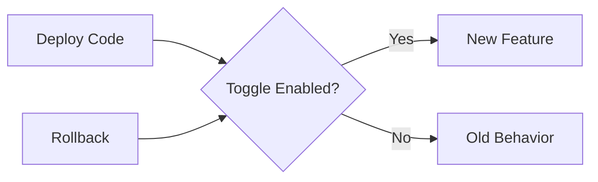

# How to Implement Feature Toggles in Python

Author: [nawazdhandala](https://www.github.com/nawazdhandala)

Tags: Python, Feature Toggles, Feature Flags, DevOps, Deployment, Configuration

Description: Learn how to implement feature toggles in Python applications to safely deploy new features, run A/B tests, and control functionality at runtime without redeploying your application.

---

> Feature toggles let you change application behavior without deploying new code. They enable safe deployments, gradual rollouts, A/B testing, and quick rollback of problematic features. This guide shows you how to build a robust feature toggle system in Python.

Feature toggles go by many names: feature flags, feature switches, or feature flippers. Whatever you call them, they solve the same problem: separating deployment from release.

---

## Why Feature Toggles?

Without feature toggles, releasing a feature means deploying code to production. If something goes wrong, you need another deployment to fix it. Feature toggles decouple these concerns:

- **Deploy** - Push code to production with the feature disabled
- **Release** - Enable the feature by flipping a toggle
- **Rollback** - Disable the feature instantly if problems arise



---

## Basic Toggle Implementation

Start with a simple in-memory toggle system. This works for development and small applications where toggles don't need to persist across restarts.

```python
# toggles/basic.py
# Simple in-memory feature toggle implementation
from typing import Dict, Any, Optional
from dataclasses import dataclass
from datetime import datetime

@dataclass
class FeatureToggle:
    """Represents a single feature toggle"""
    name: str
    enabled: bool = False
    description: str = ""
    created_at: datetime = None
    metadata: Dict[str, Any] = None

    def __post_init__(self):
        if self.created_at is None:
            self.created_at = datetime.utcnow()
        if self.metadata is None:
            self.metadata = {}

class ToggleManager:
    """Manages feature toggles with simple on/off control"""

    def __init__(self):
        # Store toggles by name
        self._toggles: Dict[str, FeatureToggle] = {}

    def register(self, name: str, enabled: bool = False, description: str = ""):
        """Register a new feature toggle"""
        self._toggles[name] = FeatureToggle(
            name=name,
            enabled=enabled,
            description=description
        )

    def is_enabled(self, name: str, default: bool = False) -> bool:
        """Check if a feature toggle is enabled"""
        toggle = self._toggles.get(name)
        if toggle is None:
            return default  # Return default for unknown toggles
        return toggle.enabled

    def enable(self, name: str):
        """Enable a feature toggle"""
        if name in self._toggles:
            self._toggles[name].enabled = True

    def disable(self, name: str):
        """Disable a feature toggle"""
        if name in self._toggles:
            self._toggles[name].enabled = False

    def list_toggles(self) -> Dict[str, bool]:
        """Return all toggles and their states"""
        return {name: t.enabled for name, t in self._toggles.items()}

# Create a singleton instance
toggles = ToggleManager()

# Usage example
toggles.register("new_checkout_flow", enabled=False, description="New checkout UI")
toggles.register("dark_mode", enabled=True, description="Dark mode support")

if toggles.is_enabled("new_checkout_flow"):
    # New checkout logic
    pass
else:
    # Existing checkout logic
    pass
```

---

## File-Based Configuration

For persistent toggles that survive restarts, store configuration in a file. JSON or YAML work well for this purpose.

```python
# toggles/file_based.py
# Feature toggles backed by a JSON configuration file
import json
import os
from typing import Dict, Any, Optional
from pathlib import Path
import logging

logger = logging.getLogger(__name__)

class FileToggleManager:
    """Feature toggles loaded from and saved to a JSON file"""

    def __init__(self, config_path: str = "toggles.json"):
        self.config_path = Path(config_path)
        self._toggles: Dict[str, Dict[str, Any]] = {}
        self._load_config()

    def _load_config(self):
        """Load toggles from the config file"""
        if self.config_path.exists():
            try:
                with open(self.config_path, "r") as f:
                    data = json.load(f)
                    self._toggles = data.get("toggles", {})
                logger.info(f"Loaded {len(self._toggles)} toggles from {self.config_path}")
            except json.JSONDecodeError as e:
                logger.error(f"Failed to parse toggle config: {e}")
                self._toggles = {}
        else:
            logger.info(f"No toggle config found at {self.config_path}, starting fresh")

    def _save_config(self):
        """Save toggles to the config file"""
        with open(self.config_path, "w") as f:
            json.dump({"toggles": self._toggles}, f, indent=2)

    def is_enabled(self, name: str, default: bool = False) -> bool:
        """Check if a toggle is enabled"""
        toggle = self._toggles.get(name)
        if toggle is None:
            return default
        return toggle.get("enabled", default)

    def set_toggle(self, name: str, enabled: bool, description: str = ""):
        """Set a toggle's state and persist to file"""
        self._toggles[name] = {
            "enabled": enabled,
            "description": description
        }
        self._save_config()

    def reload(self):
        """Reload toggles from file (useful for hot reloading)"""
        self._load_config()

# Example toggles.json file structure:
# {
#   "toggles": {
#     "new_search_algorithm": {
#       "enabled": true,
#       "description": "Use the new search ranking algorithm"
#     },
#     "premium_features": {
#       "enabled": false,
#       "description": "Premium tier features"
#     }
#   }
# }
```

---

## Redis-Backed Toggles

For distributed systems where multiple application instances need to share toggle state, use Redis as the backend. This enables instant propagation of toggle changes across all instances.

```python
# toggles/redis_backed.py
# Feature toggles stored in Redis for distributed systems
import redis
import json
from typing import Dict, Any, Optional, List
import logging

logger = logging.getLogger(__name__)

class RedisToggleManager:
    """Feature toggles backed by Redis for distributed applications"""

    def __init__(self, redis_url: str = "redis://localhost:6379", prefix: str = "toggle:"):
        self.redis = redis.from_url(redis_url, decode_responses=True)
        self.prefix = prefix

    def _key(self, name: str) -> str:
        """Generate Redis key for a toggle"""
        return f"{self.prefix}{name}"

    def is_enabled(self, name: str, default: bool = False) -> bool:
        """Check if a toggle is enabled"""
        value = self.redis.hget(self._key(name), "enabled")
        if value is None:
            return default
        return value.lower() == "true"

    def set_toggle(
        self,
        name: str,
        enabled: bool,
        description: str = "",
        metadata: Dict[str, Any] = None
    ):
        """Create or update a toggle in Redis"""
        data = {
            "enabled": str(enabled).lower(),
            "description": description
        }
        if metadata:
            data["metadata"] = json.dumps(metadata)

        self.redis.hset(self._key(name), mapping=data)
        logger.info(f"Toggle '{name}' set to {enabled}")

    def delete_toggle(self, name: str):
        """Remove a toggle from Redis"""
        self.redis.delete(self._key(name))

    def get_toggle_info(self, name: str) -> Optional[Dict[str, Any]]:
        """Get full toggle information"""
        data = self.redis.hgetall(self._key(name))
        if not data:
            return None

        result = {
            "name": name,
            "enabled": data.get("enabled", "false").lower() == "true",
            "description": data.get("description", "")
        }
        if "metadata" in data:
            result["metadata"] = json.loads(data["metadata"])
        return result

    def list_all_toggles(self) -> List[str]:
        """List all toggle names"""
        keys = self.redis.keys(f"{self.prefix}*")
        return [k.replace(self.prefix, "") for k in keys]

    def bulk_check(self, names: List[str]) -> Dict[str, bool]:
        """Check multiple toggles efficiently with pipelining"""
        pipe = self.redis.pipeline()
        for name in names:
            pipe.hget(self._key(name), "enabled")
        results = pipe.execute()

        return {
            name: (val.lower() == "true" if val else False)
            for name, val in zip(names, results)
        }
```

---

## Percentage-Based Rollouts

For gradual feature rollouts, enable features for a percentage of users. This lets you test with a small group before full deployment.

```python
# toggles/percentage.py
# Feature toggles with percentage-based rollout support
import hashlib
from typing import Optional

class PercentageToggleManager:
    """Feature toggles with percentage-based rollout capabilities"""

    def __init__(self, backend):
        # Backend can be Redis, file, or in-memory manager
        self.backend = backend

    def _get_user_bucket(self, user_id: str, toggle_name: str) -> int:
        """Generate a consistent bucket (0-99) for a user and toggle"""
        # Combine user ID and toggle name for consistent hashing
        hash_input = f"{toggle_name}:{user_id}"
        hash_value = hashlib.md5(hash_input.encode()).hexdigest()
        # Convert first 8 hex chars to int, then mod 100 for bucket
        return int(hash_value[:8], 16) % 100

    def is_enabled_for_user(
        self,
        toggle_name: str,
        user_id: str,
        percentage: int = 100
    ) -> bool:
        """Check if toggle is enabled for a specific user based on percentage"""
        # First check if the toggle is globally enabled
        toggle_info = self.backend.get_toggle_info(toggle_name)
        if toggle_info is None or not toggle_info.get("enabled"):
            return False

        # Get the rollout percentage from metadata or use provided value
        rollout_pct = toggle_info.get("metadata", {}).get("rollout_percentage", percentage)

        # Check if user falls within the rollout percentage
        user_bucket = self._get_user_bucket(user_id, toggle_name)
        return user_bucket < rollout_pct

    def set_rollout_percentage(self, toggle_name: str, percentage: int):
        """Set the rollout percentage for a toggle"""
        if not 0 <= percentage <= 100:
            raise ValueError("Percentage must be between 0 and 100")

        toggle_info = self.backend.get_toggle_info(toggle_name)
        if toggle_info is None:
            raise ValueError(f"Toggle '{toggle_name}' does not exist")

        metadata = toggle_info.get("metadata", {})
        metadata["rollout_percentage"] = percentage
        self.backend.set_toggle(
            toggle_name,
            enabled=toggle_info["enabled"],
            description=toggle_info.get("description", ""),
            metadata=metadata
        )

# Usage example
redis_backend = RedisToggleManager()
percentage_manager = PercentageToggleManager(redis_backend)

# Set up a toggle with 25% rollout
redis_backend.set_toggle("new_recommendation_engine", enabled=True)
percentage_manager.set_rollout_percentage("new_recommendation_engine", 25)

# Check for specific users
user_id = "user_12345"
if percentage_manager.is_enabled_for_user("new_recommendation_engine", user_id):
    # Show new recommendations
    pass
else:
    # Show old recommendations
    pass
```

---

## FastAPI Integration

Integrate feature toggles into a FastAPI application with dependency injection for clean, testable code.

```python
# toggles/fastapi_integration.py
# FastAPI integration with feature toggle dependencies
from fastapi import FastAPI, Depends, HTTPException, Query
from functools import wraps
from typing import Callable

app = FastAPI()

# Initialize the toggle manager (use Redis in production)
toggle_manager = RedisToggleManager()

def get_toggle_manager():
    """Dependency that provides the toggle manager"""
    return toggle_manager

def require_feature(feature_name: str):
    """Dependency that requires a feature to be enabled"""
    def dependency(manager: RedisToggleManager = Depends(get_toggle_manager)):
        if not manager.is_enabled(feature_name):
            raise HTTPException(
                status_code=404,
                detail="This feature is not available"
            )
        return True
    return Depends(dependency)

# Decorator for feature-gated routes
def feature_flag(feature_name: str):
    """Decorator to gate an entire endpoint behind a feature flag"""
    def decorator(func: Callable):
        @wraps(func)
        async def wrapper(*args, **kwargs):
            if not toggle_manager.is_enabled(feature_name):
                raise HTTPException(
                    status_code=404,
                    detail="This feature is not available"
                )
            return await func(*args, **kwargs)
        return wrapper
    return decorator

# Example endpoints

@app.get("/search")
async def search(
    query: str,
    manager: RedisToggleManager = Depends(get_toggle_manager)
):
    """Search endpoint with toggle-controlled algorithm"""
    if manager.is_enabled("new_search_algorithm"):
        # Use new search algorithm
        results = perform_new_search(query)
    else:
        # Use legacy search algorithm
        results = perform_legacy_search(query)
    return {"results": results}

@app.get("/beta/dashboard")
@feature_flag("beta_dashboard")
async def beta_dashboard():
    """Beta dashboard only available when toggle is enabled"""
    return {"message": "Welcome to the beta dashboard"}

@app.post("/admin/toggles/{name}")
async def update_toggle(
    name: str,
    enabled: bool = Query(...),
    manager: RedisToggleManager = Depends(get_toggle_manager)
):
    """Admin endpoint to update toggle state"""
    manager.set_toggle(name, enabled)
    return {"name": name, "enabled": enabled}

@app.get("/admin/toggles")
async def list_toggles(manager: RedisToggleManager = Depends(get_toggle_manager)):
    """List all feature toggles"""
    names = manager.list_all_toggles()
    return {
        "toggles": [
            manager.get_toggle_info(name)
            for name in names
        ]
    }
```

---

## Context-Aware Toggles

For more sophisticated targeting, evaluate toggles based on user context like location, subscription tier, or device type.

```python
# toggles/context_aware.py
# Feature toggles that consider user context for targeting
from dataclasses import dataclass
from typing import List, Dict, Any, Optional
from enum import Enum

class Operator(Enum):
    EQUALS = "equals"
    NOT_EQUALS = "not_equals"
    IN = "in"
    NOT_IN = "not_in"
    GREATER_THAN = "greater_than"
    LESS_THAN = "less_than"

@dataclass
class Rule:
    """A single rule for evaluating toggle eligibility"""
    attribute: str  # Context attribute to check
    operator: Operator
    value: Any  # Value or list of values to compare against

    def evaluate(self, context: Dict[str, Any]) -> bool:
        """Check if the context satisfies this rule"""
        actual = context.get(self.attribute)
        if actual is None:
            return False

        if self.operator == Operator.EQUALS:
            return actual == self.value
        elif self.operator == Operator.NOT_EQUALS:
            return actual != self.value
        elif self.operator == Operator.IN:
            return actual in self.value
        elif self.operator == Operator.NOT_IN:
            return actual not in self.value
        elif self.operator == Operator.GREATER_THAN:
            return actual > self.value
        elif self.operator == Operator.LESS_THAN:
            return actual < self.value
        return False

class ContextAwareToggle:
    """Feature toggle with context-based targeting rules"""

    def __init__(self, name: str, enabled: bool = False):
        self.name = name
        self.enabled = enabled
        self.rules: List[Rule] = []  # All rules must pass (AND logic)

    def add_rule(self, attribute: str, operator: Operator, value: Any):
        """Add a targeting rule"""
        self.rules.append(Rule(attribute, operator, value))

    def is_enabled_for_context(self, context: Dict[str, Any]) -> bool:
        """Check if toggle is enabled for the given context"""
        if not self.enabled:
            return False

        # If no rules, toggle is enabled for everyone
        if not self.rules:
            return True

        # All rules must pass (AND logic)
        return all(rule.evaluate(context) for rule in self.rules)

# Example usage
premium_feature = ContextAwareToggle("premium_analytics", enabled=True)
premium_feature.add_rule("subscription_tier", Operator.IN, ["pro", "enterprise"])
premium_feature.add_rule("account_age_days", Operator.GREATER_THAN, 30)

# Check for a specific user context
user_context = {
    "user_id": "user_123",
    "subscription_tier": "pro",
    "account_age_days": 45,
    "country": "US"
}

if premium_feature.is_enabled_for_context(user_context):
    # Show premium analytics
    pass
```

---

## Testing with Toggles

Make toggles easy to control in tests. Override toggle states without modifying production configuration.

```python
# toggles/testing.py
# Testing utilities for feature toggles
from contextlib import contextmanager
from typing import Dict
from unittest.mock import patch

class TestToggleManager:
    """Toggle manager for testing with controllable state"""

    def __init__(self):
        self._overrides: Dict[str, bool] = {}

    @contextmanager
    def override(self, **toggles):
        """Context manager to temporarily override toggle states"""
        previous = self._overrides.copy()
        self._overrides.update(toggles)
        try:
            yield
        finally:
            self._overrides = previous

    def is_enabled(self, name: str, default: bool = False) -> bool:
        """Check toggle with overrides applied"""
        return self._overrides.get(name, default)

# Usage in tests
def test_new_checkout_flow():
    test_manager = TestToggleManager()

    # Test with feature disabled
    with test_manager.override(new_checkout=False):
        assert not test_manager.is_enabled("new_checkout")

    # Test with feature enabled
    with test_manager.override(new_checkout=True):
        assert test_manager.is_enabled("new_checkout")
```

---

## Best Practices

1. **Name toggles descriptively** - Use clear names like `new_payment_processor` rather than `flag_123`
2. **Document every toggle** - Include description, owner, and expected lifetime
3. **Set expiration dates** - Plan to remove toggles after full rollout
4. **Clean up old toggles** - Remove toggles and their code paths once features are stable
5. **Use consistent checking** - Always check toggles the same way throughout the codebase
6. **Log toggle evaluations** - Track which toggles are being checked and their results
7. **Test both paths** - Write tests for both enabled and disabled states

---

## Conclusion

Feature toggles provide powerful control over feature releases. Start with simple boolean toggles and evolve to percentage-based rollouts and context-aware targeting as needed. The key is choosing the right backend for your scale and keeping toggle logic consistent throughout your application.

---

*Need to monitor feature toggle changes? [OneUptime](https://oneuptime.com) helps track configuration changes and their impact on application behavior.*
