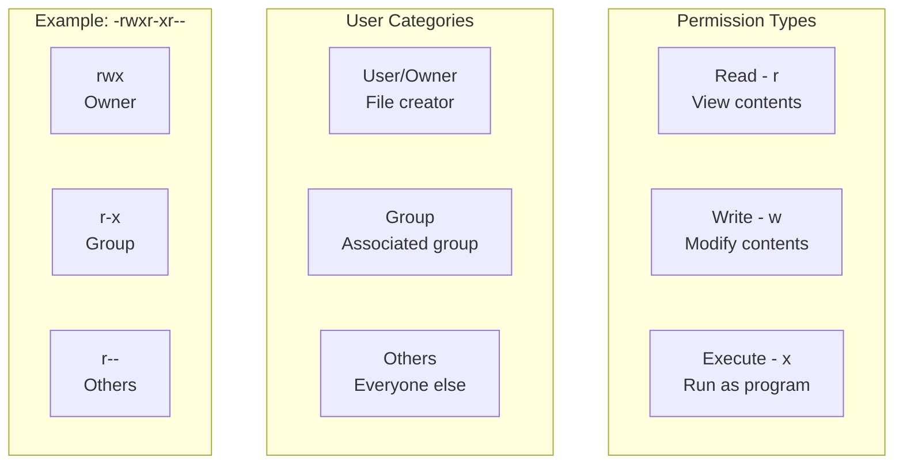
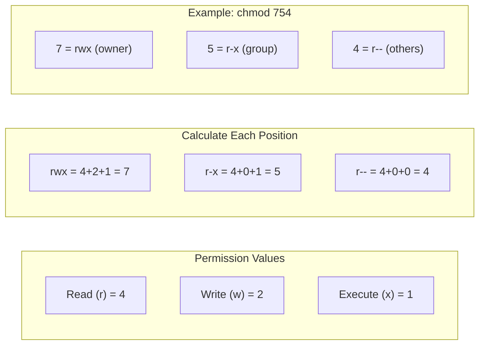
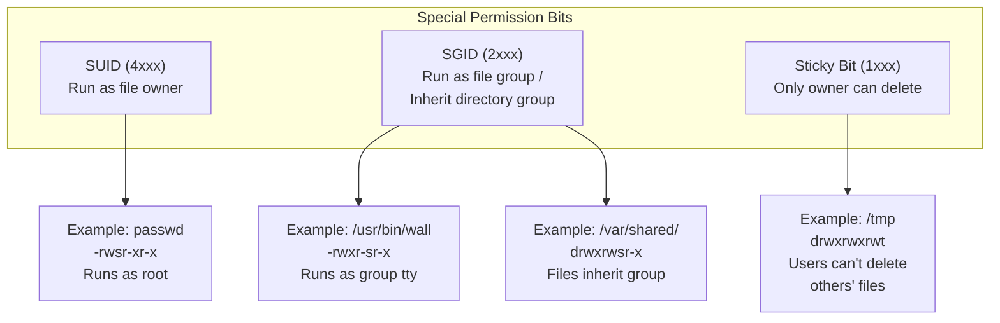
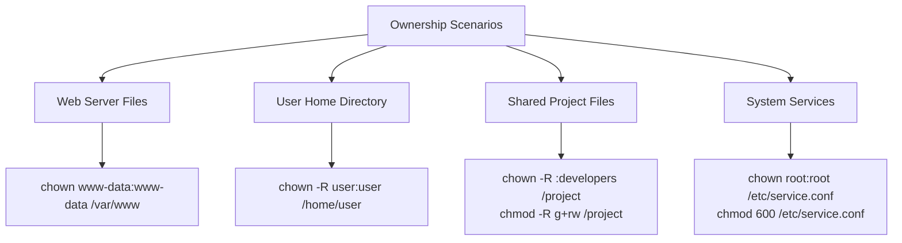
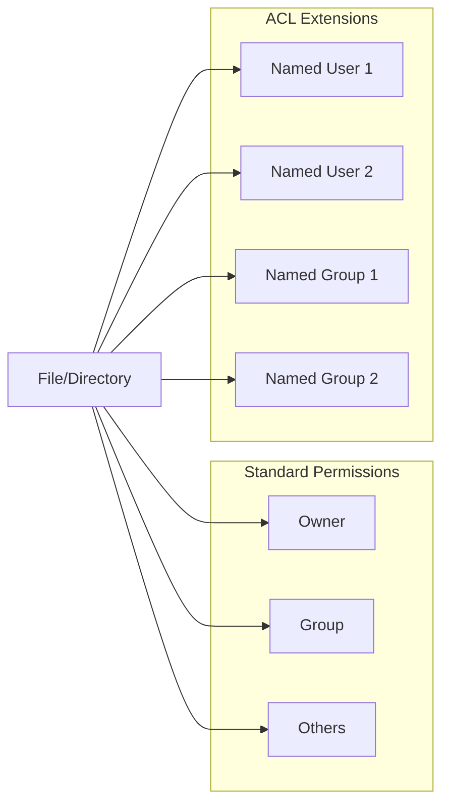
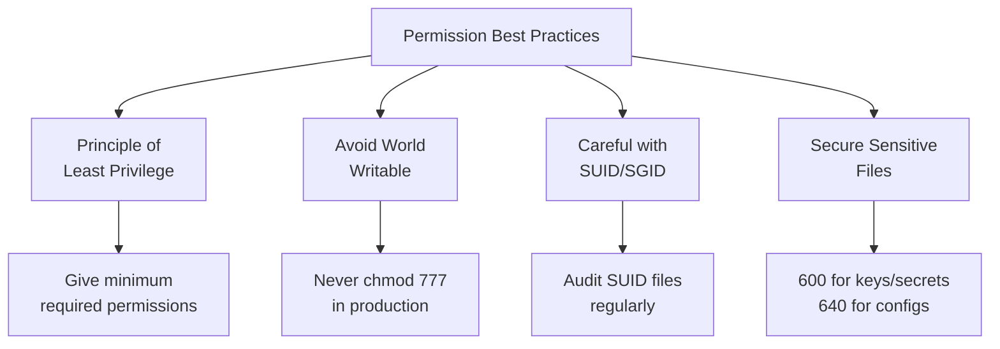

# How to Handle File Permissions with chmod and chown

Author: [nawazdhandala](https://www.github.com/nawazdhandala)

Tags: Linux, File Permissions, chmod, chown, Security, System Administration

Description: Learn how to manage file permissions and ownership in Linux using chmod and chown commands with practical examples for securing your system.

---

Understanding file permissions is fundamental to Linux system administration. Proper permission management ensures security by controlling who can read, write, or execute files. This guide covers everything you need to know about managing permissions with `chmod` and `chown`.

## Understanding Linux Permissions

Every file and directory in Linux has three types of permissions for three categories of users:



### Reading Permission Strings

```bash
# List files with permissions
ls -la

# Example output:
# -rwxr-xr-- 1 alice developers 4096 Jan 24 10:00 script.sh
# drwxr-x--- 2 alice developers 4096 Jan 24 10:00 private/
# lrwxrwxrwx 1 alice developers   11 Jan 24 10:00 link -> target.txt

# Breaking down: -rwxr-xr--
# Position 1:    - (file type: - = file, d = directory, l = link)
# Positions 2-4: rwx (owner: read, write, execute)
# Positions 5-7: r-x (group: read, no write, execute)
# Positions 8-10: r-- (others: read, no write, no execute)
```

### File Types

| Symbol | Type |
|--------|------|
| - | Regular file |
| d | Directory |
| l | Symbolic link |
| c | Character device |
| b | Block device |
| s | Socket |
| p | Named pipe (FIFO) |

### Permission Meanings for Files vs Directories

| Permission | On Files | On Directories |
|------------|----------|----------------|
| Read (r) | View file contents | List directory contents |
| Write (w) | Modify file contents | Create/delete files in directory |
| Execute (x) | Run as program | Access (cd into) directory |

## The chmod Command: Changing Permissions

### Symbolic Mode

Symbolic mode uses letters to represent permissions and operations:

```bash
# Syntax: chmod [who][operation][permission] file
# who: u (user), g (group), o (others), a (all)
# operation: + (add), - (remove), = (set exactly)
# permission: r (read), w (write), x (execute)

# Add execute permission for owner
chmod u+x script.sh

# Remove write permission from group and others
chmod go-w document.txt

# Set exact permissions for all (read only)
chmod a=r readme.txt

# Give owner full permissions, group read+execute, others read
chmod u=rwx,g=rx,o=r script.sh

# Add execute for everyone
chmod +x script.sh

# Multiple changes at once
chmod u+x,g-w,o-rwx sensitive.conf
```

### Numeric (Octal) Mode

Numeric mode uses numbers where each digit represents user, group, and others:



```bash
# Common permission combinations
chmod 755 script.sh    # rwxr-xr-x - Standard executable
chmod 644 config.txt   # rw-r--r-- - Standard file
chmod 600 secret.key   # rw------- - Private file
chmod 700 private/     # rwx------ - Private directory
chmod 777 public/      # rwxrwxrwx - World writable (dangerous!)
chmod 666 shared.txt   # rw-rw-rw- - World writable file (dangerous!)

# Permission calculation:
# r = 4, w = 2, x = 1
# 7 = 4+2+1 = rwx
# 6 = 4+2   = rw-
# 5 = 4+1   = r-x
# 4 = 4     = r--
# 0 =       = ---
```

### Special Permissions



```bash
# Set SUID - run as file owner
chmod u+s executable
chmod 4755 executable
# Shows as: -rwsr-xr-x

# Set SGID - run as file group / inherit group in directories
chmod g+s shared_directory
chmod 2775 shared_directory
# Shows as: drwxrwsr-x

# Set sticky bit - only owner can delete their files
chmod +t /tmp
chmod 1777 /tmp
# Shows as: drwxrwxrwt

# Combine special permissions
chmod 4755 program     # SUID + rwxr-xr-x
chmod 2775 directory   # SGID + rwxrwxr-x
chmod 1777 public_dir  # Sticky + rwxrwxrwx
```

### Recursive Permission Changes

```bash
# Change permissions recursively for all files and directories
chmod -R 755 directory/

# Change only directories
find /path -type d -exec chmod 755 {} \;

# Change only files
find /path -type f -exec chmod 644 {} \;

# Common pattern: directories 755, files 644
find /var/www -type d -exec chmod 755 {} \;
find /var/www -type f -exec chmod 644 {} \;

# Using chmod with find for better control
# Make scripts executable but not other files
find /opt/scripts -name "*.sh" -exec chmod 755 {} \;
```

## The chown Command: Changing Ownership

### Basic Syntax

```bash
# Change owner only
chown newowner file.txt

# Change owner and group
chown newowner:newgroup file.txt

# Change group only (note the colon)
chown :newgroup file.txt

# Alternative for group-only change
chgrp newgroup file.txt
```

### Practical Examples

```bash
# Change website ownership to web server user
sudo chown www-data:www-data /var/www/html/index.html

# Change ownership recursively
sudo chown -R www-data:www-data /var/www/html/

# Change ownership following symbolic links
sudo chown -H user:group link

# Change ownership without following links
sudo chown -h user:group link

# Change ownership of multiple files
sudo chown user:group file1.txt file2.txt file3.txt
```

### Common Use Cases



## Common Permission Patterns

### Web Server Files

```bash
# Standard web directory setup
# Owner: web server user, Group: web developers

# Set ownership
sudo chown -R www-data:webdevs /var/www/html

# Directories: owner and group can read/write/traverse, others read/traverse
sudo find /var/www/html -type d -exec chmod 775 {} \;

# Files: owner and group can read/write, others read
sudo find /var/www/html -type f -exec chmod 664 {} \;

# Allow group to write new files (SGID)
sudo chmod g+s /var/www/html
```

### Application Configuration Files

```bash
# Secure configuration files
# Only owner (service account) can read, no others

sudo chown appuser:appuser /etc/myapp/config.yml
sudo chmod 600 /etc/myapp/config.yml

# Configuration with sensitive data (database passwords, API keys)
sudo chown root:root /etc/myapp/secrets.yml
sudo chmod 600 /etc/myapp/secrets.yml
```

### SSH Key Files

```bash
# SSH key permissions (strict requirements)

# Private key - owner read only
chmod 600 ~/.ssh/id_ed25519

# Public key - owner read/write, others read
chmod 644 ~/.ssh/id_ed25519.pub

# SSH directory - owner only
chmod 700 ~/.ssh

# authorized_keys - owner read/write only
chmod 600 ~/.ssh/authorized_keys

# SSH configuration
chmod 600 ~/.ssh/config
```

### Shared Project Directories

```bash
# Setup shared directory for team collaboration

# Create group and add users
sudo groupadd developers
sudo usermod -aG developers alice
sudo usermod -aG developers bob

# Create shared directory
sudo mkdir /projects/shared

# Set ownership to group
sudo chown root:developers /projects/shared

# Set SGID so new files inherit group
sudo chmod 2775 /projects/shared

# Now all files created in /projects/shared will:
# - Belong to 'developers' group
# - Be writable by group members
```

### Temporary and Log Files

```bash
# Temporary directory (world writable with sticky bit)
sudo chmod 1777 /tmp

# Log files (owner write, group/others read)
sudo chown root:adm /var/log/myapp.log
sudo chmod 640 /var/log/myapp.log
```

## Access Control Lists (ACLs)

When basic permissions are not enough, use ACLs for granular control:

```bash
# Check if ACLs are supported
mount | grep acl

# View ACLs for a file
getfacl file.txt

# Grant specific user read access
setfacl -m u:alice:r file.txt

# Grant specific group write access
setfacl -m g:developers:rw file.txt

# Remove specific ACL
setfacl -x u:alice file.txt

# Remove all ACLs
setfacl -b file.txt

# Set default ACLs for directory (new files inherit)
setfacl -d -m g:developers:rw /projects/shared

# Recursive ACL
setfacl -R -m g:developers:rw /projects/
```



## Troubleshooting Permission Issues

### Common Problems

```bash
# Problem: "Permission denied" when running script
# Solution: Add execute permission
chmod +x script.sh

# Problem: Cannot cd into directory
# Solution: Need execute permission on directory
chmod +x directory/

# Problem: Cannot create files in directory
# Solution: Need write permission on directory
chmod +w directory/

# Problem: Web server cannot read files
# Solution: Check ownership and permissions
sudo chown -R www-data:www-data /var/www/html
sudo chmod -R 755 /var/www/html
```

### Debugging Permission Issues

```bash
# Check effective permissions for a user
sudo -u www-data ls -la /var/www/html

# Check if SELinux is blocking
ls -laZ /var/www/html
# Look for wrong security context

# Check what groups a user belongs to
groups username
id username

# Test file access
sudo -u www-data cat /var/www/html/index.php

# Check parent directory permissions
# Remember: need execute on all parent directories
namei -l /full/path/to/file
```

### Security Audit

```bash
# Find world-writable files (potential security risk)
find / -type f -perm -002 -ls 2>/dev/null

# Find world-writable directories (excluding sticky bit)
find / -type d -perm -002 ! -perm -1000 -ls 2>/dev/null

# Find SUID files (programs that run as root)
find / -type f -perm -4000 -ls 2>/dev/null

# Find SGID files
find / -type f -perm -2000 -ls 2>/dev/null

# Find files with no owner
find / -nouser -ls 2>/dev/null

# Find files with no group
find / -nogroup -ls 2>/dev/null
```

## Best Practices

### Security Guidelines



1. **Apply least privilege**: Only grant the permissions that are necessary.

2. **Avoid 777 permissions**: World-writable files are a security risk.

3. **Protect sensitive files**: Use 600 or 640 for configuration files with credentials.

4. **Use groups effectively**: Instead of making files world-readable, add users to appropriate groups.

5. **Audit SUID/SGID files**: These can be security risks if misconfigured.

6. **Set proper umask**: Configure default permissions for new files.

### Setting Default Permissions with umask

```bash
# View current umask
umask

# umask subtracts from default permissions
# Default file: 666, Default directory: 777

# umask 022: files 644, directories 755 (common default)
umask 022

# umask 077: files 600, directories 700 (restrictive)
umask 077

# Set umask permanently in ~/.bashrc or /etc/profile
echo "umask 027" >> ~/.bashrc
```

## Quick Reference

### chmod Cheat Sheet

```bash
# Symbolic mode
chmod u+x file          # Add execute for owner
chmod g-w file          # Remove write from group
chmod o=r file          # Set others to read only
chmod a+r file          # Add read for all
chmod u=rwx,go=rx file  # Owner: rwx, Group+Others: rx

# Numeric mode
chmod 755 file    # rwxr-xr-x (executable)
chmod 644 file    # rw-r--r-- (regular file)
chmod 600 file    # rw------- (private file)
chmod 700 dir     # rwx------ (private directory)

# Special permissions
chmod 4755 file   # SUID
chmod 2775 dir    # SGID
chmod 1777 dir    # Sticky bit
```

### chown Cheat Sheet

```bash
# Change owner
chown user file

# Change owner and group
chown user:group file

# Change group only
chown :group file
chgrp group file

# Recursive
chown -R user:group directory/
```

### Common Permission Values

| Value | Symbolic | Use Case |
|-------|----------|----------|
| 755 | rwxr-xr-x | Executables, public directories |
| 644 | rw-r--r-- | Regular files, public configs |
| 700 | rwx------ | Private directories |
| 600 | rw------- | Private files, SSH keys, secrets |
| 775 | rwxrwxr-x | Group-shared directories |
| 664 | rw-rw-r-- | Group-shared files |
| 1777 | rwxrwxrwt | /tmp directory |

## Conclusion

Proper file permission management is essential for Linux security and proper system operation. Use `chmod` to control who can read, write, and execute files, and `chown` to manage file ownership. Always follow the principle of least privilege, avoid world-writable permissions, and regularly audit your system for permission issues. With these tools and best practices, you can maintain a secure and well-organized file system.
