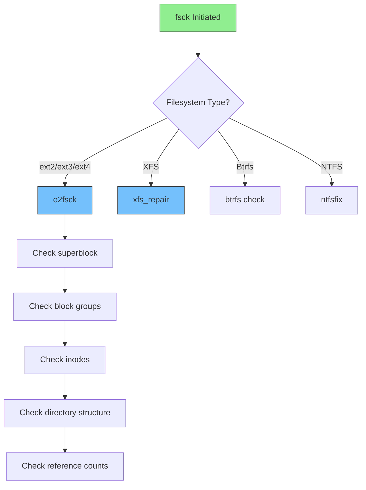
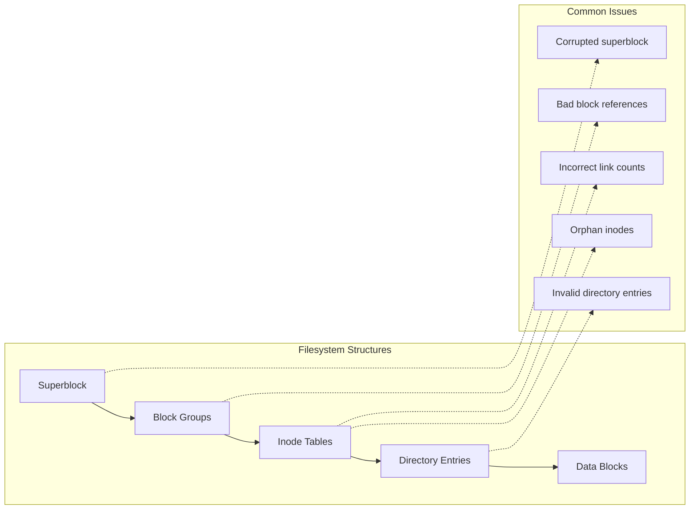
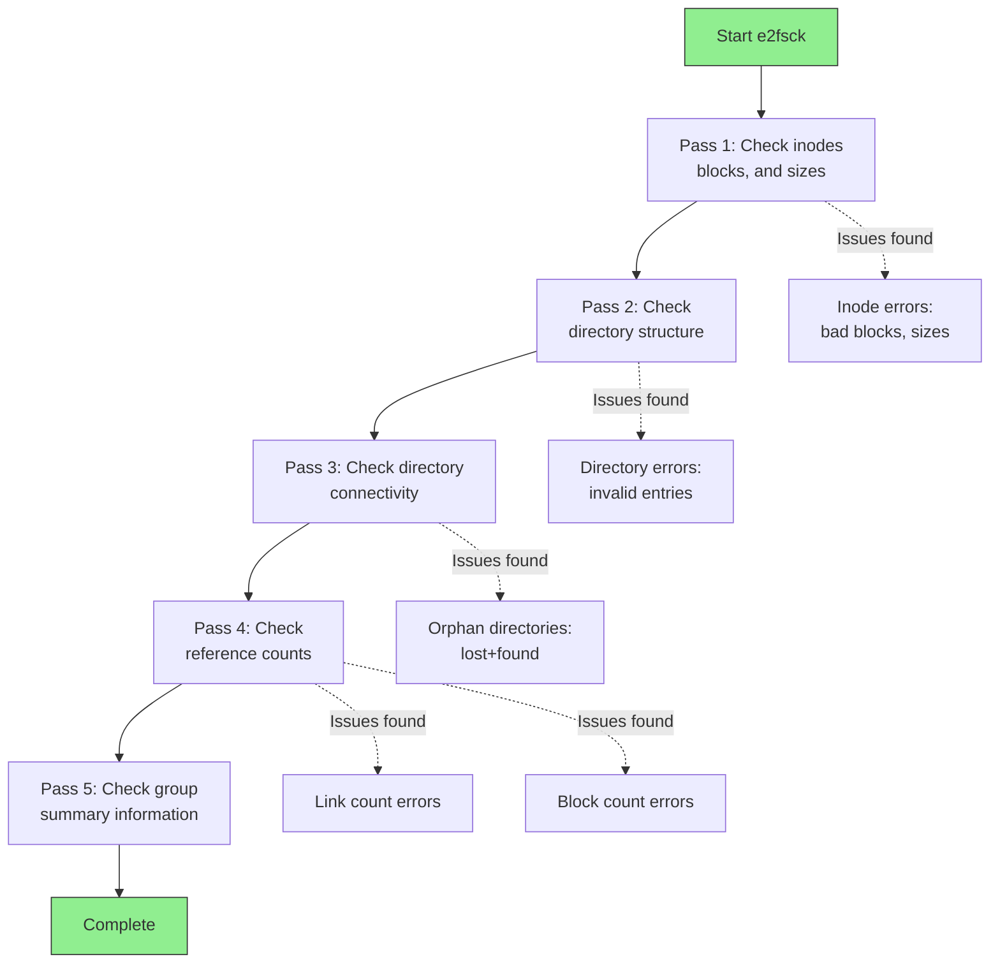
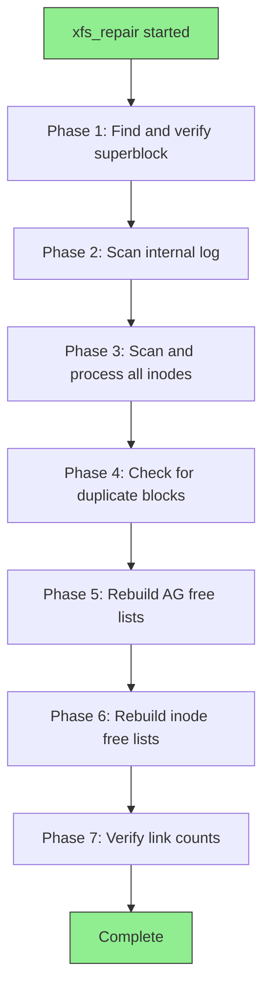
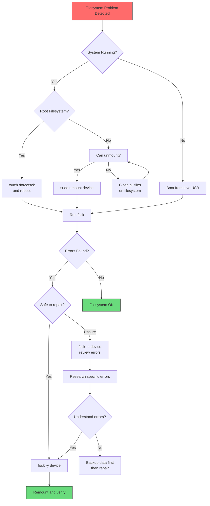

# How to Handle File System Checks with fsck

Author: [nawazdhandala](https://www.github.com/nawazdhandala)

Tags: Linux, System Administration, File Systems, fsck, Disk Maintenance, Data Recovery, ext4, XFS

Description: A comprehensive guide to using fsck for filesystem checks and repairs in Linux, covering different filesystem types, safe practices, and recovery procedures.

---

The `fsck` (file system check) utility is an essential tool for maintaining filesystem integrity in Linux. It can detect and repair filesystem inconsistencies that might lead to data corruption or system instability. This guide covers how to use fsck effectively and safely across different filesystem types.

## Understanding fsck

The fsck utility checks and repairs Linux filesystems. It runs automatically during boot if the system detects filesystem problems, or you can run it manually for maintenance.



### What fsck Checks



## Basic fsck Usage

### Important: Never Run fsck on Mounted Filesystems

```bash
# WRONG - Never do this!
# Running fsck on a mounted filesystem can cause severe corruption
sudo fsck /dev/sda1  # If sda1 is mounted, this is dangerous!

# CORRECT - Always unmount first
sudo umount /dev/sda1
sudo fsck /dev/sda1

# Check if a filesystem is mounted
mount | grep sda1
```

### Basic Commands

```bash
# Check a filesystem (read-only, no repairs)
sudo fsck -n /dev/sda1

# Check and automatically repair (use with caution)
sudo fsck -y /dev/sda1

# Force check even if filesystem appears clean
sudo fsck -f /dev/sda1

# Check all filesystems in /etc/fstab
sudo fsck -A

# Skip root filesystem when checking all
sudo fsck -AR
```

### Understanding Exit Codes

```bash
# fsck exit codes:
# 0  - No errors
# 1  - Filesystem errors corrected
# 2  - System should be rebooted
# 4  - Filesystem errors left uncorrected
# 8  - Operational error
# 16 - Usage or syntax error
# 32 - Fsck canceled by user request
# 128 - Shared library error

# Check exit code after running fsck
sudo fsck /dev/sda1
echo "Exit code: $?"
```

## Checking ext4 Filesystems

The most common Linux filesystem requires specific tools:

### Using e2fsck

```bash
# Basic ext4 check
sudo e2fsck /dev/sda1

# Force check even if clean
sudo e2fsck -f /dev/sda1

# Verbose output
sudo e2fsck -v /dev/sda1

# Automatically repair (answer yes to all)
sudo e2fsck -y /dev/sda1

# Preen mode - only fix safe repairs
sudo e2fsck -p /dev/sda1

# Check and show progress
sudo e2fsck -C 0 -f /dev/sda1
```

### Understanding e2fsck Output

```bash
# Example e2fsck output:
e2fsck 1.46.5 (30-Dec-2021)
/dev/sda1: clean, 156432/1831424 files, 2847635/7324416 blocks

# Output breakdown:
# clean         - No errors found
# 156432        - Number of files (inodes in use)
# 1831424       - Total inodes
# 2847635       - Blocks in use
# 7324416       - Total blocks

# If errors are found:
e2fsck 1.46.5 (30-Dec-2021)
Pass 1: Checking inodes, blocks, and sizes
Pass 2: Checking directory structure
Pass 3: Checking directory connectivity
Pass 4: Checking reference counts
Pass 5: Checking group summary information

/dev/sda1: ***** FILE SYSTEM WAS MODIFIED *****
/dev/sda1: 156432/1831424 files (1.5% non-contiguous), 2847635/7324416 blocks
```

### Five Passes of e2fsck



### Recovering from Superblock Corruption

```bash
# If primary superblock is corrupted, use backup superblock
# First, find backup superblock locations
sudo mke2fs -n /dev/sda1

# Output shows backup superblock locations:
# Superblock backups stored on blocks:
#     32768, 98304, 163840, 229376, 294912, 819200, 884736...

# Use backup superblock to repair
sudo e2fsck -b 32768 /dev/sda1

# Or try other backups if that fails
sudo e2fsck -b 98304 /dev/sda1
```

## Checking XFS Filesystems

XFS requires different tools:

```bash
# XFS repair (must be unmounted)
sudo umount /dev/sda1
sudo xfs_repair /dev/sda1

# Check only, do not modify (dry run)
sudo xfs_repair -n /dev/sda1

# Verbose output
sudo xfs_repair -v /dev/sda1

# If log is corrupt, clear it (data loss possible)
sudo xfs_repair -L /dev/sda1

# Check mounted XFS filesystem (limited)
sudo xfs_scrub /dev/sda1
```

### XFS Repair Process



## Checking Btrfs Filesystems

Btrfs has built-in integrity features:

```bash
# Check btrfs filesystem (can run on mounted fs for read-only check)
sudo btrfs check /dev/sda1

# Scrub - online check and repair (can run on mounted fs)
sudo btrfs scrub start /mnt/data

# Check scrub status
sudo btrfs scrub status /mnt/data

# Repair mode (must be unmounted)
sudo umount /dev/sda1
sudo btrfs check --repair /dev/sda1
```

## Checking the Root Filesystem

The root filesystem requires special handling since it cannot be unmounted while the system is running:

### Method 1: Force Check on Reboot

```bash
# Create marker file to force fsck on next boot
sudo touch /forcefsck

# Reboot system
sudo reboot

# The system will run fsck during boot
# Check /var/log/boot.log after boot for results
```

### Method 2: Boot from Live USB/Recovery Mode

```bash
# Boot from Live USB or recovery mode
# Then check the root filesystem
sudo fsck -f /dev/sda1

# Or mount and check
sudo mkdir /mnt/root
sudo mount /dev/sda1 /mnt/root
# Check logs, then unmount and fsck
sudo umount /mnt/root
sudo fsck -f /dev/sda1
```

### Method 3: Configure fstab for Regular Checks

```bash
# In /etc/fstab, the last two fields control fsck:
# <fs> <mount> <type> <options> <dump> <pass>
/dev/sda1 /     ext4   defaults  0      1
/dev/sda2 /home ext4   defaults  0      2

# Pass field values:
# 0 - Never check
# 1 - Check first (root filesystem)
# 2 - Check after root (other filesystems)

# Configure maximum mount count before forced check
sudo tune2fs -c 30 /dev/sda1   # Check every 30 mounts

# Configure maximum time between checks
sudo tune2fs -i 2w /dev/sda1   # Check every 2 weeks

# View current settings
sudo tune2fs -l /dev/sda1 | grep -i "mount count\|check"
```

## Handling Lost+Found

When fsck finds orphaned files (files with no directory entry), it places them in the lost+found directory:

```bash
# List lost+found contents
ls -la /lost+found/

# Files are named by inode number
# Example: #12345 is inode 12345

# Identify file types
file /lost+found/#*

# For text files, view content
cat /lost+found/#12345

# For binary files, use file command
file /lost+found/#12345
# Output: /lost+found/#12345: PNG image data, 1920 x 1080

# Move identified files to proper locations
sudo mv /lost+found/#12345 /home/user/recovered-image.png
```

### Recovering Lost Files

```bash
#!/bin/bash
# Script to help identify files in lost+found

LOST_FOUND="/lost+found"

echo "Analyzing files in $LOST_FOUND..."
echo ""

for file in $LOST_FOUND/#*; do
    if [ -f "$file" ]; then
        # Get file type
        TYPE=$(file -b "$file")
        # Get size
        SIZE=$(du -h "$file" | cut -f1)
        # Get inode
        INODE=$(basename "$file")

        echo "Inode: $INODE"
        echo "Size: $SIZE"
        echo "Type: $TYPE"

        # For text files, show first few lines
        if [[ "$TYPE" == *"text"* ]]; then
            echo "Preview:"
            head -5 "$file" | sed 's/^/    /'
        fi
        echo "---"
    fi
done
```

## Fsck Decision Tree



## Common fsck Scenarios

### Scenario 1: Regular Maintenance Check

```bash
#!/bin/bash
# Monthly filesystem maintenance script

# Define filesystems to check (non-root)
FILESYSTEMS="/dev/sda2 /dev/sdb1"

for fs in $FILESYSTEMS; do
    MOUNT_POINT=$(findmnt -n -o TARGET $fs)

    if [ -n "$MOUNT_POINT" ]; then
        echo "Checking $fs (mounted at $MOUNT_POINT)..."

        # Unmount
        sudo umount $fs

        if [ $? -eq 0 ]; then
            # Run fsck
            sudo fsck -f $fs

            # Remount
            sudo mount $fs $MOUNT_POINT

            echo "$fs check complete"
        else
            echo "Could not unmount $fs - skipping"
        fi
    fi
done
```

### Scenario 2: Emergency Recovery

```bash
# System failed to boot due to filesystem errors

# 1. Boot into recovery mode or from Live USB

# 2. Do NOT mount the filesystem

# 3. Run fsck with verbose output
sudo fsck -fv /dev/sda1

# 4. If prompted, review each fix carefully
# Type 'y' for yes, 'n' for no, 'a' for yes to all

# 5. After repair, mount read-only first
sudo mount -o ro /dev/sda1 /mnt

# 6. Verify critical files exist
ls -la /mnt/etc /mnt/bin /mnt/usr

# 7. If OK, remount read-write
sudo mount -o remount,rw /mnt

# 8. Reboot normally
```

### Scenario 3: Corrupted Journal Recovery

```bash
# For ext4 with corrupted journal

# Clear the journal (only if necessary)
sudo e2fsck -f /dev/sda1

# If e2fsck fails due to journal
# Remove and recreate journal
sudo tune2fs -O ^has_journal /dev/sda1
sudo e2fsck -f /dev/sda1
sudo tune2fs -j /dev/sda1
```

### Scenario 4: Fix Inode Problems

```bash
# When fsck reports inode errors

# Example error:
# "Inode 12345 has EXTENTS_FL flag set on filesystem without extents support"

# Fix with:
sudo e2fsck -fy /dev/sda1

# For "multiply claimed block" errors:
# fsck will ask to clone the block - answer yes
# This duplicates the data to resolve conflicts
```

## Safety Best Practices

### Before Running fsck

```bash
# 1. Always have backups
# 2. Document current state
sudo dumpe2fs /dev/sda1 > /tmp/fs-state-before.txt

# 3. Check disk health first
sudo smartctl -H /dev/sda

# 4. Run read-only check first
sudo fsck -n /dev/sda1

# 5. If possible, image the drive first
sudo dd if=/dev/sda1 of=/backup/sda1.img bs=4M status=progress
```

### Fsck Options Reference

```bash
# Safe options (information only):
fsck -n     # No changes, just report
fsck -v     # Verbose output
fsck -C 0   # Show progress bar

# Moderate options:
fsck -f     # Force check even if clean
fsck -p     # Preen - automatic safe repairs

# Aggressive options (use with caution):
fsck -y     # Yes to all repairs
fsck -c     # Check for bad blocks

# Dangerous options (data loss possible):
e2fsck -D   # Optimize directories
e2fsck -E discard  # Discard free blocks
```

## Filesystem-Specific Tools

| Filesystem | Check Tool | Repair Tool |
|------------|-----------|-------------|
| ext2/ext3/ext4 | e2fsck | e2fsck |
| XFS | xfs_check | xfs_repair |
| Btrfs | btrfs check | btrfs check --repair |
| NTFS | ntfsfix | ntfsfix |
| FAT/FAT32 | dosfsck | dosfsck |
| ReiserFS | reiserfsck | reiserfsck |
| ZFS | zpool scrub | zpool scrub |

## Automated Monitoring

```bash
#!/bin/bash
# /usr/local/bin/fs-health-check.sh

# Check filesystem health and alert on issues

EMAIL="admin@example.com"
LOG="/var/log/fs-health.log"

echo "=== Filesystem Health Check $(date) ===" >> $LOG

# Check for filesystem errors in dmesg
ERRORS=$(dmesg | grep -i "EXT4-fs error\|XFS.*error\|filesystem error" | tail -5)

if [ -n "$ERRORS" ]; then
    echo "ALERT: Filesystem errors detected:" >> $LOG
    echo "$ERRORS" >> $LOG
    echo "$ERRORS" | mail -s "Filesystem Error Alert" $EMAIL
fi

# Check mount count vs max mount count
for dev in $(lsblk -d -o NAME,TYPE | grep disk | awk '{print $1}'); do
    for part in $(lsblk -o NAME,TYPE /dev/$dev | grep part | awk '{print $1}'); do
        FSTYPE=$(lsblk -no FSTYPE /dev/$part 2>/dev/null)

        if [[ "$FSTYPE" == ext* ]]; then
            MOUNT_COUNT=$(tune2fs -l /dev/$part 2>/dev/null | grep "Mount count:" | awk '{print $3}')
            MAX_MOUNT=$(tune2fs -l /dev/$part 2>/dev/null | grep "Maximum mount count:" | awk '{print $4}')

            if [ -n "$MOUNT_COUNT" ] && [ -n "$MAX_MOUNT" ] && [ "$MAX_MOUNT" != "-1" ]; then
                if [ $MOUNT_COUNT -ge $((MAX_MOUNT - 5)) ]; then
                    echo "WARNING: /dev/$part approaching fsck (mounts: $MOUNT_COUNT/$MAX_MOUNT)" >> $LOG
                fi
            fi
        fi
    done
done

echo "Check complete" >> $LOG
```

## Quick Reference

| Command | Description |
|---------|-------------|
| `fsck -n /dev/sda1` | Check without making changes |
| `fsck -f /dev/sda1` | Force check even if clean |
| `fsck -y /dev/sda1` | Auto-repair all issues |
| `fsck -p /dev/sda1` | Preen mode (safe repairs only) |
| `e2fsck -b 32768 /dev/sda1` | Use backup superblock |
| `xfs_repair /dev/sda1` | Repair XFS filesystem |
| `tune2fs -c 30 /dev/sda1` | Set max mounts before check |
| `touch /forcefsck` | Force root check on reboot |

## Conclusion

Filesystem checks with fsck are essential for maintaining data integrity and system stability. While modern journaling filesystems like ext4 and XFS are resilient, regular checks and knowing how to handle filesystem problems is crucial for any system administrator.

Key takeaways:
- Never run fsck on mounted filesystems
- Always run read-only checks (`-n`) first to assess damage
- Keep backups before attempting repairs
- Use backup superblocks when primary is corrupted
- Configure regular automatic checks via fstab
- Check lost+found after repairs for recovered files
- Different filesystems require different tools
- Monitor filesystem health proactively
