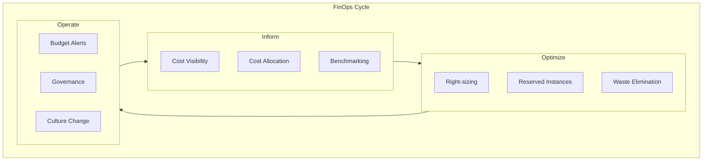

# How to Handle FinOps Practices

Author: [nawazdhandala](https://www.github.com/nawazdhandala)

Tags: FinOps, Cloud Cost Management, DevOps, Cost Optimization, Cloud Infrastructure, Budget

Description: Practical guide to implementing FinOps practices that help engineering teams understand and optimize cloud spending.

---

FinOps is the practice of bringing financial accountability to cloud spending. Instead of treating infrastructure costs as someone else's problem, engineering teams take ownership of their resource consumption. This guide covers how to implement FinOps practices that actually work.

## Understanding FinOps Fundamentals

FinOps sits at the intersection of finance, technology, and business. The goal is not to spend less, but to spend smarter.



## Setting Up Cost Visibility

You cannot optimize what you cannot see. Start by implementing comprehensive cost tagging and tracking.

### Implementing Consistent Tagging

Define a tagging strategy that every resource must follow.

```yaml
# tagging-policy.yaml
# Required tags for all cloud resources

required_tags:
  # Ownership and accountability
  - name: team
    description: Team responsible for this resource
    values:
      - platform
      - payments
      - authentication
      - data-engineering

  - name: service
    description: Service or application this resource belongs to
    pattern: "^[a-z][a-z0-9-]{2,30}$"

  - name: environment
    description: Deployment environment
    values:
      - production
      - staging
      - development
      - sandbox

  # Cost management
  - name: cost-center
    description: Finance cost center for billing
    pattern: "^CC[0-9]{4}$"

  - name: project
    description: Project or initiative this resource supports

optional_tags:
  - name: owner-email
    description: Individual owner for escalations
    pattern: "^[a-z.]+@company.com$"

  - name: expiration-date
    description: Date when resource should be reviewed or deleted
    pattern: "^[0-9]{4}-[0-9]{2}-[0-9]{2}$"
```

Enforce tagging with Terraform.

```hcl
# modules/tagging/main.tf
# Terraform module that enforces required tags

variable "required_tags" {
  description = "Tags that must be present on all resources"
  type = object({
    team         = string
    service      = string
    environment  = string
    cost_center  = string
    project      = string
  })

  validation {
    condition     = contains(["platform", "payments", "authentication", "data-engineering"], var.required_tags.team)
    error_message = "Team must be one of: platform, payments, authentication, data-engineering."
  }

  validation {
    condition     = contains(["production", "staging", "development", "sandbox"], var.required_tags.environment)
    error_message = "Environment must be one of: production, staging, development, sandbox."
  }

  validation {
    condition     = can(regex("^CC[0-9]{4}$", var.required_tags.cost_center))
    error_message = "Cost center must match pattern CC#### (e.g., CC1234)."
  }
}

locals {
  # Merge required tags with common tags
  common_tags = merge(var.required_tags, {
    managed_by   = "terraform"
    created_date = formatdate("YYYY-MM-DD", timestamp())
  })
}

# Example: Apply tags to an AWS instance
resource "aws_instance" "example" {
  ami           = var.ami_id
  instance_type = var.instance_type

  tags = merge(local.common_tags, {
    Name = "${var.required_tags.service}-${var.required_tags.environment}"
  })
}
```

### Building Cost Dashboards

Create dashboards that show costs by team, service, and environment.

```python
#!/usr/bin/env python3
# scripts/cost_report.py
# Generate cost reports from AWS Cost Explorer

import boto3
import json
from datetime import datetime, timedelta
from collections import defaultdict

def get_costs_by_tag(tag_name: str, days: int = 30) -> dict:
    """Fetch costs grouped by a specific tag."""
    client = boto3.client('ce')

    end_date = datetime.now().date()
    start_date = end_date - timedelta(days=days)

    response = client.get_cost_and_usage(
        TimePeriod={
            'Start': start_date.isoformat(),
            'End': end_date.isoformat()
        },
        Granularity='MONTHLY',
        Metrics=['UnblendedCost'],
        GroupBy=[
            {'Type': 'TAG', 'Key': tag_name}
        ]
    )

    costs = {}
    for result in response['ResultsByTime']:
        for group in result['Groups']:
            tag_value = group['Keys'][0].replace(f'{tag_name}$', '') or 'untagged'
            amount = float(group['Metrics']['UnblendedCost']['Amount'])
            costs[tag_value] = costs.get(tag_value, 0) + amount

    return costs

def get_top_services(days: int = 30, limit: int = 10) -> list:
    """Get the most expensive AWS services."""
    client = boto3.client('ce')

    end_date = datetime.now().date()
    start_date = end_date - timedelta(days=days)

    response = client.get_cost_and_usage(
        TimePeriod={
            'Start': start_date.isoformat(),
            'End': end_date.isoformat()
        },
        Granularity='MONTHLY',
        Metrics=['UnblendedCost'],
        GroupBy=[
            {'Type': 'DIMENSION', 'Key': 'SERVICE'}
        ]
    )

    services = []
    for result in response['ResultsByTime']:
        for group in result['Groups']:
            services.append({
                'service': group['Keys'][0],
                'cost': float(group['Metrics']['UnblendedCost']['Amount'])
            })

    # Sort by cost and return top N
    services.sort(key=lambda x: x['cost'], reverse=True)
    return services[:limit]

def main():
    print("=== Cost Report ===\n")

    # Costs by team
    print("Costs by Team (last 30 days):")
    team_costs = get_costs_by_tag('team')
    for team, cost in sorted(team_costs.items(), key=lambda x: x[1], reverse=True):
        print(f"  {team}: ${cost:,.2f}")

    print("\nCosts by Environment:")
    env_costs = get_costs_by_tag('environment')
    for env, cost in sorted(env_costs.items(), key=lambda x: x[1], reverse=True):
        print(f"  {env}: ${cost:,.2f}")

    print("\nTop AWS Services:")
    for svc in get_top_services():
        print(f"  {svc['service']}: ${svc['cost']:,.2f}")

    # Alert on untagged resources
    if 'untagged' in team_costs:
        print(f"\n⚠️  Warning: ${team_costs['untagged']:,.2f} in untagged resources!")

if __name__ == '__main__':
    main()
```

## Implementing Cost Optimization

Once you have visibility, start optimizing.

### Right-Sizing Resources

Most cloud resources are over-provisioned. Use metrics to find opportunities.

```python
#!/usr/bin/env python3
# scripts/rightsizing_recommendations.py
# Find over-provisioned EC2 instances

import boto3
from datetime import datetime, timedelta

def get_instance_metrics(instance_id: str, days: int = 14) -> dict:
    """Get CPU and memory utilization metrics for an instance."""
    cloudwatch = boto3.client('cloudwatch')

    end_time = datetime.utcnow()
    start_time = end_time - timedelta(days=days)

    # Get CPU utilization
    cpu_response = cloudwatch.get_metric_statistics(
        Namespace='AWS/EC2',
        MetricName='CPUUtilization',
        Dimensions=[{'Name': 'InstanceId', 'Value': instance_id}],
        StartTime=start_time,
        EndTime=end_time,
        Period=3600,  # 1 hour
        Statistics=['Average', 'Maximum']
    )

    cpu_avg = 0
    cpu_max = 0
    if cpu_response['Datapoints']:
        cpu_avg = sum(d['Average'] for d in cpu_response['Datapoints']) / len(cpu_response['Datapoints'])
        cpu_max = max(d['Maximum'] for d in cpu_response['Datapoints'])

    return {
        'cpu_avg': cpu_avg,
        'cpu_max': cpu_max
    }

def find_oversized_instances(cpu_threshold: float = 20.0) -> list:
    """Find instances that are consistently under-utilized."""
    ec2 = boto3.client('ec2')

    # Get all running instances
    response = ec2.describe_instances(
        Filters=[{'Name': 'instance-state-name', 'Values': ['running']}]
    )

    recommendations = []

    for reservation in response['Reservations']:
        for instance in reservation['Instances']:
            instance_id = instance['InstanceId']
            instance_type = instance['InstanceType']

            # Get instance tags
            tags = {t['Key']: t['Value'] for t in instance.get('Tags', [])}

            # Get utilization metrics
            metrics = get_instance_metrics(instance_id)

            # Flag if average CPU is below threshold
            if metrics['cpu_avg'] < cpu_threshold:
                recommendations.append({
                    'instance_id': instance_id,
                    'instance_type': instance_type,
                    'team': tags.get('team', 'unknown'),
                    'service': tags.get('service', 'unknown'),
                    'cpu_avg': metrics['cpu_avg'],
                    'cpu_max': metrics['cpu_max'],
                    'recommendation': suggest_smaller_instance(instance_type, metrics['cpu_max'])
                })

    return recommendations

def suggest_smaller_instance(current_type: str, max_cpu: float) -> str:
    """Suggest a smaller instance type based on utilization."""
    # Simplified logic - in practice, use AWS Compute Optimizer
    size_order = ['nano', 'micro', 'small', 'medium', 'large', 'xlarge', '2xlarge', '4xlarge']

    family = current_type.split('.')[0]
    current_size = current_type.split('.')[1]

    if current_size in size_order:
        current_idx = size_order.index(current_size)

        # If max CPU is under 50%, suggest going down one size
        if max_cpu < 50 and current_idx > 0:
            new_size = size_order[current_idx - 1]
            return f"{family}.{new_size}"

    return "No change recommended"

def main():
    print("=== Right-Sizing Recommendations ===\n")

    recommendations = find_oversized_instances()

    if not recommendations:
        print("No right-sizing opportunities found.")
        return

    for rec in recommendations:
        print(f"Instance: {rec['instance_id']} ({rec['instance_type']})")
        print(f"  Team: {rec['team']}, Service: {rec['service']}")
        print(f"  CPU: {rec['cpu_avg']:.1f}% avg, {rec['cpu_max']:.1f}% max")
        print(f"  Recommendation: {rec['recommendation']}")
        print()

if __name__ == '__main__':
    main()
```

### Automated Waste Detection

Find and eliminate unused resources automatically.

```yaml
# kubernetes/cost-cleanup-cronjob.yaml
# CronJob that identifies waste in Kubernetes clusters

apiVersion: batch/v1
kind: CronJob
metadata:
  name: cost-waste-detector
  namespace: finops
spec:
  schedule: "0 8 * * 1"  # Every Monday at 8 AM
  jobTemplate:
    spec:
      template:
        spec:
          containers:
            - name: waste-detector
              image: acme/finops-tools:latest
              command:
                - /bin/sh
                - -c
                - |
                  # Find pods with no requests/limits set
                  echo "=== Pods without resource requests ==="
                  kubectl get pods -A -o json | jq -r '
                    .items[] |
                    select(.spec.containers[].resources.requests == null) |
                    "\(.metadata.namespace)/\(.metadata.name)"
                  '

                  # Find PVCs not bound to any pod
                  echo -e "\n=== Unused PVCs ==="
                  kubectl get pvc -A -o json | jq -r '
                    .items[] |
                    select(.status.phase == "Bound") |
                    "\(.metadata.namespace)/\(.metadata.name)"
                  ' > /tmp/all_pvcs.txt

                  kubectl get pods -A -o json | jq -r '
                    .items[].spec.volumes[]? |
                    select(.persistentVolumeClaim) |
                    .persistentVolumeClaim.claimName
                  ' | sort -u > /tmp/used_pvcs.txt

                  comm -23 <(sort /tmp/all_pvcs.txt) <(sort /tmp/used_pvcs.txt)

                  # Find deployments scaled to zero for over 7 days
                  echo -e "\n=== Deployments at zero replicas ==="
                  kubectl get deployments -A -o json | jq -r '
                    .items[] |
                    select(.spec.replicas == 0) |
                    "\(.metadata.namespace)/\(.metadata.name)"
                  '
          restartPolicy: OnFailure
```

## Implementing Budget Alerts

Set up alerts before costs spiral out of control.

```hcl
# terraform/budgets.tf
# AWS Budget alerts for cost management

resource "aws_budgets_budget" "monthly_total" {
  name         = "monthly-total-budget"
  budget_type  = "COST"
  limit_amount = "50000"
  limit_unit   = "USD"
  time_unit    = "MONTHLY"

  notification {
    comparison_operator        = "GREATER_THAN"
    threshold                  = 80
    threshold_type            = "PERCENTAGE"
    notification_type         = "FORECASTED"
    subscriber_email_addresses = ["finops@acme.com"]
    subscriber_sns_topic_arns = [aws_sns_topic.budget_alerts.arn]
  }

  notification {
    comparison_operator        = "GREATER_THAN"
    threshold                  = 100
    threshold_type            = "PERCENTAGE"
    notification_type         = "ACTUAL"
    subscriber_email_addresses = ["finops@acme.com", "engineering-leads@acme.com"]
    subscriber_sns_topic_arns = [aws_sns_topic.budget_alerts.arn]
  }
}

# Per-team budgets
resource "aws_budgets_budget" "team_budgets" {
  for_each = {
    platform        = 15000
    payments        = 10000
    authentication  = 5000
    data_engineering = 20000
  }

  name         = "${each.key}-monthly-budget"
  budget_type  = "COST"
  limit_amount = each.value
  limit_unit   = "USD"
  time_unit    = "MONTHLY"

  cost_filter {
    name   = "TagKeyValue"
    values = ["user:team$${each.key}"]
  }

  notification {
    comparison_operator        = "GREATER_THAN"
    threshold                  = 90
    threshold_type            = "PERCENTAGE"
    notification_type         = "FORECASTED"
    subscriber_sns_topic_arns = [aws_sns_topic.budget_alerts.arn]
  }
}

resource "aws_sns_topic" "budget_alerts" {
  name = "budget-alerts"
}
```

## Building FinOps Culture

Tools are not enough. You need cultural change.

### Cost Visibility in Pull Requests

Show the cost impact of infrastructure changes before they merge.

```yaml
# .github/workflows/cost-estimate.yaml
name: Cost Estimate

on:
  pull_request:
    paths:
      - 'terraform/**'

jobs:
  estimate:
    runs-on: ubuntu-latest
    steps:
      - uses: actions/checkout@v4

      - name: Setup Terraform
        uses: hashicorp/setup-terraform@v3

      - name: Terraform Plan
        run: |
          cd terraform
          terraform init
          terraform plan -out=tfplan

      - name: Estimate costs
        uses: infracost/actions/cost-estimate@v3
        with:
          path: terraform/tfplan
        env:
          INFRACOST_API_KEY: ${{ secrets.INFRACOST_API_KEY }}

      - name: Post cost estimate
        uses: infracost/actions/comment@v3
        with:
          path: /tmp/infracost.json
          behavior: update
```

### Team Cost Reviews

Schedule regular reviews where teams examine their spending.

```markdown
# Monthly FinOps Review Template

## Team: [Team Name]
## Period: [Month Year]

### Spending Summary
- Total Spend: $X,XXX
- Budget: $X,XXX
- Variance: +/- X%

### Top Cost Drivers
1. [Service/Resource]: $X,XXX (X% of total)
2. [Service/Resource]: $X,XXX (X% of total)
3. [Service/Resource]: $X,XXX (X% of total)

### Optimization Actions Taken
- [ ] Right-sized X instances, saving $XXX/month
- [ ] Deleted unused resources, saving $XXX/month
- [ ] Purchased reserved capacity for $XXX savings

### Planned Optimizations
- [ ] [Action] - Expected savings: $XXX/month
- [ ] [Action] - Expected savings: $XXX/month

### Questions for FinOps Team
- [Question about spending pattern or optimization opportunity]
```

---

FinOps is not about cutting costs at all costs. It is about making informed decisions about cloud spending. When engineers understand the cost of their decisions and have the tools to optimize, they make better choices. Start with visibility through tagging, add automation for common optimizations, and build a culture where cost is part of the engineering conversation. The result is infrastructure spending that scales efficiently with your business.
