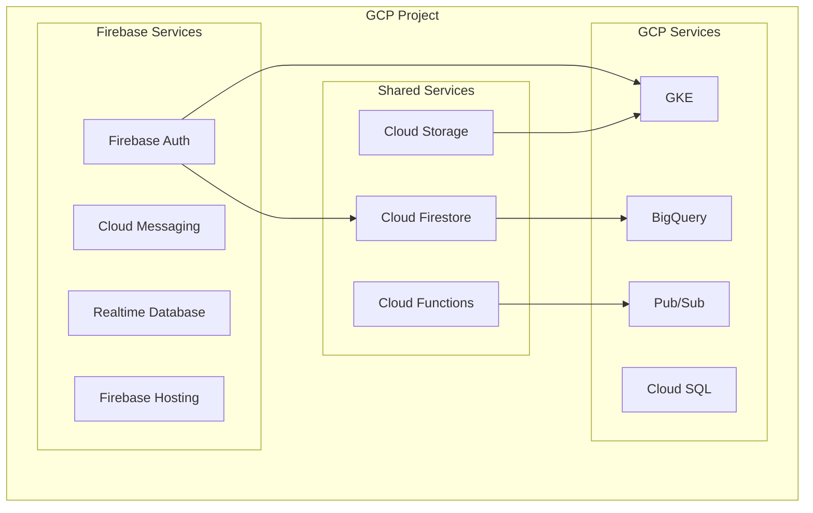

# How to Handle Firebase Integration with GCP

Author: [nawazdhandala](https://www.github.com/nawazdhandala)

Tags: Firebase, GCP, Google Cloud, Cloud Functions, Firestore, Authentication, Integration, DevOps

Description: A comprehensive guide to integrating Firebase services with Google Cloud Platform, covering authentication, data sync, and best practices for hybrid architectures.

---

Firebase and GCP share the same underlying infrastructure, but integrating them effectively requires understanding how they relate and where they overlap. Firebase provides a simplified developer experience for mobile and web apps, while GCP offers enterprise-grade infrastructure services. This guide shows you how to build architectures that leverage the best of both platforms.

## Understanding the Firebase-GCP Relationship

Firebase projects are actually GCP projects with additional Firebase-specific configurations. This means you can use both Firebase and GCP services in the same project.



## Setting Up a Firebase-GCP Project

### Initialize Firebase in an Existing GCP Project

```bash
# Install Firebase CLI
npm install -g firebase-tools

# Login to Firebase
firebase login

# Add Firebase to existing GCP project
firebase projects:addfirebase your-gcp-project-id

# Initialize Firebase in your directory
firebase init
```

### Configure Firebase Admin SDK for Backend Services

```javascript
// Initialize Firebase Admin in a Node.js backend (Cloud Run, GKE, etc.)
const admin = require('firebase-admin');

// When running on GCP, uses Application Default Credentials automatically
admin.initializeApp({
  projectId: process.env.GOOGLE_CLOUD_PROJECT,
  // Specify database URL if using Realtime Database
  databaseURL: `https://${process.env.GOOGLE_CLOUD_PROJECT}.firebaseio.com`
});

// Now you can use Firebase services
const firestore = admin.firestore();
const auth = admin.auth();
```

## Firebase Authentication with GCP Services

### Validate Firebase Tokens in Cloud Run

```javascript
// Express middleware for Firebase Auth validation
const admin = require('firebase-admin');
const express = require('express');

const app = express();

// Initialize Firebase Admin (uses ADC on GCP)
admin.initializeApp();

// Authentication middleware
const authenticateFirebase = async (req, res, next) => {
  const authHeader = req.headers.authorization;

  if (!authHeader || !authHeader.startsWith('Bearer ')) {
    return res.status(401).json({ error: 'No token provided' });
  }

  const idToken = authHeader.split('Bearer ')[1];

  try {
    // Verify the Firebase ID token
    const decodedToken = await admin.auth().verifyIdToken(idToken);

    // Add user info to request
    req.user = {
      uid: decodedToken.uid,
      email: decodedToken.email,
      emailVerified: decodedToken.email_verified,
      // Custom claims if any
      roles: decodedToken.roles || []
    };

    next();
  } catch (error) {
    console.error('Token verification failed:', error);
    return res.status(401).json({ error: 'Invalid token' });
  }
};

// Protected route
app.get('/api/user/profile', authenticateFirebase, async (req, res) => {
  // req.user contains the verified user info
  const userDoc = await admin
    .firestore()
    .collection('users')
    .doc(req.user.uid)
    .get();

  res.json(userDoc.data());
});

app.listen(8080);
```

### Set Custom Claims for Authorization

```javascript
// Set custom claims when user signs up or role changes
async function setUserRole(uid, role) {
  try {
    await admin.auth().setCustomUserClaims(uid, {
      role: role,
      permissions: getPermissionsForRole(role)
    });

    // Force token refresh on client side
    // The user will get new claims on next token refresh
    console.log(`Custom claims set for user ${uid}`);
  } catch (error) {
    console.error('Error setting custom claims:', error);
    throw error;
  }
}

function getPermissionsForRole(role) {
  const permissions = {
    admin: ['read', 'write', 'delete', 'manage_users'],
    editor: ['read', 'write'],
    viewer: ['read']
  };
  return permissions[role] || [];
}
```

## Firestore with Cloud Functions and GCP Services

### Trigger Cloud Functions from Firestore Changes

```javascript
// functions/index.js
const functions = require('firebase-functions');
const admin = require('firebase-admin');
const { PubSub } = require('@google-cloud/pubsub');

admin.initializeApp();
const pubsub = new PubSub();

// Trigger on new order creation
exports.onOrderCreated = functions.firestore
  .document('orders/{orderId}')
  .onCreate(async (snapshot, context) => {
    const order = snapshot.data();
    const orderId = context.params.orderId;

    // Publish to Pub/Sub for downstream processing
    const message = {
      orderId: orderId,
      customerId: order.customerId,
      items: order.items,
      total: order.total,
      timestamp: Date.now()
    };

    try {
      await pubsub
        .topic('new-orders')
        .publishMessage({ json: message });

      console.log(`Order ${orderId} published to Pub/Sub`);

      // Update order status
      await snapshot.ref.update({
        status: 'processing',
        processedAt: admin.firestore.FieldValue.serverTimestamp()
      });
    } catch (error) {
      console.error('Error processing order:', error);
      throw error;
    }
  });

// Sync Firestore to BigQuery for analytics
exports.syncToBigQuery = functions.firestore
  .document('orders/{orderId}')
  .onWrite(async (change, context) => {
    const { BigQuery } = require('@google-cloud/bigquery');
    const bigquery = new BigQuery();

    const orderId = context.params.orderId;
    const order = change.after.exists ? change.after.data() : null;

    if (!order) {
      // Document was deleted
      return;
    }

    const row = {
      order_id: orderId,
      customer_id: order.customerId,
      total: order.total,
      status: order.status,
      created_at: order.createdAt.toDate().toISOString(),
      updated_at: new Date().toISOString()
    };

    try {
      await bigquery
        .dataset('analytics')
        .table('orders')
        .insert([row]);
    } catch (error) {
      // Handle duplicate key errors gracefully
      if (error.name === 'PartialFailureError') {
        console.log('Row already exists, skipping');
      } else {
        throw error;
      }
    }
  });
```

### Access Firestore from GKE Workloads

```python
# Python service running in GKE
from google.cloud import firestore
from google.auth import default

# Uses Workload Identity automatically
credentials, project = default()
db = firestore.Client(credentials=credentials, project=project)

class UserService:
    def __init__(self):
        self.collection = db.collection('users')

    def get_user(self, user_id: str) -> dict:
        """Get user by Firebase UID."""
        doc = self.collection.document(user_id).get()
        if doc.exists:
            return doc.to_dict()
        return None

    def update_user(self, user_id: str, data: dict) -> bool:
        """Update user document."""
        try:
            self.collection.document(user_id).update({
                **data,
                'updatedAt': firestore.SERVER_TIMESTAMP
            })
            return True
        except Exception as e:
            print(f"Error updating user: {e}")
            return False

    def batch_update_users(self, updates: list) -> bool:
        """Batch update multiple users."""
        batch = db.batch()

        for update in updates:
            ref = self.collection.document(update['user_id'])
            batch.update(ref, update['data'])

        try:
            batch.commit()
            return True
        except Exception as e:
            print(f"Batch update failed: {e}")
            return False
```

## Firebase Cloud Storage with GCP Processing

### Set Up Cloud Storage Event Processing

```yaml
# cloudbuild.yaml - Deploy image processing pipeline
steps:
  # Deploy Cloud Function triggered by Storage
  - name: 'gcr.io/google.com/cloudsdktool/cloud-sdk'
    entrypoint: gcloud
    args:
      - functions
      - deploy
      - processUploadedImage
      - --runtime=nodejs18
      - --trigger-bucket=my-project.appspot.com
      - --entry-point=processImage
      - --memory=1024MB
      - --timeout=120s
      - --set-env-vars=OUTPUT_BUCKET=processed-images
```

```javascript
// Cloud Function for image processing
const functions = require('@google-cloud/functions-framework');
const { Storage } = require('@google-cloud/storage');
const sharp = require('sharp');

const storage = new Storage();

functions.cloudEvent('processImage', async (cloudEvent) => {
  const file = cloudEvent.data;

  // Only process images
  if (!file.contentType.startsWith('image/')) {
    console.log('Not an image, skipping');
    return;
  }

  const bucket = storage.bucket(file.bucket);
  const originalFile = bucket.file(file.name);

  // Download the image
  const [imageBuffer] = await originalFile.download();

  // Create thumbnail
  const thumbnail = await sharp(imageBuffer)
    .resize(200, 200, { fit: 'cover' })
    .jpeg({ quality: 80 })
    .toBuffer();

  // Upload thumbnail to processed bucket
  const outputBucket = storage.bucket(process.env.OUTPUT_BUCKET);
  const thumbnailPath = `thumbnails/${file.name}`;

  await outputBucket.file(thumbnailPath).save(thumbnail, {
    metadata: {
      contentType: 'image/jpeg',
      metadata: {
        originalFile: `gs://${file.bucket}/${file.name}`,
        processedAt: new Date().toISOString()
      }
    }
  });

  console.log(`Thumbnail created: ${thumbnailPath}`);

  // Update Firestore with the thumbnail URL
  const admin = require('firebase-admin');
  if (!admin.apps.length) {
    admin.initializeApp();
  }

  // Extract user ID from path (e.g., users/uid/uploads/filename)
  const pathParts = file.name.split('/');
  if (pathParts[0] === 'users' && pathParts.length >= 3) {
    const userId = pathParts[1];
    await admin.firestore()
      .collection('users')
      .doc(userId)
      .collection('uploads')
      .add({
        originalPath: `gs://${file.bucket}/${file.name}`,
        thumbnailPath: `gs://${process.env.OUTPUT_BUCKET}/${thumbnailPath}`,
        uploadedAt: admin.firestore.FieldValue.serverTimestamp()
      });
  }
});
```

## Monitoring and Observability

### Unified Logging Setup

```javascript
// Use Cloud Logging for both Firebase and GCP services
const { Logging } = require('@google-cloud/logging');
const logging = new Logging();
const log = logging.log('my-app');

// Structured logging function
async function logEvent(severity, message, metadata = {}) {
  const entry = log.entry(
    {
      resource: {
        type: 'cloud_function',
        labels: {
          function_name: process.env.FUNCTION_NAME,
          region: process.env.FUNCTION_REGION
        }
      },
      severity: severity
    },
    {
      message: message,
      ...metadata,
      timestamp: new Date().toISOString()
    }
  );

  await log.write(entry);
}

// Usage in Firebase Functions
exports.myFunction = functions.https.onRequest(async (req, res) => {
  await logEvent('INFO', 'Request received', {
    path: req.path,
    method: req.method,
    userAgent: req.headers['user-agent']
  });

  try {
    // Process request
    res.json({ success: true });
  } catch (error) {
    await logEvent('ERROR', 'Request failed', {
      error: error.message,
      stack: error.stack
    });
    res.status(500).json({ error: 'Internal error' });
  }
});
```

## Security Best Practices

### Firestore Security Rules with Backend Validation

```javascript
// Firestore rules for client access
rules_version = '2';
service cloud.firestore {
  match /databases/{database}/documents {
    // Users can only access their own data
    match /users/{userId} {
      allow read, write: if request.auth != null && request.auth.uid == userId;
    }

    // Orders require authentication and validation
    match /orders/{orderId} {
      allow read: if request.auth != null &&
                    resource.data.customerId == request.auth.uid;
      allow create: if request.auth != null &&
                      request.resource.data.customerId == request.auth.uid &&
                      request.resource.data.status == 'pending';
      // Updates only through backend (Admin SDK bypasses rules)
      allow update: if false;
    }
  }
}
```

---

Firebase and GCP work best together when you use Firebase for client-facing features like authentication and real-time updates, while leveraging GCP for backend processing, analytics, and enterprise integrations. The shared project model means data flows seamlessly between services without complex synchronization. Start with Firebase's simplicity, then expand to GCP services as your requirements grow.
