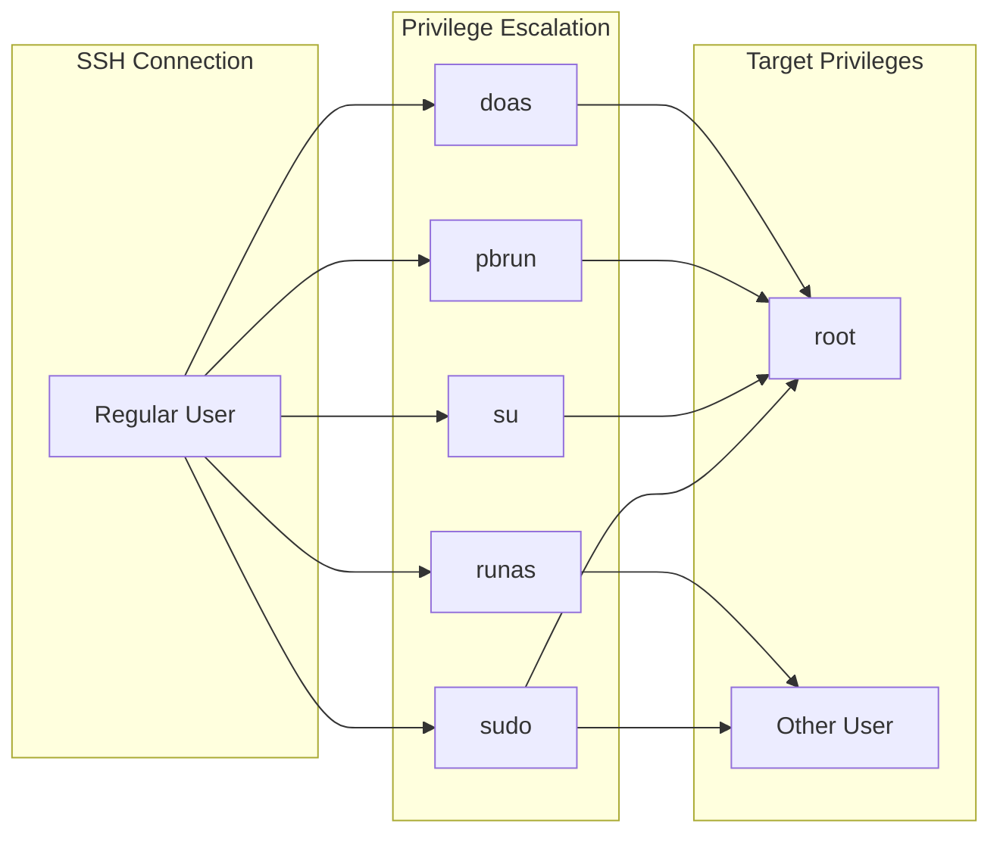
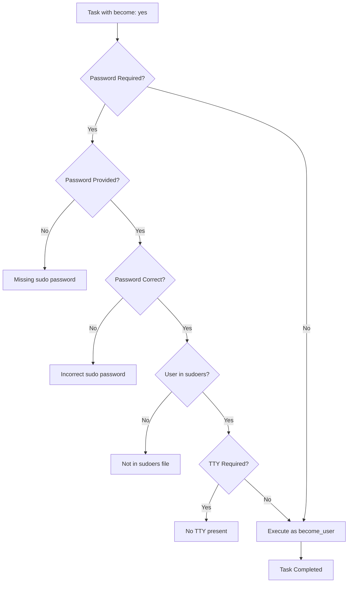

# How to Fix "Privilege Escalation" become Errors

Author: [nawazdhandala](https://www.github.com/nawazdhandala)

Tags: Ansible, Privilege Escalation, sudo, become, DevOps, Troubleshooting, Linux

Description: Learn how to diagnose and fix common Ansible privilege escalation errors including sudo failures, password issues, and become method problems.

---

Privilege escalation in Ansible allows you to run tasks with elevated permissions, typically as root. When it fails, you get cryptic errors that can be difficult to debug. This guide covers the most common `become` errors and their solutions.

## Understanding Ansible Privilege Escalation

Ansible uses the `become` directive to escalate privileges on remote hosts. By default, it uses `sudo`, but other methods are available.



## Common Error: "Missing sudo password"

This is the most frequent privilege escalation error.

### Error Message

```
FAILED! => {"msg": "Missing sudo password"}
```

### Cause

Ansible needs to provide a sudo password, but none was configured.

### Solution 1: Provide Password at Runtime

```bash
# Prompt for become password when running playbook
ansible-playbook playbook.yml --ask-become-pass

# Or use the short form
ansible-playbook playbook.yml -K
```

### Solution 2: Configure in Inventory

```ini
# inventory/hosts.ini

[webservers]
web01 ansible_host=192.168.1.10

[webservers:vars]
ansible_become_password={{ vault_become_password }}
```

### Solution 3: Configure NOPASSWD sudo

On the target host, configure passwordless sudo for the Ansible user:

```bash
# /etc/sudoers.d/ansible
# Allow ansible user to run any command without password
ansible ALL=(ALL) NOPASSWD: ALL
```

Use `visudo` to edit safely:

```bash
# Create sudoers file for ansible user
sudo visudo -f /etc/sudoers.d/ansible
```

### Solution 4: Use Ansible Vault for Password

```yaml
# group_vars/all/vault.yml (encrypted with ansible-vault)
vault_become_password: "secretpassword"

# group_vars/all/vars.yml
ansible_become_password: "{{ vault_become_password }}"
```

Run with vault:

```bash
ansible-playbook playbook.yml --ask-vault-pass
```

## Error: "Incorrect sudo password"

### Error Message

```
FAILED! => {"msg": "Incorrect sudo password"}
```

### Cause

The provided password is wrong or the user does not have sudo privileges.

### Diagnosis

```yaml
# debug-sudo.yml - Test sudo access

---
- name: Debug sudo access
  hosts: all
  gather_facts: no
  tasks:
    - name: Check current user
      command: whoami
      register: current_user
      become: no

    - name: Display current user
      debug:
        msg: "Connected as: {{ current_user.stdout }}"

    - name: Test sudo access
      command: whoami
      become: yes
      register: sudo_user

    - name: Display sudo user
      debug:
        msg: "After sudo: {{ sudo_user.stdout }}"
```

### Solution

Verify the user has sudo access on the target host:

```bash
# On target host, check sudo access
sudo -l

# Check if user is in sudo group
groups $USER

# Add user to sudo group if needed
sudo usermod -aG sudo username
```

## Error: "sudo: a password is required"

### Error Message

```
fatal: [host]: FAILED! => {
    "msg": "sudo: a password is required\n"
}
```

### Cause

The playbook has `become: yes` but no password mechanism is configured.

### Solution: Configure become properly

```yaml
# playbook.yml

---
- name: Configure servers
  hosts: all
  become: yes
  become_method: sudo
  become_user: root

  tasks:
    - name: Install packages
      apt:
        name: nginx
        state: present
```

Run with password prompt:

```bash
ansible-playbook playbook.yml -K
```

Or configure in ansible.cfg:

```ini
# ansible.cfg

[privilege_escalation]
become = True
become_method = sudo
become_user = root
become_ask_pass = True
```

## Error: "sudo: no tty present"

### Error Message

```
sudo: no tty present and no askpass program specified
```

### Cause

The target system requires a TTY for sudo, but Ansible does not allocate one by default.

### Solution 1: Disable requiretty in sudoers

```bash
# On target host, edit sudoers
sudo visudo

# Comment out or remove this line:
# Defaults    requiretty

# Or add exception for ansible user:
Defaults:ansible !requiretty
```

### Solution 2: Use pipelining (if NOPASSWD is configured)

```ini
# ansible.cfg

[ssh_connection]
pipelining = True
```

Note: Pipelining requires NOPASSWD sudo to be configured.

## Error: "become method not supported"

### Error Message

```
FAILED! => {"msg": "become method 'pbrun' is not supported"}
```

### Cause

The specified become method is not available or not configured.

### Solution: Check Available Methods

```yaml
# List available become methods in your Ansible installation
# Common methods: sudo, su, pbrun, pfexec, doas, dzdo, ksu, runas

# Use a valid become method
become_method: sudo  # Most common for Linux
become_method: su    # Traditional Unix
become_method: doas  # OpenBSD
become_method: runas # Windows
```

### Configuration for Different Methods

```yaml
# For su method
- hosts: legacy_servers
  become: yes
  become_method: su
  become_user: root
  vars:
    ansible_become_password: "{{ vault_root_password }}"

# For doas (OpenBSD)
- hosts: openbsd
  become: yes
  become_method: doas
  become_user: root
```

## Error: "Failed to set permissions on the temporary files"

### Error Message

```
Failed to set permissions on the temporary files Ansible needs to create
```

### Cause

The become user cannot access the temporary directory created by the connecting user.

### Solution 1: Configure remote_tmp

```ini
# ansible.cfg

[defaults]
remote_tmp = /tmp/.ansible-${USER}/tmp
```

### Solution 2: Use allow_world_readable_tmpfiles

```ini
# ansible.cfg

[defaults]
allow_world_readable_tmpfiles = True
```

### Solution 3: Set ACL on temp directory

```yaml
# Ensure temp directory has proper permissions
- name: Configure temp directory
  hosts: all
  become: no
  tasks:
    - name: Create ansible temp directory
      file:
        path: /tmp/.ansible-{{ ansible_user }}
        state: directory
        mode: '0700'
```

## Error: "User not in sudoers file"

### Error Message

```
user is not in the sudoers file. This incident will be reported.
```

### Cause

The connecting user does not have sudo privileges.

### Solution

Add the user to sudoers on the target host:

```bash
# Option 1: Add to sudo group (Debian/Ubuntu)
sudo usermod -aG sudo ansible

# Option 2: Add to wheel group (RHEL/CentOS)
sudo usermod -aG wheel ansible

# Option 3: Create specific sudoers entry
sudo visudo -f /etc/sudoers.d/ansible
```

Content for `/etc/sudoers.d/ansible`:

```
# Allow ansible user full sudo access
ansible ALL=(ALL) NOPASSWD: ALL

# Or with password required
ansible ALL=(ALL) ALL

# Or limited to specific commands
ansible ALL=(ALL) NOPASSWD: /usr/bin/apt-get, /usr/bin/systemctl
```

## Privilege Escalation Workflow



## Advanced Configuration

### Different become settings per host

```yaml
# inventory/hosts.yml

all:
  hosts:
    server1:
      ansible_become_method: sudo
      ansible_become_password: "{{ vault_server1_pass }}"
    server2:
      ansible_become_method: su
      ansible_become_password: "{{ vault_server2_root_pass }}"
    openbsd:
      ansible_become_method: doas
```

### Different become settings per task

```yaml
# playbook.yml

---
- name: Mixed privilege tasks
  hosts: all
  tasks:
    - name: Run as regular user
      command: whoami
      become: no

    - name: Run as root
      command: whoami
      become: yes
      become_user: root

    - name: Run as specific user
      command: whoami
      become: yes
      become_user: postgres
      become_method: sudo
```

### Escalate to non-root user

```yaml
# Run commands as application user
- name: Deploy application
  hosts: appservers
  tasks:
    - name: Run as app user
      become: yes
      become_user: appuser
      command: /opt/app/deploy.sh

    - name: Restart service as root
      become: yes
      become_user: root
      systemd:
        name: myapp
        state: restarted
```

## Debugging Privilege Escalation

### Enable verbose output

```bash
# Maximum verbosity for debugging
ansible-playbook playbook.yml -K -vvvv
```

### Check sudo configuration remotely

```yaml
# debug-become.yml

---
- name: Debug privilege escalation
  hosts: all
  tasks:
    - name: Check sudo version
      command: sudo --version
      become: no
      register: sudo_version
      ignore_errors: yes

    - name: Check sudo permissions
      command: sudo -l
      become: no
      register: sudo_perms
      ignore_errors: yes

    - name: Display sudo info
      debug:
        msg:
          - "Sudo version: {{ sudo_version.stdout_lines | default(['Not available']) }}"
          - "Sudo permissions: {{ sudo_perms.stdout_lines | default(['Not available']) }}"

    - name: Test become
      command: id
      become: yes
      register: become_test

    - name: Show become result
      debug:
        var: become_test.stdout
```

## Best Practices

1. **Use NOPASSWD for automation accounts** - Reduces complexity and avoids password management issues

2. **Limit sudo permissions** - Only grant the permissions needed for automation tasks

3. **Use Ansible Vault** - Never store passwords in plain text

4. **Test escalation separately** - Debug privilege issues before complex playbooks

5. **Document requirements** - Specify which become settings each playbook needs

```yaml
# Example: Well-documented playbook header
---
# Playbook: configure-servers.yml
# Requires: become: yes with sudo access to root
# Run with: ansible-playbook configure-servers.yml -K

- name: Configure servers
  hosts: all
  become: yes
  become_method: sudo
  become_user: root
```

---

Privilege escalation errors in Ansible usually stem from misconfigured sudo on target hosts or missing password configuration. Start by verifying that your connecting user has proper sudo access on the target, then ensure Ansible has the password it needs (either via prompt, vault, or NOPASSWD configuration). When debugging, use verbose mode and test with simple commands before running complex playbooks.
