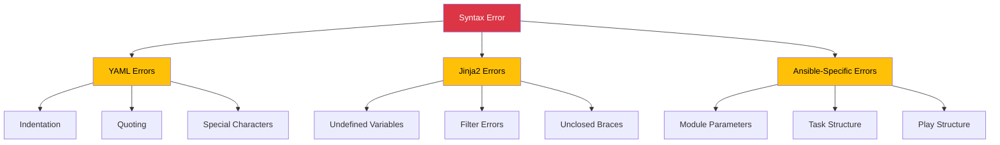
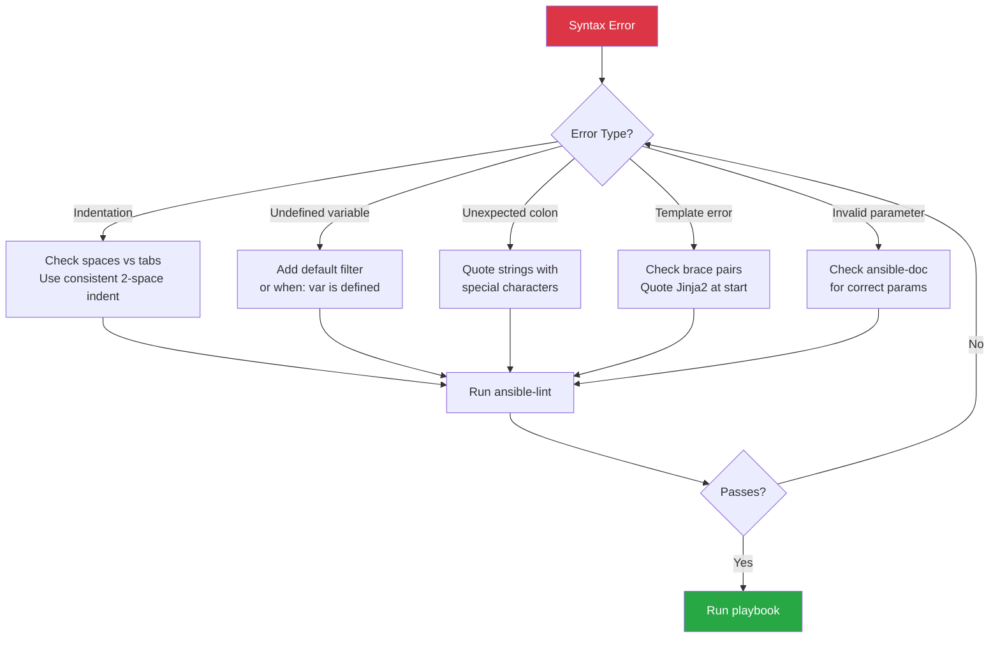

# How to Fix "Syntax Error" in Ansible Playbooks

Author: [nawazdhandala](https://www.github.com/nawazdhandala)

Tags: Ansible, DevOps, Troubleshooting, YAML, Configuration Management, Debugging

Description: A comprehensive guide to identifying and fixing common syntax errors in Ansible playbooks, including YAML formatting issues, Jinja2 template errors, and validation techniques.

---

Syntax errors in Ansible playbooks can be frustrating, but they follow predictable patterns. This guide covers the most common syntax errors and how to fix them quickly.

## Understanding Ansible Syntax Errors

Ansible playbooks use YAML format with Jinja2 templating. Syntax errors typically fall into three categories:



## YAML Syntax Errors

### Error 1: Indentation Problems

**Error message:**
```
ERROR! Syntax Error while loading YAML.
  mapping values are not allowed in this context
```

**Problem:** Inconsistent indentation or mixing tabs and spaces.

```yaml
# WRONG - inconsistent indentation
- name: Install packages
  apt:
   name: nginx    # 1 space instead of 2
    state: present  # 4 spaces instead of 2
```

**Solution:** Use consistent 2-space indentation, never tabs.

```yaml
# CORRECT - consistent 2-space indentation
- name: Install packages
  apt:
    name: nginx
    state: present
```

**Fix with editor settings:**

```bash
# .editorconfig
[*.yml]
indent_style = space
indent_size = 2

# VS Code settings.json
{
  "[yaml]": {
    "editor.tabSize": 2,
    "editor.insertSpaces": true
  }
}
```

### Error 2: Missing Colon After Key

**Error message:**
```
ERROR! Syntax Error while loading YAML.
  could not find expected ':'
```

**Problem:** Missing colon after a key name.

```yaml
# WRONG - missing colon
- name: Configure service
  template
    src: config.j2
    dest: /etc/app/config
```

**Solution:** Add the colon after the module name.

```yaml
# CORRECT
- name: Configure service
  template:
    src: config.j2
    dest: /etc/app/config
```

### Error 3: Incorrect List Formatting

**Error message:**
```
ERROR! Syntax Error while loading YAML.
  did not find expected '-' indicator
```

**Problem:** Improper list item formatting.

```yaml
# WRONG - missing dash for list items
tasks:
  name: First task
  debug:
    msg: "Hello"
  name: Second task
  debug:
    msg: "World"
```

**Solution:** Add dashes for each list item.

```yaml
# CORRECT
tasks:
  - name: First task
    debug:
      msg: "Hello"

  - name: Second task
    debug:
      msg: "World"
```

### Error 4: Quoting Issues

**Error message:**
```
ERROR! Syntax Error while loading YAML.
  found unexpected ':'
```

**Problem:** Unquoted strings containing special YAML characters.

```yaml
# WRONG - colon in unquoted string
- name: Run command
  command: echo "Time: 12:30"

# WRONG - special characters without quotes
- name: Set message
  set_fact:
    msg: Hello: World
```

**Solution:** Quote strings with special characters (`: { } [ ] , & * # ? | - < > = ! % @ \`).

```yaml
# CORRECT - quoted strings
- name: Run command
  command: "echo 'Time: 12:30'"

- name: Set message
  set_fact:
    msg: "Hello: World"
```

### Error 5: Boolean Values

**Error message:**
```
ERROR! Syntax Error while loading YAML.
  could not determine a constructor for the tag
```

**Problem:** Using unquoted yes/no that YAML interprets as boolean.

```yaml
# WRONG - "yes" becomes boolean True
- name: Set country
  set_fact:
    country: norway  # OK
    answer: yes      # Becomes True, not string "yes"
```

**Solution:** Quote string values that could be interpreted as booleans.

```yaml
# CORRECT
- name: Set values
  set_fact:
    country: norway
    answer: "yes"    # String "yes"
    enabled: true    # Boolean true
```

## Jinja2 Template Errors

### Error 6: Undefined Variable

**Error message:**
```
ERROR! 'my_variable' is undefined
```

**Problem:** Referencing a variable that does not exist.

```yaml
# WRONG - variable might not exist
- name: Show message
  debug:
    msg: "Server is {{ server_name }}"
```

**Solution:** Use default filter or define the variable.

```yaml
# CORRECT - with default value
- name: Show message
  debug:
    msg: "Server is {{ server_name | default('unknown') }}"

# CORRECT - with variable check
- name: Show message
  debug:
    msg: "Server is {{ server_name }}"
  when: server_name is defined
```

### Error 7: Unclosed Braces

**Error message:**
```
ERROR! template error while templating string
  unexpected end of template
```

**Problem:** Missing closing braces in Jinja2 expression.

```yaml
# WRONG - missing closing braces
- name: Create file
  template:
    src: "{{ template_name }.j2"
    dest: "/etc/{{ config_name"
```

**Solution:** Ensure all braces are properly closed.

```yaml
# CORRECT
- name: Create file
  template:
    src: "{{ template_name }}.j2"
    dest: "/etc/{{ config_name }}"
```

### Error 8: Jinja2 in Wrong Context

**Error message:**
```
ERROR! Syntax Error while loading YAML.
  found undefined alias
```

**Problem:** Using Jinja2 syntax where YAML expects a value.

```yaml
# WRONG - Jinja2 at start of value needs quotes
- name: Debug
  debug:
    msg: {{ my_variable }}
```

**Solution:** Quote Jinja2 expressions that start a value.

```yaml
# CORRECT
- name: Debug
  debug:
    msg: "{{ my_variable }}"

# Also correct - Jinja2 not at start
- name: Debug
  debug:
    msg: The value is {{ my_variable }}
```

### Error 9: Filter Syntax Errors

**Error message:**
```
ERROR! template error while templating string
  no filter named 'bad_filter'
```

**Problem:** Incorrect filter name or syntax.

```yaml
# WRONG - typo in filter name
- name: Process list
  debug:
    msg: "{{ my_list | jion(',') }}"  # Should be 'join'
```

**Solution:** Use correct filter names and syntax.

```yaml
# CORRECT
- name: Process list
  debug:
    msg: "{{ my_list | join(',') }}"

# Common filters
# - default(value)
# - join(separator)
# - lower / upper
# - replace(old, new)
# - regex_replace(pattern, replacement)
# - to_json / to_yaml
# - first / last
# - length
```

### Error 10: Nested Quotes

**Error message:**
```
ERROR! Syntax Error while loading YAML.
  found unexpected end of stream
```

**Problem:** Improperly escaped quotes within quotes.

```yaml
# WRONG - unescaped quotes
- name: Run command
  shell: echo "He said "Hello""
```

**Solution:** Use different quote types or escape properly.

```yaml
# CORRECT - different quote types
- name: Run command
  shell: echo "He said 'Hello'"

# CORRECT - escaped quotes
- name: Run command
  shell: echo "He said \"Hello\""

# CORRECT - YAML literal block
- name: Run command
  shell: |
    echo "He said \"Hello\""
```

## Ansible-Specific Errors

### Error 11: Invalid Module Parameters

**Error message:**
```
ERROR! Unsupported parameters for (module) module: wrong_param
```

**Problem:** Using parameters that do not exist for a module.

```yaml
# WRONG - 'package' is not a valid parameter for apt
- name: Install nginx
  apt:
    package: nginx
    state: present
```

**Solution:** Use correct parameter names.

```yaml
# CORRECT - use 'name' for apt module
- name: Install nginx
  apt:
    name: nginx
    state: present
```

**Check module documentation:**
```bash
ansible-doc apt
ansible-doc -l | grep package
```

### Error 12: Incorrect Task Structure

**Error message:**
```
ERROR! conflicting action statements: command, shell
```

**Problem:** Multiple action modules in a single task.

```yaml
# WRONG - two action modules
- name: Do something
  command: ls -la
  shell: echo "done"
```

**Solution:** One action module per task.

```yaml
# CORRECT - separate tasks
- name: List files
  command: ls -la

- name: Print done
  shell: echo "done"
```

### Error 13: Invalid Play Structure

**Error message:**
```
ERROR! 'tasks' is not a valid attribute for a Play
```

**Problem:** Incorrect play-level structure.

```yaml
# WRONG - missing hosts
- name: Configure servers
  tasks:
    - debug:
        msg: "Hello"
```

**Solution:** Include required play attributes.

```yaml
# CORRECT
- name: Configure servers
  hosts: all
  tasks:
    - debug:
        msg: "Hello"
```

### Error 14: When Condition Syntax

**Error message:**
```
ERROR! The conditional check 'ansible_os_family = "Debian"' failed
```

**Problem:** Using assignment operator instead of comparison.

```yaml
# WRONG - single equals is assignment
- name: Install on Debian
  apt:
    name: nginx
  when: ansible_os_family = "Debian"
```

**Solution:** Use double equals for comparison.

```yaml
# CORRECT
- name: Install on Debian
  apt:
    name: nginx
  when: ansible_os_family == "Debian"
```

## Validation and Debugging Tools

### Syntax Check Command

```bash
# Check playbook syntax
ansible-playbook playbook.yml --syntax-check

# Check with verbose output
ansible-playbook playbook.yml --syntax-check -v

# Check specific inventory
ansible-playbook -i inventory.yml playbook.yml --syntax-check
```

### YAML Linting with yamllint

```bash
# Install yamllint
pip install yamllint

# Create configuration
cat > .yamllint.yml << 'EOF'
extends: default

rules:
  line-length:
    max: 120
  indentation:
    spaces: 2
    indent-sequences: true
  truthy:
    allowed-values: ['true', 'false', 'yes', 'no']
EOF

# Run linter
yamllint playbook.yml
yamllint roles/
```

### Ansible Lint

```bash
# Install ansible-lint
pip install ansible-lint

# Run linter
ansible-lint playbook.yml

# Run with specific rules
ansible-lint -x yaml playbook.yml

# Show all rules
ansible-lint -L
```

### Debug Mode

```yaml
# Add debug tasks to understand variable state
- name: Debug all variables
  debug:
    var: vars

- name: Debug specific variable
  debug:
    var: my_variable

- name: Debug with message
  debug:
    msg: "Variable type: {{ my_variable | type_debug }}"
```

## Common Fixes Quick Reference



### Quick Fixes Table

| Error Message | Common Cause | Quick Fix |
|--------------|--------------|-----------|
| `mapping values are not allowed` | Bad indentation | Check spaces, use 2-space indent |
| `could not find expected ':'` | Missing colon | Add colon after key |
| `found unexpected ':'` | Unquoted special chars | Quote the string |
| `is undefined` | Missing variable | Add `\| default(value)` |
| `unexpected end of template` | Unclosed braces | Count `{{` and `}}` pairs |
| `Unsupported parameters` | Wrong module param | Check `ansible-doc module` |
| `conflicting action statements` | Multiple modules | One module per task |

## Best Practices to Avoid Syntax Errors

### 1. Use an IDE with YAML Support

VS Code with extensions:
- YAML by Red Hat
- Ansible by Red Hat
- Better Jinja

### 2. Validate Before Running

```bash
# Create a pre-commit hook
cat > .git/hooks/pre-commit << 'EOF'
#!/bin/bash
yamllint *.yml roles/*/tasks/*.yml
ansible-lint *.yml
ansible-playbook *.yml --syntax-check
EOF
chmod +x .git/hooks/pre-commit
```

### 3. Use Multiline Strings for Complex Values

```yaml
# Avoid complex quoting with block scalars
- name: Run complex command
  shell: |
    echo "Starting process"
    for i in 1 2 3; do
      echo "Step $i"
    done
    echo "Done"
```

### 4. Separate Variables from Tasks

```yaml
# vars/main.yml - easier to spot quoting issues
special_message: "Warning: Check this value!"
config_items:
  - name: "item:one"
    value: true

# tasks/main.yml - cleaner task definitions
- name: Show message
  debug:
    msg: "{{ special_message }}"
```

---

Ansible syntax errors are usually YAML formatting issues, Jinja2 template problems, or incorrect module usage. Use `--syntax-check`, `yamllint`, and `ansible-lint` to catch errors early. Configure your editor for YAML, use consistent indentation, and quote strings with special characters. When in doubt, check `ansible-doc` for correct module parameters.
