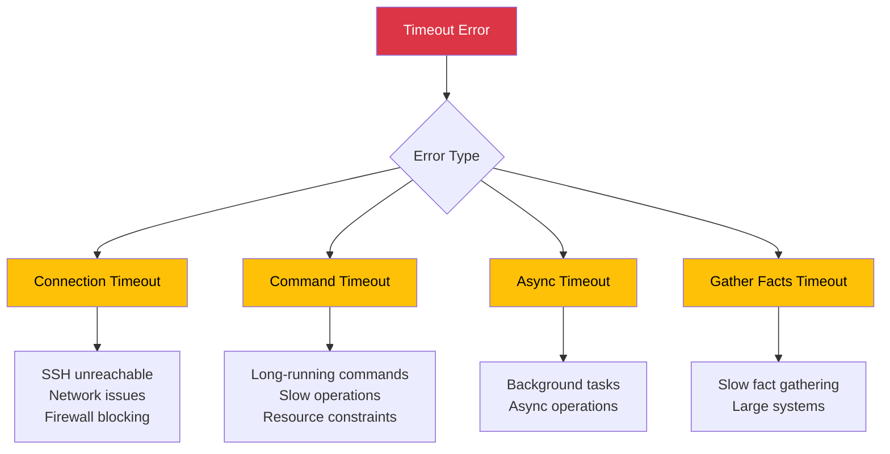
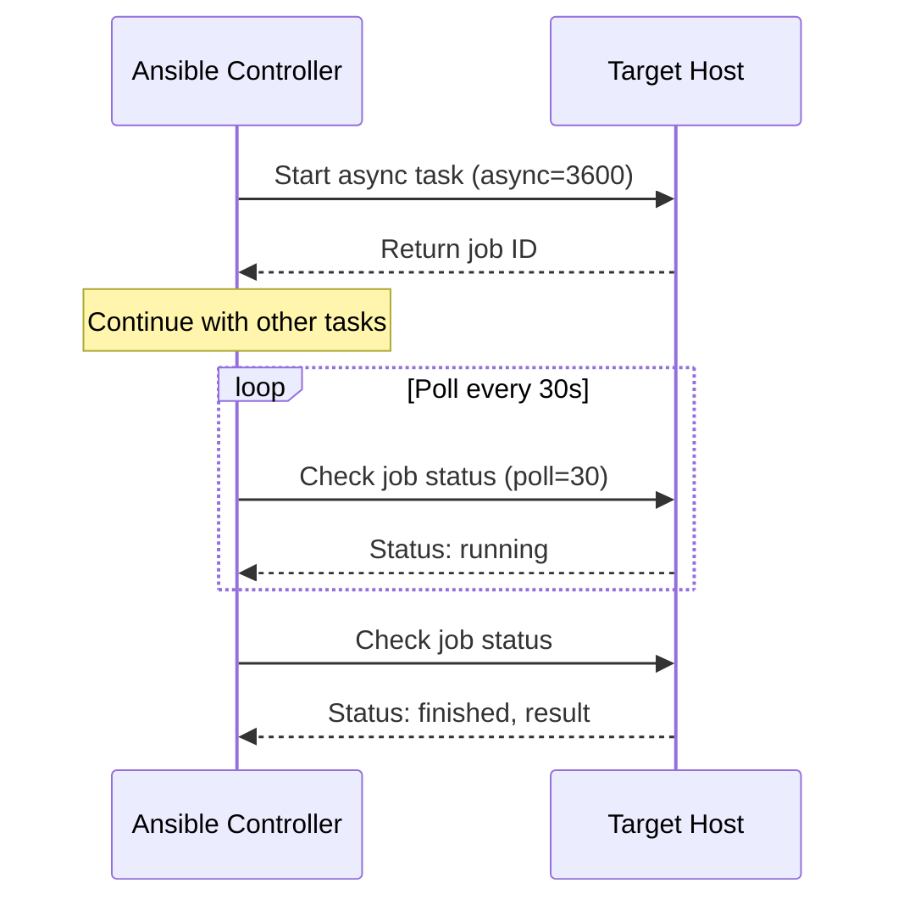
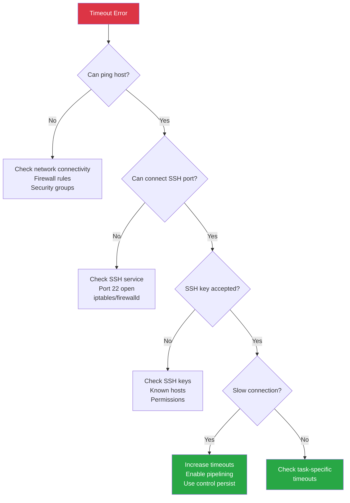

# How to Fix "Timeout" Connection Errors in Ansible

Author: [nawazdhandala](https://www.github.com/nawazdhandala)

Tags: Ansible, DevOps, Troubleshooting, SSH, Networking, Timeout, Connection

Description: A practical guide to diagnosing and fixing timeout errors in Ansible, covering SSH connection issues, slow tasks, network problems, and performance tuning.

---

Timeout errors in Ansible can occur during connection establishment, task execution, or when waiting for long-running operations. This guide helps you identify the cause and apply the right fix.

## Types of Timeout Errors



## Connection Timeout Errors

### Error Message

```
fatal: [server01]: UNREACHABLE! => {
    "changed": false,
    "msg": "Failed to connect to the host via ssh: ssh: connect to host 10.0.0.5 port 22: Connection timed out",
    "unreachable": true
}
```

### Quick Diagnosis

```bash
# Test basic connectivity
ping -c 3 10.0.0.5

# Test SSH port
nc -zv 10.0.0.5 22

# Test SSH connection with verbose output
ssh -vvv user@10.0.0.5

# Check if host is reachable with Ansible
ansible server01 -m ping -vvvv
```

### Solution 1: Increase Connection Timeout

```yaml
# In playbook
- name: Configure servers
  hosts: all
  vars:
    ansible_ssh_timeout: 30  # Default is 10 seconds
  tasks:
    - name: Task here
      debug:
        msg: "Connected"
```

```ini
# In ansible.cfg
[defaults]
timeout = 30

[ssh_connection]
ssh_args = -o ConnectTimeout=30
```

### Solution 2: Configure SSH Options

```ini
# ansible.cfg
[ssh_connection]
# Increase connection timeout
ssh_args = -o ConnectTimeout=30 -o ServerAliveInterval=15 -o ServerAliveCountMax=3

# Use control persist for connection reuse
control_path = %(directory)s/%%h-%%r
control_master = auto
control_persist = 60s

# Pipelining for better performance
pipelining = True
```

### Solution 3: Handle Network Latency

For high-latency networks or cloud connections:

```yaml
# inventory/group_vars/all.yml
---
# Connection settings for slow networks
ansible_ssh_common_args: >-
  -o ConnectTimeout=60
  -o ServerAliveInterval=30
  -o ServerAliveCountMax=5
  -o TCPKeepAlive=yes

# Retry settings
ansible_ssh_retries: 3
```

### Solution 4: Bastion/Jump Host Configuration

When connecting through a bastion host:

```yaml
# inventory/hosts.yml
---
all:
  children:
    internal_servers:
      hosts:
        internal01:
          ansible_host: 10.0.1.10
        internal02:
          ansible_host: 10.0.1.11
      vars:
        ansible_ssh_common_args: >-
          -o ProxyCommand="ssh -W %h:%p -q bastion@bastion.example.com"
          -o ConnectTimeout=60
```

```ini
# Or in ansible.cfg
[ssh_connection]
ssh_args = -o ProxyCommand="ssh -W %h:%p -q bastion@bastion.example.com" -o ConnectTimeout=60
```

## Command/Task Timeout Errors

### Error Message

```
fatal: [server01]: FAILED! => {
    "changed": false,
    "msg": "Timeout (12s) waiting for privilege escalation prompt:"
}
```

Or:

```
TASK [Install packages] *******************************************************
fatal: [server01]: FAILED! => {"msg": "command timeout triggered, timeout value is 30 seconds"}
```

### Solution 1: Increase Task Timeout

For specific slow tasks:

```yaml
- name: Run long database migration
  ansible.builtin.command: /opt/app/migrate.sh
  async: 3600        # Maximum runtime in seconds
  poll: 30           # Check every 30 seconds

- name: Wait for migration to complete
  ansible.builtin.async_status:
    jid: "{{ migration_job.ansible_job_id }}"
  register: migration_result
  until: migration_result.finished
  retries: 120       # Number of retries
  delay: 30          # Delay between retries
```

### Solution 2: Global Timeout Settings

```ini
# ansible.cfg
[defaults]
# General timeout for operations
timeout = 60

# Timeout for persistent connections
persistent_connect_timeout = 60
persistent_command_timeout = 60

[privilege_escalation]
# Timeout waiting for sudo password prompt
become_timeout = 30
```

### Solution 3: Module-Specific Timeouts

```yaml
# Wait for module with custom timeout
- name: Wait for server to come back
  ansible.builtin.wait_for_connection:
    timeout: 300      # 5 minutes
    delay: 10         # Wait 10 seconds before starting checks
    sleep: 5          # Sleep between checks

# URI module timeout
- name: Wait for application to respond
  ansible.builtin.uri:
    url: "http://{{ inventory_hostname }}:8080/health"
    timeout: 60       # Request timeout
  register: result
  until: result.status == 200
  retries: 30
  delay: 10

# Package manager timeout
- name: Install packages with extended timeout
  ansible.builtin.apt:
    name: "{{ packages }}"
    update_cache: yes
  environment:
    DEBIAN_FRONTEND: noninteractive
  timeout: 600       # 10 minutes for slow package installs
```

## Async Operations for Long-Running Tasks



### Running Long Tasks Asynchronously

```yaml
- name: Run database backup (long operation)
  ansible.builtin.shell: /opt/scripts/backup_database.sh
  async: 7200        # 2 hour maximum
  poll: 0            # Don't wait, fire and forget
  register: backup_job

- name: Continue with other tasks
  ansible.builtin.debug:
    msg: "Backup running in background"

- name: Check backup status periodically
  ansible.builtin.async_status:
    jid: "{{ backup_job.ansible_job_id }}"
  register: backup_result
  until: backup_result.finished
  retries: 240       # 240 * 30 = 7200 seconds max
  delay: 30          # Check every 30 seconds

- name: Verify backup completed successfully
  ansible.builtin.assert:
    that:
      - backup_result.rc == 0
    fail_msg: "Backup failed with return code {{ backup_result.rc }}"
```

### Parallel Async Tasks

```yaml
- name: Start long tasks on all hosts simultaneously
  ansible.builtin.shell: /opt/scripts/long_task.sh
  async: 3600
  poll: 0
  register: long_tasks

- name: Wait for all tasks to complete
  ansible.builtin.async_status:
    jid: "{{ item.ansible_job_id }}"
  loop: "{{ long_tasks.results }}"
  register: async_results
  until: async_results.finished
  retries: 120
  delay: 30
```

## Fact Gathering Timeout

### Error Message

```
fatal: [server01]: FAILED! => {
    "msg": "Timeout (10s) waiting for gather_facts"
}
```

### Solution 1: Disable or Limit Fact Gathering

```yaml
# Disable completely for fast tasks
- name: Quick configuration
  hosts: all
  gather_facts: false
  tasks:
    - name: Just copy a file
      ansible.builtin.copy:
        src: config.txt
        dest: /etc/app/config.txt

# Gather only specific facts
- name: Selective fact gathering
  hosts: all
  gather_facts: false
  tasks:
    - name: Gather only network facts
      ansible.builtin.setup:
        gather_subset:
          - network
        gather_timeout: 30
```

### Solution 2: Increase Fact Gathering Timeout

```ini
# ansible.cfg
[defaults]
# Timeout for fact gathering
gather_timeout = 30

# Fact caching to avoid repeated gathering
fact_caching = jsonfile
fact_caching_connection = /tmp/ansible_facts_cache
fact_caching_timeout = 86400  # 24 hours
```

### Solution 3: Custom Fact Gathering

```yaml
- name: Gather facts with custom timeout
  hosts: all
  gather_facts: false
  tasks:
    - name: Gather facts with increased timeout
      ansible.builtin.setup:
        gather_timeout: 60
      register: facts_result
      ignore_errors: true

    - name: Handle fact gathering failure
      ansible.builtin.set_fact:
        ansible_facts_gathered: "{{ facts_result is succeeded }}"
```

## Network Troubleshooting

### Diagnostic Playbook

```yaml
# diagnose_connectivity.yml
---
- name: Diagnose connection issues
  hosts: all
  gather_facts: false
  vars:
    ansible_ssh_timeout: 60

  tasks:
    - name: Test SSH connectivity
      ansible.builtin.wait_for_connection:
        timeout: 60
      register: connection_test
      ignore_errors: true

    - name: Report connectivity status
      ansible.builtin.debug:
        msg: "Host {{ inventory_hostname }}: {{ 'REACHABLE' if connection_test is succeeded else 'UNREACHABLE' }}"

    - name: Test DNS resolution (if connected)
      ansible.builtin.command: nslookup google.com
      register: dns_test
      ignore_errors: true
      when: connection_test is succeeded

    - name: Test outbound connectivity
      ansible.builtin.uri:
        url: https://www.google.com
        timeout: 10
      register: internet_test
      ignore_errors: true
      when: connection_test is succeeded

    - name: Gather network facts
      ansible.builtin.setup:
        gather_subset:
          - network
        gather_timeout: 30
      when: connection_test is succeeded
```

### Common Network Issues



## Performance Tuning

### Optimized ansible.cfg

```ini
# ansible.cfg
[defaults]
# Increase parallelism
forks = 50

# Connection timeout
timeout = 30

# Fact caching
gathering = smart
fact_caching = jsonfile
fact_caching_connection = /tmp/ansible_facts
fact_caching_timeout = 86400

# Callbacks for timing
callback_whitelist = timer, profile_tasks

[ssh_connection]
# SSH performance settings
ssh_args = -o ControlMaster=auto -o ControlPersist=300s -o ConnectTimeout=30 -o ServerAliveInterval=15
control_path = %(directory)s/%%h-%%r

# Enable pipelining (requires requiretty disabled in sudoers)
pipelining = True

# Retries
retries = 3

[persistent_connection]
# For network devices
connect_timeout = 60
command_timeout = 60
```

### Parallel Execution Strategy

```yaml
- name: Fast parallel execution
  hosts: all
  strategy: free          # Don't wait for all hosts
  gather_facts: false

  tasks:
    - name: Quick task
      ansible.builtin.command: uptime
```

### Retry Logic for Unreliable Connections

```yaml
- name: Handle unreliable connections
  hosts: all

  tasks:
    - name: Retry connection on failure
      block:
        - name: Attempt task
          ansible.builtin.command: some_command
      rescue:
        - name: Wait and retry
          ansible.builtin.wait_for:
            timeout: 30

        - name: Retry task
          ansible.builtin.command: some_command
```

## Quick Reference

### Timeout Settings Summary

| Setting | Location | Default | Description |
|---------|----------|---------|-------------|
| `timeout` | ansible.cfg [defaults] | 10 | General connection timeout |
| `ansible_ssh_timeout` | variable | 10 | SSH connection timeout |
| `ConnectTimeout` | SSH args | 10 | SSH ConnectTimeout option |
| `gather_timeout` | ansible.cfg | 10 | Fact gathering timeout |
| `async` | task | N/A | Max time for async task |
| `poll` | task | 10 | Poll interval for async |

### Commands for Debugging

```bash
# Test connectivity
ansible all -m ping -vvvv

# Time playbook execution
time ansible-playbook playbook.yml

# Run with connection debugging
ANSIBLE_DEBUG=1 ansible-playbook playbook.yml

# Check SSH configuration
ssh -vvv user@host

# Profile task timing
ansible-playbook playbook.yml --callback-whitelist=profile_tasks
```

---

Most Ansible timeout errors stem from network connectivity issues, slow tasks, or default timeouts being too aggressive. Start by identifying the timeout type from the error message, then apply the appropriate fix: increase connection timeouts for network issues, use async for long-running tasks, and optimize SSH settings for better performance. Always test connectivity manually with SSH before troubleshooting Ansible-specific issues.
