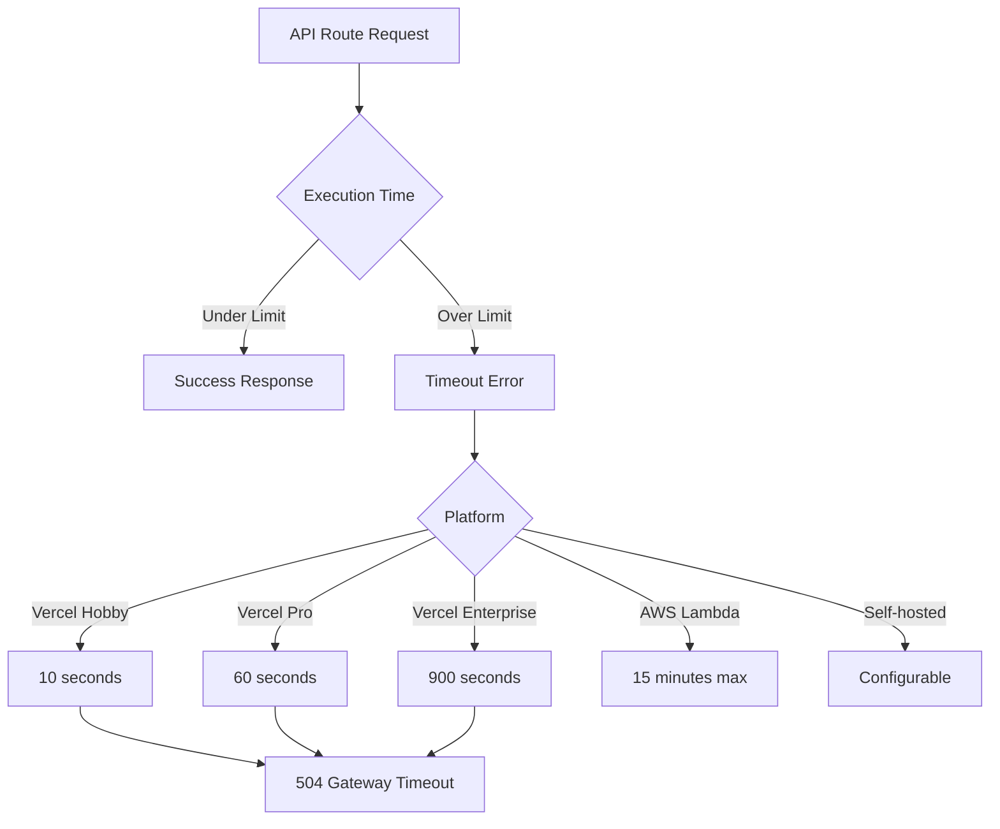
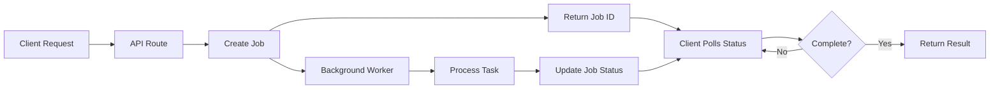

# How to Fix "API Route" Timeout Errors in Next.js

Author: [nawazdhandala](https://www.github.com/nawazdhandala)

Tags: Next.js, API Routes, Timeout, Performance, Backend, Serverless, Edge Functions

Description: A practical guide to diagnosing and resolving API route timeout errors in Next.js applications with optimization strategies.

---

API route timeout errors are a common challenge in Next.js applications, especially when dealing with serverless deployments. These errors occur when your API routes take longer to respond than the platform allows. This guide covers the causes, solutions, and best practices for handling timeouts effectively.

## Understanding API Route Timeouts

Different deployment platforms have different timeout limits:



## Common Causes of Timeout Errors

### 1. Slow Database Queries

```javascript
// pages/api/users.js - PROBLEMATIC
export default async function handler(req, res) {
  // This query might timeout on large datasets
  const users = await prisma.user.findMany({
    include: {
      posts: true,
      comments: true,
      followers: true,
    },
  });

  res.status(200).json(users);
}
```

### 2. External API Calls Without Timeout

```javascript
// pages/api/data.js - PROBLEMATIC
export default async function handler(req, res) {
  // No timeout - could hang indefinitely
  const response = await fetch('https://slow-external-api.com/data');
  const data = await response.json();

  res.status(200).json(data);
}
```

### 3. Heavy Computation

```javascript
// pages/api/process.js - PROBLEMATIC
export default async function handler(req, res) {
  // CPU-intensive operation
  const result = processLargeDataset(req.body.data);  // Could take minutes

  res.status(200).json({ result });
}
```

## Solution 1: Optimize Database Queries

```javascript
// pages/api/users.js - OPTIMIZED
import { prisma } from '../../lib/prisma';

export default async function handler(req, res) {
  try {
    // Add pagination to limit data
    const page = parseInt(req.query.page) || 1;
    const limit = parseInt(req.query.limit) || 20;
    const skip = (page - 1) * limit;

    // Select only needed fields
    const users = await prisma.user.findMany({
      skip,
      take: limit,
      select: {
        id: true,
        name: true,
        email: true,
        createdAt: true,
        // Only include counts instead of full relations
        _count: {
          select: {
            posts: true,
            followers: true,
          },
        },
      },
      // Add index-friendly ordering
      orderBy: {
        createdAt: 'desc',
      },
    });

    // Get total count for pagination
    const total = await prisma.user.count();

    res.status(200).json({
      users,
      pagination: {
        page,
        limit,
        total,
        pages: Math.ceil(total / limit),
      },
    });
  } catch (error) {
    console.error('Database query error:', error);
    res.status(500).json({ error: 'Failed to fetch users' });
  }
}
```

## Solution 2: Add Timeouts to External Requests

```javascript
// lib/fetch-with-timeout.js
export async function fetchWithTimeout(url, options = {}, timeout = 5000) {
  const controller = new AbortController();
  const { signal } = controller;

  // Create timeout promise
  const timeoutId = setTimeout(() => {
    controller.abort();
  }, timeout);

  try {
    const response = await fetch(url, {
      ...options,
      signal,
    });

    clearTimeout(timeoutId);
    return response;
  } catch (error) {
    clearTimeout(timeoutId);

    if (error.name === 'AbortError') {
      throw new Error(`Request timeout after ${timeout}ms`);
    }
    throw error;
  }
}
```

```javascript
// pages/api/data.js - WITH TIMEOUT
import { fetchWithTimeout } from '../../lib/fetch-with-timeout';

export default async function handler(req, res) {
  try {
    // Set 5 second timeout for external API
    const response = await fetchWithTimeout(
      'https://external-api.com/data',
      {
        method: 'GET',
        headers: {
          'Content-Type': 'application/json',
        },
      },
      5000  // 5 second timeout
    );

    if (!response.ok) {
      throw new Error(`API responded with status ${response.status}`);
    }

    const data = await response.json();
    res.status(200).json(data);
  } catch (error) {
    console.error('External API error:', error);

    if (error.message.includes('timeout')) {
      res.status(504).json({ error: 'External service timeout' });
    } else {
      res.status(500).json({ error: 'Failed to fetch data' });
    }
  }
}
```

## Solution 3: Implement Background Jobs

For long-running tasks, use a background job pattern:



```javascript
// lib/job-queue.js
// Simple in-memory job queue (use Redis/database in production)
const jobs = new Map();

export function createJob(taskFn) {
  const jobId = `job_${Date.now()}_${Math.random().toString(36).substr(2, 9)}`;

  jobs.set(jobId, {
    status: 'pending',
    result: null,
    error: null,
    createdAt: new Date(),
  });

  // Run task asynchronously
  (async () => {
    try {
      jobs.set(jobId, { ...jobs.get(jobId), status: 'processing' });
      const result = await taskFn();
      jobs.set(jobId, {
        ...jobs.get(jobId),
        status: 'completed',
        result,
        completedAt: new Date(),
      });
    } catch (error) {
      jobs.set(jobId, {
        ...jobs.get(jobId),
        status: 'failed',
        error: error.message,
        completedAt: new Date(),
      });
    }
  })();

  return jobId;
}

export function getJob(jobId) {
  return jobs.get(jobId) || null;
}
```

```javascript
// pages/api/process/start.js
import { createJob } from '../../../lib/job-queue';
import { processLargeDataset } from '../../../lib/data-processor';

export default async function handler(req, res) {
  if (req.method !== 'POST') {
    return res.status(405).json({ error: 'Method not allowed' });
  }

  const { data } = req.body;

  // Create background job
  const jobId = createJob(async () => {
    return await processLargeDataset(data);
  });

  // Return immediately with job ID
  res.status(202).json({
    jobId,
    status: 'pending',
    message: 'Processing started',
    checkStatusUrl: `/api/process/status?jobId=${jobId}`,
  });
}
```

```javascript
// pages/api/process/status.js
import { getJob } from '../../../lib/job-queue';

export default async function handler(req, res) {
  const { jobId } = req.query;

  if (!jobId) {
    return res.status(400).json({ error: 'Job ID required' });
  }

  const job = getJob(jobId);

  if (!job) {
    return res.status(404).json({ error: 'Job not found' });
  }

  res.status(200).json({
    jobId,
    status: job.status,
    result: job.result,
    error: job.error,
    createdAt: job.createdAt,
    completedAt: job.completedAt,
  });
}
```

## Solution 4: Use Edge Functions for Fast Responses

Edge functions run closer to users and have different timeout characteristics:

```javascript
// pages/api/fast-data.js
// Edge runtime has 30 second timeout on Vercel
export const config = {
  runtime: 'edge',
};

export default async function handler(req) {
  const { searchParams } = new URL(req.url);
  const query = searchParams.get('q');

  // Fast operations suitable for edge
  const data = await fetch(`https://fast-api.com/search?q=${query}`);
  const results = await data.json();

  return new Response(JSON.stringify(results), {
    status: 200,
    headers: {
      'Content-Type': 'application/json',
      'Cache-Control': 's-maxage=60, stale-while-revalidate',
    },
  });
}
```

## Solution 5: Streaming Responses

For large data transfers, use streaming to avoid timeouts:

```javascript
// pages/api/stream-data.js
export default async function handler(req, res) {
  // Set headers for streaming
  res.setHeader('Content-Type', 'application/json');
  res.setHeader('Transfer-Encoding', 'chunked');

  // Start JSON array
  res.write('[\n');

  let isFirst = true;
  const batchSize = 100;
  let offset = 0;

  while (true) {
    // Fetch data in batches
    const batch = await prisma.record.findMany({
      skip: offset,
      take: batchSize,
    });

    if (batch.length === 0) break;

    // Write each record
    for (const record of batch) {
      if (!isFirst) {
        res.write(',\n');
      }
      res.write(JSON.stringify(record));
      isFirst = false;
    }

    offset += batchSize;
  }

  // Close JSON array
  res.write('\n]');
  res.end();
}
```

## Solution 6: Configure Timeout Settings

### Vercel Configuration

```json
// vercel.json
{
  "functions": {
    "pages/api/long-running.js": {
      "maxDuration": 60
    },
    "pages/api/very-long-running.js": {
      "maxDuration": 300
    }
  }
}
```

### Next.js Route Segment Config (App Router)

```javascript
// app/api/process/route.js
export const maxDuration = 60;  // 60 seconds timeout

export async function POST(request) {
  const body = await request.json();

  // Long-running operation
  const result = await processData(body);

  return Response.json({ result });
}
```

## Solution 7: Implement Request Caching

```javascript
// lib/cache.js
const cache = new Map();

export function withCache(key, ttlMs, fetchFn) {
  return async () => {
    const cached = cache.get(key);

    if (cached && Date.now() - cached.timestamp < ttlMs) {
      return cached.data;
    }

    const data = await fetchFn();
    cache.set(key, { data, timestamp: Date.now() });

    return data;
  };
}

// Cleanup old entries periodically
setInterval(() => {
  const now = Date.now();
  for (const [key, value] of cache.entries()) {
    if (now - value.timestamp > 3600000) {  // 1 hour
      cache.delete(key);
    }
  }
}, 60000);  // Run every minute
```

```javascript
// pages/api/cached-data.js
import { withCache } from '../../lib/cache';

export default async function handler(req, res) {
  const { category } = req.query;
  const cacheKey = `data-${category}`;

  try {
    const getData = withCache(
      cacheKey,
      300000,  // 5 minute TTL
      async () => {
        // This slow operation will only run once per 5 minutes
        const response = await fetch(`https://slow-api.com/data/${category}`);
        return response.json();
      }
    );

    const data = await getData();
    res.status(200).json(data);
  } catch (error) {
    res.status(500).json({ error: 'Failed to fetch data' });
  }
}
```

## Solution 8: Implement Circuit Breaker Pattern

```javascript
// lib/circuit-breaker.js
class CircuitBreaker {
  constructor(options = {}) {
    this.failureThreshold = options.failureThreshold || 5;
    this.resetTimeout = options.resetTimeout || 30000;
    this.failures = 0;
    this.lastFailure = null;
    this.state = 'CLOSED';  // CLOSED, OPEN, HALF_OPEN
  }

  async execute(fn) {
    if (this.state === 'OPEN') {
      // Check if we should try again
      if (Date.now() - this.lastFailure > this.resetTimeout) {
        this.state = 'HALF_OPEN';
      } else {
        throw new Error('Circuit breaker is OPEN');
      }
    }

    try {
      const result = await fn();
      this.onSuccess();
      return result;
    } catch (error) {
      this.onFailure();
      throw error;
    }
  }

  onSuccess() {
    this.failures = 0;
    this.state = 'CLOSED';
  }

  onFailure() {
    this.failures++;
    this.lastFailure = Date.now();

    if (this.failures >= this.failureThreshold) {
      this.state = 'OPEN';
    }
  }

  getState() {
    return {
      state: this.state,
      failures: this.failures,
    };
  }
}

// Create breakers for different services
export const externalApiBreaker = new CircuitBreaker({
  failureThreshold: 3,
  resetTimeout: 60000,
});
```

```javascript
// pages/api/resilient-data.js
import { externalApiBreaker } from '../../lib/circuit-breaker';
import { fetchWithTimeout } from '../../lib/fetch-with-timeout';

export default async function handler(req, res) {
  try {
    const data = await externalApiBreaker.execute(async () => {
      const response = await fetchWithTimeout(
        'https://external-api.com/data',
        {},
        5000
      );
      return response.json();
    });

    res.status(200).json(data);
  } catch (error) {
    if (error.message === 'Circuit breaker is OPEN') {
      // Return cached/fallback data when circuit is open
      res.status(503).json({
        error: 'Service temporarily unavailable',
        fallbackData: await getFallbackData(),
      });
    } else {
      res.status(500).json({ error: 'Request failed' });
    }
  }
}
```

## Solution 9: Parallel Request Optimization

```javascript
// pages/api/dashboard.js
export default async function handler(req, res) {
  try {
    // Run independent requests in parallel
    const [users, orders, analytics, notifications] = await Promise.all([
      fetchWithTimeout('https://api.example.com/users', {}, 3000),
      fetchWithTimeout('https://api.example.com/orders', {}, 3000),
      fetchWithTimeout('https://api.example.com/analytics', {}, 3000),
      fetchWithTimeout('https://api.example.com/notifications', {}, 3000),
    ]);

    const data = await Promise.all([
      users.json(),
      orders.json(),
      analytics.json(),
      notifications.json(),
    ]);

    res.status(200).json({
      users: data[0],
      orders: data[1],
      analytics: data[2],
      notifications: data[3],
    });
  } catch (error) {
    res.status(500).json({ error: 'Failed to fetch dashboard data' });
  }
}
```

## Solution 10: Implement Request Timeout Middleware

```javascript
// middleware/timeout.js
export function withTimeout(handler, timeoutMs = 9000) {
  return async (req, res) => {
    let timeoutId;
    let finished = false;

    // Create timeout promise
    const timeoutPromise = new Promise((_, reject) => {
      timeoutId = setTimeout(() => {
        if (!finished) {
          reject(new Error('Request timeout'));
        }
      }, timeoutMs);
    });

    // Create handler promise
    const handlerPromise = (async () => {
      try {
        await handler(req, res);
        finished = true;
        clearTimeout(timeoutId);
      } catch (error) {
        finished = true;
        clearTimeout(timeoutId);
        throw error;
      }
    })();

    try {
      await Promise.race([handlerPromise, timeoutPromise]);
    } catch (error) {
      if (!res.headersSent) {
        if (error.message === 'Request timeout') {
          res.status(504).json({
            error: 'Request timeout',
            message: 'The request took too long to process',
          });
        } else {
          res.status(500).json({ error: error.message });
        }
      }
    }
  };
}
```

```javascript
// pages/api/protected-route.js
import { withTimeout } from '../../middleware/timeout';

async function handler(req, res) {
  // Your API logic here
  const data = await fetchData();
  res.status(200).json(data);
}

// Wrap with 8 second timeout (leaving buffer before platform timeout)
export default withTimeout(handler, 8000);
```

## Monitoring and Debugging Timeouts

```javascript
// lib/api-metrics.js
const metrics = {
  requests: new Map(),
  timeouts: [],
};

export function trackRequest(routeName) {
  const start = Date.now();
  const requestId = `${routeName}_${start}_${Math.random().toString(36).substr(2, 9)}`;

  metrics.requests.set(requestId, {
    routeName,
    start,
    status: 'pending',
  });

  return {
    success: () => {
      const request = metrics.requests.get(requestId);
      if (request) {
        request.status = 'success';
        request.duration = Date.now() - start;

        // Log slow requests
        if (request.duration > 5000) {
          console.warn(`Slow request: ${routeName} took ${request.duration}ms`);
        }
      }
    },
    error: (error) => {
      const request = metrics.requests.get(requestId);
      if (request) {
        request.status = 'error';
        request.error = error.message;
        request.duration = Date.now() - start;

        // Track timeouts specifically
        if (error.message.includes('timeout')) {
          metrics.timeouts.push({
            routeName,
            duration: request.duration,
            timestamp: new Date(),
          });
        }
      }
    },
  };
}

export function getMetrics() {
  return {
    totalRequests: metrics.requests.size,
    recentTimeouts: metrics.timeouts.slice(-100),
  };
}
```

## Summary

API route timeout errors in Next.js can be resolved through several strategies:

1. **Optimize database queries** - Use pagination, select only needed fields, add proper indexes
2. **Add timeouts to external requests** - Never let external calls hang indefinitely
3. **Implement background jobs** - Move long-running tasks out of the request cycle
4. **Use Edge Functions** - For fast, globally distributed responses
5. **Stream large responses** - Avoid loading everything into memory
6. **Configure platform timeouts** - Adjust limits based on your plan
7. **Implement caching** - Reduce repeated slow operations
8. **Use circuit breakers** - Fail fast when services are down
9. **Parallelize requests** - Run independent operations concurrently
10. **Add timeout middleware** - Gracefully handle approaching timeouts

By combining these techniques, you can build robust Next.js APIs that handle timeout scenarios gracefully and provide a reliable experience for your users.
