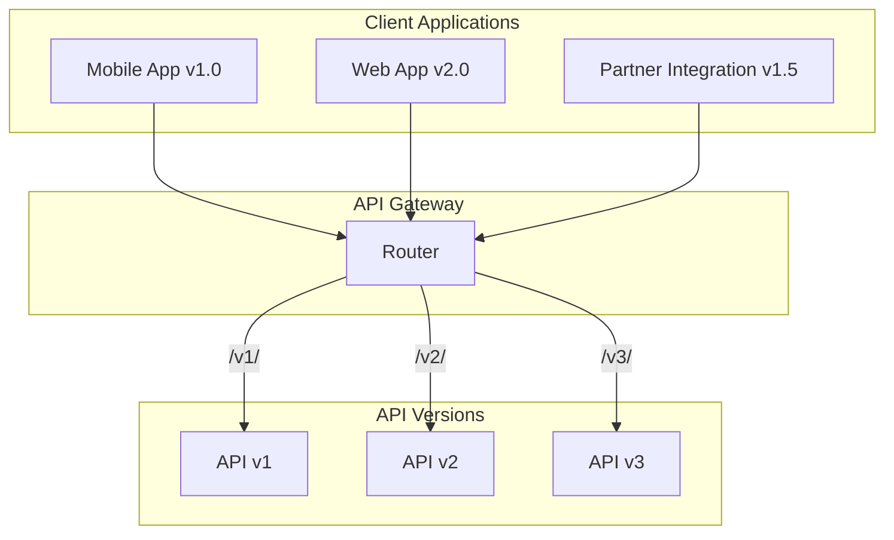
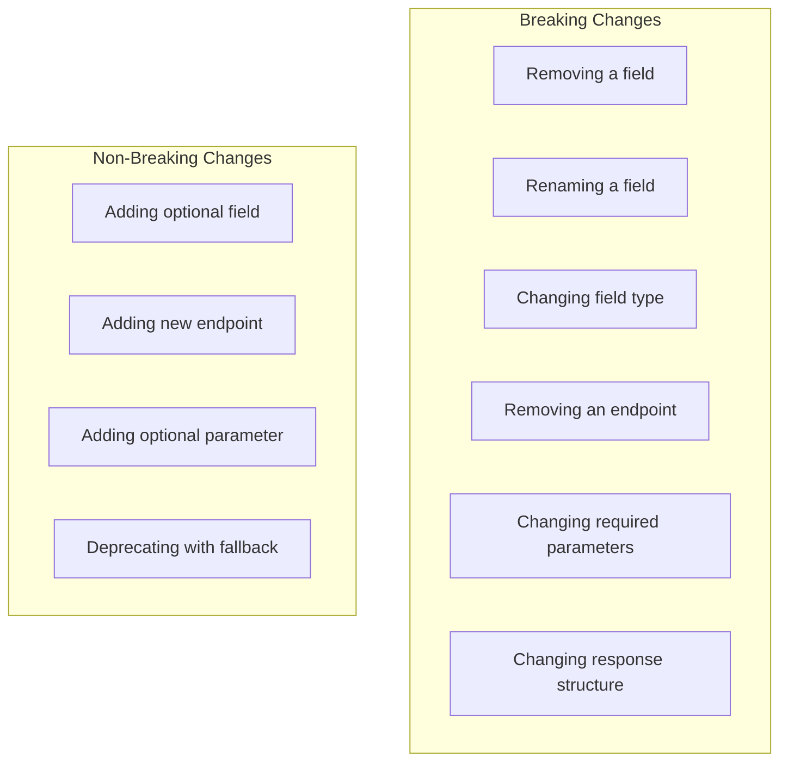

# How to Fix "API Versioning" Compatibility Issues

Author: [nawazdhandala](https://www.github.com/nawazdhandala)

Tags: API, Versioning, REST, Microservices, Backward Compatibility, API Design, Breaking Changes, Deprecation

Description: A practical guide to implementing API versioning strategies, handling breaking changes gracefully, and maintaining backward compatibility in microservices architectures.

---

> API versioning is essential for evolving your services without breaking existing clients. This guide covers versioning strategies, compatibility patterns, and migration techniques for smooth API evolution.

When your API changes, clients using older versions should not break. Proper versioning lets you introduce new features, fix issues, and evolve your API while maintaining backward compatibility.

---

## Understanding API Versioning

API versioning allows multiple API versions to coexist:



---

## Versioning Strategies

### Strategy 1: URL Path Versioning

The most explicit approach - version in the URL path:

```python
# url_versioning.py
from fastapi import FastAPI, APIRouter
from pydantic import BaseModel
from typing import Optional, List
from opentelemetry import trace

tracer = trace.get_tracer(__name__)

app = FastAPI(title="Versioned API")

# V1 Models
class UserV1(BaseModel):
    id: str
    name: str
    email: str

# V2 Models - added fields, renamed some
class UserV2(BaseModel):
    id: str
    full_name: str  # Renamed from 'name'
    email: str
    phone: Optional[str] = None  # New field
    roles: List[str] = []  # New field

# V3 Models - restructured
class NameV3(BaseModel):
    first: str
    last: str

class UserV3(BaseModel):
    id: str
    name: NameV3  # Changed from string to object
    email: str
    phone: Optional[str] = None
    roles: List[str] = []
    metadata: dict = {}  # New field


# V1 Router
v1_router = APIRouter(prefix="/v1", tags=["v1"])

@v1_router.get("/users/{user_id}", response_model=UserV1)
async def get_user_v1(user_id: str):
    """Get user - V1 format"""
    with tracer.start_as_current_span("get_user_v1") as span:
        span.set_attribute("api.version", "v1")
        span.set_attribute("user.id", user_id)

        user = await fetch_user_from_db(user_id)

        # Transform to V1 format
        return UserV1(
            id=user["id"],
            name=f"{user['name']['first']} {user['name']['last']}",
            email=user["email"]
        )


# V2 Router
v2_router = APIRouter(prefix="/v2", tags=["v2"])

@v2_router.get("/users/{user_id}", response_model=UserV2)
async def get_user_v2(user_id: str):
    """Get user - V2 format with additional fields"""
    with tracer.start_as_current_span("get_user_v2") as span:
        span.set_attribute("api.version", "v2")
        span.set_attribute("user.id", user_id)

        user = await fetch_user_from_db(user_id)

        return UserV2(
            id=user["id"],
            full_name=f"{user['name']['first']} {user['name']['last']}",
            email=user["email"],
            phone=user.get("phone"),
            roles=user.get("roles", [])
        )


# V3 Router
v3_router = APIRouter(prefix="/v3", tags=["v3"])

@v3_router.get("/users/{user_id}", response_model=UserV3)
async def get_user_v3(user_id: str):
    """Get user - V3 format with structured name"""
    with tracer.start_as_current_span("get_user_v3") as span:
        span.set_attribute("api.version", "v3")
        span.set_attribute("user.id", user_id)

        user = await fetch_user_from_db(user_id)

        return UserV3(
            id=user["id"],
            name=NameV3(
                first=user["name"]["first"],
                last=user["name"]["last"]
            ),
            email=user["email"],
            phone=user.get("phone"),
            roles=user.get("roles", []),
            metadata=user.get("metadata", {})
        )


# Register all routers
app.include_router(v1_router)
app.include_router(v2_router)
app.include_router(v3_router)
```

### Strategy 2: Header Versioning

Version specified in request headers - cleaner URLs:

```python
# header_versioning.py
from fastapi import FastAPI, Request, Depends, HTTPException
from typing import Callable
from opentelemetry import trace

tracer = trace.get_tracer(__name__)

app = FastAPI()

# Version extraction
def get_api_version(request: Request) -> str:
    """Extract API version from headers"""
    # Support multiple header formats
    version = (
        request.headers.get("X-API-Version") or
        request.headers.get("Api-Version") or
        request.headers.get("Accept-Version") or
        "v3"  # Default to latest
    )

    # Normalize version format
    if not version.startswith("v"):
        version = f"v{version}"

    return version


# Version-aware dependency
def versioned_response(
    supported_versions: list = None,
    deprecated_versions: list = None
):
    """Dependency that handles version-specific logic"""

    supported = supported_versions or ["v1", "v2", "v3"]
    deprecated = deprecated_versions or ["v1"]

    async def version_handler(request: Request):
        version = get_api_version(request)

        with tracer.start_as_current_span("version_check") as span:
            span.set_attribute("api.version", version)

            if version not in supported:
                raise HTTPException(
                    status_code=400,
                    detail={
                        "error": "unsupported_version",
                        "message": f"API version {version} is not supported",
                        "supported_versions": supported
                    }
                )

            if version in deprecated:
                span.set_attribute("api.deprecated", True)
                # Add deprecation warning header
                request.state.deprecation_warning = (
                    f"API version {version} is deprecated. "
                    f"Please migrate to {supported[-1]}."
                )

            request.state.api_version = version
            return version

    return version_handler


# Middleware to add deprecation headers
@app.middleware("http")
async def add_version_headers(request: Request, call_next):
    response = await call_next(request)

    # Add deprecation warning if present
    if hasattr(request.state, "deprecation_warning"):
        response.headers["X-API-Deprecation-Warning"] = request.state.deprecation_warning
        response.headers["Sunset"] = "2025-06-01"  # RFC 8594

    return response


# Version-aware endpoint
@app.get("/users/{user_id}")
async def get_user(
    user_id: str,
    version: str = Depends(versioned_response(
        supported_versions=["v1", "v2", "v3"],
        deprecated_versions=["v1"]
    ))
):
    """Get user with version-specific response format"""

    with tracer.start_as_current_span("get_user") as span:
        span.set_attribute("api.version", version)
        span.set_attribute("user.id", user_id)

        user = await fetch_user_from_db(user_id)

        # Transform based on version
        if version == "v1":
            return transform_to_v1(user)
        elif version == "v2":
            return transform_to_v2(user)
        else:
            return transform_to_v3(user)
```

### Strategy 3: Accept Header / Content Negotiation

Use media types for versioning:

```python
# content_negotiation.py
from fastapi import FastAPI, Request, HTTPException
from fastapi.responses import JSONResponse
import re
from opentelemetry import trace

tracer = trace.get_tracer(__name__)

app = FastAPI()

# Custom media types
MEDIA_TYPES = {
    "application/vnd.myapi.v1+json": "v1",
    "application/vnd.myapi.v2+json": "v2",
    "application/vnd.myapi.v3+json": "v3",
    "application/json": "v3",  # Default
}


def parse_accept_header(accept: str) -> str:
    """Parse Accept header and extract API version"""

    if not accept:
        return "v3"

    # Parse media type with quality values
    # Example: application/vnd.myapi.v2+json; q=0.9, application/json; q=0.5
    media_types = []

    for part in accept.split(","):
        part = part.strip()
        # Extract media type and quality
        match = re.match(r'([^;]+)(?:;\s*q=([0-9.]+))?', part)
        if match:
            media_type = match.group(1).strip()
            quality = float(match.group(2)) if match.group(2) else 1.0
            media_types.append((media_type, quality))

    # Sort by quality (highest first)
    media_types.sort(key=lambda x: x[1], reverse=True)

    # Find first supported media type
    for media_type, _ in media_types:
        if media_type in MEDIA_TYPES:
            return MEDIA_TYPES[media_type]

    return "v3"


@app.middleware("http")
async def content_negotiation_middleware(request: Request, call_next):
    """Handle content negotiation for versioning"""

    accept = request.headers.get("Accept", "application/json")
    version = parse_accept_header(accept)

    with tracer.start_as_current_span("content_negotiation") as span:
        span.set_attribute("accept.header", accept)
        span.set_attribute("api.version", version)

        request.state.api_version = version

        response = await call_next(request)

        # Set Content-Type header with version
        response.headers["Content-Type"] = f"application/vnd.myapi.{version}+json"

        return response


@app.get("/users/{user_id}")
async def get_user(request: Request, user_id: str):
    """Get user with content negotiation"""

    version = getattr(request.state, "api_version", "v3")

    user = await fetch_user_from_db(user_id)

    if version == "v1":
        return transform_to_v1(user)
    elif version == "v2":
        return transform_to_v2(user)
    else:
        return transform_to_v3(user)
```

---

## Handling Breaking Changes

### Identifying Breaking Changes



### Response Transformation Layer

Transform responses between versions without duplicating business logic:

```python
# response_transformer.py
from typing import Any, Dict, Callable
from abc import ABC, abstractmethod
from opentelemetry import trace

tracer = trace.get_tracer(__name__)

class ResponseTransformer(ABC):
    """Base class for response transformers"""

    @abstractmethod
    def transform(self, data: dict) -> dict:
        pass


class UserTransformerV3ToV2(ResponseTransformer):
    """Transform V3 user response to V2 format"""

    def transform(self, data: dict) -> dict:
        with tracer.start_as_current_span("transform_v3_to_v2"):
            name = data.get("name", {})

            return {
                "id": data["id"],
                "full_name": f"{name.get('first', '')} {name.get('last', '')}".strip(),
                "email": data["email"],
                "phone": data.get("phone"),
                "roles": data.get("roles", [])
                # Note: 'metadata' field is dropped (not in V2)
            }


class UserTransformerV3ToV1(ResponseTransformer):
    """Transform V3 user response to V1 format"""

    def transform(self, data: dict) -> dict:
        with tracer.start_as_current_span("transform_v3_to_v1"):
            name = data.get("name", {})

            return {
                "id": data["id"],
                "name": f"{name.get('first', '')} {name.get('last', '')}".strip(),
                "email": data["email"]
                # V1 only has basic fields
            }


class TransformationPipeline:
    """Pipeline for chaining transformations"""

    def __init__(self):
        self.transformers: Dict[tuple, ResponseTransformer] = {}

    def register(self, from_version: str, to_version: str, transformer: ResponseTransformer):
        """Register a transformer for a version pair"""
        self.transformers[(from_version, to_version)] = transformer

    def transform(self, data: dict, from_version: str, to_version: str) -> dict:
        """Transform data between versions"""

        with tracer.start_as_current_span("transform_response") as span:
            span.set_attribute("transform.from", from_version)
            span.set_attribute("transform.to", to_version)

            if from_version == to_version:
                return data

            transformer = self.transformers.get((from_version, to_version))

            if transformer:
                return transformer.transform(data)

            # Try multi-step transformation
            # V3 -> V2 -> V1 if direct V3 -> V1 not available
            if from_version == "v3" and to_version == "v1":
                v2_data = self.transform(data, "v3", "v2")
                return self.transform(v2_data, "v2", "v1")

            span.set_attribute("transform.error", "no_transformer")
            raise ValueError(f"No transformer from {from_version} to {to_version}")


# Initialize pipeline
pipeline = TransformationPipeline()
pipeline.register("v3", "v2", UserTransformerV3ToV2())
pipeline.register("v3", "v1", UserTransformerV3ToV1())


class VersionedEndpoint:
    """Decorator for versioned endpoints"""

    def __init__(self, current_version: str = "v3"):
        self.current_version = current_version
        self.pipeline = pipeline

    def __call__(self, func: Callable) -> Callable:
        async def wrapper(request, *args, **kwargs):
            # Get requested version
            version = getattr(request.state, "api_version", self.current_version)

            # Execute handler (always returns current version format)
            result = await func(request, *args, **kwargs)

            # Transform to requested version
            if version != self.current_version:
                result = self.pipeline.transform(
                    result,
                    self.current_version,
                    version
                )

            return result

        return wrapper


# Usage
@app.get("/users/{user_id}")
@VersionedEndpoint(current_version="v3")
async def get_user(request: Request, user_id: str):
    """Get user - business logic only deals with V3 format"""

    user = await fetch_user_from_db(user_id)

    # Always return V3 format - transformer handles version conversion
    return {
        "id": user["id"],
        "name": {
            "first": user["name"]["first"],
            "last": user["name"]["last"]
        },
        "email": user["email"],
        "phone": user.get("phone"),
        "roles": user.get("roles", []),
        "metadata": user.get("metadata", {})
    }
```

---

## Request Compatibility Layer

Handle requests from different API versions:

```python
# request_compatibility.py
from pydantic import BaseModel, validator, root_validator
from typing import Optional, List, Union, Any
from opentelemetry import trace

tracer = trace.get_tracer(__name__)

# V1 Request
class CreateUserV1(BaseModel):
    name: str  # Single string
    email: str

# V2 Request
class CreateUserV2(BaseModel):
    full_name: str  # Renamed
    email: str
    phone: Optional[str] = None
    roles: List[str] = []

# V3 Request
class CreateUserNameV3(BaseModel):
    first: str
    last: str

class CreateUserV3(BaseModel):
    name: CreateUserNameV3  # Structured
    email: str
    phone: Optional[str] = None
    roles: List[str] = []
    metadata: dict = {}


class UnifiedCreateUser(BaseModel):
    """
    Unified model that accepts any version format
    and normalizes to internal format
    """
    # Accept multiple formats
    name: Optional[Union[str, dict, CreateUserNameV3]] = None
    full_name: Optional[str] = None
    first_name: Optional[str] = None  # Alternative format
    last_name: Optional[str] = None
    email: str
    phone: Optional[str] = None
    roles: List[str] = []
    metadata: dict = {}

    @root_validator(pre=True)
    def normalize_name(cls, values):
        """Normalize name from various input formats"""

        # Already have structured name
        if isinstance(values.get("name"), dict):
            return values

        # V1 format: single name string
        if values.get("name") and isinstance(values["name"], str):
            parts = values["name"].split(" ", 1)
            values["name"] = {
                "first": parts[0],
                "last": parts[1] if len(parts) > 1 else ""
            }
            return values

        # V2 format: full_name
        if values.get("full_name"):
            parts = values["full_name"].split(" ", 1)
            values["name"] = {
                "first": parts[0],
                "last": parts[1] if len(parts) > 1 else ""
            }
            del values["full_name"]
            return values

        # Alternative format: first_name + last_name
        if values.get("first_name") or values.get("last_name"):
            values["name"] = {
                "first": values.get("first_name", ""),
                "last": values.get("last_name", "")
            }
            values.pop("first_name", None)
            values.pop("last_name", None)
            return values

        return values

    def to_internal(self) -> dict:
        """Convert to internal format"""
        return {
            "name": self.name if isinstance(self.name, dict) else {"first": "", "last": ""},
            "email": self.email,
            "phone": self.phone,
            "roles": self.roles,
            "metadata": self.metadata
        }


class RequestNormalizer:
    """Normalizes requests from different API versions"""

    def __init__(self):
        self.normalizers = {}

    def register(self, version: str, model_name: str, normalizer_class):
        """Register a normalizer for a specific version and model"""
        self.normalizers[(version, model_name)] = normalizer_class

    def normalize(self, version: str, model_name: str, data: dict) -> dict:
        """Normalize request data to internal format"""

        with tracer.start_as_current_span("normalize_request") as span:
            span.set_attribute("api.version", version)
            span.set_attribute("model.name", model_name)

            normalizer_class = self.normalizers.get((version, model_name))

            if normalizer_class:
                normalized = normalizer_class(**data)
                return normalized.to_internal()

            # Fall back to unified normalizer
            unified = UnifiedCreateUser(**data)
            return unified.to_internal()


# Usage in endpoint
normalizer = RequestNormalizer()

@app.post("/users")
async def create_user(request: Request, user_data: dict):
    """Create user accepting any API version format"""

    version = getattr(request.state, "api_version", "v3")

    with tracer.start_as_current_span("create_user") as span:
        span.set_attribute("api.version", version)

        # Normalize to internal format
        internal_data = normalizer.normalize(version, "create_user", user_data)

        # Business logic works with consistent internal format
        user = await user_service.create_user(internal_data)

        # Transform response to requested version
        return transform_response(user, "v3", version)
```

---

## API Deprecation Strategy

Implement proper deprecation with sunset dates:

```python
# deprecation.py
from datetime import datetime, timedelta
from typing import Optional, List
from dataclasses import dataclass
from fastapi import Request, HTTPException
from opentelemetry import trace

tracer = trace.get_tracer(__name__)

@dataclass
class DeprecationInfo:
    """Information about a deprecated API feature"""
    version: str
    deprecated_date: str
    sunset_date: str
    replacement: Optional[str] = None
    migration_guide: Optional[str] = None
    breaking_changes: List[str] = None

    def is_sunset(self) -> bool:
        """Check if the sunset date has passed"""
        sunset = datetime.fromisoformat(self.sunset_date)
        return datetime.utcnow() > sunset


class DeprecationRegistry:
    """Registry for deprecated API versions and endpoints"""

    def __init__(self):
        self.deprecations = {}

    def register(self, key: str, info: DeprecationInfo):
        """Register a deprecation"""
        self.deprecations[key] = info

    def get(self, key: str) -> Optional[DeprecationInfo]:
        """Get deprecation info"""
        return self.deprecations.get(key)

    def is_deprecated(self, key: str) -> bool:
        """Check if a key is deprecated"""
        return key in self.deprecations

    def is_sunset(self, key: str) -> bool:
        """Check if a key has passed its sunset date"""
        info = self.deprecations.get(key)
        return info and info.is_sunset()


# Initialize registry
deprecation_registry = DeprecationRegistry()

# Register deprecations
deprecation_registry.register("v1", DeprecationInfo(
    version="v1",
    deprecated_date="2024-01-01",
    sunset_date="2025-06-01",
    replacement="v3",
    migration_guide="https://api.example.com/docs/migration/v1-to-v3",
    breaking_changes=[
        "User name field changed from string to object",
        "Roles field added as required",
        "Metadata field added"
    ]
))

deprecation_registry.register("v2", DeprecationInfo(
    version="v2",
    deprecated_date="2024-06-01",
    sunset_date="2025-12-01",
    replacement="v3",
    migration_guide="https://api.example.com/docs/migration/v2-to-v3",
    breaking_changes=[
        "full_name field changed to structured name object"
    ]
))


class DeprecationMiddleware:
    """Middleware to handle API deprecation"""

    def __init__(self, app, registry: DeprecationRegistry):
        self.app = app
        self.registry = registry

    async def __call__(self, request: Request, call_next):
        version = getattr(request.state, "api_version", "v3")

        with tracer.start_as_current_span("deprecation_check") as span:
            span.set_attribute("api.version", version)

            # Check if version is sunset
            if self.registry.is_sunset(version):
                span.set_attribute("api.sunset", True)
                raise HTTPException(
                    status_code=410,  # Gone
                    detail={
                        "error": "api_version_sunset",
                        "message": f"API version {version} is no longer available",
                        "migration_guide": self.registry.get(version).migration_guide
                    }
                )

            response = await call_next(request)

            # Add deprecation headers if deprecated
            if self.registry.is_deprecated(version):
                info = self.registry.get(version)
                span.set_attribute("api.deprecated", True)

                response.headers["Deprecation"] = info.deprecated_date
                response.headers["Sunset"] = info.sunset_date
                response.headers["Link"] = f'<{info.migration_guide}>; rel="deprecation"'

                # Add warning header
                response.headers["Warning"] = (
                    f'299 - "API version {version} is deprecated. '
                    f'Sunset date: {info.sunset_date}. '
                    f'Please migrate to {info.replacement}."'
                )

            return response


# Deprecation response endpoint
@app.get("/api/deprecations")
async def get_deprecations():
    """Get all API deprecation information"""

    return {
        "deprecations": [
            {
                "version": info.version,
                "deprecated_date": info.deprecated_date,
                "sunset_date": info.sunset_date,
                "replacement": info.replacement,
                "migration_guide": info.migration_guide,
                "breaking_changes": info.breaking_changes,
                "is_sunset": info.is_sunset()
            }
            for info in deprecation_registry.deprecations.values()
        ]
    }
```

---

## Version-Aware Testing

Test across all API versions:

```python
# version_testing.py
import pytest
from typing import List
from httpx import AsyncClient

class VersionedAPITester:
    """Test harness for testing across API versions"""

    def __init__(self, client: AsyncClient, versions: List[str]):
        self.client = client
        self.versions = versions

    async def test_endpoint_across_versions(
        self,
        method: str,
        path: str,
        expected_fields: dict,  # version -> expected fields
        **kwargs
    ):
        """Test an endpoint across all versions"""

        results = {}

        for version in self.versions:
            # Add version header
            headers = kwargs.pop("headers", {})
            headers["X-API-Version"] = version

            response = await self.client.request(
                method,
                path,
                headers=headers,
                **kwargs
            )

            results[version] = {
                "status_code": response.status_code,
                "body": response.json() if response.status_code == 200 else None,
                "headers": dict(response.headers)
            }

            # Verify expected fields
            if version in expected_fields and response.status_code == 200:
                body = response.json()
                for field in expected_fields[version]:
                    assert field in body, f"Missing field {field} in {version} response"

        return results


# Pytest fixtures and tests
@pytest.fixture
def version_tester(client: AsyncClient):
    return VersionedAPITester(client, ["v1", "v2", "v3"])


@pytest.mark.asyncio
async def test_get_user_all_versions(version_tester):
    """Test GET /users/{id} across all API versions"""

    results = await version_tester.test_endpoint_across_versions(
        "GET",
        "/users/123",
        expected_fields={
            "v1": ["id", "name", "email"],
            "v2": ["id", "full_name", "email", "phone", "roles"],
            "v3": ["id", "name", "email", "phone", "roles", "metadata"]
        }
    )

    # V1 should have simple name
    assert isinstance(results["v1"]["body"]["name"], str)

    # V2 should have full_name
    assert "full_name" in results["v2"]["body"]

    # V3 should have structured name
    assert isinstance(results["v3"]["body"]["name"], dict)
    assert "first" in results["v3"]["body"]["name"]
    assert "last" in results["v3"]["body"]["name"]


@pytest.mark.asyncio
async def test_deprecated_version_headers(client: AsyncClient):
    """Test that deprecated versions include proper headers"""

    response = await client.get(
        "/users/123",
        headers={"X-API-Version": "v1"}
    )

    assert "Deprecation" in response.headers
    assert "Sunset" in response.headers
    assert "Warning" in response.headers


@pytest.mark.asyncio
async def test_create_user_backward_compatibility(client: AsyncClient):
    """Test that old request formats still work"""

    # V1 format
    v1_response = await client.post(
        "/users",
        json={"name": "John Doe", "email": "john@example.com"},
        headers={"X-API-Version": "v1"}
    )
    assert v1_response.status_code == 201

    # V2 format
    v2_response = await client.post(
        "/users",
        json={
            "full_name": "Jane Doe",
            "email": "jane@example.com",
            "roles": ["user"]
        },
        headers={"X-API-Version": "v2"}
    )
    assert v2_response.status_code == 201

    # V3 format
    v3_response = await client.post(
        "/users",
        json={
            "name": {"first": "Bob", "last": "Smith"},
            "email": "bob@example.com",
            "roles": ["admin"],
            "metadata": {"source": "test"}
        },
        headers={"X-API-Version": "v3"}
    )
    assert v3_response.status_code == 201
```

---

## Monitoring API Versions

Track version usage to inform deprecation decisions:

```python
# version_metrics.py
from prometheus_client import Counter, Histogram, Gauge
from opentelemetry import trace

tracer = trace.get_tracer(__name__)

# Metrics
api_requests_by_version = Counter(
    'api_requests_total',
    'Total API requests by version',
    ['version', 'endpoint', 'method', 'status']
)

api_latency_by_version = Histogram(
    'api_latency_seconds',
    'API latency by version',
    ['version', 'endpoint'],
    buckets=[0.01, 0.05, 0.1, 0.25, 0.5, 1.0, 2.5, 5.0]
)

active_clients_by_version = Gauge(
    'api_active_clients',
    'Number of unique clients using each version',
    ['version']
)


class VersionMetricsMiddleware:
    """Middleware to collect API version metrics"""

    def __init__(self, app):
        self.app = app
        self.client_versions = {}  # Track client -> version mapping

    async def __call__(self, request, call_next):
        import time

        version = getattr(request.state, "api_version", "unknown")
        endpoint = request.url.path
        method = request.method

        # Track client version
        client_id = request.headers.get("X-Client-ID", request.client.host)
        self.client_versions[client_id] = version

        # Update active clients gauge
        version_counts = {}
        for v in self.client_versions.values():
            version_counts[v] = version_counts.get(v, 0) + 1

        for v, count in version_counts.items():
            active_clients_by_version.labels(version=v).set(count)

        start_time = time.time()

        response = await call_next(request)

        duration = time.time() - start_time

        # Record metrics
        api_requests_by_version.labels(
            version=version,
            endpoint=endpoint,
            method=method,
            status=response.status_code
        ).inc()

        api_latency_by_version.labels(
            version=version,
            endpoint=endpoint
        ).observe(duration)

        return response


class VersionUsageAnalyzer:
    """Analyze API version usage patterns"""

    async def get_version_usage_report(self) -> dict:
        """Generate version usage report"""

        # In production, query from metrics store
        return {
            "versions": {
                "v1": {
                    "requests_24h": 1500,
                    "unique_clients": 12,
                    "avg_latency_ms": 45,
                    "error_rate": 0.02,
                    "deprecated": True,
                    "sunset_date": "2025-06-01"
                },
                "v2": {
                    "requests_24h": 8500,
                    "unique_clients": 45,
                    "avg_latency_ms": 38,
                    "error_rate": 0.01,
                    "deprecated": True,
                    "sunset_date": "2025-12-01"
                },
                "v3": {
                    "requests_24h": 45000,
                    "unique_clients": 230,
                    "avg_latency_ms": 32,
                    "error_rate": 0.005,
                    "deprecated": False,
                    "sunset_date": None
                }
            },
            "recommendations": [
                "12 clients still using v1 - contact for migration support",
                "v2 usage decreasing - on track for sunset"
            ]
        }
```

---

## Best Practices Summary

1. **Choose a consistent strategy**: Pick URL, header, or content negotiation and stick with it
2. **Support multiple versions**: Maintain at least N-1 version alongside current
3. **Use transformers**: Single business logic with version-specific transformations
4. **Document everything**: Clear migration guides and breaking change lists
5. **Set sunset dates**: Give clients clear deadlines
6. **Monitor usage**: Track which versions are in use before deprecating
7. **Add deprecation headers**: RFC 8594 Sunset header and Link to migration docs
8. **Test all versions**: Automated tests across all supported versions

---

## Conclusion

Effective API versioning requires:

- **Clear versioning strategy** that clients can easily follow
- **Transformation layers** to handle format differences
- **Backward compatible requests** accepting multiple input formats
- **Proper deprecation** with warnings and sunset dates
- **Monitoring** to understand version usage

A well-versioned API allows your service to evolve while maintaining trust with clients.

---

*Need to monitor your API versions and track deprecation? [OneUptime](https://oneuptime.com) provides API monitoring, version usage analytics, and alerting to help you manage your API lifecycle.*

**Related Reading:**
- [How to Implement Observability in Microservices](https://oneuptime.com/blog/post/2026-01-24-implement-observability-microservices/view)
- [How to Handle Strangler Fig Migration Pattern](https://oneuptime.com/blog/post/2026-01-24-strangler-fig-migration-pattern/view)
