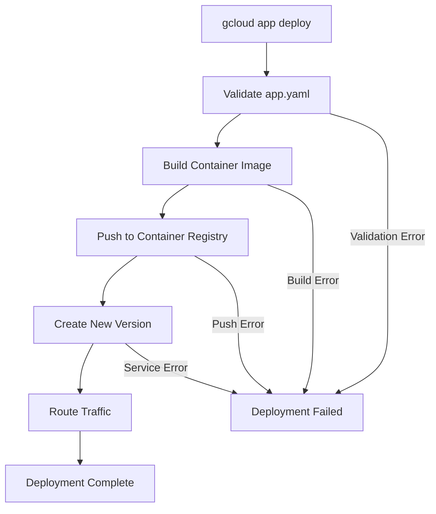

# How to Fix "App Engine" Deployment Errors

Author: [nawazdhandala](https://www.github.com/nawazdhandala)

Tags: Google Cloud, App Engine, Deployment, DevOps, Troubleshooting, GCP

Description: A practical guide to diagnosing and fixing common Google App Engine deployment errors, from permission issues to configuration problems.

---

Google App Engine is a powerful platform for deploying applications without managing infrastructure. But when deployments fail, the error messages can be cryptic and frustrating. This guide covers the most common App Engine deployment errors and how to fix them.

## Understanding App Engine Deployment Flow

Before diving into errors, let's understand what happens during a deployment.



## Permission and Authentication Errors

### Error: "You do not have permission to access project"

This is one of the most common errors. It happens when your account lacks the necessary IAM roles.

```bash
# Check your current authenticated account
gcloud auth list

# Re-authenticate if needed
gcloud auth login

# Set the correct project
gcloud config set project YOUR_PROJECT_ID

# Verify project access
gcloud projects describe YOUR_PROJECT_ID
```

Required IAM roles for App Engine deployment:

```bash
# Grant necessary roles to a service account or user
gcloud projects add-iam-policy-binding YOUR_PROJECT_ID \
    --member="user:developer@example.com" \
    --role="roles/appengine.deployer"

gcloud projects add-iam-policy-binding YOUR_PROJECT_ID \
    --member="user:developer@example.com" \
    --role="roles/appengine.serviceAdmin"

gcloud projects add-iam-policy-binding YOUR_PROJECT_ID \
    --member="user:developer@example.com" \
    --role="roles/cloudbuild.builds.builder"

gcloud projects add-iam-policy-binding YOUR_PROJECT_ID \
    --member="user:developer@example.com" \
    --role="roles/storage.admin"
```

### Error: "The App Engine default service account needs permissions"

The default App Engine service account requires specific permissions.

```bash
# Get the default service account
PROJECT_ID=$(gcloud config get-value project)
SERVICE_ACCOUNT="${PROJECT_ID}@appspot.gserviceaccount.com"

# Grant Cloud Build permissions
gcloud projects add-iam-policy-binding $PROJECT_ID \
    --member="serviceAccount:${SERVICE_ACCOUNT}" \
    --role="roles/cloudbuild.builds.builder"

# Grant Storage permissions
gcloud projects add-iam-policy-binding $PROJECT_ID \
    --member="serviceAccount:${SERVICE_ACCOUNT}" \
    --role="roles/storage.objectViewer"
```

## Configuration Errors in app.yaml

### Error: "Invalid runtime specified"

Your app.yaml specifies a runtime that doesn't exist or is deprecated.

```yaml
# Bad - Deprecated runtime
runtime: python27

# Good - Current runtime
runtime: python311
```

Valid runtimes as of 2026:

```yaml
# Python
runtime: python311
runtime: python312

# Node.js
runtime: nodejs20
runtime: nodejs22

# Java
runtime: java17
runtime: java21

# Go
runtime: go121
runtime: go122

# PHP
runtime: php83

# Ruby
runtime: ruby32
```

### Error: "Invalid field in app.yaml"

Check for typos or deprecated fields.

```yaml
# Bad - contains deprecated and invalid fields
runtime: python311
api_version: 1  # Deprecated
threadsafe: true  # Deprecated for Python 3

handlers:
  - url: /.*
    script: auto
    login: admin  # Invalid without IAP configuration

# Good - Clean configuration
runtime: python311
instance_class: F2

automatic_scaling:
  min_instances: 1
  max_instances: 10
  target_cpu_utilization: 0.65
  target_throughput_utilization: 0.65

handlers:
  - url: /static
    static_dir: static
  - url: /.*
    script: auto
    secure: always

env_variables:
  ENVIRONMENT: "production"
```

### Error: "The total size of files exceeds the maximum allowed size"

App Engine has file size limits. Use `.gcloudignore` to exclude unnecessary files.

```bash
# Create .gcloudignore file
cat > .gcloudignore << 'EOF'
# Node modules and dependencies
node_modules/
venv/
__pycache__/
*.pyc

# Build artifacts
dist/
build/
*.egg-info/

# Development files
.git/
.gitignore
*.md
tests/
*.test.js
*.spec.js

# IDE files
.idea/
.vscode/
*.swp

# Local configuration
.env.local
.env.development
*.log
EOF
```

## Build and Container Errors

### Error: "Build failed; check build logs"

```bash
# View detailed build logs
gcloud builds list --limit=5

# Get logs for a specific build
gcloud builds log BUILD_ID

# Stream logs during deployment
gcloud app deploy --verbosity=debug
```

Common build issues and fixes:

```dockerfile
# If using custom Dockerfile, ensure proper structure

# Bad - Missing dependencies
FROM python:3.11-slim
COPY . /app
CMD ["python", "main.py"]

# Good - Install dependencies properly
FROM python:3.11-slim

WORKDIR /app

# Install dependencies first for caching
COPY requirements.txt .
RUN pip install --no-cache-dir -r requirements.txt

# Then copy application code
COPY . .

# Expose the port App Engine expects
EXPOSE 8080

# Run the application
CMD ["gunicorn", "--bind", ":8080", "--workers", "2", "main:app"]
```

### Error: "Container failed to start"

The container must respond to health checks on the expected port.

```python
# Python Flask example - ensure proper port binding
import os
from flask import Flask

app = Flask(__name__)

@app.route('/_ah/warmup')
def warmup():
    # Handle warmup requests
    return '', 200

@app.route('/_ah/health')
def health():
    return 'OK', 200

@app.route('/')
def hello():
    return 'Hello, World!'

if __name__ == '__main__':
    # App Engine sets PORT environment variable
    port = int(os.environ.get('PORT', 8080))
    app.run(host='0.0.0.0', port=port)
```

```javascript
// Node.js Express example
const express = require('express');
const app = express();

// Health check endpoint
app.get('/_ah/health', (req, res) => {
    res.status(200).send('OK');
});

// Warmup handler
app.get('/_ah/warmup', (req, res) => {
    // Initialize caches, connections, etc.
    res.status(200).send('Warmed up');
});

app.get('/', (req, res) => {
    res.send('Hello, World!');
});

// Listen on the port provided by App Engine
const PORT = process.env.PORT || 8080;
app.listen(PORT, () => {
    console.log(`Server listening on port ${PORT}`);
});
```

## Resource and Quota Errors

### Error: "Quota exceeded for resource"

```bash
# Check current quotas
gcloud compute project-info describe --project YOUR_PROJECT_ID

# Request quota increase through console or
gcloud alpha services quota update \
    --service=appengine.googleapis.com \
    --consumer=projects/YOUR_PROJECT_ID \
    --metric=appengine.googleapis.com/app/admin_api_requests \
    --value=1000
```

### Error: "Instance class not available"

```yaml
# Available instance classes for standard environment
# F1 (default) - 256 MB memory, 600 MHz CPU
# F2 - 512 MB memory, 1.2 GHz CPU
# F4 - 1024 MB memory, 2.4 GHz CPU
# F4_1G - 2048 MB memory, 2.4 GHz CPU

runtime: python311
instance_class: F2  # Use F2 for most applications

# For flexible environment
runtime: python
env: flex
resources:
  cpu: 2
  memory_gb: 4
  disk_size_gb: 20
```

## Network and Service Errors

### Error: "Unable to retrieve service"

```bash
# Check if required APIs are enabled
gcloud services list --enabled

# Enable required services
gcloud services enable appengine.googleapis.com
gcloud services enable cloudbuild.googleapis.com
gcloud services enable containerregistry.googleapis.com
gcloud services enable cloudresourcemanager.googleapis.com
```

### Error: "VPC access connector not found"

When using VPC connector for private resources:

```yaml
# app.yaml with VPC configuration
runtime: python311

vpc_access_connector:
  name: projects/YOUR_PROJECT_ID/locations/REGION/connectors/CONNECTOR_NAME
  egress_setting: all-traffic
```

```bash
# Create VPC connector if it doesn't exist
gcloud compute networks vpc-access connectors create my-connector \
    --region=us-central1 \
    --network=default \
    --range=10.8.0.0/28
```

## Deployment Best Practices

### Use Version Management

```bash
# Deploy with a specific version
gcloud app deploy --version=v1-0-0 --no-promote

# Test the new version
gcloud app browse --version=v1-0-0

# Migrate traffic gradually
gcloud app services set-traffic default \
    --splits=v1-0-0=0.1,v0-9-0=0.9

# Full traffic migration after testing
gcloud app services set-traffic default \
    --splits=v1-0-0=1
```

### Deployment Script

```bash
#!/bin/bash
# deploy.sh - Safe deployment script for App Engine

set -e

PROJECT_ID=${1:-$(gcloud config get-value project)}
VERSION=${2:-$(date +%Y%m%d%H%M%S)}

echo "Deploying to project: $PROJECT_ID"
echo "Version: $VERSION"

# Validate configuration
echo "Validating app.yaml..."
if ! grep -q "^runtime:" app.yaml; then
    echo "Error: No runtime specified in app.yaml"
    exit 1
fi

# Check authentication
if ! gcloud auth print-identity-token > /dev/null 2>&1; then
    echo "Error: Not authenticated. Run 'gcloud auth login'"
    exit 1
fi

# Deploy without promoting
echo "Deploying version $VERSION..."
gcloud app deploy \
    --project=$PROJECT_ID \
    --version=$VERSION \
    --no-promote \
    --quiet

# Run smoke tests against new version
NEW_URL="https://${VERSION}-dot-${PROJECT_ID}.appspot.com"
echo "Testing new version at $NEW_URL..."

if curl -sf "${NEW_URL}/_ah/health" > /dev/null; then
    echo "Health check passed!"
else
    echo "Health check failed. Rolling back..."
    gcloud app versions delete $VERSION --quiet
    exit 1
fi

# Promote new version
echo "Promoting version $VERSION..."
gcloud app services set-traffic default --splits=$VERSION=1 --quiet

echo "Deployment complete!"
```

## Troubleshooting Checklist

When a deployment fails, work through this checklist:

1. Check authentication: `gcloud auth list`
2. Verify project: `gcloud config get-value project`
3. Validate app.yaml syntax
4. Check `.gcloudignore` for missing files
5. Review build logs: `gcloud builds list`
6. Verify required APIs are enabled
7. Check IAM permissions
8. Ensure health check endpoints exist
9. Verify port configuration matches expectations
10. Check quota limits

---

App Engine deployment errors often come down to permissions, configuration, or build issues. By understanding the deployment flow and knowing where to look for logs, you can diagnose and fix most problems quickly. Keep your app.yaml clean, use `.gcloudignore` to reduce deployment size, and always test new versions before promoting them to production.
