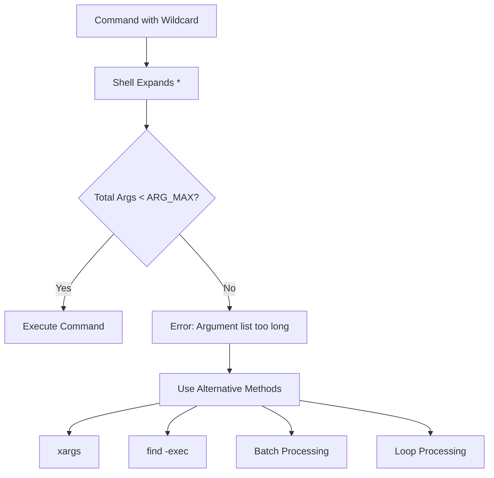
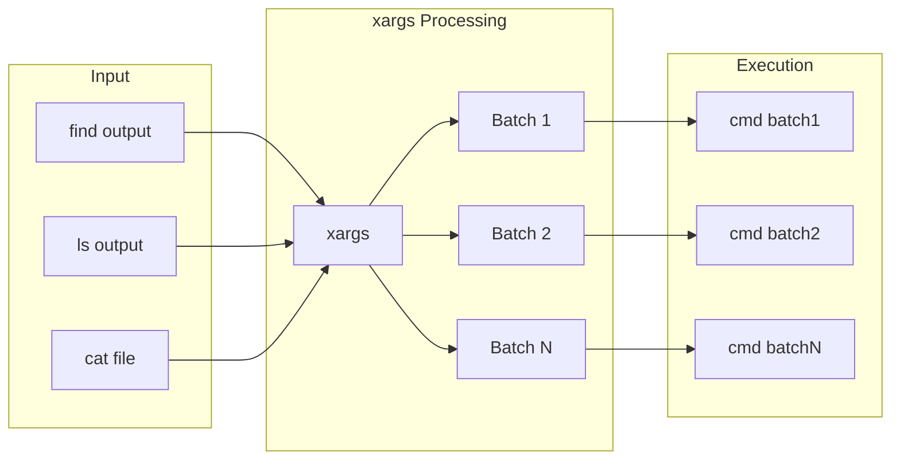

# How to Fix "Argument List Too Long" Errors

Author: [nawazdhandala](https://www.github.com/nawazdhandala)

Tags: Bash, Shell Scripting, Linux, Troubleshooting, ARG_MAX, xargs, File Operations

Description: Learn how to diagnose and fix "Argument list too long" errors when dealing with large numbers of files or long command arguments in Bash.

---

> The "Argument list too long" error occurs when the total size of command-line arguments exceeds the system limit. This commonly happens when using wildcards with thousands of files. Learn multiple techniques to work around this limitation.

Understanding ARG_MAX limits helps you write scripts that handle large file operations reliably.

---

## Overview



---

## Understanding the Error

### What Causes It

```bash
#!/bin/bash
# The error occurs when argument list exceeds kernel limit

# Check your system's limit
getconf ARG_MAX
# Typical values: 2097152 (2MB) on Linux, 262144 (256KB) on older systems

# This includes:
# 1. Command name
# 2. All arguments
# 3. Environment variables

# Example that triggers the error
# If /data has millions of files:
ls /data/*           # Error: Argument list too long
rm /data/*.log       # Error: Argument list too long
cp /data/* /backup/  # Error: Argument list too long
```

### Checking Current Usage

```bash
#!/bin/bash
# Calculate approximate argument list size

count_args_size() {
    local pattern="$1"
    local count=0
    local total_size=0

    # Count files matching pattern
    for file in $pattern; do
        if [[ -e "$file" ]]; then
            count=$((count + 1))
            # Add filename length plus null terminator
            total_size=$((total_size + ${#file} + 1))
        fi
    done

    echo "Files matching: $count"
    echo "Estimated args size: $total_size bytes"
    echo "ARG_MAX: $(getconf ARG_MAX) bytes"

    # Add environment size
    local env_size
    env_size=$(env | wc -c)
    echo "Environment size: $env_size bytes"
    echo "Total estimated: $((total_size + env_size)) bytes"
}

# Usage
count_args_size "/var/log/*.log"
```

---

## Solution 1: Using xargs

### Basic xargs Usage

```bash
#!/bin/bash
# xargs reads arguments from stdin and executes command in batches

# Instead of: rm /data/*.log
# Use:
find /data -name "*.log" | xargs rm

# With -print0 and -0 for filenames containing spaces or special chars
find /data -name "*.log" -print0 | xargs -0 rm

# Limit number of arguments per command
find /data -name "*.log" -print0 | xargs -0 -n 100 rm
# -n 100 means process 100 files at a time

# Show what would be executed (dry run)
find /data -name "*.log" -print0 | xargs -0 -n 100 echo rm
```

### xargs with Custom Commands

```bash
#!/bin/bash
# Using xargs with more complex operations

# Process files with a specific command
# -I {} replaces {} with each argument
find /data -name "*.txt" | xargs -I {} cp {} /backup/

# Parallel processing with -P
# Process 4 files simultaneously
find /data -name "*.jpg" -print0 | xargs -0 -P 4 -I {} convert {} -resize 50% {}.thumb

# Combining multiple commands
find /data -name "*.log" -print0 | xargs -0 -I {} sh -c 'gzip "{}" && mv "{}.gz" /archive/'
```

---

## xargs Flow Diagram



---

## Solution 2: Using find -exec

### Basic find -exec

```bash
#!/bin/bash
# find -exec runs command for each file found

# Delete log files older than 30 days
# {} is replaced with filename, \; ends the command
find /data -name "*.log" -mtime +30 -exec rm {} \;

# Using + instead of \; for efficiency
# + passes multiple files to single command invocation
find /data -name "*.log" -mtime +30 -exec rm {} +

# Multiple actions
find /data -name "*.txt" -exec echo "Processing: {}" \; -exec gzip {} \;
```

### find with Complex Operations

```bash
#!/bin/bash
# Advanced find -exec patterns

# Copy preserving directory structure
find /source -name "*.conf" -exec cp --parents {} /dest/ \;

# Execute shell commands
find /data -name "*.csv" -exec sh -c '
    filename=$(basename "$1")
    dir=$(dirname "$1")
    # Process each file
    sort "$1" > "${dir}/sorted_${filename}"
' _ {} \;

# Using -execdir for security (runs in file's directory)
find /data -name "*.sh" -execdir chmod +x {} \;
```

---

## Solution 3: Loop Processing

### While Loop with find

```bash
#!/bin/bash
# Process files one at a time in a loop

# Safe handling of special filenames
find /data -name "*.log" -print0 | while IFS= read -r -d '' file; do
    echo "Processing: $file"

    # Perform operations on each file
    if [[ -f "$file" ]]; then
        gzip "$file"
    fi
done

# Alternative: process substitution
while IFS= read -r -d '' file; do
    # Process file
    wc -l "$file"
done < <(find /data -name "*.txt" -print0)
```

### Glob with nullglob

```bash
#!/bin/bash
# Process files matching a pattern safely

# Enable nullglob - empty result if no matches
shopt -s nullglob

# Process in batches using array slicing
files=(/data/*.log)
total=${#files[@]}
batch_size=100

echo "Total files: $total"

for ((i = 0; i < total; i += batch_size)); do
    # Get batch of files
    batch=("${files[@]:i:batch_size}")

    echo "Processing batch: $((i / batch_size + 1))"

    # Process this batch
    rm "${batch[@]}"
done

shopt -u nullglob
```

---

## Solution 4: Using GNU Parallel

### Basic Parallel Usage

```bash
#!/bin/bash
# GNU Parallel - powerful alternative to xargs

# Install: apt install parallel (Debian/Ubuntu)
#          yum install parallel (RHEL/CentOS)

# Process files in parallel (4 jobs)
find /data -name "*.jpg" | parallel -j4 convert {} -resize 800x600 {.}_resized.jpg

# With progress bar
find /data -name "*.log" | parallel --bar gzip {}

# Distribute across multiple machines
parallel --sshlogin server1,server2,server3 \
    'process_file {}' ::: /data/*.dat
```

### Parallel with Complex Commands

```bash
#!/bin/bash
# Advanced parallel processing

# Process with multiple arguments
parallel "convert {1} -resize {2} {1.}_{2}.jpg" ::: *.jpg ::: 100x100 200x200 400x400

# Using functions with parallel
export -f my_function  # Export function for parallel

my_function() {
    local file="$1"
    # Process file
    echo "Processing: $file"
}

find /data -name "*.txt" | parallel my_function {}
```

---

## Solution 5: Using rsync

### For Copy Operations

```bash
#!/bin/bash
# rsync handles large file lists internally

# Instead of: cp /source/* /dest/
# Use rsync
rsync -av /source/ /dest/

# With specific file pattern
rsync -av --include='*.log' --exclude='*' /source/ /dest/

# Delete files not in source
rsync -av --delete /source/ /dest/

# Dry run first
rsync -avn /source/ /dest/
```

---

## Processing Flow Comparison


---

## Real-World Examples

### Cleaning Up Log Files

```bash
#!/bin/bash
# Safe cleanup of old log files

cleanup_logs() {
    local log_dir="$1"
    local days_old="${2:-30}"
    local dry_run="${3:-false}"

    echo "Cleaning logs older than $days_old days in $log_dir"

    # Count files first
    local count
    count=$(find "$log_dir" -name "*.log" -type f -mtime +"$days_old" | wc -l)
    echo "Found $count files to delete"

    if [[ "$dry_run" == "true" ]]; then
        echo "Dry run - files that would be deleted:"
        find "$log_dir" -name "*.log" -type f -mtime +"$days_old" -print
        return 0
    fi

    # Delete using find -delete (most efficient)
    find "$log_dir" -name "*.log" -type f -mtime +"$days_old" -delete

    echo "Cleanup complete"
}

# Usage
cleanup_logs /var/log 30 true   # Dry run
cleanup_logs /var/log 30 false  # Actual delete
```

### Batch File Renaming

```bash
#!/bin/bash
# Rename thousands of files safely

batch_rename() {
    local pattern="$1"
    local replacement="$2"
    local directory="$3"

    find "$directory" -type f -name "*${pattern}*" -print0 | while IFS= read -r -d '' file; do
        local dir
        dir=$(dirname "$file")
        local base
        base=$(basename "$file")
        local newname="${base//$pattern/$replacement}"

        if [[ "$base" != "$newname" ]]; then
            mv "$file" "$dir/$newname"
            echo "Renamed: $base -> $newname"
        fi
    done
}

# Rename all files containing "old" to "new"
batch_rename "old" "new" /data/files/
```

### Compressing Files

```bash
#!/bin/bash
# Compress many files efficiently

compress_files() {
    local source_dir="$1"
    local pattern="${2:-*}"
    local jobs="${3:-4}"

    echo "Compressing files matching '$pattern' in $source_dir"
    echo "Using $jobs parallel jobs"

    # Use parallel if available, otherwise xargs
    if command -v parallel &>/dev/null; then
        find "$source_dir" -name "$pattern" -type f ! -name "*.gz" -print0 | \
            parallel -0 -j"$jobs" --bar gzip {}
    else
        find "$source_dir" -name "$pattern" -type f ! -name "*.gz" -print0 | \
            xargs -0 -P"$jobs" -I {} gzip {}
    fi

    echo "Compression complete"
}

# Compress all log files with 8 parallel jobs
compress_files /var/log "*.log" 8
```

---

## Checking ARG_MAX

```bash
#!/bin/bash
# System information about argument limits

show_limits() {
    echo "=== Argument List Limits ==="

    # ARG_MAX - maximum bytes for arguments + environment
    echo "ARG_MAX: $(getconf ARG_MAX) bytes"

    # Calculate usable space
    local arg_max
    arg_max=$(getconf ARG_MAX)

    # Environment uses part of this space
    local env_size
    env_size=$(env | wc -c)
    echo "Environment size: $env_size bytes"

    # Available for arguments
    local available=$((arg_max - env_size))
    echo "Available for args: $available bytes"

    # Estimate max files (assuming average filename length)
    local avg_filename_len=50
    local max_files=$((available / (avg_filename_len + 1)))
    echo "Estimated max files (${avg_filename_len} char names): $max_files"

    echo -e "\n=== Stack Size ==="
    ulimit -s

    echo -e "\n=== Page Size ==="
    getconf PAGE_SIZE
}

show_limits
```

---

## Best Practices

### Preventive Coding

```bash
#!/bin/bash
# Write scripts that handle large file counts from the start

# Bad: Direct glob expansion
process_bad() {
    local files=(/data/*)  # May fail with too many files
    for file in "${files[@]}"; do
        process "$file"
    done
}

# Good: Stream-based processing
process_good() {
    find /data -maxdepth 1 -type f -print0 | while IFS= read -r -d '' file; do
        process "$file"
    done
}

# Good: Using xargs for external commands
delete_good() {
    find /data -name "*.tmp" -print0 | xargs -0 rm -f
}

# Good: Batched processing with arrays
process_batched() {
    local batch_size=100
    local batch=()

    while IFS= read -r -d '' file; do
        batch+=("$file")

        if (( ${#batch[@]} >= batch_size )); then
            # Process batch
            printf '%s\n' "${batch[@]}" | process_batch
            batch=()
        fi
    done < <(find /data -type f -print0)

    # Process remaining
    if (( ${#batch[@]} > 0 )); then
        printf '%s\n' "${batch[@]}" | process_batch
    fi
}
```

### Error Handling

```bash
#!/bin/bash
# Handle potential ARG_MAX errors gracefully

safe_operation() {
    local directory="$1"
    local pattern="$2"
    local operation="$3"

    # First, try the simple approach
    if eval "$operation" "$directory"/"$pattern" 2>/dev/null; then
        echo "Operation completed successfully"
        return 0
    fi

    # If that fails, use find + xargs
    echo "Falling back to find + xargs method"

    case "$operation" in
        rm)
            find "$directory" -name "$pattern" -print0 | xargs -0 rm -f
            ;;
        gzip)
            find "$directory" -name "$pattern" -print0 | xargs -0 gzip
            ;;
        *)
            find "$directory" -name "$pattern" -print0 | xargs -0 "$operation"
            ;;
    esac

    echo "Operation completed via fallback method"
}

# Usage
safe_operation /data "*.log" rm
```

---

## Summary Table

| Method | Best For | Handles Spaces | Parallel |
|--------|----------|----------------|----------|
| `xargs` | General use | With `-0` | With `-P` |
| `find -exec {} +` | Simple commands | Yes | No |
| `find -exec {} \;` | Per-file ops | Yes | No |
| `while read` loop | Complex logic | With `-d ''` | No |
| `GNU parallel` | CPU-intensive | Yes | Yes |
| `rsync` | Copy/sync | Yes | Internal |

---

## Conclusion

The "Argument list too long" error is easily resolved with proper techniques:

- **Use xargs** - batches arguments automatically
- **Use find -exec** - processes files without shell expansion
- **Use loops** - for complex per-file operations
- **Use parallel** - for CPU-intensive tasks needing concurrency

Write scripts with large file counts in mind from the start to avoid hitting this limit in production.

---

*Need to monitor your scripts? [OneUptime](https://oneuptime.com) provides comprehensive monitoring and alerting to catch failures before they impact your operations.*
