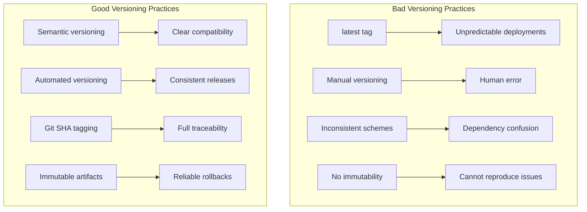
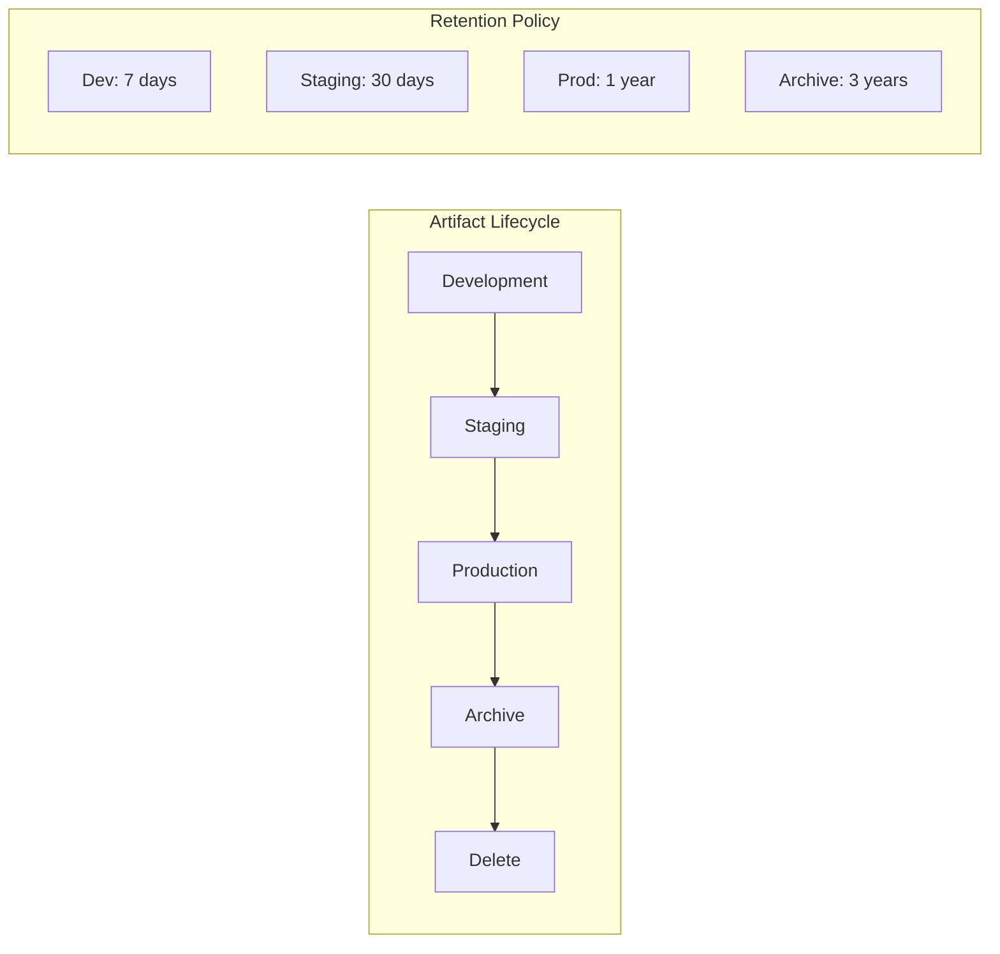

# How to Fix 'Artifact Versioning' Issues

Author: [nawazdhandala](https://www.github.com/nawazdhandala)

Tags: DevOps, CI/CD, Versioning, Semantic Versioning, Docker, Artifacts, Release Management

Description: Learn how to implement consistent artifact versioning strategies that prevent deployment confusion and enable reliable rollbacks.

---

You deploy version 2.3.1 to production, but something is wrong. You need to roll back, but which version was running before? Was it 2.3.0 or 2.2.5? And wait, someone tagged a container as "latest" over the weekend. Now three different environments are running three different versions all labeled "latest."

Artifact versioning problems like these cause real production incidents. Let's fix them with a structured approach to versioning.

## The Problem with Poor Versioning



## Implementing Semantic Versioning

Semantic Versioning (SemVer) provides clear meaning to version numbers:

```
MAJOR.MINOR.PATCH
  |      |     |
  |      |     +-- Bug fixes, no API changes
  |      +-------- New features, backward compatible
  +--------------- Breaking changes
```

### Automated SemVer with Conventional Commits

Use commit messages to determine version bumps automatically:

```bash
# Commit message format
# feat: new feature (bumps MINOR)
# fix: bug fix (bumps PATCH)
# feat!: breaking change (bumps MAJOR)
# chore: maintenance (no version bump)

git commit -m "feat: add user authentication endpoint"
git commit -m "fix: resolve memory leak in connection pool"
git commit -m "feat!: remove deprecated v1 API endpoints"
```

Configure semantic-release:

```json
{
  "branches": ["main"],
  "plugins": [
    "@semantic-release/commit-analyzer",
    "@semantic-release/release-notes-generator",
    "@semantic-release/changelog",
    ["@semantic-release/npm", {
      "npmPublish": false
    }],
    ["@semantic-release/git", {
      "assets": ["package.json", "CHANGELOG.md"],
      "message": "chore(release): ${nextRelease.version} [skip ci]"
    }],
    "@semantic-release/github"
  ]
}
```

### Git-Based Version Generation

For services that do not need SemVer, use Git metadata:

```bash
#!/bin/bash
# version.sh - Generate version from Git state

# Get the latest tag
LATEST_TAG=$(git describe --tags --abbrev=0 2>/dev/null || echo "v0.0.0")

# Get commit count since tag
COMMITS_SINCE=$(git rev-list ${LATEST_TAG}..HEAD --count)

# Get short SHA
SHORT_SHA=$(git rev-parse --short HEAD)

# Get branch name (sanitized)
BRANCH=$(git rev-parse --abbrev-ref HEAD | tr '/' '-' | tr '_' '-')

# Check for uncommitted changes
if [ -n "$(git status --porcelain)" ]; then
    DIRTY="-dirty"
else
    DIRTY=""
fi

# Build version string
if [ "$COMMITS_SINCE" -eq 0 ]; then
    VERSION="${LATEST_TAG}${DIRTY}"
else
    VERSION="${LATEST_TAG}-${COMMITS_SINCE}-g${SHORT_SHA}${DIRTY}"
fi

echo $VERSION
```

## Docker Image Versioning

Never use `latest` in production. Here is a proper tagging strategy:

```yaml
# .github/workflows/build.yml
name: Build and Push

on:
  push:
    branches: [main]
    tags: ['v*']
  pull_request:
    branches: [main]

jobs:
  build:
    runs-on: ubuntu-latest

    steps:
      - uses: actions/checkout@v4
        with:
          fetch-depth: 0  # Full history for versioning

      - name: Generate version
        id: version
        run: |
          if [[ $GITHUB_REF == refs/tags/v* ]]; then
            VERSION=${GITHUB_REF#refs/tags/}
          else
            VERSION=$(git describe --tags --always)
          fi
          SHORT_SHA=$(git rev-parse --short HEAD)
          echo "version=$VERSION" >> $GITHUB_OUTPUT
          echo "sha=$SHORT_SHA" >> $GITHUB_OUTPUT
          echo "date=$(date -u +%Y%m%d)" >> $GITHUB_OUTPUT

      - name: Docker meta
        id: meta
        uses: docker/metadata-action@v5
        with:
          images: |
            myregistry.com/myapp
          tags: |
            # Tag with version
            type=semver,pattern={{version}}
            type=semver,pattern={{major}}.{{minor}}
            type=semver,pattern={{major}}
            # Tag with SHA for traceability
            type=sha,format=short
            # Tag with branch name for PRs
            type=ref,event=branch
            # Never use 'latest' automatically

      - name: Build and push
        uses: docker/build-push-action@v5
        with:
          context: .
          push: true
          tags: ${{ steps.meta.outputs.tags }}
          labels: ${{ steps.meta.outputs.labels }}
          build-args: |
            VERSION=${{ steps.version.outputs.version }}
            GIT_SHA=${{ steps.version.outputs.sha }}
            BUILD_DATE=${{ steps.version.outputs.date }}
```

Embed version information in your application:

```dockerfile
# Dockerfile
FROM golang:1.21-alpine AS builder

ARG VERSION=dev
ARG GIT_SHA=unknown
ARG BUILD_DATE=unknown

WORKDIR /app
COPY . .

RUN go build -ldflags="-X main.Version=${VERSION} \
    -X main.GitSHA=${GIT_SHA} \
    -X main.BuildDate=${BUILD_DATE}" \
    -o /app/server .

FROM alpine:3.19
COPY --from=builder /app/server /server

# Store version info in labels
LABEL org.opencontainers.image.version="${VERSION}"
LABEL org.opencontainers.image.revision="${GIT_SHA}"
LABEL org.opencontainers.image.created="${BUILD_DATE}"

ENTRYPOINT ["/server"]
```

## Artifact Registry Organization

Structure your registry for clarity:

```
myregistry.com/
  +-- production/
  |     +-- api/
  |     |     +-- v2.3.1
  |     |     +-- v2.3.0
  |     |     +-- v2.2.5
  |     +-- web/
  |           +-- v1.8.0
  |           +-- v1.7.2
  +-- staging/
  |     +-- api/
  |           +-- main-abc1234
  |           +-- feature-auth-def5678
  +-- development/
        +-- api/
              +-- pr-123-ghi9012
              +-- pr-124-jkl3456
```

## Helm Chart Versioning

Keep chart versions synchronized with application versions:

```yaml
# Chart.yaml
apiVersion: v2
name: myapp
description: My Application Helm Chart

# Chart version - bump when chart changes
version: 1.5.0

# App version - matches Docker image tag
appVersion: "2.3.1"

dependencies:
  - name: postgresql
    version: "12.1.2"
    repository: "https://charts.bitnami.com/bitnami"
```

Automate chart versioning in CI:

```yaml
# .github/workflows/helm.yml
name: Helm Release

on:
  push:
    tags: ['v*']

jobs:
  release:
    runs-on: ubuntu-latest
    steps:
      - uses: actions/checkout@v4

      - name: Update Chart.yaml
        run: |
          VERSION=${GITHUB_REF#refs/tags/v}
          yq -i ".appVersion = \"$VERSION\"" charts/myapp/Chart.yaml

          # Bump chart version
          CHART_VERSION=$(yq '.version' charts/myapp/Chart.yaml)
          NEW_CHART_VERSION=$(echo $CHART_VERSION | awk -F. '{print $1"."$2"."$3+1}')
          yq -i ".version = \"$NEW_CHART_VERSION\"" charts/myapp/Chart.yaml

      - name: Package and push
        run: |
          helm package charts/myapp
          helm push myapp-*.tgz oci://myregistry.com/charts
```

## Version Tracking in Deployments

Always know what version is running where:

```yaml
# deployment.yaml
apiVersion: apps/v1
kind: Deployment
metadata:
  name: api
  labels:
    app: api
    version: "2.3.1"  # Match image tag
  annotations:
    app.kubernetes.io/version: "2.3.1"
    deployment.kubernetes.io/revision-history: "10"
spec:
  replicas: 3
  selector:
    matchLabels:
      app: api
  template:
    metadata:
      labels:
        app: api
        version: "2.3.1"
      annotations:
        # Record deployment metadata
        deployed-at: "2026-01-24T10:30:00Z"
        deployed-by: "github-actions"
        git-sha: "abc1234"
    spec:
      containers:
        - name: api
          # Always use digest for production
          image: myregistry.com/production/api@sha256:abc123...
          env:
            - name: APP_VERSION
              value: "2.3.1"
```

Create a version endpoint:

```go
// main.go
package main

import (
    "encoding/json"
    "net/http"
)

// Set by -ldflags at build time
var (
    Version   = "dev"
    GitSHA    = "unknown"
    BuildDate = "unknown"
)

type VersionInfo struct {
    Version   string `json:"version"`
    GitSHA    string `json:"git_sha"`
    BuildDate string `json:"build_date"`
}

func versionHandler(w http.ResponseWriter, r *http.Request) {
    info := VersionInfo{
        Version:   Version,
        GitSHA:    GitSHA,
        BuildDate: BuildDate,
    }

    w.Header().Set("Content-Type", "application/json")
    json.NewEncoder(w).Encode(info)
}

func main() {
    http.HandleFunc("/version", versionHandler)
    http.ListenAndServe(":8080", nil)
}
```

## Rollback Strategy

With proper versioning, rollbacks become straightforward:

```bash
#!/bin/bash
# rollback.sh - Roll back to previous version

DEPLOYMENT=$1
NAMESPACE=${2:-default}

# Get current revision
CURRENT=$(kubectl rollout history deployment/$DEPLOYMENT -n $NAMESPACE | tail -2 | head -1 | awk '{print $1}')

# Roll back to previous revision
kubectl rollout undo deployment/$DEPLOYMENT -n $NAMESPACE

# Verify rollback
kubectl rollout status deployment/$DEPLOYMENT -n $NAMESPACE

# Show version change
echo "Rolled back from revision $CURRENT"
kubectl get deployment/$DEPLOYMENT -n $NAMESPACE -o jsonpath='{.spec.template.metadata.labels.version}'
```

For Helm deployments:

```bash
# List release history
helm history myapp -n production

# Roll back to specific revision
helm rollback myapp 5 -n production

# Roll back to previous
helm rollback myapp -n production
```

## Version Lifecycle Management



Implement retention policies:

```yaml
# registry-lifecycle.yaml (for ECR)
rules:
  - rulePriority: 1
    description: "Keep last 10 production images"
    selection:
      tagStatus: tagged
      tagPrefixList: ["v"]
      countType: imageCountMoreThan
      countNumber: 10
    action:
      type: expire

  - rulePriority: 2
    description: "Delete untagged images older than 7 days"
    selection:
      tagStatus: untagged
      countType: sinceImagePushed
      countUnit: days
      countNumber: 7
    action:
      type: expire

  - rulePriority: 3
    description: "Delete PR images older than 14 days"
    selection:
      tagStatus: tagged
      tagPrefixList: ["pr-"]
      countType: sinceImagePushed
      countUnit: days
      countNumber: 14
    action:
      type: expire
```

## Best Practices Summary

1. **Never use `latest` in production.** It provides no information and prevents reliable rollbacks.

2. **Automate version generation.** Human-assigned versions lead to mistakes and inconsistencies.

3. **Include Git SHA in artifacts.** This creates an unbreakable link between code and deployments.

4. **Use image digests for production.** Tags can be overwritten, but digests are immutable.

5. **Embed version in the application.** Make it easy to verify what is actually running.

6. **Implement retention policies.** Old artifacts consume storage and create confusion.

7. **Document your versioning scheme.** Everyone on the team should understand how versions work.

---

Good versioning is invisible when it works and painful when it does not. Invest the time to set up automated, consistent versioning early in your project. When you need to debug a production issue at 3 AM, you will be grateful you can trace exactly which code is running.
