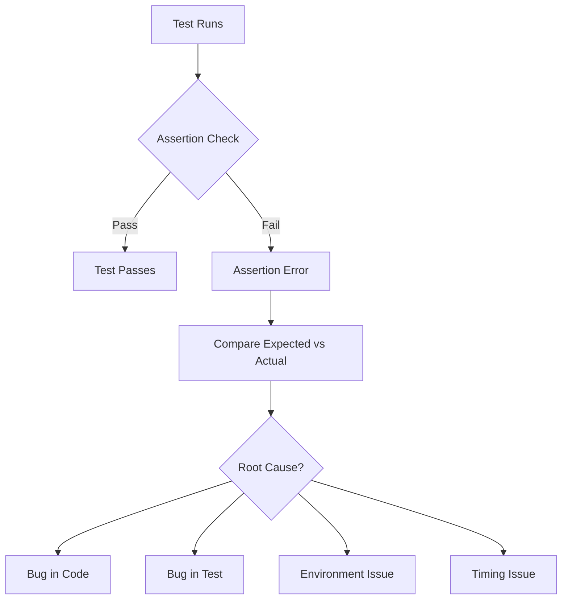

# How to Fix 'Assertion' Failures in Tests

Author: [nawazdhandala](https://www.github.com/nawazdhandala)

Tags: Testing, Assertions, Debugging, Unit Tests, Test Failures, Python, JavaScript, Best Practices

Description: Learn how to diagnose and fix assertion failures in your test suite, including common causes, debugging strategies, and best practices for writing reliable assertions.

---

> Assertion failures are the most common type of test failure. Understanding why assertions fail and how to fix them quickly is a core skill for any developer working with automated tests.

When a test fails with an assertion error, it means the actual result did not match the expected result. This guide covers the systematic approach to diagnosing and fixing these failures.

---

## Understanding Assertion Failures



---

## Common Causes of Assertion Failures

### 1. Incorrect Expected Values

The most common cause is simply having the wrong expected value in your test.

```python
# test_calculator.py
# Common mistake: wrong expected value

def test_addition():
    result = add(2, 3)
    # Wrong: developer made arithmetic error
    assert result == 6  # AssertionError: 5 != 6

    # Correct: verify expected value is accurate
    assert result == 5
```

### 2. Type Mismatches

Values may look the same but have different types.

```python
# test_types.py
# Type mismatch issues

def test_string_vs_int():
    result = get_user_id()  # Returns "123" (string)

    # Fails: comparing string to int
    assert result == 123  # AssertionError: '123' != 123

    # Fix 1: Convert types
    assert int(result) == 123

    # Fix 2: Compare same types
    assert result == "123"

    # Fix 3: Use type-agnostic comparison
    assert str(result) == str(123)


def test_float_precision():
    result = 0.1 + 0.2  # IEEE 754 floating point

    # Fails due to floating point precision
    assert result == 0.3  # AssertionError: 0.30000000000000004 != 0.3

    # Fix: Use approximate comparison
    assert abs(result - 0.3) < 1e-9

    # Or with pytest
    import pytest
    assert result == pytest.approx(0.3)
```

### 3. Object Comparison Issues

Objects need special handling for equality checks.

```python
# test_objects.py
# Object comparison problems

class User:
    def __init__(self, name, email):
        self.name = name
        self.email = email


def test_object_equality_wrong():
    user1 = User("Alice", "alice@example.com")
    user2 = User("Alice", "alice@example.com")

    # Fails: comparing object references, not values
    assert user1 == user2  # AssertionError


# Fix: Implement __eq__ method
class User:
    def __init__(self, name, email):
        self.name = name
        self.email = email

    def __eq__(self, other):
        if not isinstance(other, User):
            return False
        return self.name == other.name and self.email == other.email


def test_object_equality_correct():
    user1 = User("Alice", "alice@example.com")
    user2 = User("Alice", "alice@example.com")

    # Now passes: __eq__ compares values
    assert user1 == user2
```

---

## Debugging Assertion Failures

### Step 1: Read the Error Message Carefully

```python
# pytest output example
def test_user_creation():
    user = create_user("test@example.com")
    assert user.status == "active"

# Output:
# AssertionError: assert 'pending' == 'active'
#   +  where 'pending' = <User object>.status
```

The error tells you exactly what the actual value was (`pending`) versus expected (`active`).

### Step 2: Add Diagnostic Output

```python
# test_with_diagnostics.py
# Add context to help debug failures

def test_complex_calculation():
    data = fetch_data()
    result = process_data(data)

    # Add diagnostic message for failures
    assert result["total"] == 100, (
        f"Expected total=100, got {result['total']}. "
        f"Input data: {data}, Full result: {result}"
    )
```

### Step 3: Use Debugger for Complex Failures

```python
# test_with_debugger.py
# Drop into debugger on failure

def test_complex_logic():
    input_data = generate_test_data()
    result = complex_function(input_data)

    # Add breakpoint before assertion
    if result != expected_value:
        import pdb; pdb.set_trace()  # Debug here

    assert result == expected_value
```

Or run pytest with debugger on failure:

```bash
# Drop into debugger on first failure
pytest --pdb test_module.py

# Or use ipdb for better experience
pytest --pdb --pdbcls=IPython.terminal.debugger:TerminalPdb
```

---

## JavaScript Assertion Patterns

```javascript
// test/user.test.js
// Common JavaScript assertion fixes

const { expect } = require('chai');

describe('User Service', () => {

    // Problem: Async assertion not awaited
    it('creates user - WRONG', () => {
        const user = createUser('test@example.com');
        // This passes but doesn't actually test anything
        // because createUser returns a Promise
        expect(user.email).to.equal('test@example.com');
    });

    // Fix: Await async operations
    it('creates user - CORRECT', async () => {
        const user = await createUser('test@example.com');
        expect(user.email).to.equal('test@example.com');
    });

    // Problem: Deep equality for objects
    it('returns user data - WRONG', async () => {
        const result = await getUser(1);
        // Fails: strict equality on objects
        expect(result).to.equal({ id: 1, name: 'Alice' });
    });

    // Fix: Use deep equality
    it('returns user data - CORRECT', async () => {
        const result = await getUser(1);
        expect(result).to.deep.equal({ id: 1, name: 'Alice' });
        // Or with Jest
        // expect(result).toEqual({ id: 1, name: 'Alice' });
    });

    // Problem: Array order sensitivity
    it('returns user permissions - WRONG', async () => {
        const permissions = await getUserPermissions(1);
        // Fails if order differs
        expect(permissions).to.deep.equal(['read', 'write', 'delete']);
    });

    // Fix: Use unordered comparison
    it('returns user permissions - CORRECT', async () => {
        const permissions = await getUserPermissions(1);
        expect(permissions).to.have.members(['read', 'write', 'delete']);
    });
});
```

---

## Handling Timing-Related Assertion Failures

```python
# test_timing.py
# Timing issues cause flaky tests

import time
import pytest

def test_cache_expiration_flaky():
    cache.set("key", "value", ttl=1)  # 1 second TTL
    time.sleep(1)  # Exactly 1 second

    # Flaky: might pass or fail depending on timing
    assert cache.get("key") is None


def test_cache_expiration_reliable():
    cache.set("key", "value", ttl=1)
    time.sleep(1.5)  # Buffer for timing variations

    assert cache.get("key") is None


# Better: Use retry for timing-sensitive assertions
def wait_for_condition(condition_fn, timeout=5, interval=0.1):
    """Wait for condition to become true."""
    start = time.time()
    while time.time() - start < timeout:
        if condition_fn():
            return True
        time.sleep(interval)
    return False


def test_async_operation():
    trigger_background_job()

    # Wait for job to complete instead of fixed sleep
    assert wait_for_condition(
        lambda: get_job_status() == "completed",
        timeout=10
    ), "Job did not complete within timeout"
```

---

## Best Practices for Reliable Assertions

### 1. One Assertion Per Concept

```python
# test_best_practices.py

# Bad: Multiple unrelated assertions
def test_user_everything():
    user = create_user("test@example.com")
    assert user.email == "test@example.com"
    assert user.created_at is not None
    assert user.permissions == ["read"]
    assert send_welcome_email(user) is True


# Good: Focused assertions per test
def test_user_has_correct_email():
    user = create_user("test@example.com")
    assert user.email == "test@example.com"


def test_user_has_creation_timestamp():
    user = create_user("test@example.com")
    assert user.created_at is not None


def test_new_user_has_default_permissions():
    user = create_user("test@example.com")
    assert user.permissions == ["read"]
```

### 2. Use Specific Assertions

```python
# test_specific_assertions.py

# Bad: Generic assertion
def test_user_list_bad():
    users = get_users()
    assert users  # What exactly are we testing?


# Good: Specific assertions
def test_user_list_good():
    users = get_users()
    assert len(users) == 3
    assert all(isinstance(u, User) for u in users)
    assert users[0].name == "Alice"
```

### 3. Use Helper Functions for Complex Assertions

```python
# test_helpers.py

def assert_valid_user(user, expected_email):
    """Helper for common user assertions."""
    assert user is not None, "User should not be None"
    assert user.email == expected_email
    assert user.id is not None
    assert user.created_at is not None
    assert user.status in ["active", "pending"]


def test_create_user():
    user = create_user("test@example.com")
    assert_valid_user(user, "test@example.com")
    assert user.status == "pending"  # Additional specific assertion
```

---

## Quick Reference: Assertion Fix Patterns

| Problem | Solution |
|---------|----------|
| Type mismatch | Convert types before comparison |
| Float precision | Use `pytest.approx()` or tolerance |
| Object equality | Implement `__eq__` or use deep equal |
| List order | Use `set()` or `have.members()` |
| Timing issues | Add buffer or use retry loops |
| Async not awaited | Add `await` keyword |
| Wrong expected value | Verify expected value manually |

---

## Systematic Debugging Checklist

1. Read the full error message and stack trace
2. Verify the expected value is actually correct
3. Check for type mismatches (string vs int, etc.)
4. Look for timing or race condition issues
5. Add diagnostic output to understand actual state
6. Run the test in isolation to rule out interference
7. Check for environment differences (local vs CI)

---

*Need to monitor test failures across your CI/CD pipeline? [OneUptime](https://oneuptime.com) provides comprehensive monitoring with test result tracking and alerting.*

**Related Reading:**
- [How to Fix "Test Dependency" Issues](/blog/post/2026-01-24-fix-test-dependency-issues/view)
- [How to Configure pytest for Python Testing](/blog/post/2026-01-24-configure-pytest-python-testing/view)
