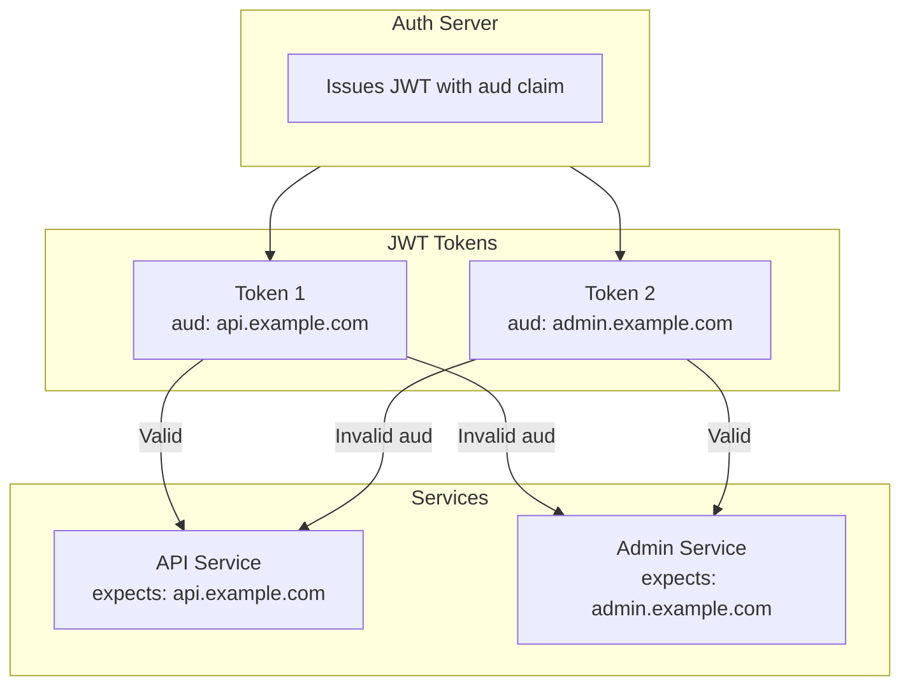
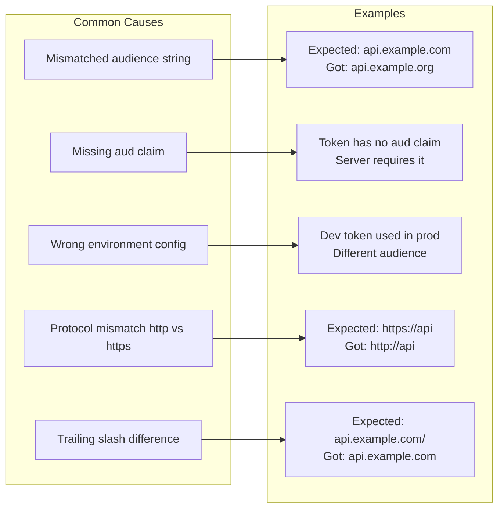
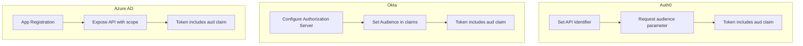

# How to Fix 'Audience Invalid' JWT Errors

Author: [nawazdhandala](https://www.github.com/nawazdhandala)

Tags: JWT, Authentication, Security, Debugging, API

Description: A practical guide to understanding and resolving JWT audience validation errors with code examples for multiple languages and frameworks.

---

The "Audience Invalid" error occurs when a JWT's `aud` (audience) claim does not match what the server expects. This is a security feature that prevents tokens issued for one service from being used with another. This guide explains the audience claim, common causes of validation failures, and how to fix them.

## Understanding the Audience Claim

The `aud` claim identifies the intended recipients of the JWT. A token with `aud: "api.example.com"` should only be accepted by that specific API.



### JWT Structure with Audience

```javascript
// Example JWT payload with audience
{
    "sub": "user123",
    "name": "John Doe",
    "email": "john@example.com",
    "aud": "https://api.example.com",  // Single audience
    "iss": "https://auth.example.com",
    "iat": 1706140800,
    "exp": 1706144400
}

// Multiple audiences (array format)
{
    "sub": "user123",
    "aud": ["https://api.example.com", "https://admin.example.com"],
    "iss": "https://auth.example.com",
    "iat": 1706140800,
    "exp": 1706144400
}
```

## Common Causes of Audience Errors



## Debugging Audience Errors

First, decode your JWT to inspect the audience claim.

```javascript
// Debug JWT audience
function debugJWTAudience(token, expectedAudience) {
    // Decode without verification for debugging
    const parts = token.split('.');
    const payload = JSON.parse(Buffer.from(parts[1], 'base64url').toString());

    console.log('=== JWT Audience Debug ===');
    console.log('Token audience (aud):', payload.aud);
    console.log('Expected audience:', expectedAudience);

    // Check if aud exists
    if (!payload.aud) {
        console.error('Problem: Token has no audience claim');
        return false;
    }

    // Handle string or array audience
    const tokenAudiences = Array.isArray(payload.aud) ? payload.aud : [payload.aud];
    const expectedAudiences = Array.isArray(expectedAudience) ? expectedAudience : [expectedAudience];

    // Check for match
    const hasMatch = tokenAudiences.some(aud =>
        expectedAudiences.some(expected => {
            const match = aud === expected;
            if (!match) {
                // Detailed comparison
                console.log(`Comparing: "${aud}" vs "${expected}"`);
                console.log(`  Length: ${aud.length} vs ${expected.length}`);
                console.log(`  Lowercase match: ${aud.toLowerCase() === expected.toLowerCase()}`);
            }
            return match;
        })
    );

    if (hasMatch) {
        console.log('Result: Audience matches');
    } else {
        console.error('Result: Audience mismatch');
        console.log('Possible issues:');
        console.log('  - Different protocol (http vs https)');
        console.log('  - Trailing slash mismatch');
        console.log('  - Case sensitivity');
        console.log('  - Wrong environment configuration');
    }

    return hasMatch;
}

// Usage
const token = 'eyJhbGciOiJIUzI1NiJ9...';
debugJWTAudience(token, 'https://api.example.com');
```

```python
# Python debug function
import jwt
import json
from typing import Union, List

def debug_jwt_audience(token: str, expected_audience: Union[str, List[str]]) -> bool:
    """Debug JWT audience claim issues."""

    # Decode without verification
    payload = jwt.decode(token, options={"verify_signature": False})

    print("=== JWT Audience Debug ===")
    print(f"Token audience (aud): {payload.get('aud')}")
    print(f"Expected audience: {expected_audience}")

    token_aud = payload.get('aud')

    if not token_aud:
        print("Problem: Token has no audience claim")
        return False

    # Normalize to lists
    token_audiences = token_aud if isinstance(token_aud, list) else [token_aud]
    expected_audiences = expected_audience if isinstance(expected_audience, list) else [expected_audience]

    # Check for match
    for t_aud in token_audiences:
        for e_aud in expected_audiences:
            if t_aud == e_aud:
                print("Result: Audience matches")
                return True
            else:
                print(f"Comparing: '{t_aud}' vs '{e_aud}'")
                print(f"  Exact match: {t_aud == e_aud}")
                print(f"  Case-insensitive: {t_aud.lower() == e_aud.lower()}")

    print("Result: Audience mismatch")
    return False
```

## Fixing Audience Validation

### Node.js with jsonwebtoken

```javascript
const jwt = require('jsonwebtoken');

// Issue 1: Verify with correct audience
function verifyToken(token) {
    try {
        // Specify expected audience
        const decoded = jwt.verify(token, process.env.JWT_SECRET, {
            audience: 'https://api.example.com'
        });
        return { valid: true, payload: decoded };
    } catch (error) {
        if (error.message.includes('audience')) {
            console.error('Audience validation failed:', error.message);
        }
        return { valid: false, error: error.message };
    }
}

// Issue 2: Multiple valid audiences
function verifyTokenMultipleAudiences(token) {
    try {
        const decoded = jwt.verify(token, process.env.JWT_SECRET, {
            // Accept tokens for any of these audiences
            audience: [
                'https://api.example.com',
                'https://api.example.com/',  // With trailing slash
                'api.example.com'             // Without protocol
            ]
        });
        return { valid: true, payload: decoded };
    } catch (error) {
        return { valid: false, error: error.message };
    }
}

// Issue 3: Normalize audience before comparison
function normalizeAudience(aud) {
    if (!aud) return null;

    let normalized = aud.toLowerCase();

    // Remove trailing slash
    normalized = normalized.replace(/\/$/, '');

    // Ensure https protocol
    if (!normalized.startsWith('http')) {
        normalized = 'https://' + normalized;
    }

    return normalized;
}

// Custom verification with normalization
function verifyTokenNormalized(token, expectedAudience) {
    const decoded = jwt.decode(token);

    if (!decoded || !decoded.aud) {
        throw new Error('Token missing audience claim');
    }

    const tokenAudiences = Array.isArray(decoded.aud) ? decoded.aud : [decoded.aud];
    const expectedNormalized = normalizeAudience(expectedAudience);

    const hasValidAudience = tokenAudiences.some(
        aud => normalizeAudience(aud) === expectedNormalized
    );

    if (!hasValidAudience) {
        throw new Error(`Audience mismatch: expected ${expectedAudience}`);
    }

    // Now verify signature
    return jwt.verify(token, process.env.JWT_SECRET);
}
```

### Python with PyJWT

```python
import jwt
from typing import List, Union

# Basic audience verification
def verify_token(token: str, secret: str, expected_audience: str) -> dict:
    """Verify token with audience check."""
    try:
        payload = jwt.decode(
            token,
            secret,
            algorithms=["HS256"],
            audience=expected_audience
        )
        return {"valid": True, "payload": payload}
    except jwt.InvalidAudienceError as e:
        return {"valid": False, "error": f"Audience invalid: {e}"}
    except jwt.InvalidTokenError as e:
        return {"valid": False, "error": str(e)}

# Multiple audiences
def verify_token_multi_audience(
    token: str,
    secret: str,
    valid_audiences: List[str]
) -> dict:
    """Verify token accepting multiple audiences."""
    try:
        # PyJWT accepts list of valid audiences
        payload = jwt.decode(
            token,
            secret,
            algorithms=["HS256"],
            audience=valid_audiences
        )
        return {"valid": True, "payload": payload}
    except jwt.InvalidAudienceError:
        # Get actual audience for debugging
        unverified = jwt.decode(token, options={"verify_signature": False})
        return {
            "valid": False,
            "error": f"Audience mismatch. Token has: {unverified.get('aud')}, expected one of: {valid_audiences}"
        }

# Skip audience verification (use with caution)
def verify_token_no_audience(token: str, secret: str) -> dict:
    """Verify token without audience check."""
    try:
        payload = jwt.decode(
            token,
            secret,
            algorithms=["HS256"],
            options={"verify_aud": False}  # Disable audience verification
        )
        return {"valid": True, "payload": payload}
    except jwt.InvalidTokenError as e:
        return {"valid": False, "error": str(e)}
```

### Express Middleware with Flexible Audience

```javascript
const jwt = require('jsonwebtoken');

// Middleware factory with configurable audience
function createAuthMiddleware(options = {}) {
    const {
        audiences = [],
        strict = true,
        normalizeAudience = true
    } = options;

    return (req, res, next) => {
        const authHeader = req.headers.authorization;

        if (!authHeader || !authHeader.startsWith('Bearer ')) {
            return res.status(401).json({ error: 'No token provided' });
        }

        const token = authHeader.substring(7);

        try {
            let verifyOptions = {
                algorithms: ['HS256']
            };

            // Set audience if provided
            if (audiences.length > 0) {
                if (normalizeAudience) {
                    // Normalize audiences for comparison
                    verifyOptions.audience = audiences.map(a =>
                        a.toLowerCase().replace(/\/$/, '')
                    );
                } else {
                    verifyOptions.audience = audiences;
                }
            }

            const decoded = jwt.verify(token, process.env.JWT_SECRET, verifyOptions);
            req.user = decoded;
            next();
        } catch (error) {
            if (error.name === 'JsonWebTokenError' && error.message.includes('audience')) {
                // Provide helpful error message
                const decoded = jwt.decode(token);
                return res.status(401).json({
                    error: 'invalid_audience',
                    message: 'Token audience does not match',
                    tokenAudience: decoded?.aud,
                    expectedAudiences: audiences
                });
            }

            return res.status(401).json({
                error: 'invalid_token',
                message: error.message
            });
        }
    };
}

// Usage
const app = require('express')();

// Single audience
app.use('/api', createAuthMiddleware({
    audiences: ['https://api.example.com']
}));

// Multiple audiences for shared services
app.use('/shared', createAuthMiddleware({
    audiences: [
        'https://api.example.com',
        'https://admin.example.com',
        'https://internal.example.com'
    ]
}));
```

## Fixing Token Generation

If you control the token issuer, ensure the audience is set correctly.

```javascript
const jwt = require('jsonwebtoken');

// Token generator with proper audience
class TokenGenerator {
    constructor(secret, issuer) {
        this.secret = secret;
        this.issuer = issuer;
    }

    // Generate token for specific service
    generateToken(userId, audience, expiresIn = '1h') {
        const payload = {
            sub: userId,
            iss: this.issuer,
            aud: audience,  // Set audience
            iat: Math.floor(Date.now() / 1000)
        };

        return jwt.sign(payload, this.secret, { expiresIn });
    }

    // Generate token for multiple audiences
    generateMultiAudienceToken(userId, audiences, expiresIn = '1h') {
        const payload = {
            sub: userId,
            iss: this.issuer,
            aud: audiences,  // Array of audiences
            iat: Math.floor(Date.now() / 1000)
        };

        return jwt.sign(payload, this.secret, { expiresIn });
    }
}

// Usage
const generator = new TokenGenerator(
    process.env.JWT_SECRET,
    'https://auth.example.com'
);

// Token for API service
const apiToken = generator.generateToken(
    'user123',
    'https://api.example.com'
);

// Token valid for multiple services
const multiToken = generator.generateMultiAudienceToken(
    'user123',
    ['https://api.example.com', 'https://admin.example.com']
);
```

## OAuth2/OIDC Audience Configuration

When using OAuth2 providers, audience configuration varies by provider.



### Auth0 Configuration

```javascript
// Auth0: Request token with specific audience
const auth0 = require('auth0');

const auth0Client = new auth0.AuthenticationClient({
    domain: 'your-tenant.auth0.com',
    clientId: process.env.AUTH0_CLIENT_ID
});

// Get token with audience
async function getToken(username, password) {
    const response = await auth0Client.oauth.passwordGrant({
        username,
        password,
        audience: 'https://api.example.com',  // Your API identifier
        scope: 'openid profile email'
    });

    return response.access_token;
}

// Verify Auth0 token
const jwksClient = require('jwks-rsa');

const client = jwksClient({
    jwksUri: 'https://your-tenant.auth0.com/.well-known/jwks.json'
});

function getKey(header, callback) {
    client.getSigningKey(header.kid, (err, key) => {
        const signingKey = key.publicKey || key.rsaPublicKey;
        callback(null, signingKey);
    });
}

function verifyAuth0Token(token) {
    return new Promise((resolve, reject) => {
        jwt.verify(token, getKey, {
            audience: 'https://api.example.com',  // Must match API identifier
            issuer: 'https://your-tenant.auth0.com/',
            algorithms: ['RS256']
        }, (err, decoded) => {
            if (err) reject(err);
            else resolve(decoded);
        });
    });
}
```

### Azure AD Configuration

```javascript
// Azure AD token verification
const { ConfidentialClientApplication } = require('@azure/msal-node');

const msalConfig = {
    auth: {
        clientId: process.env.AZURE_CLIENT_ID,
        authority: `https://login.microsoftonline.com/${process.env.AZURE_TENANT_ID}`,
        clientSecret: process.env.AZURE_CLIENT_SECRET
    }
};

const cca = new ConfidentialClientApplication(msalConfig);

// Request token with specific audience (scope)
async function getToken() {
    const result = await cca.acquireTokenByClientCredential({
        // Audience is specified via scope
        scopes: ['https://api.example.com/.default']
    });

    return result.accessToken;
}

// Verify Azure AD token
const { verify } = require('azure-ad-verify-token');

async function verifyAzureToken(token) {
    const options = {
        jwksUri: `https://login.microsoftonline.com/${process.env.AZURE_TENANT_ID}/discovery/v2.0/keys`,
        issuer: `https://login.microsoftonline.com/${process.env.AZURE_TENANT_ID}/v2.0`,
        audience: process.env.AZURE_CLIENT_ID  // Or your API's app ID
    };

    return verify(token, options);
}
```

## Environment-Specific Audiences

Handle different audiences across environments.

```javascript
// Environment-aware audience configuration
const audienceConfig = {
    development: {
        api: 'http://localhost:3000',
        admin: 'http://localhost:3001'
    },
    staging: {
        api: 'https://api.staging.example.com',
        admin: 'https://admin.staging.example.com'
    },
    production: {
        api: 'https://api.example.com',
        admin: 'https://admin.example.com'
    }
};

function getAudience(service) {
    const env = process.env.NODE_ENV || 'development';
    const config = audienceConfig[env];

    if (!config || !config[service]) {
        throw new Error(`Unknown audience for service: ${service} in env: ${env}`);
    }

    return config[service];
}

// Token verification with environment awareness
function verifyTokenForService(token, service) {
    const expectedAudience = getAudience(service);

    return jwt.verify(token, process.env.JWT_SECRET, {
        audience: expectedAudience
    });
}

// Allow all environment audiences during migration
function verifyTokenAllEnvironments(token, service) {
    const allAudiences = Object.values(audienceConfig)
        .map(env => env[service])
        .filter(Boolean);

    return jwt.verify(token, process.env.JWT_SECRET, {
        audience: allAudiences
    });
}
```

## Audience Validation Checklist

- [ ] Token includes `aud` claim
- [ ] Server configured with correct expected audience
- [ ] Protocol matches (http vs https)
- [ ] No trailing slash mismatch
- [ ] Case sensitivity handled
- [ ] Environment-specific audiences configured
- [ ] Multiple audiences supported if needed
- [ ] Error messages are helpful for debugging

---

Audience validation is an important security feature that ensures tokens are only used by their intended recipients. When you encounter audience errors, decode the token to see the actual `aud` value, then compare it carefully with your server configuration. Pay attention to protocol, trailing slashes, and case sensitivity as these are the most common sources of mismatches.
