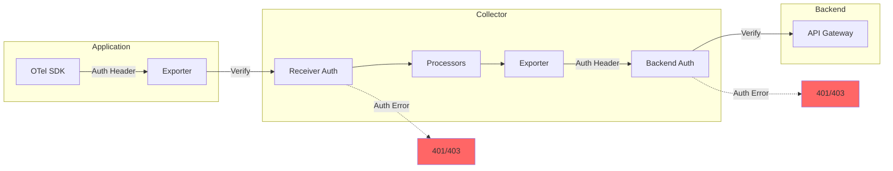

# How to Fix "Authentication Failed" Collector Errors

Author: [nawazdhandala](https://www.github.com/nawazdhandala)

Tags: OpenTelemetry, Collector, Authentication, Troubleshooting, Security, Observability, Errors

Description: A practical guide to diagnosing and fixing authentication errors in OpenTelemetry Collector deployments, covering common causes and solutions.

---

Authentication errors in OpenTelemetry Collector deployments can be frustrating to debug. The error messages are often vague, and the issue could be in your application, the collector, or the backend. This guide provides a systematic approach to identifying and fixing these errors.

---

## Understanding Authentication in OpenTelemetry

Authentication can occur at multiple points in the telemetry pipeline:



---

## Common Authentication Error Messages

| Error Message | Likely Cause |
|--------------|--------------|
| `401 Unauthorized` | Missing or invalid credentials |
| `403 Forbidden` | Valid credentials but insufficient permissions |
| `invalid or expired token` | Token needs refresh or is wrong |
| `authentication handshake failed` | TLS or mTLS configuration issue |

---

## Fixing Application-to-Collector Authentication

### Solution: Add Auth Headers to SDK Exporter

**Node.js:**

```javascript
const { OTLPTraceExporter } = require('@opentelemetry/exporter-trace-otlp-http');

const exporter = new OTLPTraceExporter({
  url: 'https://collector.example.com:4318/v1/traces',
  headers: {
    'Authorization': `Bearer ${process.env.COLLECTOR_TOKEN}`,
  },
});
```

**Python:**

```python
from opentelemetry.exporter.otlp.proto.http.trace_exporter import OTLPSpanExporter

exporter = OTLPSpanExporter(
    endpoint="https://collector.example.com:4318/v1/traces",
    headers={"Authorization": f"Bearer {os.getenv('COLLECTOR_TOKEN')}"},
)
```

---

## Fixing Collector-to-Backend Authentication

### Solution: Configure Exporter Authentication

```yaml
# otel-collector-config.yaml
exporters:
  otlphttp:
    endpoint: https://oneuptime.com/otlp
    headers:
      x-oneuptime-token: ${ONEUPTIME_TOKEN}
      Content-Type: application/json
    encoding: json
```

---

## Testing Authentication

```bash
# Test backend authentication with curl
curl -v -X POST https://oneuptime.com/otlp/v1/traces \
  -H "Content-Type: application/json" \
  -H "x-oneuptime-token: your-token-here" \
  -d '{"resourceSpans":[]}'

# Expected: 200 OK
# Auth failure: 401 Unauthorized or 403 Forbidden
```

---

## Best Practices

1. **Use Environment Variables for Secrets** - Never hardcode tokens
2. **Rotate Tokens Regularly** - Use OAuth2 where possible
3. **Use Different Tokens per Environment** - Separate prod and staging

---

## Related Reading

- [What is OpenTelemetry Collector and Why Use One](https://oneuptime.com/blog/post/2025-09-18-what-is-opentelemetry-collector-and-why-use-one/view)
