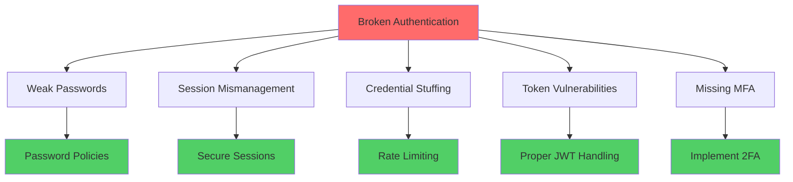

# How to Fix 'Broken Authentication' Issues

Author: [nawazdhandala](https://www.github.com/nawazdhandala)

Tags: Security, Authentication, OWASP, Session Management, API Security

Description: Learn how to identify and fix broken authentication vulnerabilities including weak sessions, credential stuffing, and improper token handling.

---

Broken authentication consistently ranks in the OWASP Top 10 security risks. It occurs when authentication mechanisms are improperly implemented, allowing attackers to compromise passwords, session tokens, or exploit other flaws to assume user identities. This guide covers common broken authentication issues and how to fix them.

## Common Authentication Vulnerabilities



## Issue 1: Weak Password Policies

### The Problem

Many applications accept weak passwords that are easily guessed or cracked.

### The Fix

```javascript
// password-validator.js
const zxcvbn = require('zxcvbn');
const crypto = require('crypto');
const https = require('https');

class PasswordValidator {
    constructor(options = {}) {
        this.minLength = options.minLength || 12;
        this.minScore = options.minScore || 3;  // zxcvbn score 0-4
        this.checkBreached = options.checkBreached !== false;
    }

    async validate(password, userInputs = []) {
        const errors = [];

        // Length check
        if (password.length < this.minLength) {
            errors.push(`Password must be at least ${this.minLength} characters`);
        }

        // Strength check using zxcvbn
        const result = zxcvbn(password, userInputs);
        if (result.score < this.minScore) {
            errors.push(`Password is too weak: ${result.feedback.warning || 'Try a longer password with more variety'}`);
            if (result.feedback.suggestions.length > 0) {
                errors.push(...result.feedback.suggestions);
            }
        }

        // Check against breached password database
        if (this.checkBreached && errors.length === 0) {
            const isBreached = await this.checkPwnedPassword(password);
            if (isBreached) {
                errors.push('This password has been exposed in a data breach. Please choose a different password.');
            }
        }

        return {
            valid: errors.length === 0,
            errors,
            score: result.score,
            crackTime: result.crack_times_display.offline_slow_hashing_1e4_per_second
        };
    }

    async checkPwnedPassword(password) {
        // Use k-Anonymity to check without sending the full password
        const hash = crypto.createHash('sha1').update(password).digest('hex').toUpperCase();
        const prefix = hash.substring(0, 5);
        const suffix = hash.substring(5);

        return new Promise((resolve, reject) => {
            https.get(`https://api.pwnedpasswords.com/range/${prefix}`, (res) => {
                let data = '';
                res.on('data', chunk => data += chunk);
                res.on('end', () => {
                    const found = data.split('\n').some(line => {
                        const [hashSuffix] = line.split(':');
                        return hashSuffix.trim() === suffix;
                    });
                    resolve(found);
                });
            }).on('error', () => resolve(false));  // Fail open if service unavailable
        });
    }
}

// Express middleware
async function validatePassword(req, res, next) {
    const validator = new PasswordValidator();
    const { password, email, name } = req.body;

    // Include user data to prevent passwords containing personal info
    const userInputs = [email, name].filter(Boolean);

    const result = await validator.validate(password, userInputs);

    if (!result.valid) {
        return res.status(400).json({
            error: 'Password does not meet requirements',
            details: result.errors
        });
    }

    next();
}
```

## Issue 2: Insecure Session Management

### The Problem

Sessions that are predictable, never expire, or transmitted insecurely allow session hijacking.

### The Fix

```javascript
// secure-session.js
const session = require('express-session');
const RedisStore = require('connect-redis').default;
const Redis = require('ioredis');
const crypto = require('crypto');

const redis = new Redis(process.env.REDIS_URL);

// Secure session configuration
const sessionConfig = {
    store: new RedisStore({ client: redis }),
    name: '__Host-session',  // Cookie prefix for enhanced security
    secret: process.env.SESSION_SECRET,

    // Generate cryptographically secure session IDs
    genid: () => crypto.randomBytes(32).toString('hex'),

    resave: false,
    saveUninitialized: false,

    cookie: {
        secure: true,           // HTTPS only
        httpOnly: true,         // No JavaScript access
        sameSite: 'strict',     // CSRF protection
        maxAge: 3600000,        // 1 hour
        path: '/',
        domain: process.env.COOKIE_DOMAIN
    }
};

// Session security middleware
function sessionSecurityMiddleware(req, res, next) {
    if (!req.session) {
        return next();
    }

    // Regenerate session ID on privilege changes
    const originalLogin = req.login;
    req.login = function(user, options, callback) {
        req.session.regenerate((err) => {
            if (err) return callback(err);
            originalLogin.call(req, user, options, callback);
        });
    };

    // Track session metadata
    if (req.session.userId) {
        req.session.lastActivity = Date.now();
        req.session.ip = req.ip;
        req.session.userAgent = req.get('User-Agent');
    }

    // Detect session anomalies
    if (req.session.ip && req.session.ip !== req.ip) {
        console.log(`Session anomaly: IP changed from ${req.session.ip} to ${req.ip}`);
        // Optionally invalidate session
        // return req.session.destroy(() => res.status(401).json({ error: 'Session invalidated' }));
    }

    next();
}

// Absolute session timeout (regardless of activity)
function absoluteTimeout(maxAge = 86400000) {  // 24 hours
    return (req, res, next) => {
        if (req.session && req.session.createdAt) {
            if (Date.now() - req.session.createdAt > maxAge) {
                return req.session.destroy(() => {
                    res.status(401).json({ error: 'Session expired. Please login again.' });
                });
            }
        } else if (req.session) {
            req.session.createdAt = Date.now();
        }
        next();
    };
}

// Idle timeout
function idleTimeout(maxIdle = 1800000) {  // 30 minutes
    return (req, res, next) => {
        if (req.session && req.session.lastActivity) {
            if (Date.now() - req.session.lastActivity > maxIdle) {
                return req.session.destroy(() => {
                    res.status(401).json({ error: 'Session timed out due to inactivity.' });
                });
            }
        }
        if (req.session) {
            req.session.lastActivity = Date.now();
        }
        next();
    };
}
```

## Issue 3: JWT Token Vulnerabilities

### Common JWT Problems

- Using `none` algorithm
- Weak secrets
- No expiration
- Sensitive data in payload
- No token revocation

### The Fix

```javascript
// secure-jwt.js
const jwt = require('jsonwebtoken');
const crypto = require('crypto');

class SecureJWT {
    constructor(options) {
        this.secret = options.secret;
        this.algorithm = 'HS256';  // Explicitly set algorithm
        this.issuer = options.issuer;
        this.audience = options.audience;
        this.accessTokenExpiry = options.accessTokenExpiry || '15m';
        this.refreshTokenExpiry = options.refreshTokenExpiry || '7d';
        this.redis = options.redis;  // For token revocation
    }

    generateTokenPair(userId, claims = {}) {
        const tokenId = crypto.randomBytes(16).toString('hex');
        const refreshTokenId = crypto.randomBytes(16).toString('hex');

        const accessToken = jwt.sign(
            {
                sub: userId,
                jti: tokenId,
                type: 'access',
                ...claims
            },
            this.secret,
            {
                algorithm: this.algorithm,
                expiresIn: this.accessTokenExpiry,
                issuer: this.issuer,
                audience: this.audience
            }
        );

        const refreshToken = jwt.sign(
            {
                sub: userId,
                jti: refreshTokenId,
                type: 'refresh',
                accessTokenId: tokenId
            },
            this.secret,
            {
                algorithm: this.algorithm,
                expiresIn: this.refreshTokenExpiry,
                issuer: this.issuer,
                audience: this.audience
            }
        );

        return { accessToken, refreshToken, tokenId, refreshTokenId };
    }

    async verify(token, expectedType = 'access') {
        try {
            // Explicitly specify allowed algorithms to prevent algorithm confusion
            const decoded = jwt.verify(token, this.secret, {
                algorithms: [this.algorithm],
                issuer: this.issuer,
                audience: this.audience
            });

            // Verify token type
            if (decoded.type !== expectedType) {
                throw new Error('Invalid token type');
            }

            // Check if token is revoked
            const isRevoked = await this.redis.get(`revoked:${decoded.jti}`);
            if (isRevoked) {
                throw new Error('Token has been revoked');
            }

            return decoded;
        } catch (error) {
            throw new Error(`Token verification failed: ${error.message}`);
        }
    }

    async revokeToken(tokenId, expiresIn = 86400) {
        // Add to revocation list with TTL matching token expiry
        await this.redis.setex(`revoked:${tokenId}`, expiresIn, '1');
    }

    async revokeAllUserTokens(userId) {
        // Store user's token revocation timestamp
        await this.redis.set(`user_tokens_revoked:${userId}`, Date.now());
    }

    async verifyWithUserCheck(token, expectedType = 'access') {
        const decoded = await this.verify(token, expectedType);

        // Check if all user tokens were revoked after this token was issued
        const revokedAt = await this.redis.get(`user_tokens_revoked:${decoded.sub}`);
        if (revokedAt && decoded.iat * 1000 < parseInt(revokedAt)) {
            throw new Error('Token has been revoked');
        }

        return decoded;
    }
}

// Middleware
function jwtAuthMiddleware(secureJwt) {
    return async (req, res, next) => {
        const authHeader = req.headers.authorization;

        if (!authHeader || !authHeader.startsWith('Bearer ')) {
            return res.status(401).json({ error: 'Missing or invalid authorization header' });
        }

        const token = authHeader.substring(7);

        try {
            const decoded = await secureJwt.verifyWithUserCheck(token);
            req.user = { id: decoded.sub, ...decoded };
            next();
        } catch (error) {
            return res.status(401).json({ error: error.message });
        }
    };
}
```

## Issue 4: Missing Multi-Factor Authentication

### The Fix

```javascript
// totp-mfa.js
const speakeasy = require('speakeasy');
const QRCode = require('qrcode');

class MFAManager {
    constructor(options) {
        this.issuer = options.issuer || 'MyApp';
        this.redis = options.redis;
    }

    generateSecret(userEmail) {
        const secret = speakeasy.generateSecret({
            name: `${this.issuer}:${userEmail}`,
            issuer: this.issuer,
            length: 32
        });

        return {
            base32: secret.base32,
            otpauthUrl: secret.otpauth_url
        };
    }

    async getQRCode(otpauthUrl) {
        return QRCode.toDataURL(otpauthUrl);
    }

    verifyToken(secret, token) {
        return speakeasy.totp.verify({
            secret: secret,
            encoding: 'base32',
            token: token,
            window: 1  // Allow 1 step tolerance (30 seconds)
        });
    }

    async verifyWithRateLimiting(userId, secret, token) {
        const attemptsKey = `mfa_attempts:${userId}`;

        // Check rate limit
        const attempts = await this.redis.incr(attemptsKey);
        if (attempts === 1) {
            await this.redis.expire(attemptsKey, 300);  // 5 minute window
        }

        if (attempts > 5) {
            throw new Error('Too many MFA attempts. Please wait 5 minutes.');
        }

        const valid = this.verifyToken(secret, token);

        if (valid) {
            // Reset attempts on success
            await this.redis.del(attemptsKey);

            // Prevent token reuse
            const usedKey = `mfa_used:${userId}:${token}`;
            const alreadyUsed = await this.redis.get(usedKey);
            if (alreadyUsed) {
                throw new Error('MFA token already used');
            }
            await this.redis.setex(usedKey, 60, '1');  // Token valid for 30s, cache for 60s
        }

        return valid;
    }

    generateBackupCodes(count = 10) {
        const codes = [];
        for (let i = 0; i < count; i++) {
            const code = speakeasy.generateSecret({ length: 10 }).base32.substring(0, 8);
            codes.push(code);
        }
        return codes;
    }
}
```

## Issue 5: Credential Stuffing Protection

### The Fix

```javascript
// credential-stuffing-protection.js
class CredentialStuffingProtection {
    constructor(redis) {
        this.redis = redis;
    }

    async recordFailedAttempt(ip, email) {
        const ipKey = `failed_login_ip:${ip}`;
        const emailKey = `failed_login_email:${email}`;
        const globalKey = 'failed_login_global';

        const pipeline = this.redis.pipeline();

        pipeline.incr(ipKey);
        pipeline.expire(ipKey, 3600);

        pipeline.incr(emailKey);
        pipeline.expire(emailKey, 3600);

        pipeline.incr(globalKey);
        pipeline.expire(globalKey, 60);

        await pipeline.exec();
    }

    async shouldBlock(ip, email) {
        const [ipAttempts, emailAttempts, globalAttempts] = await Promise.all([
            this.redis.get(`failed_login_ip:${ip}`),
            this.redis.get(`failed_login_email:${email}`),
            this.redis.get('failed_login_global')
        ]);

        // Block if too many failures from this IP
        if (parseInt(ipAttempts) > 10) {
            return { blocked: true, reason: 'Too many failed attempts from your IP' };
        }

        // Block if too many failures for this email
        if (parseInt(emailAttempts) > 5) {
            return { blocked: true, reason: 'Account temporarily locked' };
        }

        // Slow down if global attack detected
        if (parseInt(globalAttempts) > 100) {
            return { blocked: false, delay: 5000 };  // Add 5 second delay
        }

        return { blocked: false };
    }

    async clearOnSuccess(ip, email) {
        await this.redis.del(`failed_login_ip:${ip}`);
        await this.redis.del(`failed_login_email:${email}`);
    }
}
```

## Authentication Security Checklist

| Check | Status |
|-------|--------|
| Passwords minimum 12 characters | Required |
| Check passwords against breach databases | Required |
| Secure session ID generation | Required |
| Session regeneration on login | Required |
| Secure cookie flags (HttpOnly, Secure, SameSite) | Required |
| Session timeout (idle and absolute) | Required |
| Rate limiting on authentication endpoints | Required |
| Account lockout after failed attempts | Required |
| MFA option available | Recommended |
| JWT algorithm explicitly specified | Required |
| JWT expiration enforced | Required |
| Token revocation mechanism | Required |

## Summary

Fixing broken authentication requires a defense-in-depth approach. Implement strong password policies, secure session management, proper token handling, rate limiting, and multi-factor authentication. Regular security audits and penetration testing help identify authentication weaknesses before attackers do.
