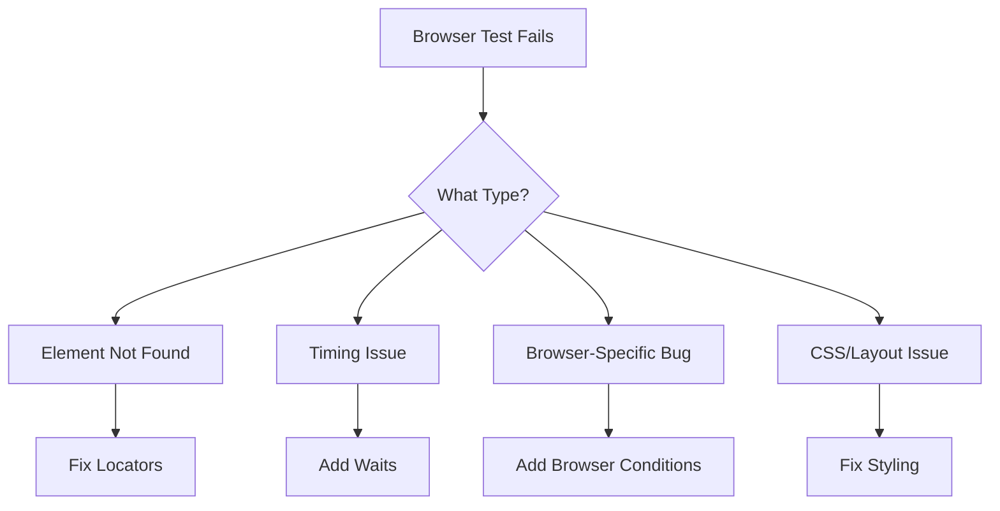

# How to Fix 'Browser Compatibility' Test Issues

Author: [nawazdhandala](https://www.github.com/nawazdhandala)

Tags: Testing, Browser Testing, Selenium, Playwright, Cross-Browser, E2E Testing, WebDriver, Automation

Description: Learn how to diagnose and fix browser compatibility issues in automated tests, including element locators, timing issues, and cross-browser differences.

---

> Browser compatibility testing catches issues before your users do. But cross-browser tests are notorious for flakiness and false failures. Understanding common issues helps you write stable tests that work across all browsers.

This guide covers the most common browser compatibility test failures and how to fix them.

---

## Common Browser Testing Challenges



---

## Element Locator Issues

### Problem: Brittle Locators

```python
# test_brittle_locators.py
# BAD: These locators break easily

from selenium import webdriver
from selenium.webdriver.common.by import By

def test_login_brittle():
    driver = webdriver.Chrome()
    driver.get("https://example.com/login")

    # BAD: Depends on exact HTML structure
    driver.find_element(By.XPATH, "/html/body/div[2]/form/input[1]").send_keys("user")

    # BAD: Depends on class names that may change
    driver.find_element(By.CSS_SELECTOR, ".btn-primary-v2-new").click()

    # BAD: Depends on generated IDs
    driver.find_element(By.ID, "input-12345-email").send_keys("test@example.com")
```

### Solution: Use Stable Locators

```python
# test_stable_locators.py
# GOOD: Stable, semantic locators

from selenium import webdriver
from selenium.webdriver.common.by import By

def test_login_stable():
    driver = webdriver.Chrome()
    driver.get("https://example.com/login")

    # GOOD: Use data-testid attributes
    driver.find_element(By.CSS_SELECTOR, "[data-testid='email-input']").send_keys("user@example.com")

    # GOOD: Use semantic HTML attributes
    driver.find_element(By.CSS_SELECTOR, "input[type='password']").send_keys("password")

    # GOOD: Use aria-label for accessibility
    driver.find_element(By.CSS_SELECTOR, "[aria-label='Submit login form']").click()

    # GOOD: Use name attributes
    driver.find_element(By.NAME, "email").send_keys("test@example.com")

    # GOOD: Use form association
    driver.find_element(By.CSS_SELECTOR, "form[action='/login'] button[type='submit']").click()
```

### Add Test IDs to Your Application

```html
<!-- HTML with test IDs -->
<form data-testid="login-form" action="/login">
    <input
        data-testid="email-input"
        type="email"
        name="email"
        aria-label="Email address"
    />
    <input
        data-testid="password-input"
        type="password"
        name="password"
        aria-label="Password"
    />
    <button
        data-testid="login-submit"
        type="submit"
        aria-label="Submit login form"
    >
        Log In
    </button>
</form>
```

---

## Timing and Wait Issues

### Problem: Race Conditions

```python
# test_race_condition.py
# BAD: No waits lead to flaky tests

def test_async_content_bad():
    driver.get("https://example.com/dashboard")

    # BAD: Element might not be loaded yet
    dashboard_title = driver.find_element(By.CSS_SELECTOR, ".dashboard-title")
    assert dashboard_title.text == "Welcome"  # NoSuchElementException or empty text
```

### Solution: Explicit Waits

```python
# test_with_waits.py
# GOOD: Wait for elements to be ready

from selenium.webdriver.support.ui import WebDriverWait
from selenium.webdriver.support import expected_conditions as EC
from selenium.common.exceptions import TimeoutException

def test_async_content_good():
    driver.get("https://example.com/dashboard")
    wait = WebDriverWait(driver, timeout=10)

    # Wait for element to be present
    dashboard_title = wait.until(
        EC.presence_of_element_located((By.CSS_SELECTOR, "[data-testid='dashboard-title']"))
    )

    # Wait for element to be visible
    welcome_message = wait.until(
        EC.visibility_of_element_located((By.CSS_SELECTOR, "[data-testid='welcome-msg']"))
    )

    # Wait for element to be clickable
    start_button = wait.until(
        EC.element_to_be_clickable((By.CSS_SELECTOR, "[data-testid='start-button']"))
    )

    # Wait for text to be present
    wait.until(
        EC.text_to_be_present_in_element(
            (By.CSS_SELECTOR, "[data-testid='status']"),
            "Ready"
        )
    )


def test_with_custom_wait():
    """Custom wait condition."""
    wait = WebDriverWait(driver, timeout=10)

    def element_has_loaded_data(driver):
        """Wait until element has non-empty data attribute."""
        element = driver.find_element(By.CSS_SELECTOR, "[data-testid='user-list']")
        return element.get_attribute("data-loaded") == "true"

    wait.until(element_has_loaded_data)
```

---

## Playwright for Better Cross-Browser Testing

```python
# test_playwright.py
# Playwright provides better cross-browser support

from playwright.sync_api import sync_playwright, expect

def test_login_with_playwright():
    with sync_playwright() as p:
        # Run on multiple browsers
        for browser_type in [p.chromium, p.firefox, p.webkit]:
            browser = browser_type.launch()
            page = browser.new_page()

            page.goto("https://example.com/login")

            # Playwright auto-waits for elements
            page.fill("[data-testid='email-input']", "user@example.com")
            page.fill("[data-testid='password-input']", "password")
            page.click("[data-testid='login-submit']")

            # Built-in assertions with auto-retry
            expect(page.locator("[data-testid='dashboard']")).to_be_visible()

            browser.close()


def test_mobile_viewport():
    """Test responsive design."""
    with sync_playwright() as p:
        browser = p.chromium.launch()

        # iPhone 12 viewport
        context = browser.new_context(
            viewport={"width": 390, "height": 844},
            device_scale_factor=3,
            is_mobile=True,
            has_touch=True,
        )

        page = context.new_page()
        page.goto("https://example.com")

        # Mobile menu should be visible
        expect(page.locator("[data-testid='mobile-menu-button']")).to_be_visible()

        # Desktop nav should be hidden
        expect(page.locator("[data-testid='desktop-nav']")).to_be_hidden()

        browser.close()
```

---

## Handling Browser-Specific Behavior

### Conditional Logic for Browser Differences

```python
# test_browser_specific.py
# Handle browser differences gracefully

import pytest
from selenium import webdriver
from selenium.webdriver.common.keys import Keys

@pytest.fixture(params=["chrome", "firefox", "safari"])
def browser(request):
    """Parameterized browser fixture."""
    if request.param == "chrome":
        driver = webdriver.Chrome()
    elif request.param == "firefox":
        driver = webdriver.Firefox()
    elif request.param == "safari":
        driver = webdriver.Safari()

    yield driver
    driver.quit()


def test_file_upload(browser):
    """File upload works differently across browsers."""
    browser.get("https://example.com/upload")

    file_input = browser.find_element(By.CSS_SELECTOR, "input[type='file']")

    # File upload is handled consistently with Selenium
    file_input.send_keys("/path/to/test/file.pdf")

    # But the UI feedback might differ
    wait = WebDriverWait(browser, 10)
    wait.until(
        EC.text_to_be_present_in_element(
            (By.CSS_SELECTOR, "[data-testid='upload-status']"),
            "file.pdf"
        )
    )


def test_keyboard_shortcuts(browser):
    """Keyboard shortcuts differ by OS/browser."""
    browser.get("https://example.com/editor")

    text_area = browser.find_element(By.CSS_SELECTOR, "[data-testid='editor']")
    text_area.send_keys("Hello World")

    # Select all: Cmd+A on Mac, Ctrl+A on Windows/Linux
    import platform
    modifier = Keys.COMMAND if platform.system() == "Darwin" else Keys.CONTROL

    text_area.send_keys(modifier, "a")  # Select all
    text_area.send_keys(modifier, "c")  # Copy
```

---

## CSS and Layout Issues

### Problem: Different Rendering Across Browsers

```python
# test_visual_regression.py
# Catch visual differences between browsers

from playwright.sync_api import sync_playwright

def test_visual_consistency():
    with sync_playwright() as p:
        browsers = {
            "chromium": p.chromium,
            "firefox": p.firefox,
            "webkit": p.webkit,
        }

        for name, browser_type in browsers.items():
            browser = browser_type.launch()
            page = browser.new_page()
            page.goto("https://example.com")

            # Take screenshot for visual comparison
            page.screenshot(path=f"screenshots/{name}-homepage.png", full_page=True)

            # Compare against baseline
            # Use tools like Percy or Applitools for actual comparison

            browser.close()


def test_responsive_breakpoints():
    """Test layout at different breakpoints."""
    with sync_playwright() as p:
        browser = p.chromium.launch()

        viewports = [
            {"width": 320, "height": 568, "name": "mobile"},
            {"width": 768, "height": 1024, "name": "tablet"},
            {"width": 1920, "height": 1080, "name": "desktop"},
        ]

        for viewport in viewports:
            page = browser.new_page(viewport={"width": viewport["width"], "height": viewport["height"]})
            page.goto("https://example.com")

            # Check layout-specific elements
            if viewport["width"] < 768:
                # Mobile layout assertions
                assert page.locator("[data-testid='mobile-nav']").is_visible()
            else:
                # Desktop layout assertions
                assert page.locator("[data-testid='desktop-nav']").is_visible()

            page.close()

        browser.close()
```

---

## CI/CD Configuration for Cross-Browser Testing

```yaml
# .github/workflows/browser-tests.yml

name: Browser Tests

on:
  push:
    branches: [main]
  pull_request:
    branches: [main]

jobs:
  test:
    runs-on: ubuntu-latest
    strategy:
      matrix:
        browser: [chromium, firefox, webkit]

    steps:
      - uses: actions/checkout@v4

      - name: Set up Python
        uses: actions/setup-python@v5
        with:
          python-version: '3.11'

      - name: Install dependencies
        run: |
          pip install playwright pytest
          playwright install --with-deps ${{ matrix.browser }}

      - name: Run tests
        run: |
          pytest tests/e2e --browser ${{ matrix.browser }} -v

      - name: Upload screenshots on failure
        if: failure()
        uses: actions/upload-artifact@v4
        with:
          name: screenshots-${{ matrix.browser }}
          path: screenshots/
```

---

## Debugging Failed Browser Tests

```python
# conftest.py
# Capture debug info on test failure

import pytest
from datetime import datetime

@pytest.hookimpl(tryfirst=True, hookwrapper=True)
def pytest_runtest_makereport(item, call):
    """Capture screenshot and logs on test failure."""
    outcome = yield
    report = outcome.get_result()

    if report.when == "call" and report.failed:
        # Get browser driver from test
        driver = item.funcargs.get("browser") or item.funcargs.get("driver")

        if driver:
            timestamp = datetime.now().strftime("%Y%m%d_%H%M%S")
            test_name = item.name

            # Save screenshot
            screenshot_path = f"screenshots/failure_{test_name}_{timestamp}.png"
            driver.save_screenshot(screenshot_path)

            # Save page source
            html_path = f"screenshots/failure_{test_name}_{timestamp}.html"
            with open(html_path, "w") as f:
                f.write(driver.page_source)

            # Save browser logs (Chrome only)
            try:
                logs = driver.get_log("browser")
                log_path = f"screenshots/failure_{test_name}_{timestamp}.log"
                with open(log_path, "w") as f:
                    for entry in logs:
                        f.write(f"{entry}\n")
            except Exception:
                pass
```

---

## Quick Reference: Common Issues and Fixes

| Issue | Fix |
|-------|-----|
| Element not found | Add explicit wait |
| Stale element | Re-locate element after page changes |
| Click intercepted | Scroll element into view first |
| Different rendering | Use visual regression testing |
| Timing inconsistency | Use proper waits, not sleep |
| Mobile touch events | Use proper touch actions |
| File upload differs | Use send_keys on input element |

---

*Need to monitor your application across browsers and devices? [OneUptime](https://oneuptime.com) provides synthetic monitoring that tests your app from multiple locations and browsers.*

**Related Reading:**
- [How to Handle Security Testing](/blog/post/2026-01-24-handle-security-testing/view)
- [How to Fix "Assertion" Failures in Tests](/blog/post/2026-01-24-fix-assertion-failures-tests/view)
