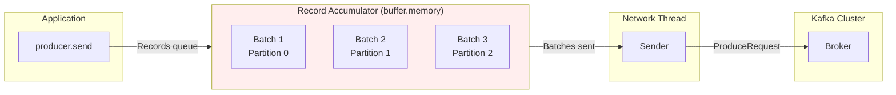
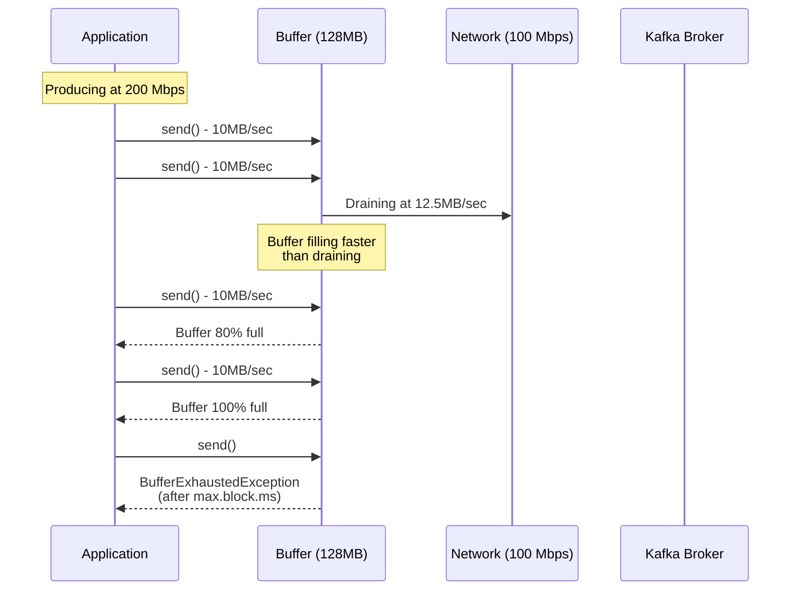
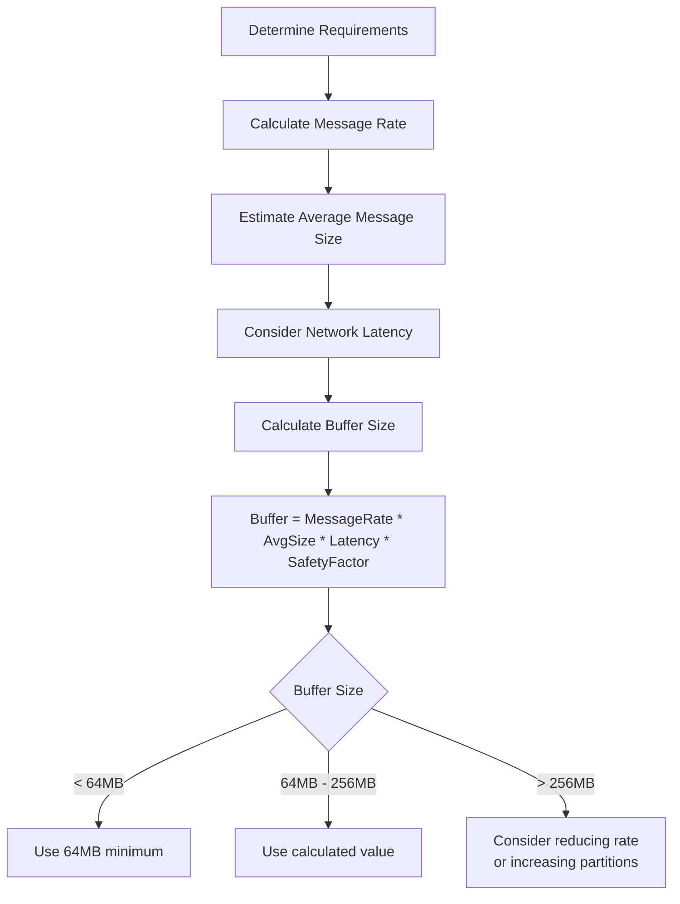

# How to Fix "BufferExhaustedException" in Kafka Producer

Author: [nawazdhandala](https://www.github.com/nawazdhandala)

Tags: Kafka, BufferExhaustedException, Producer, Java, Troubleshooting, Memory, Performance

Description: Learn how to diagnose and resolve BufferExhaustedException in Kafka producers by understanding buffer memory management, proper configuration, and implementing backpressure handling.

---

> BufferExhaustedException occurs when your Kafka producer is generating records faster than they can be sent to the brokers. Understanding the producer's memory model is key to solving this problem without losing data.

The `BufferExhaustedException` is thrown when the producer's internal buffer is full and cannot accept new records. This guide explains why this happens and provides practical solutions to prevent data loss and maintain stable throughput.

---

## Understanding the Exception

When you call `producer.send()`, records are not immediately sent to Kafka. Instead, they are stored in an internal buffer called the Record Accumulator, which batches records for efficient network transmission.



The exception occurs when:
1. The buffer reaches `buffer.memory` capacity
2. The `max.block.ms` timeout expires while waiting for space
3. No space becomes available (broker is slow or down)

---

## Common Causes and Solutions

### 1. Insufficient Buffer Memory

The default `buffer.memory` is 32MB, which may be too small for high-throughput applications.

```java
import org.apache.kafka.clients.producer.*;
import org.apache.kafka.common.errors.BufferExhaustedException;
import org.apache.kafka.common.errors.TimeoutException;

public class BufferConfiguredProducer {

    public static KafkaProducer<String, String> createProducer() {
        Properties props = new Properties();
        props.put(ProducerConfig.BOOTSTRAP_SERVERS_CONFIG, "localhost:9092");
        props.put(ProducerConfig.KEY_SERIALIZER_CLASS_CONFIG,
            "org.apache.kafka.common.serialization.StringSerializer");
        props.put(ProducerConfig.VALUE_SERIALIZER_CLASS_CONFIG,
            "org.apache.kafka.common.serialization.StringSerializer");

        // BUFFER MEMORY CONFIGURATION

        // Total memory available for buffering records
        // Default: 33554432 (32MB)
        // Increase based on your throughput requirements
        props.put(ProducerConfig.BUFFER_MEMORY_CONFIG, 134217728); // 128MB

        // Maximum time to block when buffer is full
        // Default: 60000 (60 seconds)
        // After this time, BufferExhaustedException is thrown
        props.put(ProducerConfig.MAX_BLOCK_MS_CONFIG, 30000); // 30 seconds

        // Batch size affects how quickly buffer space is freed
        // Larger batches = more efficient, but use more memory per batch
        props.put(ProducerConfig.BATCH_SIZE_CONFIG, 65536); // 64KB

        // Linger time allows batches to fill before sending
        // Helps with throughput but adds latency
        props.put(ProducerConfig.LINGER_MS_CONFIG, 10);

        return new KafkaProducer<>(props);
    }
}
```

### 2. Slow Broker Response

If brokers are slow to acknowledge records, the buffer fills up while waiting for confirmations.

```java
public class SlowBrokerHandler {

    public static Properties configureForSlowBrokers() {
        Properties props = new Properties();
        props.put(ProducerConfig.BOOTSTRAP_SERVERS_CONFIG, "localhost:9092");

        // Reduce acks requirement for faster acknowledgment
        // acks=1 means only leader needs to acknowledge
        // WARNING: This trades durability for throughput
        props.put(ProducerConfig.ACKS_CONFIG, "1");

        // Increase request timeout for slow brokers
        props.put(ProducerConfig.REQUEST_TIMEOUT_MS_CONFIG, 60000);

        // Increase delivery timeout
        props.put(ProducerConfig.DELIVERY_TIMEOUT_MS_CONFIG, 180000);

        // Allow more in-flight requests
        // This helps maintain throughput despite latency
        props.put(ProducerConfig.MAX_IN_FLIGHT_REQUESTS_PER_CONNECTION, 10);

        // Larger buffer for slow broker scenarios
        props.put(ProducerConfig.BUFFER_MEMORY_CONFIG, 268435456); // 256MB

        return props;
    }
}
```

### 3. Producer Outpacing Network Capacity

When your application produces faster than network bandwidth allows:



---

## Implementing Backpressure Handling

### Strategy 1: Block with Timeout and Retry

```java
import java.util.concurrent.*;

public class BackpressureProducer {
    private final KafkaProducer<String, String> producer;
    private final int maxRetries;
    private final long retryBackoffMs;

    public BackpressureProducer(Properties props, int maxRetries, long retryBackoffMs) {
        // Configure shorter block time for faster feedback
        props.put(ProducerConfig.MAX_BLOCK_MS_CONFIG, 5000); // 5 second block

        this.producer = new KafkaProducer<>(props);
        this.maxRetries = maxRetries;
        this.retryBackoffMs = retryBackoffMs;
    }

    // Send with automatic retry on buffer exhaustion
    public Future<RecordMetadata> sendWithBackpressure(ProducerRecord<String, String> record)
            throws InterruptedException {

        int attempts = 0;

        while (attempts < maxRetries) {
            try {
                return producer.send(record);

            } catch (BufferExhaustedException e) {
                attempts++;
                System.err.printf("Buffer exhausted, attempt %d/%d. Waiting...%n",
                    attempts, maxRetries);

                if (attempts >= maxRetries) {
                    throw e;
                }

                // Exponential backoff
                long backoff = retryBackoffMs * (long) Math.pow(2, attempts - 1);
                Thread.sleep(Math.min(backoff, 30000)); // Cap at 30 seconds

            } catch (TimeoutException e) {
                attempts++;
                System.err.printf("Send timeout, attempt %d/%d%n", attempts, maxRetries);

                if (attempts >= maxRetries) {
                    throw e;
                }

                Thread.sleep(retryBackoffMs);
            }
        }

        throw new RuntimeException("Failed to send after " + maxRetries + " attempts");
    }

    public void close() {
        producer.close(Duration.ofSeconds(30));
    }
}
```

### Strategy 2: Rate Limiting with Semaphore

```java
import java.util.concurrent.Semaphore;

public class RateLimitedProducer {
    private final KafkaProducer<String, String> producer;
    private final Semaphore rateLimiter;
    private final int maxOutstandingRecords;

    public RateLimitedProducer(Properties props, int maxOutstandingRecords) {
        this.producer = new KafkaProducer<>(props);
        this.maxOutstandingRecords = maxOutstandingRecords;

        // Semaphore limits concurrent outstanding sends
        this.rateLimiter = new Semaphore(maxOutstandingRecords);
    }

    // Send with rate limiting to prevent buffer exhaustion
    public void sendRateLimited(ProducerRecord<String, String> record)
            throws InterruptedException {

        // Acquire permit before sending
        // This blocks if too many records are in flight
        rateLimiter.acquire();

        producer.send(record, (metadata, exception) -> {
            // Release permit when send completes (success or failure)
            rateLimiter.release();

            if (exception != null) {
                System.err.println("Send failed: " + exception.getMessage());
                // Handle failed record (e.g., dead letter queue, retry logic)
            }
        });
    }

    // Get current buffer pressure
    public double getBufferPressure() {
        int availablePermits = rateLimiter.availablePermits();
        return 1.0 - ((double) availablePermits / maxOutstandingRecords);
    }

    public void close() {
        producer.close(Duration.ofSeconds(30));
    }
}
```

### Strategy 3: Async Processing with Bounded Queue

```java
import java.util.concurrent.*;

public class BoundedAsyncProducer {
    private final KafkaProducer<String, String> producer;
    private final BlockingQueue<ProducerRecord<String, String>> queue;
    private final ExecutorService senderThread;
    private volatile boolean running = true;

    public BoundedAsyncProducer(Properties props, int queueCapacity) {
        this.producer = new KafkaProducer<>(props);

        // Bounded queue provides backpressure
        this.queue = new ArrayBlockingQueue<>(queueCapacity);

        // Background thread drains queue
        this.senderThread = Executors.newSingleThreadExecutor();
        this.senderThread.submit(this::senderLoop);
    }

    // Non-blocking offer with timeout
    public boolean offer(ProducerRecord<String, String> record, long timeout, TimeUnit unit)
            throws InterruptedException {
        return queue.offer(record, timeout, unit);
    }

    // Blocking put - waits indefinitely for space
    public void put(ProducerRecord<String, String> record) throws InterruptedException {
        queue.put(record);
    }

    // Get queue utilization for monitoring
    public double getQueueUtilization() {
        return (double) queue.size() / (queue.size() + queue.remainingCapacity());
    }

    private void senderLoop() {
        while (running || !queue.isEmpty()) {
            try {
                ProducerRecord<String, String> record = queue.poll(100, TimeUnit.MILLISECONDS);

                if (record != null) {
                    // Send with callback for error handling
                    producer.send(record, (metadata, exception) -> {
                        if (exception != null) {
                            handleSendError(record, exception);
                        }
                    });
                }

            } catch (InterruptedException e) {
                Thread.currentThread().interrupt();
                break;
            }
        }
    }

    private void handleSendError(ProducerRecord<String, String> record, Exception e) {
        System.err.println("Failed to send record: " + e.getMessage());
        // Implement retry logic or dead letter queue
    }

    public void shutdown() {
        running = false;
        senderThread.shutdown();
        try {
            senderThread.awaitTermination(30, TimeUnit.SECONDS);
        } catch (InterruptedException e) {
            senderThread.shutdownNow();
        }
        producer.close(Duration.ofSeconds(30));
    }
}
```

---

## Monitoring Buffer Health

Track buffer metrics to detect issues before they cause exceptions:

```java
import org.apache.kafka.common.Metric;
import org.apache.kafka.common.MetricName;
import java.util.Map;

public class BufferHealthMonitor {
    private final KafkaProducer<String, String> producer;

    public BufferHealthMonitor(KafkaProducer<String, String> producer) {
        this.producer = producer;
    }

    // Get current buffer utilization percentage
    public double getBufferUtilization() {
        Map<MetricName, ? extends Metric> metrics = producer.metrics();

        double bufferAvailable = 0;
        double bufferTotal = 0;

        for (Map.Entry<MetricName, ? extends Metric> entry : metrics.entrySet()) {
            String name = entry.getKey().name();

            if (name.equals("buffer-available-bytes")) {
                bufferAvailable = (double) entry.getValue().metricValue();
            }
            if (name.equals("buffer-total-bytes")) {
                bufferTotal = (double) entry.getValue().metricValue();
            }
        }

        if (bufferTotal > 0) {
            return 1.0 - (bufferAvailable / bufferTotal);
        }
        return 0;
    }

    // Log all buffer-related metrics
    public void logBufferMetrics() {
        Map<MetricName, ? extends Metric> metrics = producer.metrics();

        System.out.println("=== Buffer Metrics ===");

        for (Map.Entry<MetricName, ? extends Metric> entry : metrics.entrySet()) {
            String name = entry.getKey().name();

            if (name.contains("buffer") ||
                name.contains("batch") ||
                name.contains("record-queue")) {

                System.out.printf("%s: %s%n", name, entry.getValue().metricValue());
            }
        }
    }

    // Check if buffer is under pressure
    public boolean isBufferUnderPressure(double threshold) {
        return getBufferUtilization() > threshold;
    }
}
```

### Setting Up Alerts

```java
import io.micrometer.core.instrument.*;

public class BufferMetricsExporter {
    private final KafkaProducer<String, String> producer;
    private final MeterRegistry registry;

    public BufferMetricsExporter(KafkaProducer<String, String> producer, MeterRegistry registry) {
        this.producer = producer;
        this.registry = registry;

        // Register gauges for buffer metrics
        Gauge.builder("kafka.producer.buffer.utilization", this, BufferMetricsExporter::getBufferUtilization)
            .description("Producer buffer utilization percentage")
            .register(registry);

        Gauge.builder("kafka.producer.buffer.available.bytes", this, BufferMetricsExporter::getBufferAvailable)
            .description("Available buffer memory in bytes")
            .register(registry);

        Gauge.builder("kafka.producer.batch.queue.size", this, BufferMetricsExporter::getBatchQueueSize)
            .description("Number of batches waiting to be sent")
            .register(registry);
    }

    private double getBufferUtilization() {
        // Implementation from BufferHealthMonitor
        return 0.0;
    }

    private double getBufferAvailable() {
        return getMetricValue("buffer-available-bytes");
    }

    private double getBatchQueueSize() {
        return getMetricValue("record-queue-time-avg");
    }

    private double getMetricValue(String metricName) {
        Map<MetricName, ? extends Metric> metrics = producer.metrics();
        for (Map.Entry<MetricName, ? extends Metric> entry : metrics.entrySet()) {
            if (entry.getKey().name().equals(metricName)) {
                Object value = entry.getValue().metricValue();
                if (value instanceof Number) {
                    return ((Number) value).doubleValue();
                }
            }
        }
        return 0.0;
    }
}
```

---

## Buffer Memory Sizing Guide

Calculate appropriate buffer memory based on your requirements:



### Sizing Formula

```java
public class BufferSizeCalculator {

    /**
     * Calculate recommended buffer size
     *
     * @param messagesPerSecond Expected message rate
     * @param avgMessageSizeBytes Average message size including key and headers
     * @param expectedLatencyMs Expected round-trip latency to broker
     * @param safetyFactor Multiplier for burst handling (typically 2-3)
     * @return Recommended buffer size in bytes
     */
    public static long calculateBufferSize(
            double messagesPerSecond,
            int avgMessageSizeBytes,
            int expectedLatencyMs,
            double safetyFactor) {

        // Bytes produced per second
        double bytesPerSecond = messagesPerSecond * avgMessageSizeBytes;

        // Buffer needs to hold data for at least one round-trip
        double secondsOfBuffer = expectedLatencyMs / 1000.0;

        // Calculate base buffer requirement
        long baseBuffer = (long) (bytesPerSecond * secondsOfBuffer);

        // Apply safety factor for bursts
        long recommendedBuffer = (long) (baseBuffer * safetyFactor);

        // Minimum 64MB, maximum 512MB
        return Math.max(67108864, Math.min(recommendedBuffer, 536870912));
    }

    public static void main(String[] args) {
        // Example: 10,000 messages/sec, 1KB each, 50ms latency
        long bufferSize = calculateBufferSize(10000, 1024, 50, 3.0);
        System.out.printf("Recommended buffer.memory: %d bytes (%.2f MB)%n",
            bufferSize, bufferSize / (1024.0 * 1024.0));
    }
}
```

---

## Complete Solution Example

```java
import org.apache.kafka.clients.producer.*;
import org.apache.kafka.common.errors.*;
import java.util.*;
import java.util.concurrent.*;
import java.time.Duration;

public class ResilientKafkaProducer {
    private final KafkaProducer<String, String> producer;
    private final Semaphore inflightLimiter;
    private final int maxInflight;
    private final BufferHealthMonitor healthMonitor;

    public ResilientKafkaProducer(String bootstrapServers, int maxInflight) {
        Properties props = new Properties();
        props.put(ProducerConfig.BOOTSTRAP_SERVERS_CONFIG, bootstrapServers);
        props.put(ProducerConfig.KEY_SERIALIZER_CLASS_CONFIG,
            "org.apache.kafka.common.serialization.StringSerializer");
        props.put(ProducerConfig.VALUE_SERIALIZER_CLASS_CONFIG,
            "org.apache.kafka.common.serialization.StringSerializer");

        // Generous buffer with reasonable timeout
        props.put(ProducerConfig.BUFFER_MEMORY_CONFIG, 134217728); // 128MB
        props.put(ProducerConfig.MAX_BLOCK_MS_CONFIG, 10000); // 10 seconds

        // Efficient batching
        props.put(ProducerConfig.BATCH_SIZE_CONFIG, 65536);
        props.put(ProducerConfig.LINGER_MS_CONFIG, 10);
        props.put(ProducerConfig.COMPRESSION_TYPE_CONFIG, "lz4");

        // Reliability settings
        props.put(ProducerConfig.ACKS_CONFIG, "all");
        props.put(ProducerConfig.ENABLE_IDEMPOTENCE_CONFIG, true);
        props.put(ProducerConfig.RETRIES_CONFIG, Integer.MAX_VALUE);

        this.producer = new KafkaProducer<>(props);
        this.maxInflight = maxInflight;
        this.inflightLimiter = new Semaphore(maxInflight);
        this.healthMonitor = new BufferHealthMonitor(producer);
    }

    // Send with comprehensive error handling
    public CompletableFuture<RecordMetadata> send(String topic, String key, String value) {
        CompletableFuture<RecordMetadata> future = new CompletableFuture<>();

        try {
            // Check buffer health before sending
            if (healthMonitor.isBufferUnderPressure(0.9)) {
                System.out.println("Warning: Buffer under pressure, slowing down...");
            }

            // Acquire permit (may block)
            if (!inflightLimiter.tryAcquire(5, TimeUnit.SECONDS)) {
                future.completeExceptionally(
                    new BufferExhaustedException("Too many in-flight requests"));
                return future;
            }

            ProducerRecord<String, String> record = new ProducerRecord<>(topic, key, value);

            producer.send(record, (metadata, exception) -> {
                inflightLimiter.release();

                if (exception != null) {
                    future.completeExceptionally(exception);
                } else {
                    future.complete(metadata);
                }
            });

        } catch (InterruptedException e) {
            Thread.currentThread().interrupt();
            future.completeExceptionally(e);
        } catch (BufferExhaustedException | TimeoutException e) {
            future.completeExceptionally(e);
        }

        return future;
    }

    // Get current health status
    public Map<String, Object> getHealthStatus() {
        Map<String, Object> status = new HashMap<>();
        status.put("bufferUtilization", healthMonitor.getBufferUtilization());
        status.put("inflightPermits", inflightLimiter.availablePermits());
        status.put("maxInflight", maxInflight);
        return status;
    }

    public void close() {
        producer.close(Duration.ofSeconds(30));
    }
}
```

---

## Summary

To fix and prevent `BufferExhaustedException`:

1. **Increase buffer memory** - Set `buffer.memory` based on throughput needs
2. **Implement backpressure** - Use rate limiting or bounded queues
3. **Monitor buffer health** - Track utilization and alert before exhaustion
4. **Handle errors gracefully** - Implement retry logic with exponential backoff
5. **Right-size for your workload** - Calculate buffer needs based on message rate and latency

---

*Need visibility into your Kafka producer health? [OneUptime](https://oneuptime.com) provides real-time monitoring of producer metrics, buffer utilization, and automatic alerting when issues arise.*

**Related Reading:**
- [How to Configure Kafka for High Throughput](https://oneuptime.com/blog/post/configure-kafka-high-throughput)
- [Understanding Kafka Producer Internals](https://oneuptime.com/blog/post/kafka-producer-internals)
