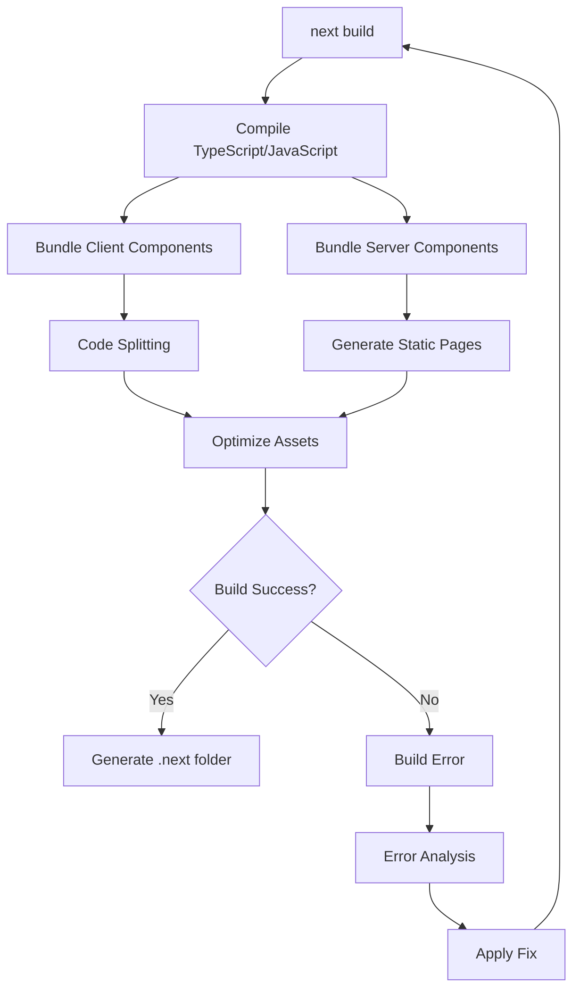
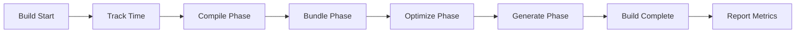

# How to Fix 'Build Optimization' Errors in Next.js

Author: [nawazdhandala](https://www.github.com/nawazdhandala)

Tags: Next.js, Build Optimization, Performance, Webpack, Production, Deployment, Troubleshooting

Description: A practical guide to diagnosing and resolving build optimization errors in Next.js applications for successful production deployments.

---

Build optimization errors in Next.js can be frustrating, often appearing unexpectedly during production builds. These errors range from memory issues to module resolution failures. This guide covers the most common build optimization errors and their solutions.

## Understanding the Next.js Build Process



## Common Error 1: JavaScript Heap Out of Memory

```bash
# Error message
FATAL ERROR: Ineffective mark-compacts near heap limit Allocation failed - JavaScript heap out of memory
```

### Solution: Increase Node.js Memory Limit

```json
// package.json
{
  "scripts": {
    "build": "NODE_OPTIONS='--max-old-space-size=4096' next build",
    "build:large": "NODE_OPTIONS='--max-old-space-size=8192' next build"
  }
}
```

For Windows:

```json
// package.json
{
  "scripts": {
    "build": "set NODE_OPTIONS=--max-old-space-size=4096 && next build"
  }
}
```

Cross-platform solution:

```bash
# Install cross-env
npm install --save-dev cross-env
```

```json
// package.json
{
  "scripts": {
    "build": "cross-env NODE_OPTIONS='--max-old-space-size=4096' next build"
  }
}
```

## Common Error 2: Module Not Found During Build

```bash
# Error message
Module not found: Can't resolve 'some-module'
  at ./components/SomeComponent.js
```

### Solution: Check Import Paths and Dependencies

```javascript
// next.config.js
/** @type {import('next').NextConfig} */
const nextConfig = {
  // Add webpack configuration for module resolution
  webpack: (config, { isServer }) => {
    // Add aliases for common paths
    config.resolve.alias = {
      ...config.resolve.alias,
      '@components': './components',
      '@lib': './lib',
      '@utils': './utils',
    };

    // Handle specific module resolution issues
    config.resolve.fallback = {
      ...config.resolve.fallback,
      fs: false,
      net: false,
      tls: false,
    };

    return config;
  },
};

module.exports = nextConfig;
```

For path aliases, configure tsconfig.json or jsconfig.json:

```json
// tsconfig.json or jsconfig.json
{
  "compilerOptions": {
    "baseUrl": ".",
    "paths": {
      "@/*": ["./*"],
      "@components/*": ["components/*"],
      "@lib/*": ["lib/*"],
      "@utils/*": ["utils/*"]
    }
  }
}
```

## Common Error 3: Build Size Too Large

```bash
# Warning message
Warning: First Load JS shared by all pages exceeds 100 kB
```

### Solution: Analyze and Reduce Bundle Size

```bash
# Install bundle analyzer
npm install --save-dev @next/bundle-analyzer
```

```javascript
// next.config.js
const withBundleAnalyzer = require('@next/bundle-analyzer')({
  enabled: process.env.ANALYZE === 'true',
});

/** @type {import('next').NextConfig} */
const nextConfig = {
  // Your existing config
};

module.exports = withBundleAnalyzer(nextConfig);
```

```json
// package.json
{
  "scripts": {
    "analyze": "ANALYZE=true next build"
  }
}
```

### Implement Dynamic Imports

```jsx
// Before: Static import (included in initial bundle)
import HeavyComponent from './HeavyComponent';

// After: Dynamic import (loaded on demand)
import dynamic from 'next/dynamic';

const HeavyComponent = dynamic(() => import('./HeavyComponent'), {
  loading: () => <p>Loading...</p>,
  ssr: false,  // Disable SSR if not needed
});
```

### Tree Shaking Optimization

```javascript
// Bad: Imports entire library
import _ from 'lodash';
const result = _.map(array, fn);

// Good: Import only what you need
import map from 'lodash/map';
const result = map(array, fn);

// Or use lodash-es for better tree shaking
import { map } from 'lodash-es';
```

## Common Error 4: Static Generation Failure

```bash
# Error message
Error: Error occurred prerendering page "/some-page"
```

### Solution: Handle Dynamic Data Properly

```javascript
// pages/posts/[id].js (Pages Router)
export async function getStaticPaths() {
  // Fetch only the IDs you want to pre-render
  const posts = await fetch('https://api.example.com/posts?limit=100');
  const data = await posts.json();

  const paths = data.map((post) => ({
    params: { id: String(post.id) },
  }));

  return {
    paths,
    // Enable fallback for pages not generated at build time
    fallback: 'blocking',  // or true, or false
  };
}

export async function getStaticProps({ params }) {
  try {
    const res = await fetch(`https://api.example.com/posts/${params.id}`);

    if (!res.ok) {
      return { notFound: true };
    }

    const post = await res.json();

    return {
      props: { post },
      revalidate: 60,  // Revalidate every 60 seconds
    };
  } catch (error) {
    return { notFound: true };
  }
}
```

```javascript
// app/posts/[id]/page.js (App Router)
export async function generateStaticParams() {
  const posts = await fetch('https://api.example.com/posts?limit=100');
  const data = await posts.json();

  return data.map((post) => ({
    id: String(post.id),
  }));
}

// Enable dynamic params for non-generated paths
export const dynamicParams = true;

export default async function PostPage({ params }) {
  const { id } = await params;
  const post = await fetch(`https://api.example.com/posts/${id}`);

  if (!post.ok) {
    notFound();
  }

  const data = await post.json();
  return <PostContent post={data} />;
}
```

## Common Error 5: TypeScript Build Errors

```bash
# Error message
Type error: Property 'x' does not exist on type 'y'
```

### Solution: Fix Type Definitions

```javascript
// next.config.js
/** @type {import('next').NextConfig} */
const nextConfig = {
  // Option 1: Ignore TypeScript errors during build (not recommended)
  typescript: {
    ignoreBuildErrors: false,  // Set to true only for debugging
  },

  // Option 2: Use strict mode incrementally
  // Configure in tsconfig.json instead
};

module.exports = nextConfig;
```

```json
// tsconfig.json
{
  "compilerOptions": {
    "strict": true,
    "noImplicitAny": true,
    "strictNullChecks": true,
    // Add custom type roots
    "typeRoots": ["./types", "./node_modules/@types"],
    // Skip checking node_modules
    "skipLibCheck": true
  },
  "include": ["next-env.d.ts", "**/*.ts", "**/*.tsx"],
  "exclude": ["node_modules"]
}
```

Create custom type definitions:

```typescript
// types/custom.d.ts
declare module 'some-untyped-module' {
  export function someFunction(param: string): void;
  export const someConstant: number;
}

// Extend existing types
declare module 'next' {
  interface NextConfig {
    customOption?: boolean;
  }
}
```

## Common Error 6: Image Optimization Errors

```bash
# Error message
Error: Invalid src prop on next/image
```

### Solution: Configure Image Domains

```javascript
// next.config.js
/** @type {import('next').NextConfig} */
const nextConfig = {
  images: {
    // Configure remote image domains
    remotePatterns: [
      {
        protocol: 'https',
        hostname: 'images.example.com',
        port: '',
        pathname: '/uploads/**',
      },
      {
        protocol: 'https',
        hostname: '*.amazonaws.com',
      },
    ],

    // Or use domains for simpler configuration
    domains: ['images.example.com', 'cdn.example.com'],

    // Configure image sizes
    deviceSizes: [640, 750, 828, 1080, 1200, 1920, 2048, 3840],
    imageSizes: [16, 32, 48, 64, 96, 128, 256, 384],

    // Disable optimization for specific cases
    unoptimized: false,  // Set to true to disable all optimization
  },
};

module.exports = nextConfig;
```

For local images with issues:

```jsx
// Use unoptimized for problematic images
import Image from 'next/image';

export default function ProblematicImage() {
  return (
    <Image
      src="/problematic-image.png"
      width={500}
      height={300}
      alt="Description"
      unoptimized  // Skip optimization for this image
    />
  );
}
```

## Common Error 7: ESLint Build Failures

```bash
# Error message
Failed to compile.
ESLint: error
```

### Solution: Configure ESLint for Next.js

```javascript
// .eslintrc.js
module.exports = {
  extends: [
    'next/core-web-vitals',  // Strict rules
    // Or use 'next' for less strict rules
  ],
  rules: {
    // Customize rules as needed
    'react/no-unescaped-entities': 'off',
    '@next/next/no-img-element': 'warn',
  },
  // Ignore specific files
  ignorePatterns: [
    'node_modules/',
    '.next/',
    'out/',
    'public/',
  ],
};
```

```javascript
// next.config.js
/** @type {import('next').NextConfig} */
const nextConfig = {
  eslint: {
    // Only run ESLint on specific directories
    dirs: ['pages', 'components', 'lib', 'app'],

    // Ignore ESLint during builds (not recommended)
    ignoreDuringBuilds: false,  // Set to true only for debugging
  },
};

module.exports = nextConfig;
```

## Common Error 8: CSS/PostCSS Build Errors

```bash
# Error message
Error: PostCSS plugin ... requires PostCSS 8
```

### Solution: Fix PostCSS Configuration

```javascript
// postcss.config.js
module.exports = {
  plugins: {
    tailwindcss: {},
    autoprefixer: {},
    // Add other plugins as needed
  },
};
```

If using older plugins:

```bash
# Install PostCSS compatibility version
npm install postcss@latest autoprefixer@latest
```

## Common Error 9: Environment Variable Issues

```bash
# Error message
Error: Environment variable NEXT_PUBLIC_API_URL is missing
```

### Solution: Proper Environment Variable Setup

```javascript
// lib/env.js
// Validate environment variables at build time
function getEnvVar(key, required = true) {
  const value = process.env[key];

  if (required && !value) {
    throw new Error(`Environment variable ${key} is required but not set`);
  }

  return value;
}

export const config = {
  apiUrl: getEnvVar('NEXT_PUBLIC_API_URL'),
  apiKey: getEnvVar('API_KEY'),  // Server-only
  nodeEnv: process.env.NODE_ENV,
};
```

```javascript
// next.config.js
/** @type {import('next').NextConfig} */
const nextConfig = {
  // Expose environment variables
  env: {
    CUSTOM_VAR: process.env.CUSTOM_VAR,
  },

  // For runtime configuration
  publicRuntimeConfig: {
    apiUrl: process.env.NEXT_PUBLIC_API_URL,
  },
  serverRuntimeConfig: {
    apiKey: process.env.API_KEY,
  },
};

module.exports = nextConfig;
```

## Common Error 10: Webpack 5 Compatibility Issues

```bash
# Error message
Error: Cannot find module 'webpack/lib/...'
```

### Solution: Configure Webpack 5 Polyfills

```javascript
// next.config.js
/** @type {import('next').NextConfig} */
const nextConfig = {
  webpack: (config, { isServer }) => {
    if (!isServer) {
      // Client-side polyfills for Node.js core modules
      config.resolve.fallback = {
        ...config.resolve.fallback,
        crypto: require.resolve('crypto-browserify'),
        stream: require.resolve('stream-browserify'),
        buffer: require.resolve('buffer'),
        util: require.resolve('util'),
        process: require.resolve('process/browser'),
      };

      // Provide globals
      const webpack = require('webpack');
      config.plugins.push(
        new webpack.ProvidePlugin({
          Buffer: ['buffer', 'Buffer'],
          process: 'process/browser',
        })
      );
    }

    return config;
  },
};

module.exports = nextConfig;
```

Install required polyfills:

```bash
npm install crypto-browserify stream-browserify buffer util process
```

## Build Optimization Configuration

```javascript
// next.config.js
/** @type {import('next').NextConfig} */
const nextConfig = {
  // Enable React strict mode
  reactStrictMode: true,

  // Configure output
  output: 'standalone',  // For Docker deployments

  // Compression
  compress: true,

  // Power state
  poweredByHeader: false,

  // Generate ETags
  generateEtags: true,

  // Production source maps (disable for smaller builds)
  productionBrowserSourceMaps: false,

  // Experimental features
  experimental: {
    // Enable optimized package imports
    optimizePackageImports: ['lodash', 'date-fns', '@mui/material'],
  },

  // Configure compiler
  compiler: {
    // Remove console.log in production
    removeConsole: process.env.NODE_ENV === 'production',
  },

  // Module transpilation for specific packages
  transpilePackages: ['some-esm-package'],
};

module.exports = nextConfig;
```

## Build Performance Monitoring



```javascript
// scripts/build-with-metrics.js
const { execSync } = require('child_process');

function formatBytes(bytes) {
  if (bytes === 0) return '0 Bytes';
  const k = 1024;
  const sizes = ['Bytes', 'KB', 'MB', 'GB'];
  const i = Math.floor(Math.log(bytes) / Math.log(k));
  return parseFloat((bytes / Math.pow(k, i)).toFixed(2)) + ' ' + sizes[i];
}

function formatDuration(ms) {
  const seconds = Math.floor(ms / 1000);
  const minutes = Math.floor(seconds / 60);
  const remainingSeconds = seconds % 60;
  return minutes > 0
    ? `${minutes}m ${remainingSeconds}s`
    : `${seconds}s`;
}

async function buildWithMetrics() {
  console.log('Starting build...\n');
  const startTime = Date.now();

  try {
    execSync('next build', { stdio: 'inherit' });

    const endTime = Date.now();
    const duration = endTime - startTime;

    // Get build output size
    const fs = require('fs');
    const path = require('path');

    function getDirSize(dirPath) {
      let size = 0;
      const files = fs.readdirSync(dirPath);

      for (const file of files) {
        const filePath = path.join(dirPath, file);
        const stat = fs.statSync(filePath);

        if (stat.isDirectory()) {
          size += getDirSize(filePath);
        } else {
          size += stat.size;
        }
      }

      return size;
    }

    const buildSize = getDirSize('.next');

    console.log('\n--- Build Metrics ---');
    console.log(`Duration: ${formatDuration(duration)}`);
    console.log(`Build Size: ${formatBytes(buildSize)}`);
    console.log('-------------------\n');

  } catch (error) {
    console.error('Build failed:', error.message);
    process.exit(1);
  }
}

buildWithMetrics();
```

## Debugging Build Issues

```bash
# Enable verbose logging
NEXT_DEBUG=true next build

# Check for duplicate packages
npm ls react
npm ls react-dom

# Clear build cache
rm -rf .next
rm -rf node_modules/.cache

# Reinstall dependencies
rm -rf node_modules
rm package-lock.json
npm install

# Build with specific Node version
nvm use 18
next build
```

## CI/CD Build Configuration

```yaml
# .github/workflows/build.yml
name: Build

on: [push, pull_request]

jobs:
  build:
    runs-on: ubuntu-latest

    steps:
      - uses: actions/checkout@v4

      - name: Setup Node.js
        uses: actions/setup-node@v4
        with:
          node-version: '20'
          cache: 'npm'

      - name: Install dependencies
        run: npm ci

      - name: Build
        run: npm run build
        env:
          NODE_OPTIONS: '--max-old-space-size=4096'
          NEXT_PUBLIC_API_URL: ${{ secrets.NEXT_PUBLIC_API_URL }}

      - name: Upload build artifacts
        uses: actions/upload-artifact@v4
        with:
          name: build
          path: .next
```

## Summary

Build optimization errors in Next.js can be resolved through systematic debugging:

1. **Memory issues** - Increase Node.js heap size
2. **Module resolution** - Configure webpack aliases and fallbacks
3. **Bundle size** - Use dynamic imports and tree shaking
4. **Static generation** - Handle fallbacks and error states properly
5. **TypeScript errors** - Fix types or configure strict mode incrementally
6. **Image optimization** - Configure remote patterns and domains
7. **ESLint failures** - Customize rules for your project
8. **PostCSS issues** - Update plugins to PostCSS 8 compatible versions
9. **Environment variables** - Validate and expose variables correctly
10. **Webpack 5 compatibility** - Add necessary polyfills

By understanding the build process and applying these solutions, you can resolve most build optimization errors and achieve successful production deployments.
