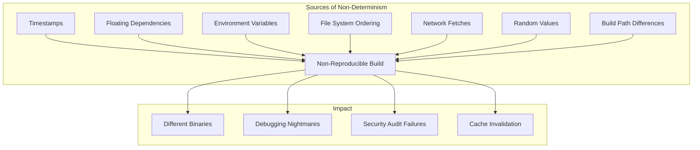
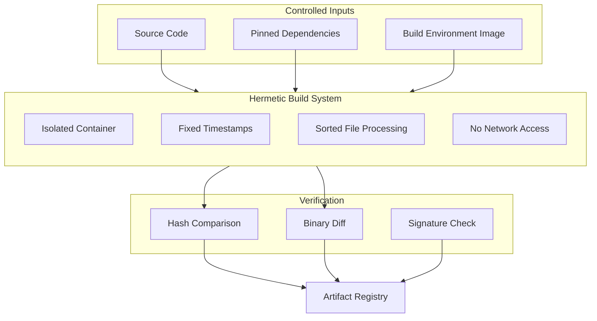

# How to Fix "Build Reproducibility" Issues

Author: [nawazdhandala](https://www.github.com/nawazdhandala)

Tags: DevOps, CI/CD, Build Systems, Docker, Reproducibility, Nix, Bazel

Description: A practical guide to achieving reproducible builds that produce identical outputs regardless of when or where they run.

---

You run the same build twice and get different results. The CI passes but production breaks. A colleague builds the same code and gets a completely different binary. These are symptoms of build reproducibility issues, and they can turn debugging into a nightmare.

Build reproducibility means that given the same source code and build instructions, you always get the same output. This sounds simple, but modern software has countless sources of non-determinism that can creep into your builds.

## Understanding Why Builds Become Non-Reproducible

Before fixing the problem, you need to understand what causes it.



## Pinning Dependencies Exactly

Floating version ranges are the most common source of non-reproducibility. A dependency update between builds can change your output completely.

### Node.js with npm

```json
{
  "name": "my-app",
  "dependencies": {
    "express": "4.18.2",
    "lodash": "4.17.21"
  }
}
```

Always use exact versions and commit your lockfile:

```bash
# Generate package-lock.json with exact versions
npm ci

# Never use npm install in CI - it can update the lockfile
# npm ci installs exactly what's in package-lock.json
```

### Python with pip

```bash
# Generate pinned requirements with hashes for verification
pip-compile --generate-hashes requirements.in -o requirements.txt

# Install with hash verification
pip install --require-hashes -r requirements.txt
```

The requirements.txt with hashes looks like this:

```txt
# requirements.txt - fully pinned with hashes
flask==2.3.3 \
    --hash=sha256:f69fcd559dc907ed196ab9df0e48471709175e696d6e698dd4dbe940f96ce66b
werkzeug==2.3.7 \
    --hash=sha256:effc12dba7f3bd72e605ce49807bbe692bd729c3bb122a3b91747a6ae77df528
```

### Go Modules

Go modules are reproducible by default when you commit go.sum:

```bash
# Verify module checksums match go.sum
go mod verify

# Download dependencies (uses go.sum for verification)
go mod download
```

## Eliminating Timestamps from Builds

Timestamps embedded in build outputs cause different hashes even with identical source code.

### Docker Images

```dockerfile
# Dockerfile with reproducible builds
FROM golang:1.21-alpine AS builder

# Set consistent timestamp for all files
ARG SOURCE_DATE_EPOCH=0

WORKDIR /app
COPY go.mod go.sum ./
RUN go mod download

COPY . .

# Build with embedded timestamp disabled
RUN CGO_ENABLED=0 go build \
    -ldflags="-buildid= -X main.version=${VERSION}" \
    -trimpath \
    -o /app/server .

FROM scratch
COPY --from=builder /app/server /server
ENTRYPOINT ["/server"]
```

Build with BuildKit for better reproducibility:

```bash
# Enable BuildKit and set source date epoch
export DOCKER_BUILDKIT=1
export SOURCE_DATE_EPOCH=$(git log -1 --format=%ct)

docker build \
    --build-arg SOURCE_DATE_EPOCH=$SOURCE_DATE_EPOCH \
    -t myapp:$(git rev-parse --short HEAD) .
```

### Removing Timestamps from Archives

```bash
# Create reproducible tar archives
find . -type f -print0 | \
    LC_ALL=C sort -z | \
    tar --mtime='1970-01-01' \
        --owner=0 --group=0 \
        --numeric-owner \
        --no-recursion \
        --null -T - \
        -cvf archive.tar
```

## Using Hermetic Build Systems

Hermetic builds isolate the build environment from the host system entirely.

### Bazel for Hermetic Builds

```python
# WORKSPACE file - pin all external dependencies
load("@bazel_tools//tools/build_defs/repo:http.bzl", "http_archive")

http_archive(
    name = "rules_go",
    sha256 = "278b7ff5a826f3dc10f04feaf0b70d48b68748ccd512d7f98bf442077f043fe3",
    urls = [
        "https://mirror.bazel.build/github.com/bazelbuild/rules_go/releases/download/v0.41.0/rules_go-v0.41.0.zip",
        "https://github.com/bazelbuild/rules_go/releases/download/v0.41.0/rules_go-v0.41.0.zip",
    ],
)
```

```python
# BUILD file - define reproducible build targets
load("@rules_go//go:def.bzl", "go_binary", "go_library")

go_binary(
    name = "server",
    embed = [":server_lib"],
    # Disable stamping for reproducibility
    stamp = 0,
    visibility = ["//visibility:public"],
)

go_library(
    name = "server_lib",
    srcs = ["main.go"],
    importpath = "github.com/example/server",
    deps = [
        "@com_github_gin_gonic_gin//:gin",
    ],
)
```

### Nix for Pure Builds

Nix provides fully reproducible builds through pure functions:

```nix
# default.nix - reproducible build definition
{ pkgs ? import (fetchTarball {
    url = "https://github.com/NixOS/nixpkgs/archive/nixos-23.11.tar.gz";
    sha256 = "1234567890abcdef...";
  }) {}
}:

pkgs.buildGoModule rec {
  pname = "myapp";
  version = "1.0.0";

  src = ./.;

  vendorHash = "sha256-AAAAAAAAAAAAAAAAAAAAAAAAAAAAAAAAAAAAAAAAAAA=";

  # Disable features that break reproducibility
  CGO_ENABLED = 0;

  ldflags = [
    "-s" "-w"
    "-X main.version=${version}"
  ];

  # Fixed output derivation
  outputHashMode = "recursive";
}
```

## Containerized Build Environments

Use containers to ensure consistent build environments across machines.

```yaml
# .github/workflows/build.yml
name: Reproducible Build

on: [push, pull_request]

jobs:
  build:
    runs-on: ubuntu-latest
    container:
      # Pin to specific digest, not tag
      image: golang@sha256:a0b1c2d3e4f5...

    steps:
      - uses: actions/checkout@v4

      - name: Set reproducible timestamp
        run: echo "SOURCE_DATE_EPOCH=$(git log -1 --format=%ct)" >> $GITHUB_ENV

      - name: Build
        run: |
          go build \
            -trimpath \
            -ldflags="-buildid=" \
            -o myapp .

      - name: Verify reproducibility
        run: |
          # Build again and compare
          go build -trimpath -ldflags="-buildid=" -o myapp2 .
          sha256sum myapp myapp2
          diff myapp myapp2
```

## Handling File System Non-Determinism

File system ordering can affect builds when processing multiple files.

```go
// Sort files before processing to ensure consistent order
package main

import (
    "os"
    "path/filepath"
    "sort"
)

func processFiles(dir string) error {
    var files []string

    err := filepath.Walk(dir, func(path string, info os.FileInfo, err error) error {
        if err != nil {
            return err
        }
        if !info.IsDir() {
            files = append(files, path)
        }
        return nil
    })
    if err != nil {
        return err
    }

    // Sort for deterministic processing order
    sort.Strings(files)

    for _, f := range files {
        // Process files in sorted order
        processFile(f)
    }

    return nil
}
```

## Verifying Build Reproducibility

Create a verification workflow that builds twice and compares outputs:

```bash
#!/bin/bash
# verify-reproducibility.sh

set -euo pipefail

WORKDIR=$(mktemp -d)
trap "rm -rf $WORKDIR" EXIT

echo "Building first artifact..."
./build.sh
cp -r dist/ "$WORKDIR/build1/"

echo "Cleaning build environment..."
./clean.sh

echo "Building second artifact..."
./build.sh
cp -r dist/ "$WORKDIR/build2/"

echo "Comparing builds..."
if diff -r "$WORKDIR/build1" "$WORKDIR/build2"; then
    echo "SUCCESS: Builds are reproducible"
    exit 0
else
    echo "FAILURE: Builds differ"
    echo "Differences:"
    diff -r "$WORKDIR/build1" "$WORKDIR/build2" || true
    exit 1
fi
```

## Build Reproducibility Architecture

Here is a diagram showing how all these components work together:



## Best Practices Checklist

When implementing reproducible builds, follow these guidelines:

1. Pin all dependencies with exact versions and checksums
2. Commit lockfiles to version control
3. Use container images referenced by digest, not tag
4. Set SOURCE_DATE_EPOCH for consistent timestamps
5. Use hermetic build tools like Bazel or Nix when possible
6. Sort file lists before processing
7. Disable build IDs and use -trimpath in Go
8. Verify reproducibility in CI by building twice
9. Document your reproducibility requirements
10. Monitor for dependency updates that could affect builds

---

Reproducible builds are not just about consistency. They are essential for security audits, debugging production issues, and building trust in your software supply chain. Start with dependency pinning, then progressively eliminate other sources of non-determinism. Your future self debugging a production incident will thank you.
