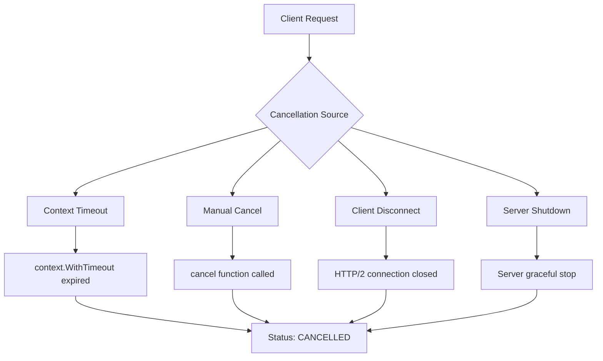
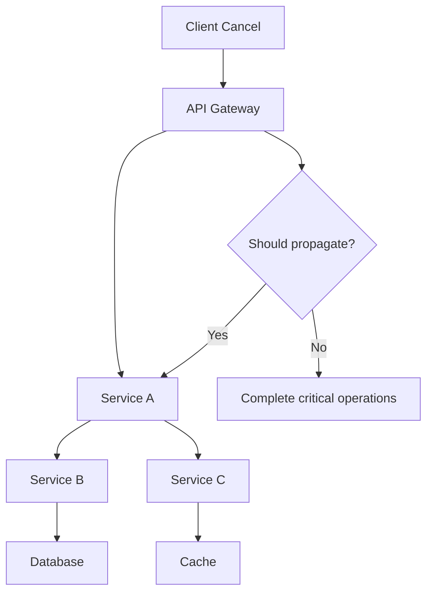

# How to Fix 'Canceled' Request Errors in gRPC

Author: [nawazdhandala](https://www.github.com/nawazdhandala)

Tags: gRPC, Debugging, Error Handling, Timeouts, Context Cancellation

Description: Learn how to diagnose and resolve gRPC canceled request errors caused by context cancellation, timeouts, and client disconnections.

---

The "Canceled" status code in gRPC indicates that an operation was terminated before completion. This error appears in various scenarios including client timeouts, context cancellation, and connection issues. Understanding the root cause is essential for building reliable gRPC services. This guide covers common causes and solutions for canceled request errors.

## Understanding gRPC Cancellation

Cancellation in gRPC propagates through the entire call chain, from client to server.



## 1. Common Causes of Cancellation

### Context Timeout Expiration

The most common cause of cancellation errors.

```go
// client_timeout.go
package main

import (
    "context"
    "log"
    "time"

    "google.golang.org/grpc"
    "google.golang.org/grpc/codes"
    "google.golang.org/grpc/credentials/insecure"
    "google.golang.org/grpc/status"

    pb "myapp/proto"
)

func main() {
    conn, err := grpc.Dial(
        "localhost:50051",
        grpc.WithTransportCredentials(insecure.NewCredentials()),
    )
    if err != nil {
        log.Fatalf("Failed to connect: %v", err)
    }
    defer conn.Close()

    client := pb.NewUserServiceClient(conn)

    // Problem: Timeout too short for the operation
    ctx, cancel := context.WithTimeout(context.Background(), 100*time.Millisecond)
    defer cancel()

    // This will fail with CANCELLED if the server takes > 100ms
    resp, err := client.GetUser(ctx, &pb.GetUserRequest{UserId: "123"})
    if err != nil {
        st, ok := status.FromError(err)
        if ok {
            switch st.Code() {
            case codes.Canceled:
                log.Printf("Request was canceled: %v", st.Message())
                // This could be client timeout or manual cancellation
            case codes.DeadlineExceeded:
                log.Printf("Request deadline exceeded: %v", st.Message())
                // The deadline was reached before cancellation
            default:
                log.Printf("RPC failed: %v", st.Message())
            }
        }
        return
    }

    log.Printf("User: %v", resp)
}
```

### Distinguishing Canceled vs DeadlineExceeded

```go
// error_handling.go
package main

import (
    "context"
    "errors"
    "log"

    "google.golang.org/grpc/codes"
    "google.golang.org/grpc/status"
)

// HandleGRPCError properly handles cancellation-related errors
func HandleGRPCError(err error) {
    if err == nil {
        return
    }

    // Check for context errors first
    if errors.Is(err, context.Canceled) {
        log.Println("Context was canceled by the caller")
        return
    }

    if errors.Is(err, context.DeadlineExceeded) {
        log.Println("Context deadline exceeded")
        return
    }

    // Check gRPC status
    st, ok := status.FromError(err)
    if !ok {
        log.Printf("Non-gRPC error: %v", err)
        return
    }

    switch st.Code() {
    case codes.Canceled:
        // Request was explicitly canceled
        // This happens when:
        // 1. Client calls cancel()
        // 2. Client connection is closed
        // 3. Parent context was canceled
        log.Printf("gRPC Canceled: %s", st.Message())

    case codes.DeadlineExceeded:
        // The deadline expired before the operation completed
        // This happens when:
        // 1. context.WithTimeout deadline passed
        // 2. context.WithDeadline deadline passed
        log.Printf("gRPC DeadlineExceeded: %s", st.Message())

    default:
        log.Printf("gRPC error [%s]: %s", st.Code(), st.Message())
    }
}
```

## 2. Fixing Client-Side Timeout Issues

### Setting Appropriate Timeouts

```go
// appropriate_timeouts.go
package main

import (
    "context"
    "log"
    "time"

    "google.golang.org/grpc"
    "google.golang.org/grpc/credentials/insecure"

    pb "myapp/proto"
)

// TimeoutConfig holds timeout settings for different operation types
type TimeoutConfig struct {
    // Fast operations (cache lookups, simple queries)
    Fast time.Duration
    // Medium operations (database queries, simple processing)
    Medium time.Duration
    // Slow operations (complex queries, file operations)
    Slow time.Duration
    // Background operations (batch processing, reports)
    Background time.Duration
}

// DefaultTimeouts returns sensible default timeouts
func DefaultTimeouts() TimeoutConfig {
    return TimeoutConfig{
        Fast:       500 * time.Millisecond,
        Medium:     5 * time.Second,
        Slow:       30 * time.Second,
        Background: 5 * time.Minute,
    }
}

// UserClient wraps the gRPC client with proper timeout handling
type UserClient struct {
    client   pb.UserServiceClient
    timeouts TimeoutConfig
}

// NewUserClient creates a new user client
func NewUserClient(conn *grpc.ClientConn, timeouts TimeoutConfig) *UserClient {
    return &UserClient{
        client:   pb.NewUserServiceClient(conn),
        timeouts: timeouts,
    }
}

// GetUser retrieves a user with appropriate timeout
func (c *UserClient) GetUser(ctx context.Context, userID string) (*pb.User, error) {
    // Use medium timeout for database lookups
    ctx, cancel := context.WithTimeout(ctx, c.timeouts.Medium)
    defer cancel()

    return c.client.GetUser(ctx, &pb.GetUserRequest{UserId: userID})
}

// ListUsers retrieves multiple users with longer timeout
func (c *UserClient) ListUsers(ctx context.Context, pageSize int) ([]*pb.User, error) {
    // Use slow timeout for list operations
    ctx, cancel := context.WithTimeout(ctx, c.timeouts.Slow)
    defer cancel()

    resp, err := c.client.ListUsers(ctx, &pb.ListUsersRequest{PageSize: int32(pageSize)})
    if err != nil {
        return nil, err
    }
    return resp.Users, nil
}

// CreateUsersBatch creates multiple users with background timeout
func (c *UserClient) CreateUsersBatch(ctx context.Context, users []*pb.User) error {
    // Use background timeout for batch operations
    ctx, cancel := context.WithTimeout(ctx, c.timeouts.Background)
    defer cancel()

    stream, err := c.client.CreateUsersBatch(ctx)
    if err != nil {
        return err
    }

    for _, user := range users {
        if err := stream.Send(&pb.CreateUserRequest{User: user}); err != nil {
            return err
        }
    }

    _, err = stream.CloseAndRecv()
    return err
}

func main() {
    conn, err := grpc.Dial(
        "localhost:50051",
        grpc.WithTransportCredentials(insecure.NewCredentials()),
    )
    if err != nil {
        log.Fatalf("Failed to connect: %v", err)
    }
    defer conn.Close()

    client := NewUserClient(conn, DefaultTimeouts())

    ctx := context.Background()
    user, err := client.GetUser(ctx, "123")
    if err != nil {
        log.Printf("Error: %v", err)
        return
    }
    log.Printf("User: %v", user)
}
```

### Implementing Retry with Backoff

```go
// retry_with_backoff.go
package main

import (
    "context"
    "log"
    "math/rand"
    "time"

    "google.golang.org/grpc"
    "google.golang.org/grpc/codes"
    "google.golang.org/grpc/credentials/insecure"
    "google.golang.org/grpc/status"

    pb "myapp/proto"
)

// RetryConfig configures retry behavior
type RetryConfig struct {
    MaxAttempts     int
    InitialBackoff  time.Duration
    MaxBackoff      time.Duration
    BackoffMultiplier float64
    RetryableCodes  []codes.Code
}

// DefaultRetryConfig returns default retry settings
func DefaultRetryConfig() RetryConfig {
    return RetryConfig{
        MaxAttempts:      3,
        InitialBackoff:   100 * time.Millisecond,
        MaxBackoff:       10 * time.Second,
        BackoffMultiplier: 2.0,
        RetryableCodes: []codes.Code{
            codes.Unavailable,
            codes.ResourceExhausted,
            codes.Aborted,
            // Note: Canceled and DeadlineExceeded are NOT retryable by default
            // because the context is already invalid
        },
    }
}

// isRetryable checks if an error should be retried
func (c RetryConfig) isRetryable(err error) bool {
    st, ok := status.FromError(err)
    if !ok {
        return false
    }

    for _, code := range c.RetryableCodes {
        if st.Code() == code {
            return true
        }
    }
    return false
}

// calculateBackoff returns the backoff duration for the given attempt
func (c RetryConfig) calculateBackoff(attempt int) time.Duration {
    backoff := float64(c.InitialBackoff)
    for i := 1; i < attempt; i++ {
        backoff *= c.BackoffMultiplier
    }

    if backoff > float64(c.MaxBackoff) {
        backoff = float64(c.MaxBackoff)
    }

    // Add jitter (plus or minus 10%)
    jitter := backoff * 0.1 * (rand.Float64()*2 - 1)
    return time.Duration(backoff + jitter)
}

// RetryingClient wraps a client with retry logic
type RetryingClient struct {
    client pb.UserServiceClient
    config RetryConfig
}

// GetUserWithRetry retrieves a user with automatic retry
func (c *RetryingClient) GetUserWithRetry(ctx context.Context, userID string) (*pb.User, error) {
    var lastErr error

    for attempt := 1; attempt <= c.config.MaxAttempts; attempt++ {
        // Create a fresh timeout for each attempt
        // Important: Use remaining time from parent context
        attemptCtx, cancel := context.WithTimeout(ctx, 5*time.Second)

        resp, err := c.client.GetUser(attemptCtx, &pb.GetUserRequest{UserId: userID})
        cancel() // Always cancel to release resources

        if err == nil {
            return resp, nil
        }

        lastErr = err

        // Check if we should retry
        if !c.config.isRetryable(err) {
            log.Printf("Non-retryable error: %v", err)
            return nil, err
        }

        // Check if parent context is still valid
        if ctx.Err() != nil {
            log.Printf("Parent context canceled, stopping retries")
            return nil, ctx.Err()
        }

        if attempt < c.config.MaxAttempts {
            backoff := c.config.calculateBackoff(attempt)
            log.Printf("Attempt %d failed, retrying in %v: %v", attempt, backoff, err)

            select {
            case <-time.After(backoff):
                // Continue to next attempt
            case <-ctx.Done():
                return nil, ctx.Err()
            }
        }
    }

    return nil, lastErr
}

func main() {
    conn, err := grpc.Dial(
        "localhost:50051",
        grpc.WithTransportCredentials(insecure.NewCredentials()),
    )
    if err != nil {
        log.Fatalf("Failed to connect: %v", err)
    }
    defer conn.Close()

    client := &RetryingClient{
        client: pb.NewUserServiceClient(conn),
        config: DefaultRetryConfig(),
    }

    // Use a longer overall timeout to allow for retries
    ctx, cancel := context.WithTimeout(context.Background(), 30*time.Second)
    defer cancel()

    user, err := client.GetUserWithRetry(ctx, "123")
    if err != nil {
        log.Printf("Failed after retries: %v", err)
        return
    }
    log.Printf("User: %v", user)
}
```

## 3. Server-Side Cancellation Handling

### Respecting Context Cancellation

```go
// server_cancellation.go
package main

import (
    "context"
    "database/sql"
    "log"
    "time"

    "google.golang.org/grpc/codes"
    "google.golang.org/grpc/status"

    pb "myapp/proto"
)

type userServer struct {
    pb.UnimplementedUserServiceServer
    db *sql.DB
}

// GetUser handles user retrieval with proper cancellation
func (s *userServer) GetUser(ctx context.Context, req *pb.GetUserRequest) (*pb.User, error) {
    // Check for cancellation before starting work
    if ctx.Err() != nil {
        return nil, status.Error(codes.Canceled, "request canceled before processing")
    }

    // Use context for database query (propagates cancellation)
    user, err := s.queryUser(ctx, req.UserId)
    if err != nil {
        // Check if the error was due to cancellation
        if ctx.Err() != nil {
            log.Printf("Request canceled during database query: %v", ctx.Err())
            return nil, status.Error(codes.Canceled, "request canceled")
        }
        return nil, status.Error(codes.Internal, "database error")
    }

    return user, nil
}

// queryUser queries the database with context
func (s *userServer) queryUser(ctx context.Context, userID string) (*pb.User, error) {
    // Use QueryRowContext to respect cancellation
    row := s.db.QueryRowContext(ctx, "SELECT id, name, email FROM users WHERE id = $1", userID)

    var user pb.User
    err := row.Scan(&user.Id, &user.Name, &user.Email)
    return &user, err
}

// ProcessBatch handles batch processing with periodic cancellation checks
func (s *userServer) ProcessBatch(ctx context.Context, req *pb.ProcessBatchRequest) (*pb.ProcessBatchResponse, error) {
    results := make([]*pb.ProcessResult, 0, len(req.Items))

    for i, item := range req.Items {
        // Check for cancellation periodically
        if i%100 == 0 {
            select {
            case <-ctx.Done():
                log.Printf("Batch processing canceled at item %d/%d", i, len(req.Items))
                return nil, status.Error(codes.Canceled, "batch processing canceled")
            default:
                // Continue processing
            }
        }

        result, err := s.processItem(ctx, item)
        if err != nil {
            if ctx.Err() != nil {
                return nil, status.Error(codes.Canceled, "processing canceled")
            }
            // Handle other errors
            results = append(results, &pb.ProcessResult{
                ItemId: item.Id,
                Error:  err.Error(),
            })
            continue
        }

        results = append(results, result)
    }

    return &pb.ProcessBatchResponse{Results: results}, nil
}

func (s *userServer) processItem(ctx context.Context, item *pb.BatchItem) (*pb.ProcessResult, error) {
    // Implement item processing with context
    return &pb.ProcessResult{ItemId: item.Id, Success: true}, nil
}
```

### Handling Streaming Cancellation

```go
// streaming_cancellation.go
package main

import (
    "context"
    "io"
    "log"

    "google.golang.org/grpc/codes"
    "google.golang.org/grpc/status"

    pb "myapp/proto"
)

type streamingServer struct {
    pb.UnimplementedStreamServiceServer
}

// ServerStream handles server-side streaming with cancellation
func (s *streamingServer) ServerStream(req *pb.StreamRequest, stream pb.StreamService_ServerStreamServer) error {
    ctx := stream.Context()

    for i := 0; i < int(req.Count); i++ {
        // Check for client disconnection
        select {
        case <-ctx.Done():
            log.Printf("Client disconnected during streaming: %v", ctx.Err())
            // Return the appropriate error based on context
            if ctx.Err() == context.Canceled {
                return status.Error(codes.Canceled, "client canceled the stream")
            }
            return status.Error(codes.DeadlineExceeded, "stream deadline exceeded")
        default:
            // Continue streaming
        }

        // Send data
        if err := stream.Send(&pb.StreamResponse{
            Index: int32(i),
            Data:  generateData(i),
        }); err != nil {
            // Check if send failed due to cancellation
            if ctx.Err() != nil {
                log.Printf("Stream send failed due to cancellation")
                return status.Error(codes.Canceled, "stream canceled")
            }
            return status.Error(codes.Internal, "failed to send")
        }
    }

    return nil
}

// ClientStream handles client-side streaming with cancellation
func (s *streamingServer) ClientStream(stream pb.StreamService_ClientStreamServer) error {
    ctx := stream.Context()
    var total int64

    for {
        // Check context before blocking on Recv
        select {
        case <-ctx.Done():
            log.Printf("Client stream context canceled: %v", ctx.Err())
            return status.Error(codes.Canceled, "stream canceled")
        default:
        }

        req, err := stream.Recv()
        if err == io.EOF {
            // Client finished sending
            return stream.SendAndClose(&pb.ClientStreamResponse{
                Total: total,
            })
        }
        if err != nil {
            // Check if error is due to cancellation
            if ctx.Err() != nil {
                return status.Error(codes.Canceled, "stream canceled during receive")
            }
            return status.Error(codes.Internal, "receive error")
        }

        total += int64(len(req.Data))
    }
}

// BidirectionalStream handles bidirectional streaming with cancellation
func (s *streamingServer) BidirectionalStream(stream pb.StreamService_BidirectionalStreamServer) error {
    ctx := stream.Context()

    // Create channel for receive errors
    recvChan := make(chan *pb.BidiRequest)
    errChan := make(chan error)

    // Start receive goroutine
    go func() {
        for {
            req, err := stream.Recv()
            if err != nil {
                errChan <- err
                return
            }
            recvChan <- req
        }
    }()

    for {
        select {
        case <-ctx.Done():
            log.Printf("Bidirectional stream canceled: %v", ctx.Err())
            return status.Error(codes.Canceled, "stream canceled")

        case err := <-errChan:
            if err == io.EOF {
                return nil
            }
            if ctx.Err() != nil {
                return status.Error(codes.Canceled, "stream canceled")
            }
            return status.Error(codes.Internal, err.Error())

        case req := <-recvChan:
            // Process and respond
            if err := stream.Send(&pb.BidiResponse{
                Result: processRequest(req),
            }); err != nil {
                if ctx.Err() != nil {
                    return status.Error(codes.Canceled, "stream canceled during send")
                }
                return status.Error(codes.Internal, "send error")
            }
        }
    }
}

func generateData(index int) []byte {
    return []byte("data")
}

func processRequest(req *pb.BidiRequest) string {
    return "processed"
}
```

## 4. Debugging Cancellation Issues

### Adding Logging and Tracing

```go
// debug_cancellation.go
package main

import (
    "context"
    "log"
    "time"

    "google.golang.org/grpc"
    "google.golang.org/grpc/codes"
    "google.golang.org/grpc/metadata"
    "google.golang.org/grpc/status"
)

// CancellationDebugInterceptor logs detailed cancellation information
func CancellationDebugInterceptor() grpc.UnaryServerInterceptor {
    return func(
        ctx context.Context,
        req interface{},
        info *grpc.UnaryServerInfo,
        handler grpc.UnaryHandler,
    ) (interface{}, error) {
        // Extract request ID from metadata
        requestID := "unknown"
        if md, ok := metadata.FromIncomingContext(ctx); ok {
            if ids := md.Get("x-request-id"); len(ids) > 0 {
                requestID = ids[0]
            }
        }

        // Get deadline information
        deadline, hasDeadline := ctx.Deadline()
        if hasDeadline {
            remaining := time.Until(deadline)
            log.Printf("[%s] Request started, deadline in %v", requestID, remaining)
        } else {
            log.Printf("[%s] Request started, no deadline set", requestID)
        }

        // Start timing
        start := time.Now()

        // Call the handler
        resp, err := handler(ctx, req)

        // Log completion details
        duration := time.Since(start)

        if err != nil {
            st, _ := status.FromError(err)

            switch st.Code() {
            case codes.Canceled:
                log.Printf("[%s] Request CANCELED after %v: %s",
                    requestID, duration, st.Message())
                // Log context error for more details
                if ctx.Err() != nil {
                    log.Printf("[%s] Context error: %v", requestID, ctx.Err())
                }

            case codes.DeadlineExceeded:
                log.Printf("[%s] Request DEADLINE EXCEEDED after %v: %s",
                    requestID, duration, st.Message())
                if hasDeadline {
                    log.Printf("[%s] Deadline was: %v, exceeded by: %v",
                        requestID, deadline, time.Since(deadline))
                }

            default:
                log.Printf("[%s] Request failed after %v with %s: %s",
                    requestID, duration, st.Code(), st.Message())
            }
        } else {
            log.Printf("[%s] Request completed successfully in %v", requestID, duration)
        }

        return resp, err
    }
}

// CancellationAwareContext wraps a context with cancellation tracking
type CancellationAwareContext struct {
    context.Context
    requestID string
    logger    *log.Logger
}

// WrapContext creates a cancellation-aware context
func WrapContext(ctx context.Context, requestID string) context.Context {
    wrapped := &CancellationAwareContext{
        Context:   ctx,
        requestID: requestID,
        logger:    log.Default(),
    }

    // Monitor for cancellation in background
    go func() {
        <-ctx.Done()
        wrapped.logger.Printf("[%s] Context canceled: %v", requestID, ctx.Err())
    }()

    return wrapped
}
```

### Client-Side Debugging

```go
// client_debug.go
package main

import (
    "context"
    "log"
    "time"

    "google.golang.org/grpc"
    "google.golang.org/grpc/codes"
    "google.golang.org/grpc/metadata"
    "google.golang.org/grpc/status"
)

// DebugClientInterceptor logs client-side cancellation details
func DebugClientInterceptor() grpc.UnaryClientInterceptor {
    return func(
        ctx context.Context,
        method string,
        req, reply interface{},
        cc *grpc.ClientConn,
        invoker grpc.UnaryInvoker,
        opts ...grpc.CallOption,
    ) error {
        // Log deadline information
        deadline, hasDeadline := ctx.Deadline()
        if hasDeadline {
            log.Printf("Calling %s with deadline in %v", method, time.Until(deadline))
        } else {
            log.Printf("Calling %s with no deadline", method)
        }

        start := time.Now()
        err := invoker(ctx, method, req, reply, cc, opts...)
        duration := time.Since(start)

        if err != nil {
            st, _ := status.FromError(err)

            if st.Code() == codes.Canceled || st.Code() == codes.DeadlineExceeded {
                log.Printf("Call to %s failed after %v", method, duration)
                log.Printf("  Error code: %s", st.Code())
                log.Printf("  Message: %s", st.Message())
                log.Printf("  Context error: %v", ctx.Err())

                if hasDeadline && time.Now().After(deadline) {
                    log.Printf("  Deadline exceeded by: %v", time.Since(deadline))
                }
            }
        }

        return err
    }
}

// TrackedContext provides detailed context tracking
type TrackedContext struct {
    context.Context
    createdAt   time.Time
    method      string
    cancelCount int
}

// NewTrackedContext creates a context with tracking
func NewTrackedContext(parent context.Context, method string, timeout time.Duration) (context.Context, context.CancelFunc) {
    ctx, cancel := context.WithTimeout(parent, timeout)

    tracked := &TrackedContext{
        Context:   ctx,
        createdAt: time.Now(),
        method:    method,
    }

    // Add tracking metadata
    md := metadata.Pairs(
        "x-request-start", tracked.createdAt.Format(time.RFC3339Nano),
        "x-timeout-ms", string(rune(timeout.Milliseconds())),
    )
    ctx = metadata.NewOutgoingContext(ctx, md)

    // Wrap cancel to track
    wrappedCancel := func() {
        tracked.cancelCount++
        log.Printf("Context for %s canceled after %v (cancel count: %d)",
            method, time.Since(tracked.createdAt), tracked.cancelCount)
        cancel()
    }

    return ctx, wrappedCancel
}
```

## 5. Preventing Unnecessary Cancellations

### Connection Management

```go
// connection_management.go
package main

import (
    "context"
    "log"
    "sync"
    "time"

    "google.golang.org/grpc"
    "google.golang.org/grpc/connectivity"
    "google.golang.org/grpc/credentials/insecure"
    "google.golang.org/grpc/keepalive"
)

// ConnectionManager manages gRPC connections with health checking
type ConnectionManager struct {
    conn *grpc.ClientConn
    mu   sync.RWMutex
}

// NewConnectionManager creates a new connection manager
func NewConnectionManager(target string) (*ConnectionManager, error) {
    conn, err := grpc.Dial(
        target,
        grpc.WithTransportCredentials(insecure.NewCredentials()),

        // Keep-alive settings to prevent idle disconnections
        grpc.WithKeepaliveParams(keepalive.ClientParameters{
            Time:                10 * time.Second, // Ping every 10s if idle
            Timeout:             5 * time.Second,  // Wait 5s for ping ack
            PermitWithoutStream: true,             // Ping even without active streams
        }),

        // Connection timeout
        grpc.WithConnectParams(grpc.ConnectParams{
            MinConnectTimeout: 5 * time.Second,
        }),

        // Automatic reconnection
        grpc.WithDefaultServiceConfig(`{
            "methodConfig": [{
                "name": [{"service": ""}],
                "waitForReady": true,
                "retryPolicy": {
                    "maxAttempts": 3,
                    "initialBackoff": "0.1s",
                    "maxBackoff": "1s",
                    "backoffMultiplier": 2,
                    "retryableStatusCodes": ["UNAVAILABLE"]
                }
            }]
        }`),
    )
    if err != nil {
        return nil, err
    }

    cm := &ConnectionManager{conn: conn}

    // Start connection monitoring
    go cm.monitorConnection()

    return cm, nil
}

// monitorConnection watches connection state
func (cm *ConnectionManager) monitorConnection() {
    for {
        state := cm.conn.GetState()
        log.Printf("Connection state: %v", state)

        if state == connectivity.TransientFailure {
            log.Println("Connection in transient failure, attempting reconnect")
            cm.conn.ResetConnectBackoff()
        }

        // Wait for state change
        cm.conn.WaitForStateChange(context.Background(), state)
    }
}

// GetConn returns the managed connection
func (cm *ConnectionManager) GetConn() *grpc.ClientConn {
    cm.mu.RLock()
    defer cm.mu.RUnlock()
    return cm.conn
}

// WaitForReady waits for the connection to be ready
func (cm *ConnectionManager) WaitForReady(ctx context.Context) error {
    for {
        state := cm.conn.GetState()
        if state == connectivity.Ready {
            return nil
        }

        if !cm.conn.WaitForStateChange(ctx, state) {
            return ctx.Err()
        }
    }
}

// Close closes the connection
func (cm *ConnectionManager) Close() error {
    cm.mu.Lock()
    defer cm.mu.Unlock()
    return cm.conn.Close()
}
```

### Request Deduplication

```go
// deduplication.go
package main

import (
    "context"
    "sync"
    "time"

    "google.golang.org/grpc"

    pb "myapp/proto"
)

// DeduplicatingClient prevents duplicate requests during retries
type DeduplicatingClient struct {
    client      pb.UserServiceClient
    inFlight    map[string]*inflightRequest
    mu          sync.Mutex
}

type inflightRequest struct {
    result chan *pb.User
    err    chan error
    ctx    context.Context
}

// NewDeduplicatingClient creates a new deduplicating client
func NewDeduplicatingClient(conn *grpc.ClientConn) *DeduplicatingClient {
    return &DeduplicatingClient{
        client:   pb.NewUserServiceClient(conn),
        inFlight: make(map[string]*inflightRequest),
    }
}

// GetUser retrieves a user, deduplicating concurrent requests
func (c *DeduplicatingClient) GetUser(ctx context.Context, userID string) (*pb.User, error) {
    c.mu.Lock()

    // Check if request is already in flight
    if req, exists := c.inFlight[userID]; exists {
        c.mu.Unlock()

        // Wait for existing request to complete
        select {
        case result := <-req.result:
            return result, nil
        case err := <-req.err:
            return nil, err
        case <-ctx.Done():
            return nil, ctx.Err()
        }
    }

    // Create new in-flight request
    req := &inflightRequest{
        result: make(chan *pb.User, 1),
        err:    make(chan error, 1),
        ctx:    ctx,
    }
    c.inFlight[userID] = req
    c.mu.Unlock()

    // Make the actual request
    go func() {
        defer func() {
            c.mu.Lock()
            delete(c.inFlight, userID)
            c.mu.Unlock()
        }()

        user, err := c.client.GetUser(ctx, &pb.GetUserRequest{UserId: userID})
        if err != nil {
            req.err <- err
        } else {
            req.result <- user
        }
    }()

    // Wait for result
    select {
    case result := <-req.result:
        return result, nil
    case err := <-req.err:
        return nil, err
    case <-ctx.Done():
        return nil, ctx.Err()
    }
}
```

## 6. Handling Cascading Cancellations

Prevent cancellation from propagating incorrectly in complex systems.



### Shielded Context for Critical Operations

```go
// shielded_context.go
package main

import (
    "context"
    "time"
)

// ShieldedContext creates a context that ignores parent cancellation
// Use sparingly for critical operations that must complete
func ShieldedContext(parent context.Context, timeout time.Duration) (context.Context, context.CancelFunc) {
    // Create new context with deadline but without cancel propagation
    ctx, cancel := context.WithTimeout(context.Background(), timeout)

    // Copy values from parent context
    return &shieldedContext{
        Context: ctx,
        parent:  parent,
    }, cancel
}

type shieldedContext struct {
    context.Context
    parent context.Context
}

// Value retrieves values from the parent context
func (s *shieldedContext) Value(key interface{}) interface{} {
    // Check local context first
    if v := s.Context.Value(key); v != nil {
        return v
    }
    // Fall back to parent for values like trace context
    return s.parent.Value(key)
}

// Example usage
func (s *service) ProcessOrder(ctx context.Context, order *Order) error {
    // Create shielded context for payment processing
    // Payment must complete even if client disconnects
    paymentCtx, cancel := ShieldedContext(ctx, 30*time.Second)
    defer cancel()

    // Process payment (will not be canceled if parent is canceled)
    if err := s.paymentService.Charge(paymentCtx, order.Amount); err != nil {
        return err
    }

    // Non-critical operations can use the original context
    // and will be canceled if client disconnects
    go s.sendConfirmationEmail(ctx, order)

    return nil
}

// DetachContext creates a completely independent context
// with values preserved but no deadline or cancellation
func DetachContext(parent context.Context) context.Context {
    return &detachedContext{parent: parent}
}

type detachedContext struct {
    parent context.Context
}

func (d *detachedContext) Deadline() (time.Time, bool) {
    return time.Time{}, false
}

func (d *detachedContext) Done() <-chan struct{} {
    return nil
}

func (d *detachedContext) Err() error {
    return nil
}

func (d *detachedContext) Value(key interface{}) interface{} {
    return d.parent.Value(key)
}
```

## 7. Monitoring Cancellation Rates

Track cancellation metrics for observability.

```go
// cancellation_metrics.go
package main

import (
    "context"

    "github.com/prometheus/client_golang/prometheus"
    "github.com/prometheus/client_golang/prometheus/promauto"
    "google.golang.org/grpc"
    "google.golang.org/grpc/codes"
    "google.golang.org/grpc/status"
)

var (
    requestsTotal = promauto.NewCounterVec(
        prometheus.CounterOpts{
            Name: "grpc_requests_total",
            Help: "Total number of gRPC requests",
        },
        []string{"method", "code"},
    )

    cancellationReasons = promauto.NewCounterVec(
        prometheus.CounterOpts{
            Name: "grpc_cancellations_total",
            Help: "Total number of gRPC cancellations by reason",
        },
        []string{"method", "reason"},
    )

    requestDuration = promauto.NewHistogramVec(
        prometheus.HistogramOpts{
            Name:    "grpc_request_duration_seconds",
            Help:    "Duration of gRPC requests",
            Buckets: []float64{.001, .005, .01, .025, .05, .1, .25, .5, 1, 2.5, 5, 10},
        },
        []string{"method", "code"},
    )
)

// MetricsInterceptor collects cancellation metrics
func MetricsInterceptor() grpc.UnaryServerInterceptor {
    return func(
        ctx context.Context,
        req interface{},
        info *grpc.UnaryServerInfo,
        handler grpc.UnaryHandler,
    ) (interface{}, error) {
        timer := prometheus.NewTimer(prometheus.ObserverFunc(func(v float64) {
            // Timer will be observed when we know the result code
        }))

        resp, err := handler(ctx, req)

        duration := timer.ObserveDuration()
        code := codes.OK

        if err != nil {
            st, _ := status.FromError(err)
            code = st.Code()

            // Track cancellation reasons
            if code == codes.Canceled {
                reason := "unknown"
                if ctx.Err() == context.Canceled {
                    reason = "context_canceled"
                } else if ctx.Err() == context.DeadlineExceeded {
                    reason = "deadline_exceeded"
                }
                cancellationReasons.WithLabelValues(info.FullMethod, reason).Inc()
            }
        }

        requestsTotal.WithLabelValues(info.FullMethod, code.String()).Inc()
        requestDuration.WithLabelValues(info.FullMethod, code.String()).Observe(duration.Seconds())

        return resp, err
    }
}
```

---

Understanding and properly handling gRPC cancellation errors is crucial for building reliable services. By setting appropriate timeouts, implementing retry logic, respecting context cancellation on the server, and monitoring cancellation rates, you can create resilient systems that handle failures gracefully while avoiding unnecessary resource waste.
