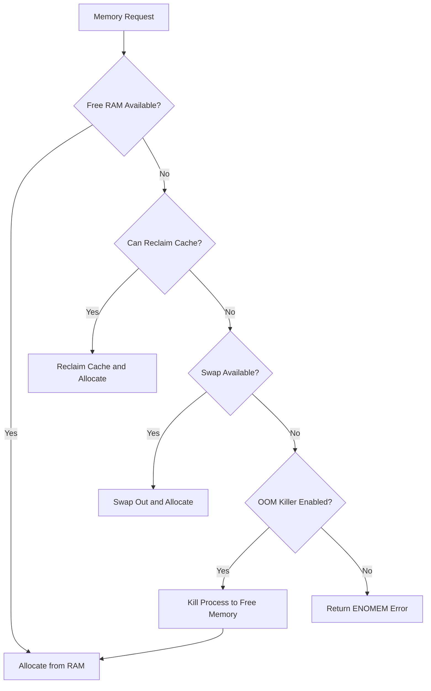
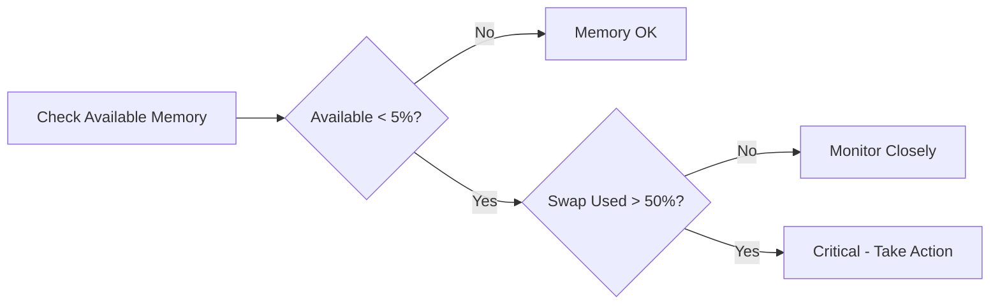

# How to Fix 'Cannot Allocate Memory' Errors in Linux

Author: [nawazdhandala](https://www.github.com/nawazdhandala)

Tags: Linux, System Administration, Memory Management, Troubleshooting, OOM Killer, Swap, Performance

Description: A practical guide to diagnosing and resolving memory allocation errors in Linux, including OOM killer issues, swap management, and memory optimization strategies.

---

"Cannot allocate memory" errors occur when the system cannot fulfill memory allocation requests. This guide helps you diagnose the root cause and implement effective solutions.

## Understanding Linux Memory Management



### Memory Types

| Type | Description | Reclaimable |
|------|-------------|-------------|
| Used | Active process memory | No (without killing) |
| Buffers | Filesystem metadata cache | Yes |
| Cache | Page cache for files | Yes |
| Available | Free + reclaimable cache | - |
| Swap | Disk-based virtual memory | - |

## Quick Diagnosis Commands

```bash
# Check memory usage overview
free -h

# Sample output:
#               total        used        free      shared  buff/cache   available
# Mem:           15Gi       12Gi       500Mi       200Mi       2.5Gi       2.0Gi
# Swap:          4.0Gi       3.5Gi       500Mi

# Detailed memory info
cat /proc/meminfo

# Check per-process memory usage
ps aux --sort=-%mem | head -20

# Check for OOM killer activity
dmesg | grep -i "out of memory"
journalctl -k | grep -i "oom"

# Check swap usage
swapon --show
```

## Interpreting Memory Status

### Reading `free -h` Output

```
              total        used        free      shared  buff/cache   available
Mem:           15Gi       12Gi       500Mi       200Mi       2.5Gi       2.0Gi
```

**Key metric**: `available` (not `free`)

- `free` = completely unused memory
- `available` = free + reclaimable cache/buffers
- `available` is what matters for new allocations

### When is Memory Actually Low?



## Common Causes and Solutions

### Cause 1: Memory Leak in Application

**Symptoms**: Memory usage grows continuously over time

```bash
# Monitor memory growth over time
watch -n 5 'ps aux --sort=-%mem | head -10'

# Check specific process memory over time
pidstat -r -p $(pgrep myapp) 1

# Get detailed memory map of process
pmap -x $(pgrep myapp)
cat /proc/$(pgrep myapp)/smaps | grep -E "^(Rss|Pss|Shared|Private)"
```

**Solutions**:

```bash
# Short-term: Restart the application
sudo systemctl restart myapp

# Set up automatic restart when memory exceeds threshold
# Using systemd:
# MemoryMax=1G in service file

# For Java applications - check heap settings
# Ensure -Xmx is set appropriately
java -Xmx512m -jar app.jar

# For Node.js - set max old space
node --max-old-space-size=512 app.js
```

### Cause 2: Insufficient RAM for Workload

**Symptoms**: System consistently runs low on available memory

```bash
# Check total memory vs usage
free -h

# Check what is using memory
ps aux --sort=-%mem | head -20

# Sum memory by process name
ps aux | awk '{mem[$11]+=$6} END {for (p in mem) print mem[p]/1024 " MB", p}' | sort -rn | head -20
```

**Solutions**:

```bash
# Add more swap space (temporary relief)
# Create swap file
sudo fallocate -l 4G /swapfile
sudo chmod 600 /swapfile
sudo mkswap /swapfile
sudo swapon /swapfile

# Make permanent
echo '/swapfile none swap sw 0 0' | sudo tee -a /etc/fstab

# Optimize application memory usage
# Reduce workers/threads
# Enable memory limits in application configs
```

### Cause 3: OOM Killer Terminating Processes

**Symptoms**: Processes mysteriously dying, OOM messages in logs

```bash
# Check for OOM kills
dmesg | grep -i "killed process"
journalctl -k | grep -i "oom"

# Check which processes are most likely to be killed
# Higher oom_score = more likely to be killed
for pid in $(ls /proc | grep -E '^[0-9]+$'); do
    if [ -f /proc/$pid/oom_score ]; then
        name=$(cat /proc/$pid/comm 2>/dev/null)
        score=$(cat /proc/$pid/oom_score 2>/dev/null)
        echo "$score $pid $name"
    fi
done | sort -rn | head -20
```

**Solutions**:

```bash
# Protect critical processes from OOM killer
# Lower values = less likely to be killed (-1000 to 1000)
echo -500 | sudo tee /proc/$(pgrep mysqld)/oom_score_adj

# Or disable OOM killer for a process (use carefully)
echo -1000 | sudo tee /proc/$(pgrep critical_app)/oom_score_adj

# Make permanent via systemd
# Add to service file:
# [Service]
# OOMScoreAdjust=-500

# Configure OOM killer behavior system-wide
# More aggressive (reclaim memory sooner)
echo 1 | sudo tee /proc/sys/vm/overcommit_memory
```

### Cause 4: Fork/Exec Failures

**Symptoms**: "Cannot allocate memory" when starting new processes

```bash
# Check if overcommit is disabled
cat /proc/sys/vm/overcommit_memory
# 0 = heuristic (default)
# 1 = always overcommit
# 2 = never overcommit

# Check commit limit
cat /proc/meminfo | grep -i commit
```

**Solutions**:

```bash
# Enable memory overcommit (allows fork to succeed)
# WARNING: May lead to OOM kills later
echo 1 | sudo tee /proc/sys/vm/overcommit_memory

# Make permanent
echo "vm.overcommit_memory = 1" | sudo tee -a /etc/sysctl.conf
sudo sysctl -p

# For Redis specifically (common issue)
echo "vm.overcommit_memory = 1" | sudo tee /etc/sysctl.d/redis.conf
sudo sysctl -p /etc/sysctl.d/redis.conf
```

### Cause 5: Swap Space Exhausted

**Symptoms**: Both RAM and swap are full

```bash
# Check swap usage
free -h
swapon --show

# See what is using swap
for pid in $(ls /proc | grep -E '^[0-9]+$'); do
    if [ -f /proc/$pid/smaps ]; then
        swap=$(awk '/Swap:/{sum+=$2} END {print sum}' /proc/$pid/smaps 2>/dev/null)
        name=$(cat /proc/$pid/comm 2>/dev/null)
        if [ -n "$swap" ] && [ "$swap" -gt 0 ]; then
            echo "$swap $pid $name"
        fi
    fi
done | sort -rn | head -20
```

**Solutions**:

```bash
# Add more swap (see Cause 2)

# Or move swapped processes back to RAM by restarting them
sudo systemctl restart myapp

# Clear swap (forces everything back to RAM - may cause OOM)
# Only do this if you have enough free RAM
sudo swapoff -a && sudo swapon -a
```

### Cause 6: Kernel Memory (Slab) Exhaustion

**Symptoms**: Available memory looks OK but allocations fail

```bash
# Check slab cache usage
cat /proc/meminfo | grep -i slab
slabtop

# Check for specific slab issues
cat /proc/slabinfo | sort -k3 -rn | head -20
```

**Solutions**:

```bash
# Drop caches (temporary relief)
sync; echo 3 | sudo tee /proc/sys/vm/drop_caches

# Check for inode/dentry cache bloat
cat /proc/sys/fs/inode-nr
cat /proc/sys/fs/dentry-state

# Adjust vfs_cache_pressure (higher = reclaim more aggressively)
echo 150 | sudo tee /proc/sys/vm/vfs_cache_pressure

# Make permanent
echo "vm.vfs_cache_pressure = 150" | sudo tee -a /etc/sysctl.conf
```

### Cause 7: Memory Fragmentation

**Symptoms**: System has free memory but large allocations fail

```bash
# Check memory fragmentation
cat /proc/buddyinfo

# Sample output shows free blocks at each order (2^n pages)
# Node 0, zone Normal: 1 2 3 4 5 6 7 8 9 10 11
# Low numbers at higher orders = fragmentation
```

**Solutions**:

```bash
# Trigger memory compaction
echo 1 | sudo tee /proc/sys/vm/compact_memory

# Enable proactive compaction (kernel 5.9+)
echo 20 | sudo tee /proc/sys/vm/compaction_proactiveness

# Restart memory-hungry applications during low usage
# This allows memory to be reallocated contiguously
```

## Memory Optimization Techniques

### Tune Swappiness

```bash
# Check current swappiness (0-100)
cat /proc/sys/vm/swappiness
# Default is 60

# Lower value = prefer keeping data in RAM
# Higher value = more willing to swap

# For databases and latency-sensitive apps
echo 10 | sudo tee /proc/sys/vm/swappiness

# For desktop systems
echo 60 | sudo tee /proc/sys/vm/swappiness

# Make permanent
echo "vm.swappiness = 10" | sudo tee -a /etc/sysctl.conf
```

### Configure Transparent Huge Pages

```bash
# Check THP status
cat /sys/kernel/mm/transparent_hugepage/enabled

# Disable THP (recommended for databases like Redis, MongoDB)
echo never | sudo tee /sys/kernel/mm/transparent_hugepage/enabled
echo never | sudo tee /sys/kernel/mm/transparent_hugepage/defrag

# Make permanent (add to /etc/rc.local or systemd unit)
```

### Set Process Memory Limits

**Using systemd**:

```ini
[Service]
# Hard limit
MemoryMax=1G

# Soft limit (allows bursting)
MemoryHigh=800M

# Swap limit
MemorySwapMax=500M
```

**Using ulimit**:

```bash
# Set max virtual memory (in KB)
ulimit -v 1048576    # 1GB

# Set max resident set size
ulimit -m 524288     # 512MB

# Add to /etc/security/limits.conf for persistence
# myuser hard as 1048576
```

**Using cgroups**:

```bash
# Create a cgroup
sudo cgcreate -g memory:/limited

# Set memory limit
echo 1G | sudo tee /sys/fs/cgroup/memory/limited/memory.limit_in_bytes

# Move process to cgroup
echo 12345 | sudo tee /sys/fs/cgroup/memory/limited/cgroup.procs
```

## Monitoring and Alerting

### Memory Alert Script

```bash
#!/bin/bash
# memory_alert.sh

THRESHOLD=90
EMAIL="admin@example.com"

# Get memory usage percentage
USED_PCT=$(free | grep Mem | awk '{printf "%.0f", $3/$2 * 100}')
AVAILABLE=$(free -m | grep Mem | awk '{print $7}')

if [ "$USED_PCT" -gt "$THRESHOLD" ]; then
    # Get top memory consumers
    TOP_PROCS=$(ps aux --sort=-%mem | head -10)

    # Check for OOM events
    OOM_EVENTS=$(dmesg | grep -i "out of memory" | tail -5)

    MESSAGE="Memory Alert: ${USED_PCT}% used (${AVAILABLE}MB available)

Top Memory Consumers:
${TOP_PROCS}

Recent OOM Events:
${OOM_EVENTS}"

    echo "$MESSAGE" | mail -s "Memory Alert: ${HOSTNAME}" "$EMAIL"
fi
```

### Prometheus Metrics

```yaml
# Alert rules for memory
groups:
  - name: memory
    rules:
      - alert: HighMemoryUsage
        expr: (1 - node_memory_MemAvailable_bytes / node_memory_MemTotal_bytes) > 0.9
        for: 5m
        labels:
          severity: warning
        annotations:
          summary: "High memory usage on {{ $labels.instance }}"

      - alert: OOMKillDetected
        expr: increase(node_vmstat_oom_kill[5m]) > 0
        labels:
          severity: critical
        annotations:
          summary: "OOM kill detected on {{ $labels.instance }}"

      - alert: SwapUsageHigh
        expr: node_memory_SwapFree_bytes / node_memory_SwapTotal_bytes < 0.2
        for: 5m
        labels:
          severity: warning
        annotations:
          summary: "Swap usage above 80% on {{ $labels.instance }}"
```

## Memory Debugging Commands Reference

```bash
# System overview
free -h                              # Memory summary
vmstat 1 5                           # Virtual memory stats
cat /proc/meminfo                    # Detailed memory info

# Process memory
ps aux --sort=-%mem | head -20       # Top memory users
pmap -x PID                          # Process memory map
cat /proc/PID/smaps                  # Detailed memory segments
cat /proc/PID/status | grep -i mem   # Process memory summary

# OOM analysis
dmesg | grep -i "out of memory"      # OOM events
cat /proc/PID/oom_score              # OOM kill priority
cat /proc/PID/oom_score_adj          # OOM adjustment

# Cache and buffers
slabtop                              # Kernel slab cache
cat /proc/slabinfo                   # Slab details
cat /proc/buddyinfo                  # Memory fragmentation

# Swap
swapon --show                        # Swap devices
cat /proc/swaps                      # Swap details

# System tuning
cat /proc/sys/vm/swappiness          # Swap tendency
cat /proc/sys/vm/overcommit_memory   # Overcommit policy
cat /proc/sys/vm/overcommit_ratio    # Overcommit ratio
```

## Quick Fixes Checklist

- [ ] Check `free -h` for available memory
- [ ] Identify top memory consumers with `ps aux --sort=-%mem`
- [ ] Check for OOM kills in `dmesg`
- [ ] Restart memory-leaking applications
- [ ] Add swap space if needed
- [ ] Drop caches if slab is bloated: `echo 3 > /proc/sys/vm/drop_caches`
- [ ] Adjust swappiness for your workload
- [ ] Set memory limits on services
- [ ] Protect critical services from OOM killer

---

Memory allocation failures usually stem from actual memory exhaustion, memory leaks, or system configuration issues. Start by checking `free -h` and identifying top consumers with `ps`. For persistent issues, implement memory limits, add monitoring, and consider adding RAM or optimizing application memory usage.
