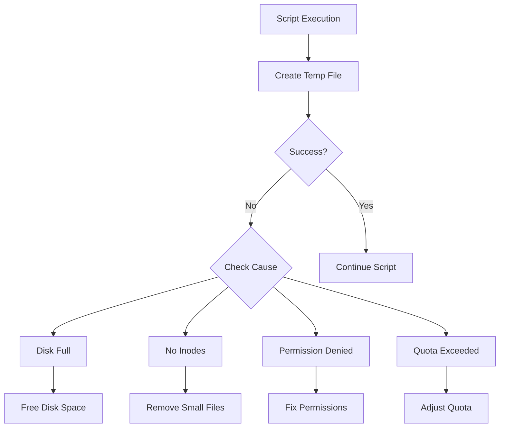
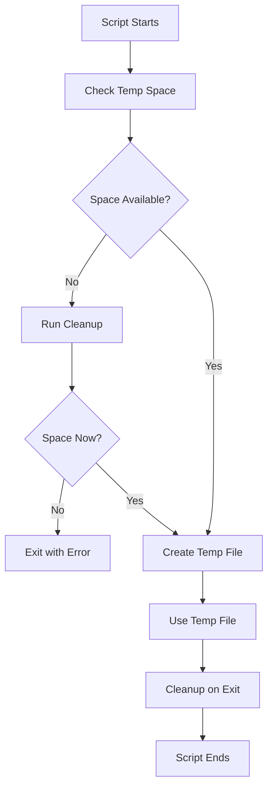

# How to Fix 'Cannot Create Temp File' Errors

Author: [nawazdhandala](https://www.github.com/nawazdhandala)

Tags: Bash, Shell Scripting, Linux, Troubleshooting, Disk Space, Temp Files, System Administration

Description: Learn how to diagnose and fix 'cannot create temp file' errors in Bash caused by disk space, permissions, and quota issues.

---

> The "cannot create temp file for here-document" error stops scripts in their tracks. This typically indicates disk space exhaustion, permission problems, or inode depletion. Learn how to diagnose the root cause and implement reliable fixes.

Temp file errors can cause critical scripts to fail. Understanding the causes helps prevent production outages.

---

## Overview



---

## Understanding the Error

### Common Error Messages

```bash
# These errors indicate temp file creation failures

# Here-document failure
./script.sh: line 10: cannot create temp file for here-document: No space left on device

# Redirection failure
./script.sh: line 15: /tmp/output.txt: No space left on device

# Command substitution failure
./script.sh: line 20: cannot create temp file for here-document: Disk quota exceeded

# Permission error
./script.sh: line 25: /tmp/data.txt: Permission denied
```

### What Causes Temp File Errors

```bash
#!/bin/bash
# Common causes of temp file creation failures

# 1. Disk space exhaustion
# The /tmp filesystem (or wherever TMPDIR points) is full
df -h /tmp

# 2. Inode exhaustion
# All inodes used even if disk space available
df -i /tmp

# 3. Permission problems
# User cannot write to temp directory
ls -la /tmp

# 4. Disk quotas exceeded
# User or group quota limit reached
quota -u "$USER"

# 5. Read-only filesystem
# Filesystem mounted read-only
mount | grep /tmp

# 6. SELinux or AppArmor restrictions
# Security policies blocking writes
getenforce  # SELinux
aa-status   # AppArmor
```

---

## Diagnosing the Problem

### Check Disk Space

```bash
#!/bin/bash
# Comprehensive disk space diagnostics

echo "=== Disk Space Usage ==="
df -h

echo -e "\n=== Temp Directory Space ==="
df -h /tmp
df -h "${TMPDIR:-/tmp}"

echo -e "\n=== Inode Usage ==="
df -i /tmp

echo -e "\n=== Large Files in /tmp ==="
# Find files larger than 100MB in /tmp
find /tmp -type f -size +100M -exec ls -lh {} \; 2>/dev/null

echo -e "\n=== Files by Size (Top 20) ==="
du -ah /tmp 2>/dev/null | sort -rh | head -20

echo -e "\n=== Old Files (older than 7 days) ==="
find /tmp -type f -mtime +7 -exec ls -la {} \; 2>/dev/null | head -20
```

### Check Permissions

```bash
#!/bin/bash
# Diagnose permission issues

echo "=== Temp Directory Permissions ==="
ls -la /tmp

echo -e "\n=== Current User ==="
id

echo -e "\n=== TMPDIR Environment Variable ==="
echo "TMPDIR=${TMPDIR:-not set}"

echo -e "\n=== Can Write to /tmp? ==="
if touch /tmp/test_write_$$ 2>/dev/null; then
    echo "Yes - write successful"
    rm /tmp/test_write_$$
else
    echo "No - write failed"
fi

echo -e "\n=== Sticky Bit Status ==="
# /tmp should have sticky bit (t) set
stat -c "%A %n" /tmp
```

### Check Quotas

```bash
#!/bin/bash
# Check user and group quotas

echo "=== User Quota ==="
quota -u "$USER" 2>/dev/null || echo "Quota not enabled or not available"

echo -e "\n=== Group Quota ==="
quota -g "$(id -gn)" 2>/dev/null || echo "Group quota not available"

echo -e "\n=== Filesystem Quota Report ==="
repquota /tmp 2>/dev/null || echo "Cannot generate quota report"
```

---

## Fixing Disk Space Issues

### Free Up Space Safely

```bash
#!/bin/bash
# Safe disk space cleanup script

set -euo pipefail

TEMP_DIR="${TMPDIR:-/tmp}"
MIN_FREE_PERCENT=10

cleanup_temp() {
    echo "Starting temp directory cleanup..."

    # Get current usage percentage
    local usage
    usage=$(df "$TEMP_DIR" | awk 'NR==2 {gsub(/%/,""); print $5}')

    if (( usage < (100 - MIN_FREE_PERCENT) )); then
        echo "Disk usage at ${usage}% - no cleanup needed"
        return 0
    fi

    echo "Disk usage at ${usage}% - starting cleanup"

    # Remove old temp files (older than 24 hours)
    # Only remove files, not directories
    echo "Removing files older than 24 hours..."
    find "$TEMP_DIR" -type f -mtime +1 -delete 2>/dev/null || true

    # Remove empty directories older than 7 days
    echo "Removing empty directories older than 7 days..."
    find "$TEMP_DIR" -type d -empty -mtime +7 -delete 2>/dev/null || true

    # Remove common temp file patterns
    echo "Removing known temp file patterns..."
    rm -f "$TEMP_DIR"/tmp.* 2>/dev/null || true
    rm -f "$TEMP_DIR"/*.tmp 2>/dev/null || true
    rm -f "$TEMP_DIR"/core.* 2>/dev/null || true

    # Report new usage
    usage=$(df "$TEMP_DIR" | awk 'NR==2 {gsub(/%/,""); print $5}')
    echo "Cleanup complete. Disk usage now at ${usage}%"
}

cleanup_temp
```

### Find and Remove Large Files

```bash
#!/bin/bash
# Interactive cleanup of large temp files

find_large_files() {
    local min_size="${1:-50M}"
    local temp_dir="${TMPDIR:-/tmp}"

    echo "Finding files larger than $min_size in $temp_dir..."
    echo "---"

    # Find large files and display with details
    find "$temp_dir" -type f -size +"$min_size" -printf '%s %p\n' 2>/dev/null | \
        sort -rn | \
        while read -r size path; do
            # Convert bytes to human readable
            local human_size
            human_size=$(numfmt --to=iec-i --suffix=B "$size" 2>/dev/null || echo "${size}B")

            # Get file age
            local age
            age=$(stat -c %y "$path" 2>/dev/null | cut -d' ' -f1)

            # Get file owner
            local owner
            owner=$(stat -c %U "$path" 2>/dev/null)

            echo "$human_size | $age | $owner | $path"
        done
}

# Usage
find_large_files "100M"
```

---

## Fixing Inode Exhaustion

### Identify Inode Usage

```bash
#!/bin/bash
# Find directories with most files (inode consumers)

echo "=== Inode Usage Summary ==="
df -i /tmp

echo -e "\n=== Directories with Most Files ==="
# Count files in each subdirectory
find /tmp -xdev -type d 2>/dev/null | while read -r dir; do
    count=$(find "$dir" -maxdepth 1 -type f 2>/dev/null | wc -l)
    if (( count > 100 )); then
        echo "$count $dir"
    fi
done | sort -rn | head -20

echo -e "\n=== Small Files Consuming Inodes ==="
# Find directories with many small files
find /tmp -type f -size -4k 2>/dev/null | \
    sed 's|/[^/]*$||' | \
    sort | uniq -c | sort -rn | head -20
```

### Clean Up Small Files

```bash
#!/bin/bash
# Remove numerous small files causing inode exhaustion

cleanup_small_files() {
    local target_dir="$1"
    local max_age_days="${2:-7}"

    if [[ ! -d "$target_dir" ]]; then
        echo "Error: Directory $target_dir does not exist"
        return 1
    fi

    echo "Cleaning small files older than $max_age_days days in $target_dir"

    # Count before cleanup
    local before_count
    before_count=$(find "$target_dir" -type f 2>/dev/null | wc -l)

    # Remove small files older than specified days
    # Small files (less than 4KB) often cause inode issues
    find "$target_dir" -type f -size -4k -mtime +"$max_age_days" -delete 2>/dev/null

    # Count after cleanup
    local after_count
    after_count=$(find "$target_dir" -type f 2>/dev/null | wc -l)

    local removed=$((before_count - after_count))
    echo "Removed $removed files"
    echo "Files remaining: $after_count"
}

# Clean session files that accumulate
cleanup_small_files "/tmp/sess_*" 1
cleanup_small_files "/tmp/php*" 3
```

---

## Fixing Permission Issues

### Reset Temp Directory Permissions

```bash
#!/bin/bash
# Fix /tmp directory permissions (requires root)

fix_tmp_permissions() {
    # Standard /tmp permissions: drwxrwxrwt (1777)
    # The sticky bit (t) prevents users from deleting others' files

    echo "Current /tmp permissions:"
    ls -la / | grep tmp

    # Set correct ownership
    chown root:root /tmp

    # Set correct permissions with sticky bit
    chmod 1777 /tmp

    echo "Fixed /tmp permissions:"
    ls -la / | grep tmp
}

# Run with sudo
# sudo bash -c "$(declare -f fix_tmp_permissions); fix_tmp_permissions"
```

### Use Alternative Temp Directory

```bash
#!/bin/bash
# Configure and use an alternative temp directory

setup_user_tmpdir() {
    # Create user-specific temp directory
    local user_tmp="$HOME/.tmp"

    if [[ ! -d "$user_tmp" ]]; then
        mkdir -p "$user_tmp"
        chmod 700 "$user_tmp"
        echo "Created user temp directory: $user_tmp"
    fi

    # Export for current session
    export TMPDIR="$user_tmp"
    export TMP="$user_tmp"
    export TEMP="$user_tmp"

    echo "TMPDIR set to: $TMPDIR"

    # Verify we can write
    if touch "$TMPDIR/test_$$" 2>/dev/null; then
        rm "$TMPDIR/test_$$"
        echo "Write test successful"
    else
        echo "Warning: Cannot write to $TMPDIR"
        return 1
    fi
}

# Add to ~/.bashrc for persistence:
# export TMPDIR="$HOME/.tmp"
```

---

## Prevention Strategies

### Temp File Management Flow



### Pre-flight Checks

```bash
#!/bin/bash
# Add to beginning of scripts that need temp files

check_temp_space() {
    local min_space_mb="${1:-100}"
    local temp_dir="${TMPDIR:-/tmp}"

    # Get available space in MB
    local available_mb
    available_mb=$(df -m "$temp_dir" | awk 'NR==2 {print $4}')

    if (( available_mb < min_space_mb )); then
        echo "Error: Insufficient temp space" >&2
        echo "Required: ${min_space_mb}MB, Available: ${available_mb}MB" >&2
        return 1
    fi

    # Check inodes
    local inode_percent
    inode_percent=$(df -i "$temp_dir" | awk 'NR==2 {gsub(/%/,""); print $5}')

    if (( inode_percent > 90 )); then
        echo "Warning: Inode usage at ${inode_percent}%" >&2
    fi

    # Check write permission
    if ! touch "$temp_dir/check_$$" 2>/dev/null; then
        echo "Error: Cannot write to $temp_dir" >&2
        return 1
    fi
    rm -f "$temp_dir/check_$$"

    return 0
}

# Use in scripts
if ! check_temp_space 500; then
    echo "Pre-flight check failed. Aborting."
    exit 1
fi
```

### Safe Temp File Creation

```bash
#!/bin/bash
# Create temp files safely with automatic cleanup

# Method 1: mktemp with trap for cleanup
create_safe_temp() {
    local temp_file
    temp_file=$(mktemp) || {
        echo "Failed to create temp file" >&2
        return 1
    }

    # Register cleanup on exit
    trap "rm -f '$temp_file'" EXIT

    echo "$temp_file"
}

# Method 2: Using a temp directory
create_temp_dir() {
    local temp_dir
    temp_dir=$(mktemp -d) || {
        echo "Failed to create temp directory" >&2
        return 1
    }

    # Cleanup entire directory on exit
    trap "rm -rf '$temp_dir'" EXIT

    echo "$temp_dir"
}

# Method 3: Fallback to alternative locations
create_temp_with_fallback() {
    local locations=("${TMPDIR:-}" "/tmp" "/var/tmp" "$HOME/.tmp" ".")

    for loc in "${locations[@]}"; do
        [[ -z "$loc" ]] && continue
        [[ ! -d "$loc" ]] && continue

        if temp_file=$(mktemp "$loc/tmp.XXXXXX" 2>/dev/null); then
            trap "rm -f '$temp_file'" EXIT
            echo "$temp_file"
            return 0
        fi
    done

    echo "Error: Could not create temp file in any location" >&2
    return 1
}
```

---

## Monitoring and Alerting

### Disk Space Monitor

```bash
#!/bin/bash
# Monitor temp directory and alert on low space

monitor_temp_space() {
    local threshold_percent="${1:-80}"
    local check_interval="${2:-300}"  # 5 minutes
    local temp_dir="${TMPDIR:-/tmp}"

    while true; do
        # Check disk usage percentage
        local usage
        usage=$(df "$temp_dir" | awk 'NR==2 {gsub(/%/,""); print $5}')

        # Check inode usage
        local inode_usage
        inode_usage=$(df -i "$temp_dir" | awk 'NR==2 {gsub(/%/,""); print $5}')

        # Alert if over threshold
        if (( usage > threshold_percent )); then
            echo "[ALERT] Temp disk usage: ${usage}% (threshold: ${threshold_percent}%)"
            # Add your alerting mechanism here
            # send_alert "Temp disk usage critical: ${usage}%"
        fi

        if (( inode_usage > threshold_percent )); then
            echo "[ALERT] Temp inode usage: ${inode_usage}% (threshold: ${threshold_percent}%)"
        fi

        sleep "$check_interval"
    done
}

# Run in background: monitor_temp_space 80 300 &
```

### Log Rotation for Temp Cleanup

```bash
#!/bin/bash
# Scheduled cleanup script for cron

# Add to crontab:
# 0 * * * * /path/to/temp_cleanup.sh >> /var/log/temp_cleanup.log 2>&1

set -euo pipefail

LOG_PREFIX="[$(date '+%Y-%m-%d %H:%M:%S')]"
TEMP_DIR="${TMPDIR:-/tmp}"
MAX_AGE_HOURS=24

echo "$LOG_PREFIX Starting temp cleanup"

# Remove files older than MAX_AGE_HOURS
deleted_count=$(find "$TEMP_DIR" -type f -mmin +$((MAX_AGE_HOURS * 60)) -delete -print 2>/dev/null | wc -l)

echo "$LOG_PREFIX Removed $deleted_count old files"

# Report current usage
usage=$(df -h "$TEMP_DIR" | awk 'NR==2 {print $5}')
echo "$LOG_PREFIX Current usage: $usage"
```

---

## System Configuration

### Configure tmpfs Size

```bash
#!/bin/bash
# Resize tmpfs mounted /tmp (requires root)

# Check current tmpfs size
df -h /tmp

# Remount with larger size (temporary until reboot)
# This sets /tmp to 4GB maximum
mount -o remount,size=4G /tmp

# For permanent change, edit /etc/fstab:
# tmpfs /tmp tmpfs defaults,size=4G,mode=1777 0 0

# Or create /etc/systemd/system/tmp.mount for systemd systems:
# [Mount]
# What=tmpfs
# Where=/tmp
# Type=tmpfs
# Options=mode=1777,strictatime,nosuid,nodev,size=4G
```

### Adjust Quotas

```bash
#!/bin/bash
# Manage disk quotas for temp directory

# Check if quotas are enabled
quotaon -p /tmp

# Set soft and hard limits for user (in blocks)
# Requires quota package and enabled quotas
setquota -u username 1000000 1500000 10000 15000 /tmp

# Parameters: user soft-block hard-block soft-inode hard-inode filesystem

# Generate quota report
repquota -a
```

---

## Best Practices

1. **Always check space first** - verify temp directory has sufficient space before creating files
2. **Use mktemp** - never hardcode temp file names to avoid collisions
3. **Clean up on exit** - use trap to ensure temp files are removed
4. **Set TMPDIR** - use alternative directories when /tmp is problematic
5. **Monitor continuously** - alert before issues cause failures
6. **Implement rotation** - regularly clean old temp files

---

## Conclusion

"Cannot create temp file" errors typically stem from:

- **Disk space exhaustion** - clean up large or old files
- **Inode depletion** - remove numerous small files
- **Permission issues** - fix directory permissions or use alternatives
- **Quota limits** - adjust user quotas or change directories

Proactive monitoring and proper temp file management prevent these errors from impacting production systems.

---

*Need to monitor your systems? [OneUptime](https://oneuptime.com) provides comprehensive monitoring with disk space alerts to prevent temp file failures before they happen.*
