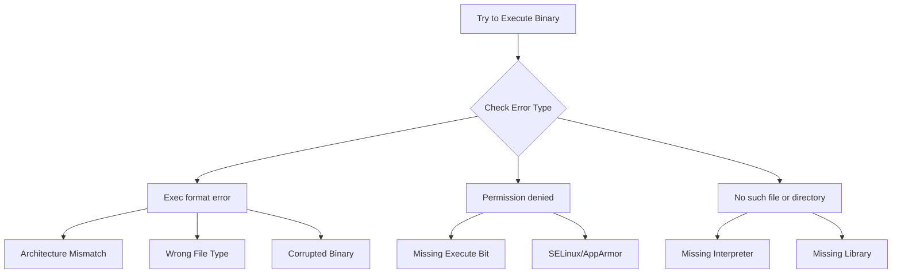
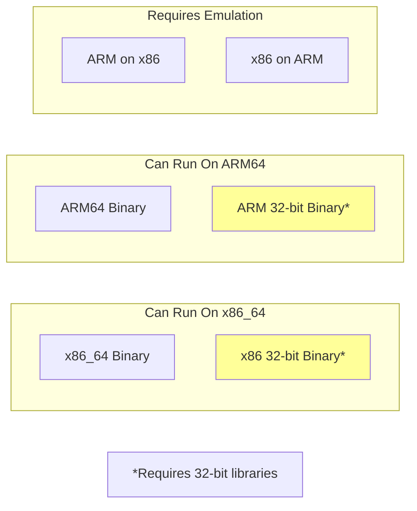

# How to Fix 'Cannot Execute Binary File' Errors

Author: [nawazdhandala](https://www.github.com/nawazdhandala)

Tags: Linux, Troubleshooting, Binary, Architecture, Shell, System Administration

Description: Learn how to diagnose and fix 'cannot execute binary file' errors in Linux caused by architecture mismatches, corrupted files, missing interpreters, and permission issues.

---

The "cannot execute binary file" error is one of the most common issues Linux administrators face. This guide walks you through the root causes and provides practical solutions for each scenario.

## Understanding the Error



### Common Error Messages

```bash
# Architecture mismatch
bash: ./myprogram: cannot execute binary file: Exec format error

# Missing execute permission
bash: ./myprogram: Permission denied

# Missing interpreter (for scripts)
bash: ./script.sh: /bin/bash^M: bad interpreter: No such file or directory

# Missing shared library
./myprogram: error while loading shared libraries: libfoo.so.1: cannot open shared object file
```

## Quick Diagnosis

### Step 1: Check File Type

```bash
# Use the file command to identify what type of file you have
file ./myprogram
```

Expected outputs:

```bash
# Native x86_64 binary (correct for most modern systems)
./myprogram: ELF 64-bit LSB executable, x86-64, version 1 (SYSV), dynamically linked

# ARM binary (wrong for x86 systems)
./myprogram: ELF 64-bit LSB executable, ARM aarch64, version 1 (SYSV)

# 32-bit binary on 64-bit system
./myprogram: ELF 32-bit LSB executable, Intel 80386, version 1 (SYSV)

# Shell script
./script.sh: Bourne-Again shell script, ASCII text executable

# Windows executable (won't run natively on Linux)
./program.exe: PE32+ executable (console) x86-64, for MS Windows
```

### Step 2: Check System Architecture

```bash
# Check your system architecture
uname -m

# Common outputs:
# x86_64  - 64-bit Intel/AMD
# aarch64 - 64-bit ARM
# armv7l  - 32-bit ARM
# i686    - 32-bit Intel
```

### Step 3: Check Permissions

```bash
# View file permissions
ls -la ./myprogram

# Check if execute bit is set (look for 'x' in permissions)
# -rwxr-xr-x means executable by everyone
# -rw-r--r-- means NOT executable
```

## Cause 1: Architecture Mismatch

This is the most common cause. You are trying to run a binary compiled for a different CPU architecture.

### Diagnosis

```bash
# Check the binary architecture
file ./myprogram
# Output: ELF 64-bit LSB executable, ARM aarch64...

# Check your system architecture
uname -m
# Output: x86_64

# Mismatch detected: ARM binary on x86 system
```

### Solution A: Get the Correct Binary

```bash
# Download or compile the correct version for your architecture
# For x86_64 systems, look for packages labeled:
# - x86_64
# - amd64
# - linux64

# For ARM systems, look for:
# - aarch64
# - arm64
# - armhf (32-bit ARM)
```

### Solution B: Use Emulation (QEMU)

```bash
# Install QEMU user-mode emulation for running foreign binaries
# On Debian/Ubuntu
sudo apt-get install qemu-user-static binfmt-support

# On RHEL/CentOS/Fedora
sudo dnf install qemu-user-static

# Run ARM binary on x86 system
qemu-aarch64-static ./myprogram

# With binfmt_misc configured, you can run directly
./myprogram
```

### Solution C: Recompile from Source

```bash
# If you have the source code, compile for your architecture
./configure
make
sudo make install

# For cross-compilation (building ARM binary on x86)
./configure --host=aarch64-linux-gnu
make
```

## Cause 2: Running a Script Without Proper Shebang

### Diagnosis

```bash
# Check if file is a script
file ./script
# Output: ASCII text

# View the first line
head -1 ./script
# Missing or wrong shebang line
```

### Solution

```bash
# Add proper shebang to the script
# For bash scripts
#!/bin/bash

# For Python scripts
#!/usr/bin/env python3

# For Perl scripts
#!/usr/bin/perl

# Make the script executable
chmod +x ./script

# Alternative: run with explicit interpreter
bash ./script
python3 ./script.py
```

## Cause 3: Windows Line Endings (CRLF)

Scripts created on Windows have CRLF line endings that break the shebang.

### Diagnosis

```bash
# Check for Windows line endings
file ./script.sh
# Output: Bourne-Again shell script, ASCII text executable, with CRLF line terminators

# Or use cat to see hidden characters
cat -A ./script.sh | head -1
# #!/bin/bash^M$   <-- ^M indicates carriage return
```

### Solution

```bash
# Convert Windows line endings to Unix using dos2unix
dos2unix ./script.sh

# Or use sed to remove carriage returns
sed -i 's/\r$//' ./script.sh

# Or use tr to delete carriage returns
tr -d '\r' < script.sh > script_fixed.sh && mv script_fixed.sh script.sh

# Verify the fix
file ./script.sh
# Output: Bourne-Again shell script, ASCII text executable
```

## Cause 4: Missing Execute Permission

### Diagnosis

```bash
# Check permissions
ls -la ./myprogram
# -rw-r--r-- 1 user user 12345 Jan 24 10:00 myprogram
# No 'x' in permissions means not executable
```

### Solution

```bash
# Add execute permission for owner
chmod u+x ./myprogram

# Add execute permission for everyone
chmod +x ./myprogram

# Set specific permissions (rwxr-xr-x)
chmod 755 ./myprogram

# Verify
ls -la ./myprogram
# -rwxr-xr-x 1 user user 12345 Jan 24 10:00 myprogram
```

## Cause 5: Corrupted Binary

### Diagnosis

```bash
# Check if the file was downloaded correctly
file ./myprogram
# Output: data  <-- Not a valid executable format

# Verify checksum if available
sha256sum ./myprogram
# Compare with expected checksum from source
```

### Solution

```bash
# Re-download the binary
wget https://example.com/myprogram -O myprogram

# Verify checksum
echo "expected_checksum  myprogram" | sha256sum -c -

# If using curl, ensure binary mode
curl -L -o myprogram https://example.com/myprogram
```

## Cause 6: Missing Shared Libraries

### Diagnosis

```bash
# Check for missing libraries
ldd ./myprogram

# Output showing missing library:
# linux-vdso.so.1 (0x00007fff...)
# libcustom.so.1 => not found    <-- Problem here
# libc.so.6 => /lib/x86_64-linux-gnu/libc.so.6
```

### Solution

```bash
# Find and install the missing library
apt-file search libcustom.so.1
# Or
dnf provides */libcustom.so.1

# Install the package containing the library
sudo apt-get install libcustom1

# Or add library path if library exists elsewhere
export LD_LIBRARY_PATH=/path/to/library:$LD_LIBRARY_PATH
./myprogram

# Make the path permanent in /etc/ld.so.conf.d/
echo "/path/to/library" | sudo tee /etc/ld.so.conf.d/custom.conf
sudo ldconfig
```

## Cause 7: Running 32-bit Binary on 64-bit System

### Diagnosis

```bash
# Check binary architecture
file ./myprogram
# Output: ELF 32-bit LSB executable, Intel 80386

# Check if 32-bit support is installed
dpkg --print-foreign-architectures
# Should show i386 for 32-bit support
```

### Solution

```bash
# On Debian/Ubuntu: enable 32-bit architecture support
sudo dpkg --add-architecture i386
sudo apt-get update
sudo apt-get install libc6:i386 libstdc++6:i386

# On RHEL/CentOS/Fedora
sudo dnf install glibc.i686 libstdc++.i686

# Verify
./myprogram
```

## Cause 8: Trying to Execute Non-Executable Files

### Diagnosis

```bash
# Sometimes users accidentally try to execute data files
file ./myfile
# Output: gzip compressed data
# Or: ASCII text
# Or: PDF document
```

### Solution

```bash
# Identify what the file actually is
file ./myfile

# Handle accordingly based on type:
# Compressed archive
tar -xzf ./myfile.tar.gz

# Text file (view, don't execute)
cat ./myfile

# Shared library (not directly executable)
# Libraries are loaded by programs, not run directly
```

## Diagnostic Script

Create a script to diagnose binary execution issues:

```bash
#!/bin/bash
# diagnose-binary.sh - Diagnose "cannot execute binary file" issues

BINARY="$1"

if [ -z "$BINARY" ]; then
    echo "Usage: $0 <binary-path>"
    exit 1
fi

echo "=== Diagnosing: $BINARY ==="
echo

# Check if file exists
if [ ! -e "$BINARY" ]; then
    echo "[ERROR] File does not exist"
    exit 1
fi

# Check file type
echo "File type:"
file "$BINARY"
echo

# Check system architecture
echo "System architecture: $(uname -m)"
echo

# Check permissions
echo "Permissions:"
ls -la "$BINARY"
echo

# Check if executable
if [ ! -x "$BINARY" ]; then
    echo "[WARNING] File is not executable. Run: chmod +x $BINARY"
fi

# Check for shared library dependencies (if ELF binary)
if file "$BINARY" | grep -q "ELF"; then
    echo "Shared library dependencies:"
    ldd "$BINARY" 2>&1

    # Check for missing libraries
    if ldd "$BINARY" 2>&1 | grep -q "not found"; then
        echo
        echo "[ERROR] Missing shared libraries detected"
    fi
fi

# Check for Windows line endings (if script)
if file "$BINARY" | grep -q "CRLF"; then
    echo "[WARNING] Windows line endings detected. Run: dos2unix $BINARY"
fi

# Check shebang (if text file)
if file "$BINARY" | grep -q "text"; then
    SHEBANG=$(head -1 "$BINARY")
    echo "Shebang line: $SHEBANG"

    if [[ ! "$SHEBANG" =~ ^#! ]]; then
        echo "[WARNING] Missing shebang line"
    fi
fi

echo
echo "=== Diagnosis complete ==="
```

## Prevention Best Practices

### Always Verify Downloads

```bash
# Check checksums before running downloaded binaries
sha256sum downloaded-binary
# Compare with published checksum

# Check file type before executing
file downloaded-binary
```

### Use Package Managers When Possible

```bash
# Package managers handle architecture automatically
sudo apt-get install package-name
sudo dnf install package-name

# For third-party software, use official repositories
curl -fsSL https://example.com/setup.sh | sudo bash
sudo apt-get install example-package
```

### Document Binary Requirements

```bash
# In your project README, specify:
# - Required architecture (x86_64, arm64, etc.)
# - Required libraries and versions
# - Installation instructions for dependencies
```

## Architecture Compatibility Chart



## Quick Reference

| Error | Likely Cause | Quick Fix |
|-------|--------------|-----------|
| Exec format error | Wrong architecture | Check `file` and `uname -m` |
| Permission denied | Missing +x | `chmod +x binary` |
| bad interpreter | CRLF endings | `dos2unix script.sh` |
| No such file | Missing shebang | Add `#!/bin/bash` |
| cannot open shared object | Missing library | Install with package manager |

---

The "cannot execute binary file" error almost always comes down to one of these causes: wrong architecture, wrong file type, or missing dependencies. Use the `file` command as your first diagnostic step, and the solution usually becomes clear.
