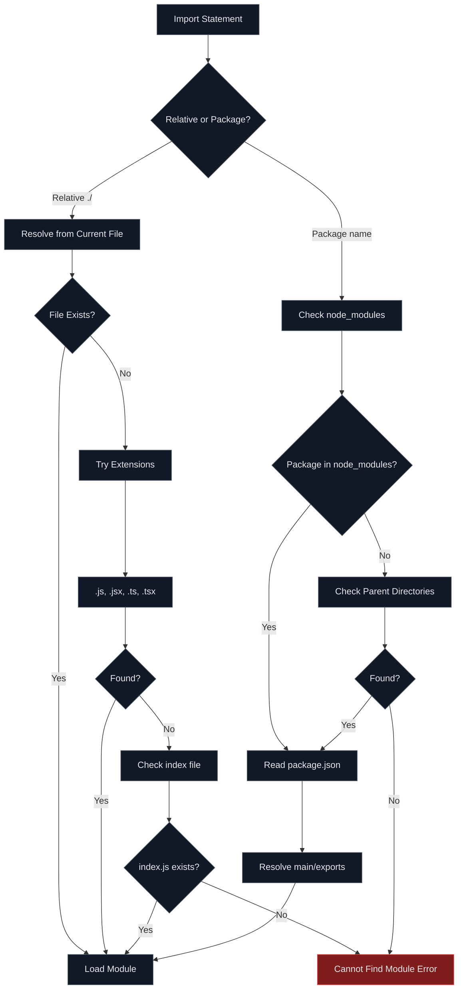
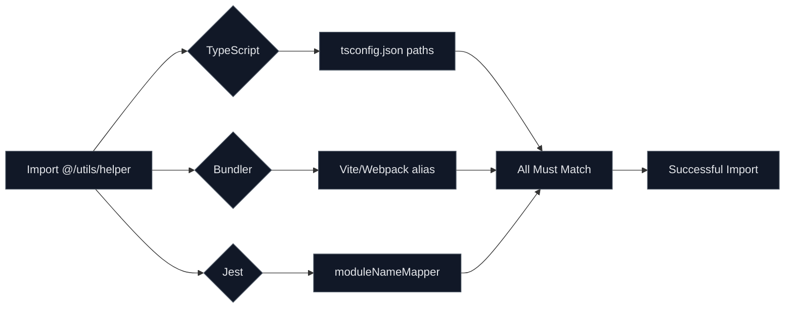
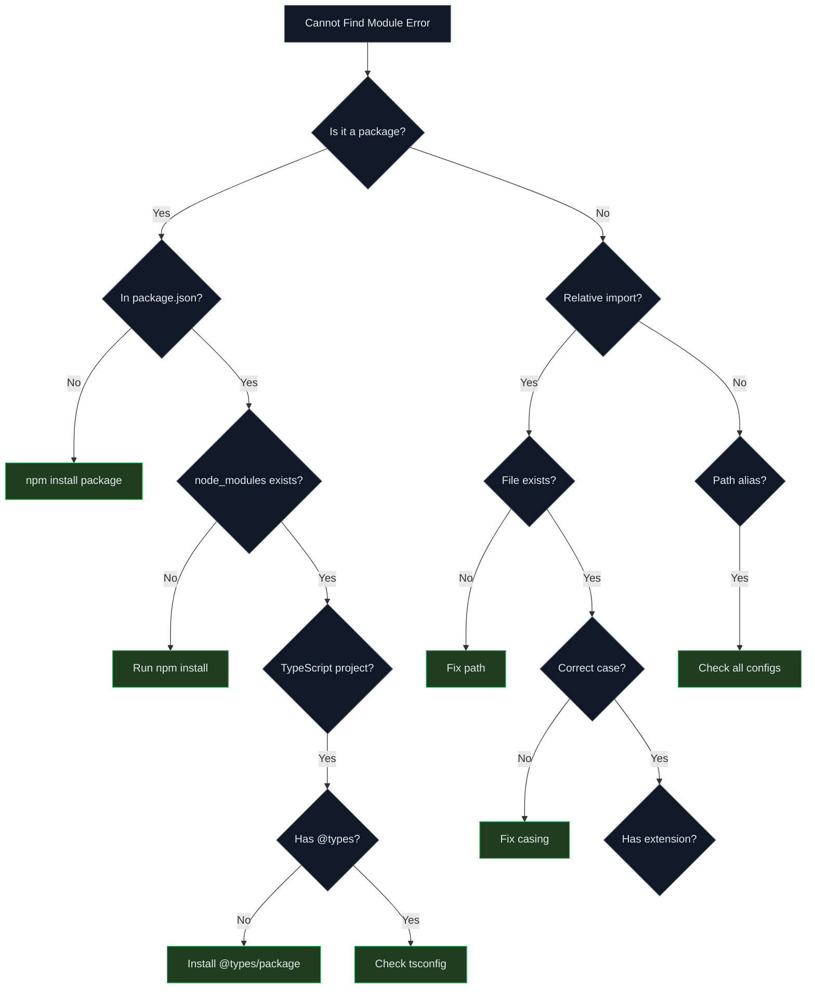

# How to Fix 'Cannot Find Module' Import Errors

Author: [nawazdhandala](https://www.github.com/nawazdhandala)

Tags: JavaScript, TypeScript, Node.js, Module Resolution, Import Errors, Webpack, ESM, CommonJS

Description: A comprehensive troubleshooting guide for resolving 'Cannot find module' errors in JavaScript and TypeScript projects, covering path aliases, ESM/CommonJS conflicts, and build tool configurations.

---

The "Cannot find module" error is one of the most common issues developers face in JavaScript and TypeScript projects. This error occurs when the module resolution system cannot locate a file or package you are trying to import. This guide covers all the common causes and their solutions.

## Understanding Module Resolution



## Common Causes and Solutions

### 1. Missing Package Installation

The most common cause is forgetting to install a package:

```bash
# Error message
Error: Cannot find module 'axios'

# Solution: Install the package
npm install axios

# For dev dependencies
npm install -D @types/node

# If using yarn
yarn add axios

# If using pnpm
pnpm add axios
```

Check if the package is in your package.json:

```json
{
  "dependencies": {
    "axios": "^1.6.0"
  },
  "devDependencies": {
    "@types/node": "^20.10.0"
  }
}
```

### 2. Incorrect Relative Path

```typescript
// File structure:
// src/
//   components/
//     Button.tsx
//   utils/
//     helpers.ts
//   pages/
//     Home.tsx

// BAD: Wrong relative path from Home.tsx
import { Button } from './components/Button';  // Error!

// GOOD: Correct relative path
import { Button } from '../components/Button';

// BAD: Missing file extension for non-standard files
import config from './config';  // Might fail if config.json

// GOOD: Include extension for non-JS files
import config from './config.json';
```

### 3. Missing TypeScript Path Aliases Configuration

If you use path aliases, ensure both TypeScript and your bundler are configured:

```json
// tsconfig.json
{
  "compilerOptions": {
    "baseUrl": ".",
    "paths": {
      "@/*": ["src/*"],
      "@components/*": ["src/components/*"],
      "@utils/*": ["src/utils/*"],
      "@hooks/*": ["src/hooks/*"],
      "@types/*": ["src/types/*"]
    }
  }
}
```

For Vite:

```typescript
// vite.config.ts
import { defineConfig } from 'vite';
import react from '@vitejs/plugin-react';
import path from 'path';

export default defineConfig({
  plugins: [react()],
  resolve: {
    alias: {
      '@': path.resolve(__dirname, './src'),
      '@components': path.resolve(__dirname, './src/components'),
      '@utils': path.resolve(__dirname, './src/utils'),
      '@hooks': path.resolve(__dirname, './src/hooks'),
    },
  },
});
```

For Webpack:

```javascript
// webpack.config.js
const path = require('path');

module.exports = {
  resolve: {
    alias: {
      '@': path.resolve(__dirname, 'src'),
      '@components': path.resolve(__dirname, 'src/components'),
      '@utils': path.resolve(__dirname, 'src/utils'),
    },
    extensions: ['.ts', '.tsx', '.js', '.jsx', '.json'],
  },
};
```

For Jest:

```javascript
// jest.config.js
module.exports = {
  moduleNameMapper: {
    '^@/(.*)$': '<rootDir>/src/$1',
    '^@components/(.*)$': '<rootDir>/src/components/$1',
    '^@utils/(.*)$': '<rootDir>/src/utils/$1',
  },
};
```

## Path Alias Configuration Flow



### 4. ESM vs CommonJS Conflicts

Modern JavaScript has two module systems that can conflict:

```javascript
// ESM (ES Modules) - uses import/export
import express from 'express';
export const handler = () => {};

// CommonJS - uses require/module.exports
const express = require('express');
module.exports = { handler: () => {} };
```

Ensure your package.json specifies the correct type:

```json
// For ESM
{
  "type": "module"
}

// For CommonJS (default)
{
  "type": "commonjs"
}
```

Importing CommonJS modules in ESM:

```javascript
// package.json has "type": "module"

// Some packages only export CommonJS
// BAD: Named imports may not work
import { something } from 'cjs-package';

// GOOD: Use default import and destructure
import cjsPackage from 'cjs-package';
const { something } = cjsPackage;

// Or use createRequire for stubborn packages
import { createRequire } from 'module';
const require = createRequire(import.meta.url);
const cjsPackage = require('cjs-package');
```

### 5. Missing Type Definitions

TypeScript needs type definitions for JavaScript packages:

```bash
# Error
Could not find a declaration file for module 'lodash'.

# Solution: Install type definitions
npm install -D @types/lodash

# Check if types exist on DefinitelyTyped
npm search @types/package-name
```

If no types exist, create a declaration file:

```typescript
// src/types/untyped-module.d.ts
declare module 'untyped-module' {
  export function doSomething(input: string): void;
  export default function main(): void;
}

// For quick fix, allow any
declare module 'untyped-module';
```

### 6. Case Sensitivity Issues

File systems on macOS and Windows are case-insensitive by default, but Linux is case-sensitive:

```typescript
// File: src/components/Button.tsx

// Works on macOS/Windows, fails on Linux
import { Button } from './components/button';  // Wrong case!

// GOOD: Match exact case
import { Button } from './components/Button';
```

### 7. Missing Index File

When importing a directory, Node looks for an index file:

```
// File structure:
// src/
//   components/
//     Button/
//       Button.tsx
//       Button.styles.ts
//       index.ts  // <-- Need this!

// components/Button/index.ts
export { Button } from './Button';
export type { ButtonProps } from './Button';
```

Now you can import the directory:

```typescript
// This works because index.ts exists
import { Button } from '@/components/Button';
```

### 8. Node.js Built-in Module Issues

For Node.js built-in modules in browser environments:

```typescript
// Error: Cannot find module 'path'
// This happens when using Node modules in browser code

// Solution 1: Use a polyfill
npm install path-browserify

// vite.config.ts
export default defineConfig({
  resolve: {
    alias: {
      path: 'path-browserify',
    },
  },
});

// Solution 2: Use browser-compatible alternatives
// Instead of 'path', use URL API
const url = new URL('./file.txt', import.meta.url);
```

### 9. Monorepo Package Resolution

In monorepos, packages need proper configuration:

```json
// packages/shared/package.json
{
  "name": "@myorg/shared",
  "main": "./dist/index.js",
  "types": "./dist/index.d.ts",
  "exports": {
    ".": {
      "import": "./dist/index.mjs",
      "require": "./dist/index.js",
      "types": "./dist/index.d.ts"
    }
  }
}
```

```json
// packages/app/package.json
{
  "dependencies": {
    "@myorg/shared": "workspace:*"
  }
}
```

```json
// Root tsconfig.json for monorepo
{
  "compilerOptions": {
    "paths": {
      "@myorg/shared": ["packages/shared/src"],
      "@myorg/shared/*": ["packages/shared/src/*"]
    }
  }
}
```

## Troubleshooting Checklist



## Quick Fixes by Error Type

| Error Message | Likely Cause | Solution |
|--------------|--------------|----------|
| Cannot find module 'package-name' | Package not installed | `npm install package-name` |
| Cannot find module './file' | Wrong relative path | Check file path and case |
| Cannot find module '@/path' | Path alias misconfigured | Update tsconfig and bundler config |
| Could not find declaration file | Missing TypeScript types | `npm install -D @types/package` |
| ERR_MODULE_NOT_FOUND | ESM/CJS mismatch | Check package.json "type" field |
| Module not found: Can't resolve | Webpack/Vite cannot find | Check resolve.alias config |

## Debugging Commands

```bash
# Check if package is installed
npm ls package-name

# Check where Node resolves a module
node -e "console.log(require.resolve('package-name'))"

# Clear npm cache and reinstall
rm -rf node_modules package-lock.json
npm cache clean --force
npm install

# Check TypeScript module resolution
npx tsc --traceResolution 2>&1 | grep "module-name"

# Verify tsconfig paths are correct
npx tsc --showConfig
```

## Verifying Your Fix

After making changes, verify the fix:

```bash
# Clear build cache
rm -rf dist .next .vite

# Restart TypeScript server (in VS Code)
# Cmd/Ctrl + Shift + P > TypeScript: Restart TS Server

# Rebuild the project
npm run build

# Run type check
npx tsc --noEmit
```

## Prevention Tips

1. **Use consistent import style** across your project
2. **Configure path aliases** once and document them
3. **Use TypeScript strict mode** to catch issues early
4. **Set up CI** to build on Linux to catch case sensitivity issues
5. **Keep dependencies updated** to avoid compatibility issues
6. **Use a monorepo tool** like Turborepo or Nx for complex setups

Module resolution errors can be frustrating, but they are almost always configuration issues. Work through the checklist systematically, and you will find the root cause. The key is ensuring all your tools (TypeScript, bundler, test runner) have matching configurations.
