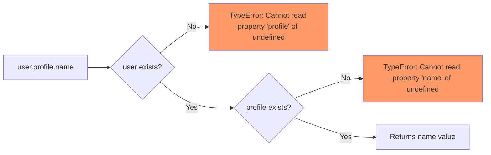
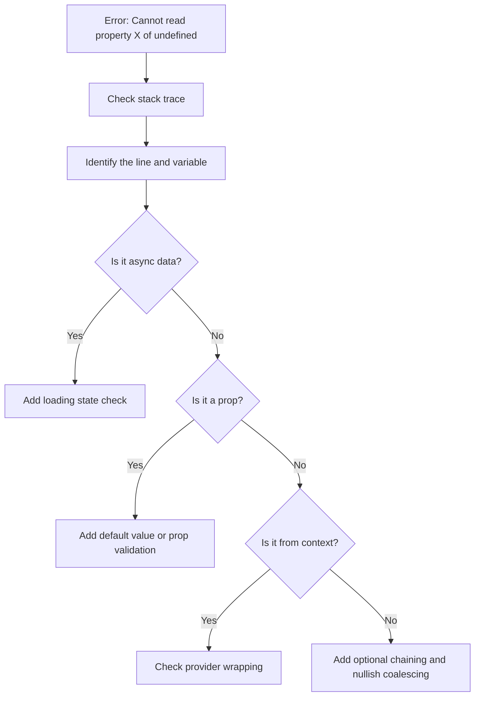

# How to Fix "Cannot Read Property of Undefined" in React

Author: [nawazdhandala](https://github.com/nawazdhandala)

Tags: React, JavaScript, Debugging, Frontend, Error Handling

Description: Learn how to diagnose and fix the common "Cannot read property of undefined" error in React applications with defensive coding patterns.

---

"TypeError: Cannot read property 'x' of undefined" is one of the most frequent errors in React development. It occurs when you try to access a property on a value that is undefined or null. In React, this commonly happens with async data, optional props, or nested objects.

## Understanding the Error

This error happens when JavaScript tries to access a property on something that does not exist:



## Common Scenarios and Fixes

### 1. Async Data Not Yet Loaded

The most common cause is trying to render data before it loads:

```javascript
// BAD: Assumes data exists immediately
function UserProfile({ userId }) {
  const [user, setUser] = useState(); // undefined initially

  useEffect(() => {
    fetchUser(userId).then(setUser);
  }, [userId]);

  // Crashes on first render when user is undefined
  return (
    <div>
      <h1>{user.name}</h1>
      <p>{user.email}</p>
    </div>
  );
}

// GOOD: Handle loading state
function UserProfile({ userId }) {
  const [user, setUser] = useState(null);
  const [isLoading, setIsLoading] = useState(true);

  useEffect(() => {
    setIsLoading(true);
    fetchUser(userId)
      .then(setUser)
      .finally(() => setIsLoading(false));
  }, [userId]);

  if (isLoading) {
    return <LoadingSpinner />;
  }

  if (!user) {
    return <div>User not found</div>;
  }

  return (
    <div>
      <h1>{user.name}</h1>
      <p>{user.email}</p>
    </div>
  );
}
```

### 2. Accessing Nested Properties

Deep property access is risky with potentially undefined objects:

```javascript
// BAD: Deep access without checks
function OrderDetails({ order }) {
  return (
    <div>
      <p>Customer: {order.customer.address.city}</p>
      <p>Item: {order.items[0].product.name}</p>
    </div>
  );
}

// GOOD: Use optional chaining
function OrderDetails({ order }) {
  return (
    <div>
      <p>Customer: {order?.customer?.address?.city ?? 'N/A'}</p>
      <p>Item: {order?.items?.[0]?.product?.name ?? 'No items'}</p>
    </div>
  );
}
```

### 3. Array Operations on Undefined

Calling array methods on potentially undefined values:

```javascript
// BAD: Assumes items is always an array
function ItemList({ items }) {
  return (
    <ul>
      {items.map(item => (
        <li key={item.id}>{item.name}</li>
      ))}
    </ul>
  );
}

// GOOD: Provide default empty array
function ItemList({ items = [] }) {
  return (
    <ul>
      {items.map(item => (
        <li key={item.id}>{item.name}</li>
      ))}
    </ul>
  );
}

// ALTERNATIVE: Guard with conditional
function ItemList({ items }) {
  if (!items || items.length === 0) {
    return <p>No items to display</p>;
  }

  return (
    <ul>
      {items.map(item => (
        <li key={item.id}>{item.name}</li>
      ))}
    </ul>
  );
}
```

### 4. Event Handler Access

Accessing properties from event objects incorrectly:

```javascript
// BAD: Destructuring from possibly undefined
function SearchForm() {
  const handleSubmit = (e) => {
    e.preventDefault();
    const { value } = e.target.elements.query; // May be undefined
    search(value);
  };

  return (
    <form onSubmit={handleSubmit}>
      <input name="query" />
      <button type="submit">Search</button>
    </form>
  );
}

// GOOD: Safe access with fallbacks
function SearchForm() {
  const handleSubmit = (e) => {
    e.preventDefault();
    const formData = new FormData(e.target);
    const query = formData.get('query') ?? '';
    search(query);
  };

  return (
    <form onSubmit={handleSubmit}>
      <input name="query" />
      <button type="submit">Search</button>
    </form>
  );
}
```

### 5. Context Not Available

Using context outside its provider:

```javascript
// BAD: No error handling for missing provider
const UserContext = createContext();

function useUser() {
  return useContext(UserContext); // Returns undefined if no provider
}

function UserGreeting() {
  const user = useUser();
  // Crashes if UserContext.Provider is missing
  return <h1>Hello, {user.name}!</h1>;
}

// GOOD: Explicit error for missing provider
const UserContext = createContext(undefined);

function useUser() {
  const context = useContext(UserContext);
  if (context === undefined) {
    throw new Error('useUser must be used within a UserProvider');
  }
  return context;
}

// Now you get a helpful error message instead of cryptic undefined error
```

## Defensive Coding Patterns

### Pattern 1: Default Values with Destructuring

```javascript
// Props with defaults
function Card({
  title = 'Untitled',
  description = '',
  author = { name: 'Anonymous' },
  tags = []
}) {
  return (
    <div className="card">
      <h2>{title}</h2>
      <p>{description}</p>
      <span>By {author.name}</span>
      <div>
        {tags.map(tag => <Tag key={tag} name={tag} />)}
      </div>
    </div>
  );
}
```

### Pattern 2: Early Return Guards

```javascript
function ProductPage({ product }) {
  // Guard clause at the top
  if (!product) {
    return <NotFound message="Product not found" />;
  }

  // Now product is guaranteed to exist
  return (
    <div>
      <h1>{product.name}</h1>
      <p>{product.description}</p>
      <span>${product.price}</span>
    </div>
  );
}
```

### Pattern 3: Null Object Pattern

```javascript
// Define a "null object" with safe defaults
const NULL_USER = {
  id: null,
  name: 'Guest',
  email: '',
  profile: {
    avatar: '/default-avatar.png',
    bio: '',
  },
  permissions: [],
};

function useCurrentUser() {
  const [user, setUser] = useState(NULL_USER);
  const [isLoading, setIsLoading] = useState(true);

  useEffect(() => {
    fetchCurrentUser()
      .then(data => setUser(data ?? NULL_USER))
      .finally(() => setIsLoading(false));
  }, []);

  return { user, isLoading };
}

// Component can safely access nested properties
function Header() {
  const { user } = useCurrentUser();

  // Safe even before data loads
  return (
    <header>
      
      <span>{user.name}</span>
    </header>
  );
}
```

### Pattern 4: Type Checking with TypeScript

```typescript
// Define exact shape of data
interface User {
  id: string;
  name: string;
  email: string;
  profile?: {
    avatar?: string;
    bio?: string;
  };
}

interface UserProfileProps {
  user: User | null;
  isLoading: boolean;
}

function UserProfile({ user, isLoading }: UserProfileProps) {
  if (isLoading) {
    return <Skeleton />;
  }

  if (!user) {
    return <EmptyState />;
  }

  // TypeScript knows user exists here
  return (
    <div>
      <h1>{user.name}</h1>
      {/* Optional chaining for optional properties */}
      
    </div>
  );
}
```

## Error Boundaries for Runtime Errors

Even with defensive coding, errors can slip through. Error boundaries catch them:

```javascript
import { Component } from 'react';

class ErrorBoundary extends Component {
  constructor(props) {
    super(props);
    this.state = { hasError: false, error: null };
  }

  static getDerivedStateFromError(error) {
    return { hasError: true, error };
  }

  componentDidCatch(error, errorInfo) {
    // Log to error reporting service
    console.error('Error caught by boundary:', error, errorInfo);
  }

  render() {
    if (this.state.hasError) {
      return (
        <div className="error-fallback">
          <h2>Something went wrong</h2>
          <button onClick={() => this.setState({ hasError: false })}>
            Try again
          </button>
        </div>
      );
    }

    return this.props.children;
  }
}

// Wrap components that might fail
function App() {
  return (
    <ErrorBoundary>
      <UserDashboard />
    </ErrorBoundary>
  );
}
```

## Debugging Flow

When you encounter this error, follow this debugging process:



## Summary of Solutions

| Cause | Solution |
|-------|----------|
| Async data not loaded | Add loading state, render conditionally |
| Missing props | Default values in destructuring |
| Nested property access | Optional chaining `?.` |
| Undefined fallback | Nullish coalescing `??` |
| Array might be undefined | Default to empty array `[]` |
| Context outside provider | Validate in custom hook |
| Runtime errors | Error boundaries |

## Quick Reference

```javascript
// Optional chaining
user?.profile?.name

// Nullish coalescing
user?.name ?? 'Anonymous'

// Default parameter
function Component({ items = [] }) {}

// Logical AND short-circuit (falsy check)
user && user.name

// Array default
const items = props.items || [];

// Early return guard
if (!data) return null;
```

By combining these defensive patterns with proper TypeScript types and error boundaries, you can eliminate most "Cannot read property of undefined" errors and build more resilient React applications.
