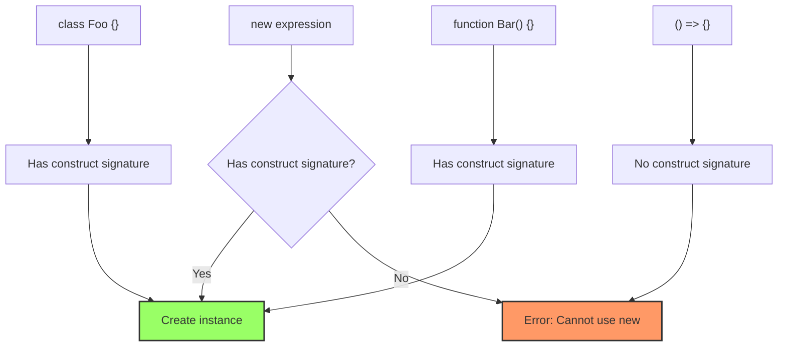
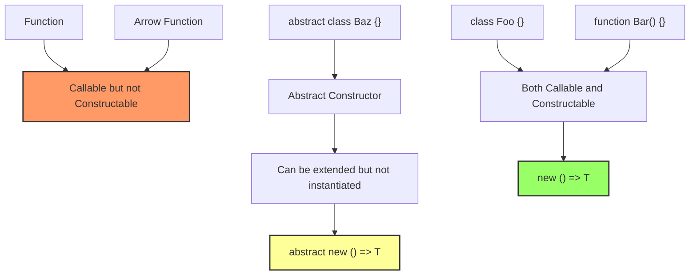

# How to Fix 'Cannot Use 'new' with Expression' Errors

Author: [nawazdhandala](https://www.github.com/nawazdhandala)

Tags: TypeScript, Classes, Constructors, Types, Object-Oriented Programming

Description: Resolve TypeScript errors when using new with dynamic expressions, factory patterns, and generic constructors.

---

The "Cannot use 'new' with an expression whose type lacks a call or construct signature" error occurs when TypeScript cannot verify that a value can be instantiated with `new`. This guide explains the causes and provides solutions for common scenarios.

## Understanding the Error

TypeScript requires proof that a value has a construct signature before allowing `new`. Without this guarantee, the runtime could fail if you try to instantiate a non-constructor value.

```typescript
// This function accepts any function type
function createInstance(ctor: Function) {
  // Error: Cannot use 'new' with an expression whose type lacks
  // a call or construct signature
  return new ctor();
}

// TypeScript does not know if 'ctor' is a constructor
// It could be an arrow function, which cannot be instantiated
const arrowFn = () => {};
createInstance(arrowFn);  // Would fail at runtime
```



## Solution 1: Use Constructor Type

Define a type that explicitly has a construct signature:

```typescript
// Define a constructor type that creates instances of T
// The 'new' keyword in the type indicates a construct signature
type Constructor<T = {}> = new (...args: any[]) => T;

// Now TypeScript knows this parameter can be instantiated
function createInstance<T>(ctor: Constructor<T>): T {
  return new ctor();
}

// Usage with a class
class User {
  name = 'Anonymous';
}

const user = createInstance(User);  // Works: user is of type User
console.log(user.name);  // 'Anonymous'
```

### Constructor with Parameters

```typescript
// Constructor type with specific parameters
type ConstructorWithParams<T, P extends any[]> = new (...args: P) => T;

// Factory function that passes arguments
function createWithArgs<T, P extends any[]>(
  ctor: ConstructorWithParams<T, P>,
  ...args: P
): T {
  return new ctor(...args);
}

// Class with required parameters
class User {
  constructor(public name: string, public age: number) {}
}

// TypeScript enforces correct arguments
const user = createWithArgs(User, 'Alice', 30);  // Works
const bad = createWithArgs(User, 'Bob');  // Error: Expected 2 arguments
```

## Solution 2: Interface with Construct Signature

Define an interface that includes a construct signature:

```typescript
// Interface with a construct signature
interface Constructable<T> {
  new (...args: any[]): T;
}

// Function using the interface
function instantiate<T>(type: Constructable<T>): T {
  return new type();
}

// Can also include static members
interface ClassWithStatic<T> {
  new (...args: any[]): T;
  staticMethod(): void;
  staticProperty: string;
}

function useClassWithStatic<T>(cls: ClassWithStatic<T>): T {
  cls.staticMethod();  // Access static method
  console.log(cls.staticProperty);  // Access static property
  return new cls();  // Create instance
}
```

## Solution 3: Type Guard for Constructors

When dealing with unknown values, use a type guard:

```typescript
// Type guard to check if a value is a constructor
function isConstructor(value: unknown): value is new (...args: any[]) => any {
  try {
    // Check for [[Construct]] internal method
    // Arrow functions and methods do not have this
    Reflect.construct(String, [], value as any);
    return true;
  } catch {
    return false;
  }
}

// Safe instantiation with type narrowing
function safeCreate<T>(
  maybeConstructor: unknown
): T | null {
  if (isConstructor(maybeConstructor)) {
    return new maybeConstructor() as T;
  }
  return null;
}

// Usage
class MyClass {
  value = 42;
}

const instance = safeCreate<MyClass>(MyClass);
if (instance) {
  console.log(instance.value);  // 42
}

const failed = safeCreate(() => {});  // null (arrow functions are not constructors)
```

## Solution 4: Abstract Constructor Types

Handle abstract classes that cannot be directly instantiated:

```typescript
// Abstract constructor type - for types that cannot be directly instantiated
// but can be extended
type AbstractConstructor<T = {}> = abstract new (...args: any[]) => T;

// Concrete constructor type - can be instantiated
type ConcreteConstructor<T = {}> = new (...args: any[]) => T;

// Function that works with abstract base classes
function extendClass<T extends AbstractConstructor>(Base: T) {
  return class Extended extends Base {
    extended = true;
  };
}

// Abstract base class
abstract class Animal {
  abstract speak(): string;
}

// Extend the abstract class
const ExtendedAnimal = extendClass(Animal);

// Still need to implement abstract methods
class Dog extends ExtendedAnimal {
  speak() {
    return 'Woof!';
  }
}

const dog = new Dog();
console.log(dog.extended);  // true
console.log(dog.speak());   // 'Woof!'
```

## Solution 5: Class Decorator Pattern

For decorators that need to wrap constructors:

```typescript
// Decorator that wraps a class constructor
// The return type must be compatible with the input constructor
function Timestamped<T extends new (...args: any[]) => {}>(Base: T) {
  return class extends Base {
    createdAt = new Date();
  };
}

// Apply decorator
@Timestamped
class User {
  constructor(public name: string) {}
}

const user = new User('Alice');
console.log(user.name);       // 'Alice'
console.log(user.createdAt);  // Date object

// Without decorator syntax
const TimestampedUser = Timestamped(User);
const user2 = new TimestampedUser('Bob');
```

## Common Scenarios

### Scenario 1: Factory Pattern

```typescript
// Registry of constructors
type ServiceConstructor<T> = new (...args: any[]) => T;

class ServiceContainer {
  private registry = new Map<string, ServiceConstructor<any>>();

  // Register a service class
  register<T>(name: string, ctor: ServiceConstructor<T>): void {
    this.registry.set(name, ctor);
  }

  // Create a service instance
  create<T>(name: string): T | undefined {
    const ctor = this.registry.get(name);
    if (ctor) {
      return new ctor() as T;
    }
    return undefined;
  }
}

// Usage
class DatabaseService {
  connect() { console.log('Connected'); }
}

class CacheService {
  get(key: string) { return null; }
}

const container = new ServiceContainer();
container.register('db', DatabaseService);
container.register('cache', CacheService);

const db = container.create<DatabaseService>('db');
db?.connect();  // 'Connected'
```

### Scenario 2: Generic Repository

```typescript
// Entity base class
abstract class Entity {
  id!: number;
  createdAt!: Date;
}

// Repository that works with any entity type
class Repository<T extends Entity> {
  private items: T[] = [];

  constructor(private entityClass: new () => T) {}

  create(): T {
    const entity = new this.entityClass();
    entity.id = this.items.length + 1;
    entity.createdAt = new Date();
    return entity;
  }

  save(entity: T): T {
    this.items.push(entity);
    return entity;
  }

  findAll(): T[] {
    return [...this.items];
  }
}

// Concrete entity
class User extends Entity {
  name = '';
  email = '';
}

// Create repository
const userRepo = new Repository(User);
const user = userRepo.create();
user.name = 'Alice';
user.email = 'alice@example.com';
userRepo.save(user);
```

### Scenario 3: Mixin Pattern

```typescript
// Mixin that adds functionality to any class
type GConstructor<T = {}> = new (...args: any[]) => T;

// Mixin for serialization
function Serializable<TBase extends GConstructor>(Base: TBase) {
  return class Serializable extends Base {
    toJSON(): string {
      return JSON.stringify(this);
    }

    static fromJSON<T>(this: new () => T, json: string): T {
      return Object.assign(new this(), JSON.parse(json));
    }
  };
}

// Mixin for validation
function Validatable<TBase extends GConstructor>(Base: TBase) {
  return class Validatable extends Base {
    validate(): boolean {
      // Override in subclass
      return true;
    }
  };
}

// Apply mixins
class BaseModel {
  id = 0;
}

const EnhancedModel = Serializable(Validatable(BaseModel));

class User extends EnhancedModel {
  name = '';
  email = '';

  validate(): boolean {
    return this.name.length > 0 && this.email.includes('@');
  }
}

const user = new User();
user.name = 'Alice';
user.email = 'alice@example.com';

console.log(user.validate());  // true
console.log(user.toJSON());    // {"id":0,"name":"Alice","email":"alice@example.com"}
```

### Scenario 4: Dependency Injection

```typescript
// Token for identifying dependencies
const TYPES = {
  Logger: Symbol('Logger'),
  Database: Symbol('Database'),
};

// Constructor type with dependency metadata
type InjectableConstructor<T> = new (...args: any[]) => T;

// Simple DI container
class Container {
  private bindings = new Map<symbol, InjectableConstructor<any>>();
  private instances = new Map<symbol, any>();

  bind<T>(token: symbol, ctor: InjectableConstructor<T>): void {
    this.bindings.set(token, ctor);
  }

  get<T>(token: symbol): T {
    // Return cached instance if exists
    if (this.instances.has(token)) {
      return this.instances.get(token);
    }

    // Create new instance
    const ctor = this.bindings.get(token);
    if (!ctor) {
      throw new Error(`No binding for ${String(token)}`);
    }

    const instance = new ctor();
    this.instances.set(token, instance);
    return instance;
  }
}

// Services
class Logger {
  log(message: string) {
    console.log(`[LOG] ${message}`);
  }
}

class Database {
  constructor() {
    console.log('Database initialized');
  }
  query(sql: string) {
    return [];
  }
}

// Setup container
const container = new Container();
container.bind(TYPES.Logger, Logger);
container.bind(TYPES.Database, Database);

// Resolve dependencies
const logger = container.get<Logger>(TYPES.Logger);
const db = container.get<Database>(TYPES.Database);
```

## Type Relationship Diagram



## Summary

| Solution | When to Use |
|----------|-------------|
| `Constructor<T>` type | Simple factory functions |
| Interface with `new` | When you need static members too |
| Type guard | Unknown values at runtime |
| Abstract constructor | Working with abstract classes |
| Generic constraints | Mixins and decorators |

The key is to provide TypeScript with proof that a value can be used with `new`. This is done through:

1. Explicit constructor types: `new (...args: any[]) => T`
2. Generic constraints: `T extends new () => any`
3. Runtime type guards when dealing with unknown values

By using these patterns, you can write type-safe factory functions, dependency injection containers, and class decorators that TypeScript can verify at compile time.
