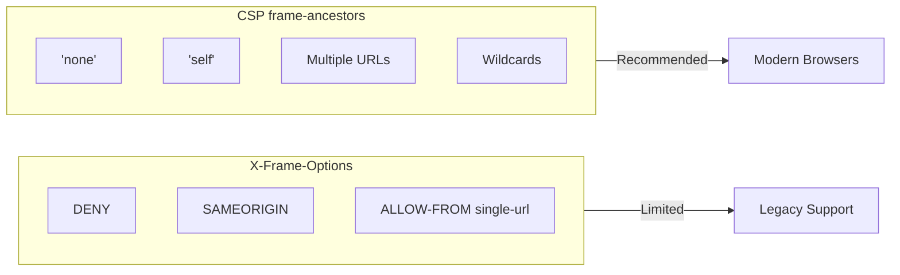

# How to Fix "Clickjacking" Vulnerabilities

Author: [nawazdhandala](https://www.github.com/nawazdhandala)

Tags: Security, Vulnerabilities, Clickjacking, Web Security, CSP, X-Frame-Options, OWASP

Description: A practical guide to preventing clickjacking attacks by implementing proper frame protection headers and Content Security Policy.

---

Clickjacking tricks users into clicking something different from what they perceive. An attacker overlays your legitimate site with an invisible iframe and positions malicious buttons over your UI elements. When users think they are clicking your "Download" button, they are actually clicking "Transfer $10,000." Let's prevent that.

## Understanding Clickjacking

```mermaid
flowchart TB
    subgraph Attack["Clickjacking Attack"]
        direction TB
        V[Visible Layer: "Win a Prize!"]
        I[Invisible iframe: Your Banking App]
        B[Hidden Button: Transfer Money]

        V --> I
        I --> B
    end

    subgraph User["User Perspective"]
        U[User clicks "Claim Prize"]
        U --> R[Actually clicks "Confirm Transfer"]
    end
```

The attacker creates a page that loads your application in an invisible iframe, positioned so that sensitive buttons align with decoy elements on the visible page.

## Primary Defense: X-Frame-Options Header

The simplest defense is the `X-Frame-Options` header.

### Configure X-Frame-Options in Node.js/Express

```javascript
const express = require('express');
const app = express();

// Apply X-Frame-Options to all responses
app.use((req, res, next) => {
  // DENY - Never allow framing
  res.setHeader('X-Frame-Options', 'DENY');

  // Or SAMEORIGIN - Only allow framing from same origin
  // res.setHeader('X-Frame-Options', 'SAMEORIGIN');

  next();
});

// For specific routes that need different policies
app.get('/embeddable-widget', (req, res) => {
  // Allow specific trusted domain to embed
  res.setHeader('X-Frame-Options', 'ALLOW-FROM https://trusted-partner.com');
  res.send('Widget content');
});
```

### Configure X-Frame-Options in Nginx

```nginx
# nginx.conf - Global configuration
http {
    # Add X-Frame-Options to all responses
    add_header X-Frame-Options "DENY" always;

    server {
        listen 443 ssl;
        server_name example.com;

        # Override for specific locations if needed
        location /embed {
            add_header X-Frame-Options "SAMEORIGIN" always;
            # Other headers must be re-added when using add_header in location
            add_header X-Content-Type-Options "nosniff" always;
        }
    }
}
```

### Configure X-Frame-Options in Apache

```apache
# .htaccess or httpd.conf
# Prevent all framing
Header always set X-Frame-Options "DENY"

# Or allow same origin only
# Header always set X-Frame-Options "SAMEORIGIN"

# For specific directories that can be embedded
<Directory "/var/www/html/embeddable">
    Header always set X-Frame-Options "SAMEORIGIN"
</Directory>
```

## Modern Defense: Content-Security-Policy frame-ancestors

`X-Frame-Options` is limited. CSP `frame-ancestors` provides more granular control.



### Implement CSP frame-ancestors

```javascript
// Node.js/Express with comprehensive CSP
const helmet = require('helmet');

app.use(helmet({
  contentSecurityPolicy: {
    directives: {
      defaultSrc: ["'self'"],
      scriptSrc: ["'self'"],
      styleSrc: ["'self'", "'unsafe-inline'"],
      imgSrc: ["'self'", "data:", "https:"],

      // Frame ancestors - who can embed this page
      frameAncestors: ["'none'"],  // No one can embed

      // Or allow specific origins
      // frameAncestors: ["'self'", "https://trusted-partner.com"],
    }
  },
  // Also set X-Frame-Options for older browsers
  frameguard: { action: 'deny' }
}));
```

### CSP frame-ancestors with Multiple Trusted Origins

```python
# Python/Flask with multiple trusted embedding origins
from flask import Flask, Response

app = Flask(__name__)

TRUSTED_EMBED_ORIGINS = [
    "'self'",
    "https://partner1.com",
    "https://partner2.com",
    "https://*.trusted-domain.com"
]

@app.after_request
def add_security_headers(response):
    # Build frame-ancestors directive
    frame_ancestors = ' '.join(TRUSTED_EMBED_ORIGINS)

    csp = f"frame-ancestors {frame_ancestors}; default-src 'self'"

    response.headers['Content-Security-Policy'] = csp
    # Fallback for older browsers
    response.headers['X-Frame-Options'] = 'SAMEORIGIN'

    return response
```

### Nginx Configuration with CSP

```nginx
server {
    listen 443 ssl;
    server_name example.com;

    # Comprehensive security headers
    add_header Content-Security-Policy "frame-ancestors 'none'; default-src 'self'" always;
    add_header X-Frame-Options "DENY" always;
    add_header X-Content-Type-Options "nosniff" always;
    add_header X-XSS-Protection "1; mode=block" always;
    add_header Referrer-Policy "strict-origin-when-cross-origin" always;

    # For pages that can be embedded by partners
    location /partner-embed {
        add_header Content-Security-Policy "frame-ancestors 'self' https://partner.com" always;
        add_header X-Frame-Options "ALLOW-FROM https://partner.com" always;
        add_header X-Content-Type-Options "nosniff" always;
    }
}
```

## JavaScript Frame-Busting (Defense in Depth)

Headers can fail if not properly configured. Add JavaScript as a backup.

### Modern Frame-Busting Script

```javascript
// frame-buster.js - Client-side clickjacking protection
(function() {
  'use strict';

  // Check if we're in a frame
  if (window.self !== window.top) {
    // We're framed - take action

    // Option 1: Break out of the frame
    try {
      window.top.location = window.self.location;
    } catch (e) {
      // Cross-origin frame - can't redirect
      // Option 2: Make the page unusable
      document.body.innerHTML = '';
      document.body.style.display = 'none';

      // Log the attempt
      console.error('Clickjacking attempt detected');

      // Option 3: Show a warning
      const warning = document.createElement('div');
      warning.innerHTML = `
        <div style="position:fixed;top:0;left:0;right:0;bottom:0;
                    background:#fff;z-index:999999;padding:50px;
                    text-align:center;font-family:sans-serif;">
          <h1>Security Warning</h1>
          <p>This page cannot be displayed in a frame.</p>
          <p>Please access this page directly at:</p>
          <a href="${window.location.href}">${window.location.href}</a>
        </div>
      `;
      document.body.appendChild(warning);
    }
  }
})();
```

### React Component for Frame Detection

```jsx
// FrameGuard.jsx - React component for frame detection
import { useEffect, useState } from 'react';

function FrameGuard({ children }) {
  const [isFramed, setIsFramed] = useState(false);

  useEffect(() => {
    // Check if we're in a frame
    if (window.self !== window.top) {
      setIsFramed(true);

      // Log security event
      fetch('/api/security/log', {
        method: 'POST',
        headers: { 'Content-Type': 'application/json' },
        body: JSON.stringify({
          event: 'clickjacking_attempt',
          referrer: document.referrer,
          timestamp: new Date().toISOString()
        })
      }).catch(() => {});
    }
  }, []);

  if (isFramed) {
    return (
      <div className="security-warning">
        <h1>Security Warning</h1>
        <p>This page cannot be displayed in a frame for security reasons.</p>
        <a href={window.location.href}>Click here to open this page directly</a>
      </div>
    );
  }

  return children;
}

// Usage
function App() {
  return (
    <FrameGuard>
      <YourApplication />
    </FrameGuard>
  );
}
```

## Protecting Specific Sensitive Actions

For critical actions, add extra protection beyond headers.

### Confirmation Dialogs for Sensitive Actions

```javascript
// Add user interaction verification for sensitive actions
class ClickjackingProtection {
  constructor() {
    this.lastMousePosition = { x: 0, y: 0 };
    this.lastClickTime = 0;

    document.addEventListener('mousemove', (e) => {
      this.lastMousePosition = { x: e.clientX, y: e.clientY };
    });
  }

  verifySensitiveClick(button, callback) {
    const buttonRect = button.getBoundingClientRect();
    const { x, y } = this.lastMousePosition;

    // Check if mouse is actually over the button
    const isOverButton = (
      x >= buttonRect.left &&
      x <= buttonRect.right &&
      y >= buttonRect.top &&
      y <= buttonRect.bottom
    );

    if (!isOverButton) {
      console.warn('Potential clickjacking: click position mismatch');
      return false;
    }

    // Check for rapid repeated clicks (potential automated clicking)
    const now = Date.now();
    if (now - this.lastClickTime < 100) {
      console.warn('Potential clickjacking: rapid clicks detected');
      return false;
    }
    this.lastClickTime = now;

    // Require explicit confirmation for sensitive actions
    const confirmed = window.confirm(
      'You are about to perform a sensitive action. Continue?'
    );

    if (confirmed) {
      callback();
    }

    return confirmed;
  }
}

// Usage
const protection = new ClickjackingProtection();

document.getElementById('transfer-btn').addEventListener('click', function(e) {
  e.preventDefault();

  protection.verifySensitiveClick(this, () => {
    // Perform the sensitive action
    performTransfer();
  });
});
```

### CAPTCHA for High-Risk Actions

```python
# Python/Flask - Require CAPTCHA for sensitive actions
from flask import Flask, request, jsonify
import requests

app = Flask(__name__)

def verify_captcha(token):
    """Verify reCAPTCHA token"""
    response = requests.post(
        'https://www.google.com/recaptcha/api/siteverify',
        data={
            'secret': app.config['RECAPTCHA_SECRET'],
            'response': token
        }
    )
    result = response.json()
    return result.get('success', False) and result.get('score', 0) > 0.5

@app.route('/api/transfer', methods=['POST'])
def transfer_funds():
    data = request.get_json()

    # Verify CAPTCHA for sensitive action
    captcha_token = data.get('captcha_token')
    if not captcha_token or not verify_captcha(captcha_token):
        return jsonify({'error': 'CAPTCHA verification failed'}), 403

    # Additional clickjacking protection
    # Check for suspicious request patterns
    if request.headers.get('Sec-Fetch-Dest') == 'iframe':
        return jsonify({'error': 'Request not allowed from iframe'}), 403

    # Proceed with transfer
    return perform_transfer(data)
```

## Testing Clickjacking Protection

### Create a Test Page

```html
<!-- clickjacking-test.html -->
<!DOCTYPE html>
<html>
<head>
    <title>Clickjacking Test</title>
    <style>
        .container {
            position: relative;
            width: 800px;
            height: 600px;
            margin: 50px auto;
        }

        .decoy {
            position: absolute;
            top: 0;
            left: 0;
            width: 100%;
            height: 100%;
            z-index: 2;
            background: rgba(255, 255, 255, 0.01);
        }

        .decoy button {
            position: absolute;
            top: 200px;  /* Position over target button */
            left: 300px;
            padding: 20px 40px;
            font-size: 18px;
            cursor: pointer;
        }

        iframe {
            position: absolute;
            top: 0;
            left: 0;
            width: 100%;
            height: 100%;
            border: none;
            opacity: 0.5;  /* Make visible for testing, would be 0 in real attack */
            z-index: 1;
        }
    </style>
</head>
<body>
    <h1>Clickjacking Test Page</h1>
    <p>If your site is vulnerable, it will load in the iframe below.</p>

    <div class="container">
        <iframe src="https://your-site.com/sensitive-page"></iframe>
        <div class="decoy">
            <button onclick="alert('Gotcha!')">Click to Win!</button>
        </div>
    </div>

    <p>If you see "Refused to display in a frame" error in console, protection is working.</p>
</body>
</html>
```

### Automated Testing Script

```bash
#!/bin/bash
# test-clickjacking.sh - Test clickjacking protection

URL=$1

echo "Testing clickjacking protection for: $URL"

# Check X-Frame-Options header
XFO=$(curl -sI "$URL" | grep -i "x-frame-options")
if [ -n "$XFO" ]; then
    echo "X-Frame-Options: $XFO"
else
    echo "WARNING: X-Frame-Options header missing!"
fi

# Check Content-Security-Policy frame-ancestors
CSP=$(curl -sI "$URL" | grep -i "content-security-policy")
if echo "$CSP" | grep -qi "frame-ancestors"; then
    echo "CSP frame-ancestors: Found"
    echo "$CSP"
else
    echo "WARNING: CSP frame-ancestors directive missing!"
fi

# Summary
echo ""
echo "=== Summary ==="
if [ -n "$XFO" ] || echo "$CSP" | grep -qi "frame-ancestors"; then
    echo "Basic clickjacking protection is in place."
else
    echo "VULNERABLE: No clickjacking protection detected!"
fi
```

## Security Headers Checklist

Apply these headers to protect against clickjacking and related attacks:

```nginx
# Complete security headers configuration
add_header X-Frame-Options "DENY" always;
add_header Content-Security-Policy "frame-ancestors 'none'; default-src 'self'" always;
add_header X-Content-Type-Options "nosniff" always;
add_header X-XSS-Protection "1; mode=block" always;
add_header Referrer-Policy "strict-origin-when-cross-origin" always;
add_header Permissions-Policy "geolocation=(), microphone=(), camera=()" always;
```

---

Clickjacking is preventable with proper headers. Set `X-Frame-Options: DENY` for legacy browsers and `Content-Security-Policy: frame-ancestors 'none'` for modern ones. Add JavaScript frame-busting as defense in depth. For sensitive actions, require additional user confirmation. Test your protection by trying to embed your pages in an iframe - if they load, you have work to do.
