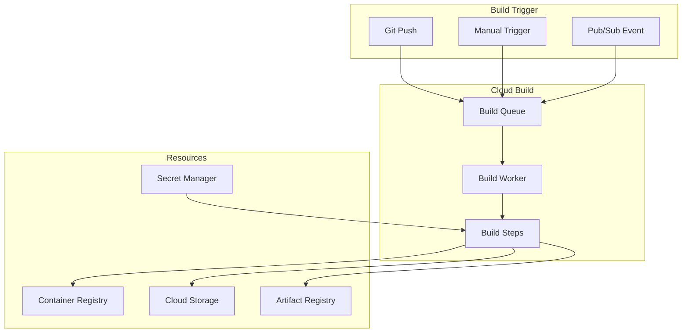

# How to Fix "Cloud Build" Pipeline Errors

Author: [nawazdhandala](https://www.github.com/nawazdhandala)

Tags: Cloud Build, CI/CD, Google Cloud, DevOps, Docker, Troubleshooting, Automation

Description: A practical guide to diagnosing and fixing common Google Cloud Build errors, from permission issues to build timeouts and cache problems.

---

Google Cloud Build is a powerful CI/CD platform, but cryptic error messages can turn a simple deployment into a debugging marathon. This guide covers the most common Cloud Build errors and their solutions, with practical examples you can apply immediately.

## Understanding Cloud Build Architecture



## Permission Errors

### Error: "PERMISSION_DENIED: The caller does not have permission"

This is the most common Cloud Build error. The Cloud Build service account needs proper permissions.

```bash
# Find your Cloud Build service account
PROJECT_NUMBER=$(gcloud projects describe $PROJECT_ID --format='value(projectNumber)')
SERVICE_ACCOUNT="${PROJECT_NUMBER}@cloudbuild.gserviceaccount.com"

# Grant required roles based on what your build does
# For pushing to GCR/Artifact Registry
gcloud projects add-iam-policy-binding $PROJECT_ID \
    --member="serviceAccount:${SERVICE_ACCOUNT}" \
    --role="roles/artifactregistry.writer"

# For deploying to Cloud Run
gcloud projects add-iam-policy-binding $PROJECT_ID \
    --member="serviceAccount:${SERVICE_ACCOUNT}" \
    --role="roles/run.developer"

# For deploying to GKE
gcloud projects add-iam-policy-binding $PROJECT_ID \
    --member="serviceAccount:${SERVICE_ACCOUNT}" \
    --role="roles/container.developer"

# For accessing secrets
gcloud projects add-iam-policy-binding $PROJECT_ID \
    --member="serviceAccount:${SERVICE_ACCOUNT}" \
    --role="roles/secretmanager.secretAccessor"
```

### Error: "Error: failed to get credentials for registry"

```bash
# Your cloudbuild.yaml needs proper authentication
# Add this as the first step:
steps:
  - name: 'gcr.io/cloud-builders/docker'
    args: ['pull', 'gcr.io/$PROJECT_ID/my-image:cache']
    allowFailure: true  # Don't fail if cache doesn't exist

# Or for Artifact Registry:
  - name: 'gcr.io/cloud-builders/gcloud'
    args: ['auth', 'configure-docker', 'us-central1-docker.pkg.dev', '--quiet']
```

## Build Configuration Errors

### Error: "cloudbuild.yaml: file not found"

The build configuration file must be in the correct location.

```bash
# Default location
./cloudbuild.yaml

# Or specify custom location
gcloud builds submit --config=build/cloudbuild.yaml .

# For GitHub triggers, specify in trigger configuration
gcloud builds triggers create github \
    --repo-name=my-repo \
    --repo-owner=my-org \
    --branch-pattern="^main$" \
    --build-config=ci/cloudbuild.yaml
```

### Error: "failed to build: parsing Dockerfile"

```yaml
# cloudbuild.yaml - Common Dockerfile issues

steps:
  # Wrong: Running docker build from wrong directory
  - name: 'gcr.io/cloud-builders/docker'
    args: ['build', '-t', 'gcr.io/$PROJECT_ID/app', '.']
    # This fails if Dockerfile is in a subdirectory

  # Correct: Specify the build context and Dockerfile location
  - name: 'gcr.io/cloud-builders/docker'
    args: [
      'build',
      '-t', 'gcr.io/$PROJECT_ID/app',
      '-f', 'docker/Dockerfile',  # Explicit Dockerfile path
      '.'  # Build context is still root
    ]
```

### Error: "Step exceeded maximum allowed runtime"

Default step timeout is 10 minutes. Override it for long-running steps.

```yaml
steps:
  - name: 'gcr.io/cloud-builders/docker'
    args: ['build', '-t', 'gcr.io/$PROJECT_ID/app', '.']
    timeout: 1800s  # 30 minutes for this step

# Set overall build timeout
timeout: 3600s  # 1 hour total build time

options:
  machineType: 'E2_HIGHCPU_8'  # Faster machine for quicker builds
```

## Docker Build Failures

### Error: "failed to fetch metadata: not found"

Base image cannot be pulled.

```dockerfile
# Bad: Using a tag that doesn't exist or got removed
FROM node:lts-alpine

# Better: Use specific versions
FROM node:20.11-alpine

# Best: Use SHA for reproducibility
FROM node:20.11-alpine@sha256:abc123...
```

### Error: "COPY failed: file not found"

```yaml
# cloudbuild.yaml
steps:
  - name: 'gcr.io/cloud-builders/docker'
    args: ['build', '-t', 'gcr.io/$PROJECT_ID/app', '.']
    dir: 'app'  # Set working directory for this step

# Or in Dockerfile, ensure paths are relative to build context
# If your build context is the repo root:
COPY app/package*.json ./  # Not just package*.json
```

### Optimizing Docker Builds with Cache

```yaml
# cloudbuild.yaml with layer caching
steps:
  # Pull previous image for cache
  - name: 'gcr.io/cloud-builders/docker'
    entrypoint: 'bash'
    args:
      - '-c'
      - |
        docker pull gcr.io/$PROJECT_ID/app:latest || exit 0

  # Build with cache
  - name: 'gcr.io/cloud-builders/docker'
    args:
      - 'build'
      - '--cache-from=gcr.io/$PROJECT_ID/app:latest'
      - '-t=gcr.io/$PROJECT_ID/app:$SHORT_SHA'
      - '-t=gcr.io/$PROJECT_ID/app:latest'
      - '.'

  # Push both tags
  - name: 'gcr.io/cloud-builders/docker'
    args: ['push', '--all-tags', 'gcr.io/$PROJECT_ID/app']

images:
  - 'gcr.io/$PROJECT_ID/app:$SHORT_SHA'
  - 'gcr.io/$PROJECT_ID/app:latest'
```

## Secret Management Errors

### Error: "Secret version not found" or "Permission denied on secret"

```yaml
# cloudbuild.yaml - Using secrets correctly
steps:
  - name: 'gcr.io/cloud-builders/docker'
    args:
      - 'build'
      - '--build-arg=API_KEY=$$API_KEY'  # Double $$ for substitution
      - '-t=gcr.io/$PROJECT_ID/app'
      - '.'
    secretEnv: ['API_KEY']

availableSecrets:
  secretManager:
    - versionName: projects/$PROJECT_ID/secrets/api-key/versions/latest
      env: 'API_KEY'
```

```bash
# Grant Cloud Build access to the secret
gcloud secrets add-iam-policy-binding api-key \
    --member="serviceAccount:${PROJECT_NUMBER}@cloudbuild.gserviceaccount.com" \
    --role="roles/secretmanager.secretAccessor"
```

### Using Secrets in Multi-Step Builds

```yaml
steps:
  # Step 1: Run tests with database credentials
  - name: 'node:20'
    entrypoint: 'npm'
    args: ['test']
    env:
      - 'NODE_ENV=test'
    secretEnv: ['DATABASE_URL']

  # Step 2: Build and push (no secrets needed)
  - name: 'gcr.io/cloud-builders/docker'
    args: ['build', '-t', 'gcr.io/$PROJECT_ID/app', '.']

availableSecrets:
  secretManager:
    - versionName: projects/$PROJECT_ID/secrets/database-url/versions/latest
      env: 'DATABASE_URL'
```

## Network and Connectivity Errors

### Error: "dial tcp: lookup failed" or "network unreachable"

```yaml
# cloudbuild.yaml - Configure private pool for VPC access
options:
  pool:
    name: 'projects/$PROJECT_ID/locations/us-central1/workerPools/my-private-pool'

# Or use cloud-builders with proper network config
steps:
  - name: 'gcr.io/cloud-builders/gcloud'
    args: ['compute', 'ssh', 'my-instance', '--command=echo hello']
```

### Accessing Private NPM/PyPI Registries

```yaml
steps:
  - name: 'node:20'
    entrypoint: 'bash'
    args:
      - '-c'
      - |
        echo "//registry.npmjs.org/:_authToken=$$NPM_TOKEN" > .npmrc
        npm ci
        rm .npmrc  # Clean up token
    secretEnv: ['NPM_TOKEN']

availableSecrets:
  secretManager:
    - versionName: projects/$PROJECT_ID/secrets/npm-token/versions/latest
      env: 'NPM_TOKEN'
```

## Debugging Failed Builds

### View Build Logs

```bash
# List recent builds
gcloud builds list --limit=10

# Get detailed logs for a specific build
gcloud builds log BUILD_ID

# Stream logs in real-time
gcloud builds log BUILD_ID --stream

# Get logs for a failed step
gcloud builds describe BUILD_ID --format='value(steps[0].logs)'
```

### Local Testing with cloud-build-local

```bash
# Install cloud-build-local
gcloud components install cloud-build-local

# Run build locally (uses local Docker)
cloud-build-local --config=cloudbuild.yaml --dryrun=false .

# With substitutions
cloud-build-local \
    --config=cloudbuild.yaml \
    --substitutions=_ENV=staging,SHORT_SHA=abc123 \
    --dryrun=false .
```

### Interactive Debugging

```yaml
# Add a debug step that keeps container running
steps:
  - name: 'gcr.io/cloud-builders/docker'
    args: ['build', '-t', 'gcr.io/$PROJECT_ID/app', '.']

  # Debug step - comment out in production
  - name: 'gcr.io/cloud-builders/gcloud'
    entrypoint: 'bash'
    args:
      - '-c'
      - |
        echo "=== Environment Variables ==="
        env | sort
        echo "=== Working Directory ==="
        pwd && ls -la
        echo "=== Docker Images ==="
        docker images
```

## Complete Production cloudbuild.yaml

```yaml
# cloudbuild.yaml - Production-ready configuration
substitutions:
  _ENV: 'production'
  _REGION: 'us-central1'
  _SERVICE_NAME: 'my-app'

steps:
  # Step 1: Run security scan
  - name: 'gcr.io/cloud-builders/gcloud'
    id: 'security-scan'
    entrypoint: 'bash'
    args:
      - '-c'
      - |
        # Check for secrets in code
        if grep -rE "(api[_-]?key|password|secret)" --include="*.js" --include="*.py" .; then
          echo "WARNING: Possible secrets in code"
        fi

  # Step 2: Run tests
  - name: 'node:20-alpine'
    id: 'test'
    entrypoint: 'sh'
    args:
      - '-c'
      - |
        npm ci
        npm run test:ci
    waitFor: ['-']  # Run in parallel with security scan

  # Step 3: Build Docker image
  - name: 'gcr.io/cloud-builders/docker'
    id: 'build'
    args:
      - 'build'
      - '--cache-from=gcr.io/$PROJECT_ID/${_SERVICE_NAME}:latest'
      - '-t=gcr.io/$PROJECT_ID/${_SERVICE_NAME}:$SHORT_SHA'
      - '-t=gcr.io/$PROJECT_ID/${_SERVICE_NAME}:latest'
      - '--build-arg=BUILD_SHA=$SHORT_SHA'
      - '.'
    waitFor: ['test', 'security-scan']

  # Step 4: Push to registry
  - name: 'gcr.io/cloud-builders/docker'
    id: 'push'
    args: ['push', '--all-tags', 'gcr.io/$PROJECT_ID/${_SERVICE_NAME}']
    waitFor: ['build']

  # Step 5: Deploy to Cloud Run
  - name: 'gcr.io/cloud-builders/gcloud'
    id: 'deploy'
    args:
      - 'run'
      - 'deploy'
      - '${_SERVICE_NAME}'
      - '--image=gcr.io/$PROJECT_ID/${_SERVICE_NAME}:$SHORT_SHA'
      - '--region=${_REGION}'
      - '--platform=managed'
      - '--quiet'
    waitFor: ['push']

images:
  - 'gcr.io/$PROJECT_ID/${_SERVICE_NAME}:$SHORT_SHA'
  - 'gcr.io/$PROJECT_ID/${_SERVICE_NAME}:latest'

options:
  machineType: 'E2_HIGHCPU_8'
  logging: CLOUD_LOGGING_ONLY

timeout: 1800s
```

## Common Gotchas

1. **Substitution variables**: Use `$VAR` for Cloud Build variables, `$$VAR` for environment variables
2. **Working directory**: Each step starts fresh in `/workspace`, use `dir` to change
3. **Step ordering**: Use `waitFor` for parallel execution or explicit dependencies
4. **Artifacts**: Use Cloud Storage or `/workspace` to share files between steps
5. **Exit codes**: Any non-zero exit code fails the build unless `allowFailure: true`

---

Cloud Build errors usually fall into three categories: permissions, configuration, or resource issues. Start with the error message, check service account permissions, and verify your cloudbuild.yaml syntax. With the debugging techniques in this guide, you should be able to resolve most build failures within minutes.
