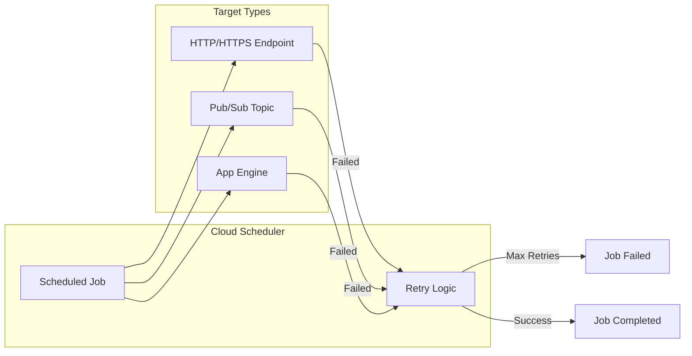
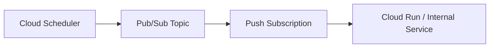

# How to Fix "Cloud Scheduler" Job Errors

Author: [nawazdhandala](https://www.github.com/nawazdhandala)

Tags: Google Cloud, Cloud Scheduler, Cron Jobs, Troubleshooting, GCP, Serverless

Description: A practical guide to diagnosing and fixing common Google Cloud Scheduler job failures, from authentication issues to target endpoint problems.

---

Cloud Scheduler is Google Cloud's managed cron job service. It triggers HTTP endpoints, Pub/Sub topics, or App Engine services on a schedule. When jobs fail, the error messages can be vague. This guide covers how to diagnose and fix the most common issues.

## Understanding Cloud Scheduler Architecture



## Permission and Authentication Errors

### Error: "PERMISSION_DENIED: The caller does not have permission"

This is the most common error. Cloud Scheduler uses a service account to call your targets.

```bash
# Check the service account used by Cloud Scheduler
gcloud scheduler jobs describe my-job --location=us-central1

# The output shows the service account in the httpTarget or pubsubTarget section
```

For HTTP targets, grant the invoker role:

```bash
# Get the Cloud Scheduler service account
PROJECT_ID=$(gcloud config get-value project)
PROJECT_NUMBER=$(gcloud projects describe $PROJECT_ID --format='value(projectNumber)')
SCHEDULER_SA="service-${PROJECT_NUMBER}@gcp-sa-cloudscheduler.iam.gserviceaccount.com"

# For Cloud Functions, grant invoker role
gcloud functions add-iam-policy-binding my-function \
    --region=us-central1 \
    --member="serviceAccount:${SCHEDULER_SA}" \
    --role="roles/cloudfunctions.invoker"

# For Cloud Run, grant invoker role
gcloud run services add-iam-policy-binding my-service \
    --region=us-central1 \
    --member="serviceAccount:${SCHEDULER_SA}" \
    --role="roles/run.invoker"
```

### Error: "UNAUTHENTICATED: Request had invalid authentication credentials"

When using OIDC tokens for authentication:

```bash
# Create or update job with proper OIDC configuration
gcloud scheduler jobs update http my-job \
    --location=us-central1 \
    --uri="https://my-service-abc123-uc.a.run.app/api/process" \
    --oidc-service-account-email="scheduler-invoker@${PROJECT_ID}.iam.gserviceaccount.com" \
    --oidc-token-audience="https://my-service-abc123-uc.a.run.app"
```

Creating a dedicated service account for Scheduler:

```bash
# Create service account
gcloud iam service-accounts create scheduler-invoker \
    --display-name="Cloud Scheduler Invoker"

# Grant necessary roles
gcloud projects add-iam-policy-binding $PROJECT_ID \
    --member="serviceAccount:scheduler-invoker@${PROJECT_ID}.iam.gserviceaccount.com" \
    --role="roles/run.invoker"

# Grant Cloud Scheduler permission to use this service account
gcloud iam service-accounts add-iam-policy-binding \
    scheduler-invoker@${PROJECT_ID}.iam.gserviceaccount.com \
    --member="serviceAccount:service-${PROJECT_NUMBER}@gcp-sa-cloudscheduler.iam.gserviceaccount.com" \
    --role="roles/iam.serviceAccountUser"
```

## HTTP Target Errors

### Error: "Could not reach backend" or "Connection refused"

The target endpoint is not accessible from Cloud Scheduler.

```bash
# Verify your endpoint is publicly accessible (for HTTP targets)
curl -I https://your-endpoint.com/api/scheduled-task

# Common issues:
# 1. Endpoint requires VPC access (not supported directly)
# 2. Firewall rules blocking traffic
# 3. Service is down or not responding
```

For internal services, use Pub/Sub as an intermediary:



```bash
# Create Pub/Sub topic
gcloud pubsub topics create scheduled-tasks

# Create push subscription to internal service
gcloud pubsub subscriptions create scheduled-tasks-sub \
    --topic=scheduled-tasks \
    --push-endpoint="https://internal-service.a.run.app/api/task" \
    --push-auth-service-account="scheduler-invoker@${PROJECT_ID}.iam.gserviceaccount.com"

# Create scheduler job targeting Pub/Sub
gcloud scheduler jobs create pubsub my-scheduled-job \
    --location=us-central1 \
    --schedule="0 * * * *" \
    --topic=scheduled-tasks \
    --message-body='{"task": "process-data"}'
```

### Error: "HTTP status code 4XX/5XX"

The target endpoint is returning an error response.

```bash
# View job execution history
gcloud scheduler jobs describe my-job --location=us-central1

# Check recent logs
gcloud logging read "resource.type=cloud_scheduler_job AND resource.labels.job_id=my-job" \
    --limit=10 \
    --format="table(timestamp, jsonPayload.status, jsonPayload.targetType)"
```

Fix your endpoint to handle the request properly:

```python
# Python Flask example - proper scheduled endpoint
from flask import Flask, request
import logging

app = Flask(__name__)

@app.route('/api/scheduled-task', methods=['POST'])
def scheduled_task():
    try:
        # Verify request is from Cloud Scheduler (optional but recommended)
        scheduler_header = request.headers.get('X-CloudScheduler', 'false')
        if scheduler_header != 'true':
            logging.warning("Request not from Cloud Scheduler")

        # Get the message body
        data = request.get_json(silent=True) or {}

        # Process the scheduled task
        result = process_scheduled_work(data)

        # Return 2XX status for success
        return {'status': 'success', 'result': result}, 200

    except Exception as e:
        logging.error(f"Scheduled task failed: {e}")
        # Return 5XX so Scheduler knows to retry
        return {'status': 'error', 'message': str(e)}, 500

def process_scheduled_work(data):
    # Your business logic here
    return "Processed successfully"
```

## Schedule Expression Errors

### Error: "Invalid schedule specification"

Cloud Scheduler uses unix-cron format with some extensions.

```bash
# Valid cron expressions
# minute hour day-of-month month day-of-week

# Every hour at minute 0
"0 * * * *"

# Every day at 2:30 AM
"30 2 * * *"

# Every Monday at 9:00 AM
"0 9 * * 1"

# Every 15 minutes
"*/15 * * * *"

# First day of every month at midnight
"0 0 1 * *"

# Weekdays at 8 AM
"0 8 * * 1-5"
```

Creating jobs with proper schedules:

```bash
# Hourly job
gcloud scheduler jobs create http hourly-cleanup \
    --location=us-central1 \
    --schedule="0 * * * *" \
    --uri="https://my-service.run.app/api/cleanup" \
    --http-method=POST \
    --time-zone="America/New_York"

# Daily job at specific time
gcloud scheduler jobs create http daily-report \
    --location=us-central1 \
    --schedule="0 6 * * *" \
    --uri="https://my-service.run.app/api/daily-report" \
    --http-method=POST \
    --time-zone="UTC"
```

### Timezone Issues

```bash
# List available timezones
gcloud scheduler jobs create http test --help | grep -A 20 "time-zone"

# Common timezones:
# UTC
# America/New_York
# America/Los_Angeles
# Europe/London
# Asia/Tokyo

# Update job timezone
gcloud scheduler jobs update http my-job \
    --location=us-central1 \
    --time-zone="America/Los_Angeles"
```

## Retry Configuration

### Error: "Max retry attempts reached"

Configure appropriate retry behavior based on your use case.

```bash
# Create job with custom retry settings
gcloud scheduler jobs create http critical-job \
    --location=us-central1 \
    --schedule="0 */4 * * *" \
    --uri="https://my-service.run.app/api/critical-task" \
    --http-method=POST \
    --attempt-deadline=180s \
    --max-retry-attempts=5 \
    --min-backoff=5s \
    --max-backoff=1h \
    --max-doublings=5
```

Understanding retry parameters:

```yaml
# Retry configuration explanation
attempt_deadline: 180s  # Max time for single attempt
max_retry_attempts: 5   # Total retry attempts
min_backoff: 5s         # Initial retry delay
max_backoff: 1h         # Maximum retry delay
max_doublings: 5        # Times to double backoff before using max

# Backoff sequence example:
# Attempt 1: immediate
# Attempt 2: 5s delay
# Attempt 3: 10s delay
# Attempt 4: 20s delay
# Attempt 5: 40s delay
# Attempt 6: 80s delay (capped at max_backoff if exceeded)
```

## Pub/Sub Target Errors

### Error: "Topic not found" or "Permission denied on topic"

```bash
# Verify topic exists
gcloud pubsub topics describe my-topic

# Create topic if missing
gcloud pubsub topics create my-topic

# Grant Scheduler permission to publish
PROJECT_NUMBER=$(gcloud projects describe $PROJECT_ID --format='value(projectNumber)')

gcloud pubsub topics add-iam-policy-binding my-topic \
    --member="serviceAccount:service-${PROJECT_NUMBER}@gcp-sa-cloudscheduler.iam.gserviceaccount.com" \
    --role="roles/pubsub.publisher"
```

### Error: "Message too large"

Pub/Sub messages have a 10MB limit, but keep scheduled payloads small.

```bash
# Create job with proper message body
gcloud scheduler jobs create pubsub data-processor \
    --location=us-central1 \
    --schedule="0 * * * *" \
    --topic=processing-tasks \
    --message-body='{"action": "process", "batch_size": 1000}' \
    --attributes="priority=high,source=scheduler"
```

## Debugging and Monitoring

### View Job Execution Logs

```bash
# Get job run history
gcloud scheduler jobs describe my-job \
    --location=us-central1 \
    --format="yaml(state, lastAttemptTime, scheduleTime, status)"

# View detailed logs in Cloud Logging
gcloud logging read '
resource.type="cloud_scheduler_job"
resource.labels.job_id="my-job"
severity>=WARNING
' --limit=20 --format=json

# Monitor with custom dashboard query
# Metric: cloudscheduler.googleapis.com/job/attempt_count
# Filter by: status="failed"
```

### Manual Job Trigger for Testing

```bash
# Run job immediately for testing
gcloud scheduler jobs run my-job --location=us-central1

# Watch logs in real-time
gcloud logging tail "resource.type=cloud_scheduler_job AND resource.labels.job_id=my-job"
```

### Health Check Script

```bash
#!/bin/bash
# check-scheduler-jobs.sh

PROJECT_ID=$(gcloud config get-value project)
LOCATION="us-central1"

echo "Checking Cloud Scheduler jobs in $PROJECT_ID..."

# List all jobs and their status
gcloud scheduler jobs list --location=$LOCATION \
    --format="table(name, state, schedule, lastAttemptTime, status.code)"

# Check for failed jobs
echo -e "\nJobs with recent failures:"
gcloud logging read '
resource.type="cloud_scheduler_job"
jsonPayload.status.code!=200
timestamp>="'$(date -u -v-1H +%Y-%m-%dT%H:%M:%SZ)'"
' --limit=10 --format="table(timestamp, resource.labels.job_id, jsonPayload.status.code)"
```

## Best Practices

### Idempotent Endpoints

Your scheduled endpoints should be idempotent since retries may cause duplicate calls.

```python
# Good - Idempotent endpoint
@app.route('/api/process-day', methods=['POST'])
def process_day():
    # Use the scheduled time, not current time
    scheduled_time = request.headers.get('X-CloudScheduler-ScheduleTime')

    # Check if already processed
    date_key = scheduled_time[:10]  # Extract date
    if redis_client.get(f"processed:{date_key}"):
        return {'status': 'already_processed'}, 200

    # Process and mark as done
    result = do_processing(date_key)
    redis_client.setex(f"processed:{date_key}", 86400 * 7, "1")

    return {'status': 'success', 'result': result}, 200
```

### Timeout Configuration

```bash
# Set appropriate timeouts
# attempt-deadline should be less than your function/service timeout

# For Cloud Functions (max 540s for gen2)
gcloud scheduler jobs update http my-cf-job \
    --location=us-central1 \
    --attempt-deadline=300s

# For Cloud Run (max 3600s)
gcloud scheduler jobs update http my-run-job \
    --location=us-central1 \
    --attempt-deadline=900s
```

---

Cloud Scheduler errors usually stem from authentication issues, unreachable endpoints, or misconfigured retry policies. Use dedicated service accounts with minimal permissions, verify your endpoints return proper HTTP status codes, and configure retries based on your reliability requirements. When in doubt, use Pub/Sub as an intermediary for better reliability and decoupling.
