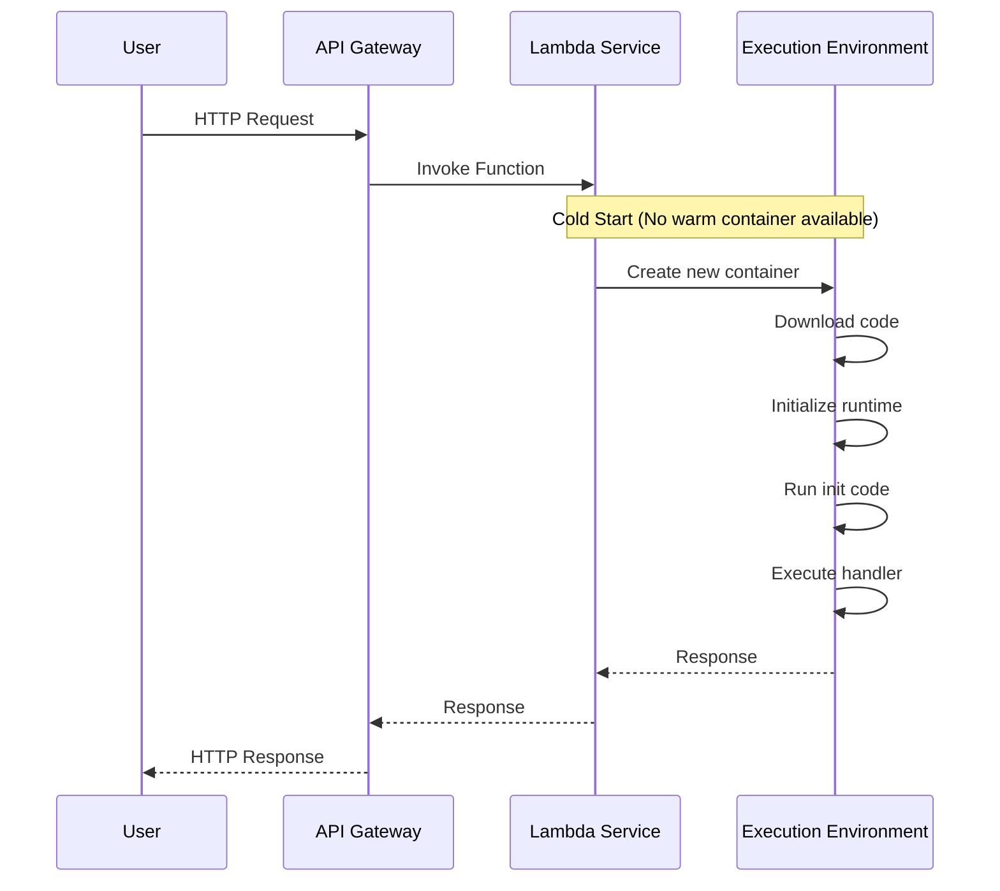
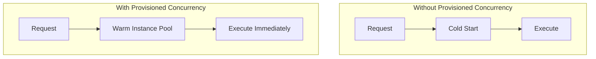
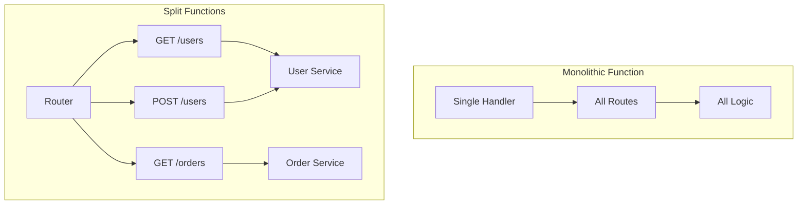

# How to Fix "Cold Start" Serverless Issues

Author: [nawazdhandala](https://www.github.com/nawazdhandala)

Tags: Serverless, AWS Lambda, Performance, Cold Start, Cloud Functions, Optimization

Description: A practical guide to reducing serverless cold start latency with provisioned concurrency, code optimization, and architectural patterns.

---

Cold starts occur when a serverless function needs to initialize a new execution environment before processing a request. This adds latency that can range from a few hundred milliseconds to several seconds. This guide covers practical techniques to minimize cold start impact.

## Understanding Cold Starts



Cold start time consists of:
- Container initialization (100-300ms)
- Runtime initialization (varies by language)
- Your initialization code (depends on what you load)

## Measuring Cold Starts

First, understand your baseline. Use this wrapper to track cold starts:

```javascript
// Lambda handler with cold start tracking
let isWarm = false;
let initTime = Date.now();

export const handler = async (event, context) => {
    const startTime = Date.now();
    const wasColdStart = !isWarm;
    isWarm = true;

    try {
        const result = await processRequest(event);

        // Log timing metrics
        const duration = Date.now() - startTime;
        console.log(JSON.stringify({
            requestId: context.awsRequestId,
            coldStart: wasColdStart,
            initDuration: wasColdStart ? startTime - initTime : 0,
            executionDuration: duration,
            memoryUsed: process.memoryUsage().heapUsed,
            memoryLimit: context.memoryLimitInMB
        }));

        return result;
    } catch (error) {
        console.error('Handler error:', error);
        throw error;
    }
};
```

Query cold start frequency with CloudWatch Insights:

```
fields @timestamp, @requestId, @duration, @billedDuration, @initDuration
| filter @type = "REPORT"
| filter ispresent(@initDuration)
| stats count() as coldStarts,
        avg(@initDuration) as avgInitTime,
        max(@initDuration) as maxInitTime,
        pct(@initDuration, 95) as p95InitTime
by bin(1h)
```

## Code Optimization Strategies

### 1. Lazy Loading

Only load modules when needed, not at initialization time.

```javascript
// Bad: Loads AWS SDK at init time even if not needed
const AWS = require('aws-sdk');
const s3 = new AWS.S3();
const dynamodb = new AWS.DynamoDB.DocumentClient();

// Good: Lazy load only what is needed
let s3Client;
let dynamoClient;

function getS3() {
    if (!s3Client) {
        const { S3 } = require('@aws-sdk/client-s3');
        s3Client = new S3();
    }
    return s3Client;
}

function getDynamo() {
    if (!dynamoClient) {
        const { DynamoDB } = require('@aws-sdk/lib-dynamodb');
        dynamoClient = DynamoDB.from(
            new (require('@aws-sdk/client-dynamodb')).DynamoDBClient()
        );
    }
    return dynamoClient;
}

export const handler = async (event) => {
    // Only initializes S3 client if this path is hit
    if (event.path === '/upload') {
        const s3 = getS3();
        // Use S3
    }

    // Only initializes DynamoDB if this path is hit
    if (event.path === '/data') {
        const db = getDynamo();
        // Use DynamoDB
    }
};
```

### 2. Reduce Bundle Size

Smaller packages mean faster cold starts. Use bundling to include only what you need.

```javascript
// esbuild.config.js - Bundle for Lambda
const esbuild = require('esbuild');

esbuild.build({
    entryPoints: ['src/handler.js'],
    bundle: true,
    minify: true,
    platform: 'node',
    target: 'node18',
    outfile: 'dist/handler.js',
    external: [
        // Keep AWS SDK external (included in Lambda runtime)
        '@aws-sdk/*'
    ],
    // Tree shaking removes unused code
    treeShaking: true,
    // Analyze bundle size
    metafile: true
}).then(result => {
    // Print bundle analysis
    const outputs = Object.entries(result.metafile.outputs);
    for (const [file, info] of outputs) {
        console.log(`${file}: ${(info.bytes / 1024).toFixed(2)} KB`);
    }
});
```

### 3. Connection Reuse

Keep database connections outside the handler to reuse across invocations.

```javascript
import { Pool } from 'pg';

// Connection pool created outside handler
// Reused across warm invocations
let pool;

function getPool() {
    if (!pool) {
        pool = new Pool({
            host: process.env.DB_HOST,
            database: process.env.DB_NAME,
            user: process.env.DB_USER,
            password: process.env.DB_PASSWORD,
            max: 1,  // Single connection for Lambda
            idleTimeoutMillis: 120000,
            connectionTimeoutMillis: 5000
        });
    }
    return pool;
}

export const handler = async (event) => {
    const db = getPool();

    // Reuses existing connection if warm
    const result = await db.query('SELECT * FROM users WHERE id = $1', [
        event.pathParameters.id
    ]);

    return {
        statusCode: 200,
        body: JSON.stringify(result.rows[0])
    };
};
```

## Provisioned Concurrency

Keep a specified number of function instances warm and ready.



### AWS Lambda Configuration

```yaml
# serverless.yml
service: my-api

provider:
  name: aws
  runtime: nodejs18.x

functions:
  api:
    handler: src/handler.main
    memorySize: 1024
    timeout: 10

    # Provisioned concurrency settings
    provisionedConcurrency: 5

    # Or use auto-scaling for provisioned concurrency
    # provisionedConcurrency: ${self:custom.provisionedConcurrency.${opt:stage, 'dev'}}

custom:
  provisionedConcurrency:
    dev: 1
    staging: 3
    prod: 10
```

### Auto-Scaling Provisioned Concurrency

Scale provisioned instances based on traffic patterns:

```yaml
# CloudFormation for auto-scaling provisioned concurrency
Resources:
  ApiScalableTarget:
    Type: AWS::ApplicationAutoScaling::ScalableTarget
    Properties:
      MaxCapacity: 50
      MinCapacity: 5
      ResourceId: !Sub function:${ApiLambdaFunction}:${ApiLambdaFunction.Version}
      RoleARN: !GetAtt AutoScalingRole.Arn
      ScalableDimension: lambda:function:ProvisionedConcurrency
      ServiceNamespace: lambda

  ApiScalingPolicy:
    Type: AWS::ApplicationAutoScaling::ScalingPolicy
    Properties:
      PolicyName: ApiUtilizationPolicy
      PolicyType: TargetTrackingScaling
      ScalingTargetId: !Ref ApiScalableTarget
      TargetTrackingScalingPolicyConfiguration:
        # Scale when 70% of provisioned instances are used
        TargetValue: 0.7
        PredefinedMetricSpecification:
          PredefinedMetricType: LambdaProvisionedConcurrencyUtilization
        ScaleInCooldown: 300
        ScaleOutCooldown: 60
```

### Scheduled Warming

Use scheduled events to keep functions warm during expected traffic:

```yaml
# serverless.yml - Schedule warming events
functions:
  api:
    handler: src/handler.main
    events:
      - http:
          path: /api/{proxy+}
          method: any
      # Warm the function every 5 minutes during business hours
      - schedule:
          rate: rate(5 minutes)
          enabled: true
          input:
            source: 'serverless-warmup'
            warmupRequest: true
```

```javascript
// Handler that detects and short-circuits warmup requests
export const handler = async (event, context) => {
    // Check if this is a warmup request
    if (event.source === 'serverless-warmup') {
        console.log('Warmup request - keeping container alive');
        return { statusCode: 200, body: 'Warmed' };
    }

    // Normal request processing
    return processRequest(event);
};
```

## Runtime Selection

Different runtimes have different cold start characteristics:

```mermaid
gantt
    title Average Cold Start Times by Runtime
    dateFormat X
    axisFormat %L ms

    section Runtimes
    Python 3.x     :0, 200
    Node.js 18.x   :0, 250
    Go 1.x         :0, 100
    Java 17        :0, 800
    .NET 6         :0, 400
```



### Optimizing Node.js

```javascript
// Use ES modules for better tree shaking
// package.json: "type": "module"

// Use specific imports instead of full SDK
// Bad
import AWS from 'aws-sdk';
// Good
import { S3Client, GetObjectCommand } from '@aws-sdk/client-s3';

// Avoid top-level await in initialization
// Bad: Blocks container init
const config = await fetchConfig();

// Good: Lazy fetch in handler
let config;
async function getConfig() {
    if (!config) {
        config = await fetchConfig();
    }
    return config;
}
```

### Optimizing Java

Java has the highest cold start times, but several techniques can help:

```java
// Use GraalVM native image for faster startup
// Or use SnapStart (AWS Lambda)

// Minimize dependencies in build.gradle
dependencies {
    // Use lightweight HTTP client
    implementation 'software.amazon.awssdk:url-connection-client'

    // Avoid full SDK, use only needed services
    implementation 'software.amazon.awssdk:dynamodb'
}

// Use static initialization carefully
public class Handler implements RequestHandler<APIGatewayProxyRequestEvent, APIGatewayProxyResponseEvent> {

    // Initialize once, reuse across invocations
    private static final DynamoDbClient dynamoDb = DynamoDbClient.builder()
        .httpClient(UrlConnectionHttpClient.builder().build())
        .build();

    @Override
    public APIGatewayProxyResponseEvent handleRequest(
        APIGatewayProxyRequestEvent event,
        Context context
    ) {
        // Handler code
    }
}
```

## Architecture Patterns

### Keep Functions Small

Split large functions into smaller, focused ones:



### Use HTTP Keep-Alive

Enable connection reuse for downstream services:

```javascript
import https from 'https';
import { NodeHttpHandler } from '@aws-sdk/node-http-handler';

// Configure keep-alive for AWS SDK
const httpHandler = new NodeHttpHandler({
    httpsAgent: new https.Agent({
        keepAlive: true,
        maxSockets: 50
    })
});

const dynamoClient = new DynamoDBClient({
    requestHandler: httpHandler
});
```

## Monitoring Cold Starts

Set up CloudWatch alarms for cold start frequency:

```yaml
# CloudFormation alarm for cold starts
Resources:
  ColdStartAlarm:
    Type: AWS::CloudWatch::Alarm
    Properties:
      AlarmName: HighColdStartRate
      AlarmDescription: Cold start rate exceeds 10%
      MetricName: ColdStarts
      Namespace: Custom/Lambda
      Statistic: Sum
      Period: 300
      EvaluationPeriods: 3
      Threshold: 10
      ComparisonOperator: GreaterThanThreshold
      TreatMissingData: notBreaching
```

Custom metric for cold start tracking:

```javascript
import { CloudWatch } from '@aws-sdk/client-cloudwatch';

const cloudwatch = new CloudWatch();

async function reportColdStart(functionName, initDuration) {
    await cloudwatch.putMetricData({
        Namespace: 'Custom/Lambda',
        MetricData: [
            {
                MetricName: 'ColdStarts',
                Value: 1,
                Unit: 'Count',
                Dimensions: [
                    { Name: 'FunctionName', Value: functionName }
                ]
            },
            {
                MetricName: 'InitDuration',
                Value: initDuration,
                Unit: 'Milliseconds',
                Dimensions: [
                    { Name: 'FunctionName', Value: functionName }
                ]
            }
        ]
    });
}
```

## Best Practices Summary

1. **Measure first** - Understand your cold start baseline before optimizing
2. **Minimize bundle size** - Use tree shaking and only import what you need
3. **Lazy load dependencies** - Initialize expensive resources only when needed
4. **Reuse connections** - Keep database and HTTP connections outside the handler
5. **Consider provisioned concurrency** - For latency-sensitive workloads
6. **Choose the right runtime** - Go and Python have the fastest cold starts
7. **Monitor continuously** - Track cold start frequency and duration

---

Cold starts are an inherent part of serverless architecture, but their impact can be minimized. Start by measuring your current cold start metrics, then apply optimizations based on your specific workload. For latency-critical paths, provisioned concurrency ensures consistent performance.
