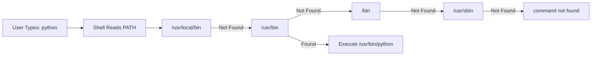
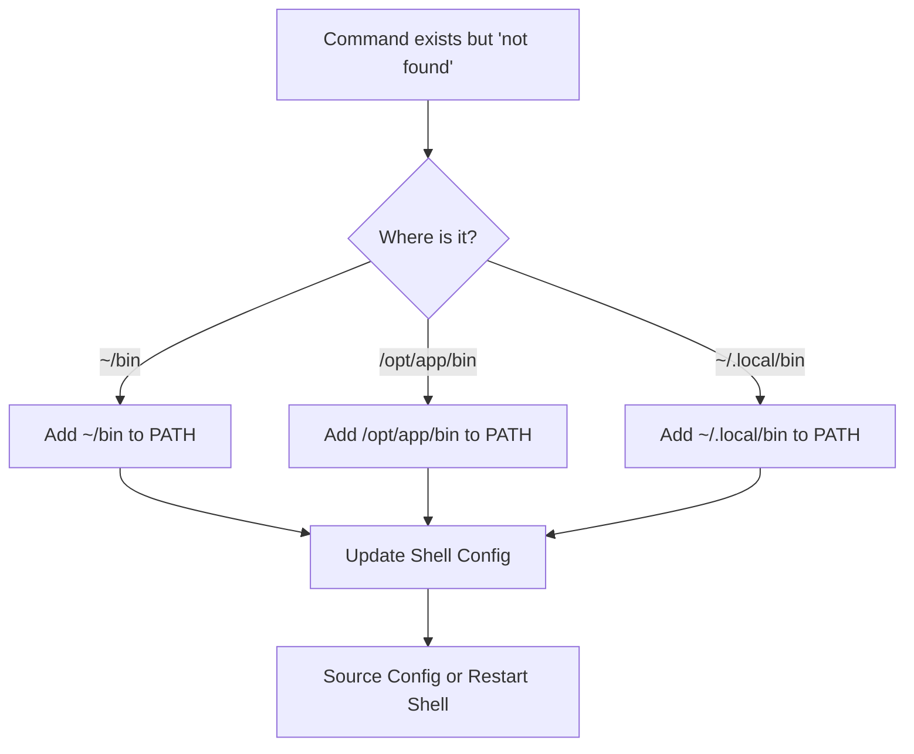

# How to Fix 'Command Not Found' PATH Errors

Author: [nawazdhandala](https://github.com/nawazdhandala)

Tags: Linux, System Administration, Troubleshooting, Shell, PATH, Environment Variables

Description: Learn how to diagnose and fix 'command not found' errors in Linux by understanding PATH configuration, locating executables, and properly setting environment variables.

---

The "command not found" error is one of the most common issues Linux users encounter. While it might seem simple, the underlying causes can range from typos to complex PATH misconfigurations. This guide covers everything you need to know to diagnose and fix these errors.

## Understanding the PATH Variable

The PATH environment variable tells the shell where to look for executable files. When you type a command, the shell searches through directories listed in PATH from left to right.



### View Current PATH

```bash
# Display PATH variable
echo $PATH

# Example output:
# /usr/local/bin:/usr/bin:/bin:/usr/sbin:/sbin:/home/user/bin

# Display PATH with each directory on a new line (easier to read)
echo $PATH | tr ':' '\n'

# Show PATH with numbers
echo $PATH | tr ':' '\n' | nl
```

## Diagnosing "Command Not Found"

### Step 1: Check if the Command Exists

```bash
# Check if command is installed
which python
# or
type python
# or
command -v python

# Search for command in common locations
whereis python

# Find all instances of a command
type -a python

# Search entire system (slow but thorough)
find / -name "python*" -type f 2>/dev/null
```

### Step 2: Verify the Command Location

```bash
# Check if the command exists but is not in PATH
# Common locations to check:

# User-specific binaries
ls -la ~/bin/
ls -la ~/.local/bin/

# System binaries
ls -la /usr/local/bin/
ls -la /opt/*/bin/

# Application-specific paths
ls -la /snap/bin/           # Snap packages
ls -la ~/.cargo/bin/        # Rust
ls -la ~/go/bin/            # Go
ls -la ~/.npm-global/bin/   # npm global
ls -la /usr/local/go/bin/   # Go system-wide
```

### Step 3: Check Installation

```bash
# Debian/Ubuntu - check if package is installed
dpkg -l | grep package-name
apt list --installed | grep package-name

# RHEL/CentOS - check if package is installed
rpm -qa | grep package-name
yum list installed | grep package-name

# Find which package provides a command
# Debian/Ubuntu
apt-file search /usr/bin/command-name
# or
dpkg -S /usr/bin/command-name

# RHEL/CentOS
yum provides */command-name
# or
rpm -qf /usr/bin/command-name
```

## Common Causes and Fixes

### Cause 1: Command Not Installed

```bash
# Install missing command
# Debian/Ubuntu
apt-get update
apt-get install package-name

# RHEL/CentOS
yum install package-name
# or
dnf install package-name

# Example: "python3 command not found"
apt-get install python3  # Debian/Ubuntu
yum install python3      # RHEL/CentOS
```

### Cause 2: Directory Not in PATH



```bash
# Add directory to PATH temporarily (current session only)
export PATH="$PATH:/path/to/directory"

# Add directory to PATH permanently
# For Bash - add to ~/.bashrc
echo 'export PATH="$PATH:/path/to/directory"' >> ~/.bashrc
source ~/.bashrc

# For Zsh - add to ~/.zshrc
echo 'export PATH="$PATH:/path/to/directory"' >> ~/.zshrc
source ~/.zshrc

# For all users - add to /etc/profile.d/
# Create file: /etc/profile.d/custom-path.sh
echo 'export PATH="$PATH:/path/to/directory"' | sudo tee /etc/profile.d/custom-path.sh
```

### Cause 3: Missing Shebang or Execute Permission

```bash
# Check if script has execute permission
ls -la /path/to/script

# Add execute permission
chmod +x /path/to/script

# Check shebang line (first line of script)
head -1 /path/to/script
# Should be something like: #!/bin/bash or #!/usr/bin/env python3

# If shebang is missing or wrong, edit the file
# Add appropriate shebang at the beginning:
# #!/bin/bash        - for bash scripts
# #!/usr/bin/env python3  - for Python scripts
# #!/usr/bin/env node     - for Node.js scripts
```

### Cause 4: Wrong Shell Configuration

```bash
# Check which shell you are using
echo $SHELL
echo $0

# Check if PATH is set correctly in shell config
# For Bash
grep -n PATH ~/.bashrc ~/.bash_profile ~/.profile 2>/dev/null

# For Zsh
grep -n PATH ~/.zshrc ~/.zprofile 2>/dev/null

# Common issue: PATH being overwritten instead of appended
# Wrong:
export PATH="/usr/local/bin"
# Correct:
export PATH="$PATH:/usr/local/bin"
# Or prepend (higher priority):
export PATH="/usr/local/bin:$PATH"
```

### Cause 5: Sudo PATH Differences

```bash
# Regular user PATH
echo $PATH

# Root user PATH (often different)
sudo env | grep PATH

# When sudo strips PATH, use full path
sudo /usr/local/bin/mycommand

# Or preserve PATH with sudo
sudo env "PATH=$PATH" mycommand

# Or configure sudo to preserve PATH
# Edit /etc/sudoers with visudo and add:
# Defaults    env_keep += "PATH"

# Or use secure_path in sudoers
# Defaults    secure_path="/usr/local/sbin:/usr/local/bin:/usr/sbin:/usr/bin:/sbin:/bin"
```

### Cause 6: Symlink Issues

```bash
# Check if command is a broken symlink
ls -la $(which command-name)

# Find and remove broken symlinks
find /usr/local/bin -xtype l

# Recreate symlink if needed
sudo ln -sf /actual/path/to/binary /usr/local/bin/command-name
```

## Shell Configuration Files

Understanding which configuration files are loaded helps fix PATH issues.

```mermaid
flowchart TD
    subgraph "Bash Startup Files"
        A[Login Shell] --> B[/etc/profile]
        B --> C[~/.bash_profile OR ~/.bash_login OR ~/.profile]
        C --> D[~/.bashrc usually sourced]

        E[Non-Login Interactive] --> F[~/.bashrc]

        G[Non-Interactive] --> H[BASH_ENV if set]
    end
```

### Bash Configuration

```bash
# Login shells (ssh, console login) read in order:
# 1. /etc/profile
# 2. ~/.bash_profile (or ~/.bash_login or ~/.profile)

# Interactive non-login shells (new terminal window) read:
# 1. ~/.bashrc

# Best practice: Put PATH modifications in ~/.bashrc
# and source ~/.bashrc from ~/.bash_profile

# ~/.bash_profile
if [ -f ~/.bashrc ]; then
    source ~/.bashrc
fi

# ~/.bashrc - add PATH modifications here
export PATH="$HOME/bin:$HOME/.local/bin:$PATH"
```

### Zsh Configuration

```bash
# Zsh reads these files in order:
# 1. /etc/zshenv (always)
# 2. ~/.zshenv (always)
# 3. /etc/zprofile (login shells)
# 4. ~/.zprofile (login shells)
# 5. /etc/zshrc (interactive)
# 6. ~/.zshrc (interactive)
# 7. /etc/zlogin (login shells)
# 8. ~/.zlogin (login shells)

# Best practice for Zsh - add PATH to ~/.zshrc
export PATH="$HOME/bin:$HOME/.local/bin:$PATH"
```

## Application-Specific PATH Fixes

### Python

```bash
# pip installed packages not found
# Check pip installation location
pip show package-name | grep Location

# Add pip user directory to PATH
export PATH="$HOME/.local/bin:$PATH"

# For pyenv
export PYENV_ROOT="$HOME/.pyenv"
export PATH="$PYENV_ROOT/bin:$PATH"
eval "$(pyenv init --path)"
```

### Node.js / npm

```bash
# npm global packages not found
# Check npm global prefix
npm config get prefix

# Add npm global bin to PATH
export PATH="$(npm config get prefix)/bin:$PATH"

# For nvm (Node Version Manager)
export NVM_DIR="$HOME/.nvm"
[ -s "$NVM_DIR/nvm.sh" ] && source "$NVM_DIR/nvm.sh"
```

### Ruby / rbenv

```bash
# rbenv shims not found
export PATH="$HOME/.rbenv/bin:$PATH"
eval "$(rbenv init -)"

# RubyGems user install
export PATH="$HOME/.gem/ruby/3.0.0/bin:$PATH"
```

### Go

```bash
# Go binaries not found
export GOPATH="$HOME/go"
export PATH="$PATH:$GOPATH/bin"
export PATH="$PATH:/usr/local/go/bin"
```

### Rust / Cargo

```bash
# Cargo installed binaries not found
export PATH="$HOME/.cargo/bin:$PATH"

# Or source the cargo environment
source "$HOME/.cargo/env"
```

## Debugging PATH Issues

### Trace Shell Startup

```bash
# Debug bash startup
bash -x -l -c 'echo $PATH' 2>&1 | grep PATH

# Debug zsh startup
zsh -x -l -c 'echo $PATH' 2>&1 | grep PATH

# Check where PATH is modified
grep -r "PATH" ~/.bashrc ~/.bash_profile ~/.profile /etc/profile /etc/profile.d/ 2>/dev/null
```

### Create Diagnostic Script

```bash
#!/bin/bash
# Save as ~/bin/diagnose-path.sh

echo "=== PATH Diagnostic Tool ==="
echo ""

echo "Current Shell: $SHELL"
echo "Running as: $0"
echo ""

echo "=== Current PATH ==="
echo $PATH | tr ':' '\n' | nl
echo ""

echo "=== Non-existent PATH directories ==="
echo $PATH | tr ':' '\n' | while read dir; do
    if [ ! -d "$dir" ]; then
        echo "MISSING: $dir"
    fi
done
echo ""

echo "=== Duplicate PATH entries ==="
echo $PATH | tr ':' '\n' | sort | uniq -d
echo ""

echo "=== Shell Configuration Files ==="
for f in ~/.bashrc ~/.bash_profile ~/.profile ~/.zshrc ~/.zprofile /etc/profile; do
    if [ -f "$f" ]; then
        echo "EXISTS: $f"
        grep -c "PATH" "$f" 2>/dev/null && echo "  (contains PATH references)"
    fi
done
echo ""

if [ -n "$1" ]; then
    echo "=== Searching for: $1 ==="
    echo "which: $(which $1 2>/dev/null || echo 'not found')"
    echo "type: $(type $1 2>/dev/null || echo 'not found')"
    echo "whereis: $(whereis $1)"
    echo ""
    echo "Searching filesystem..."
    find /usr /opt $HOME -name "$1*" -type f 2>/dev/null | head -10
fi
```

## Quick Reference

| Problem | Solution |
|---------|----------|
| Command not installed | `apt-get install package` or `yum install package` |
| Directory not in PATH | `export PATH="$PATH:/new/directory"` |
| Changes not persisting | Add to `~/.bashrc` or `~/.zshrc` |
| Works for user, not sudo | Use full path or configure sudoers |
| Symlink broken | `ln -sf /real/path /usr/local/bin/cmd` |
| No execute permission | `chmod +x /path/to/script` |
| Wrong shell config | Check `~/.bashrc` vs `~/.bash_profile` |

## PATH Best Practices

```bash
# 1. Always append to PATH, don't overwrite
export PATH="$PATH:/new/path"

# 2. Use $HOME instead of ~ in scripts
export PATH="$HOME/bin:$PATH"

# 3. Check if directory exists before adding
if [ -d "$HOME/bin" ]; then
    export PATH="$HOME/bin:$PATH"
fi

# 4. Avoid duplicate entries
add_to_path() {
    case ":$PATH:" in
        *":$1:"*) ;;  # Already in PATH
        *) export PATH="$1:$PATH" ;;
    esac
}
add_to_path "$HOME/bin"

# 5. Put user paths before system paths for priority
export PATH="$HOME/bin:$HOME/.local/bin:$PATH"
```

## Conclusion

The "command not found" error usually comes down to one of a few issues: the command is not installed, it is installed but not in your PATH, or there is a configuration problem. Start by verifying the command exists on your system, then check your PATH configuration. Remember that different shells and login types load different configuration files, and sudo may use a different PATH than your regular user. With systematic debugging and proper understanding of how PATH works, these errors become easy to resolve.
