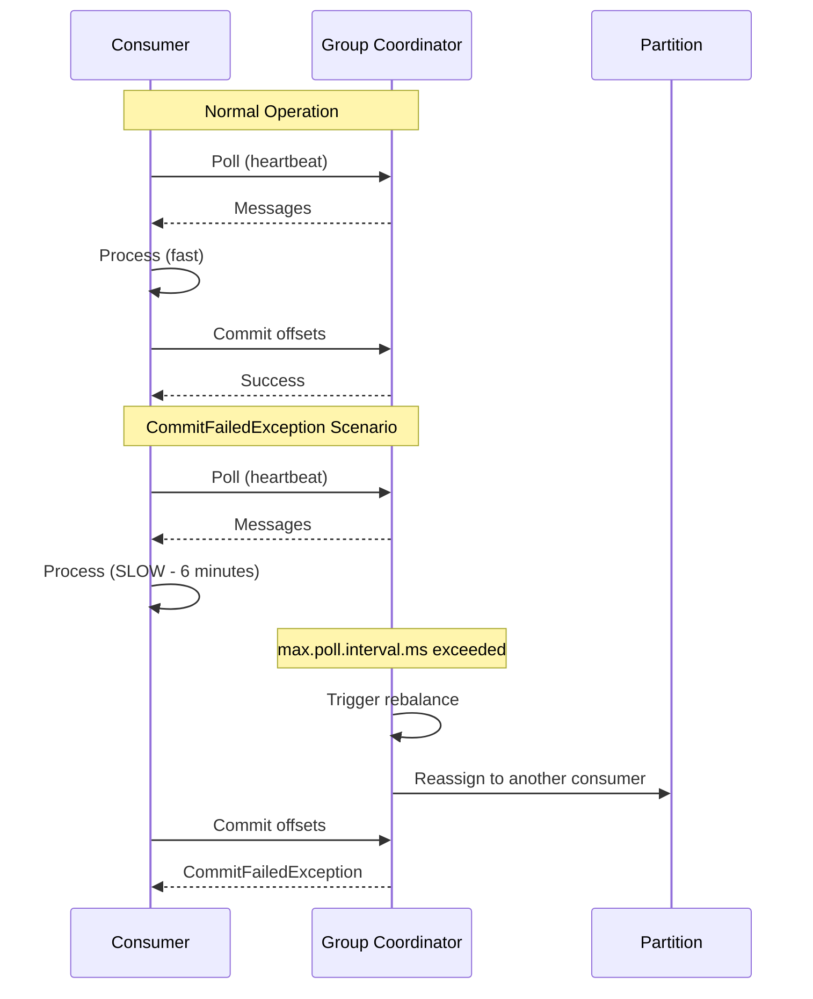
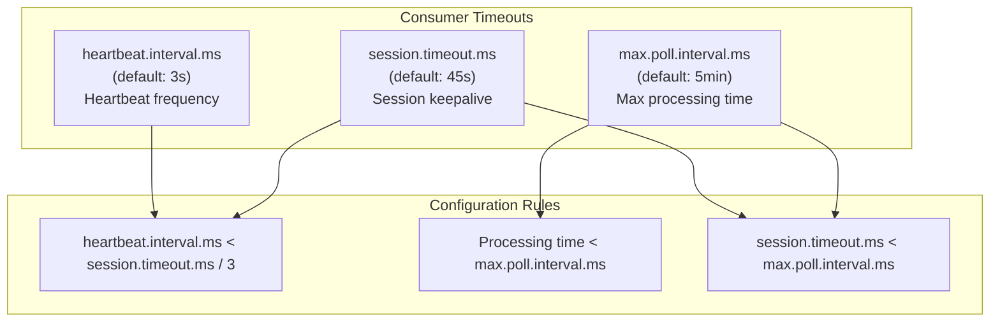
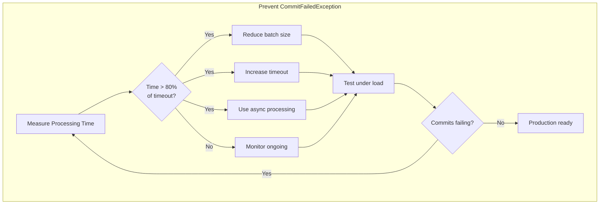

# How to Fix 'CommitFailedException' in Kafka Consumer

Author: [nawazdhandala](https://www.github.com/nawazdhandala)

Tags: Kafka, Consumer, CommitFailedException, Troubleshooting, Rebalancing, Session Timeout, Offset Management

Description: A detailed guide to diagnosing and fixing Kafka's CommitFailedException, including proper timeout configuration and processing strategies.

---

The `CommitFailedException` is a common error in Kafka consumers that occurs when a consumer tries to commit offsets but is no longer part of its consumer group. This typically happens due to session timeouts during long message processing. This guide explains the root causes and provides practical solutions.

## Understanding the Error

When you see this exception:

```
org.apache.kafka.clients.consumer.CommitFailedException: Commit cannot be completed since the group has already rebalanced and assigned the partitions to another member. This means that the time between subsequent calls to poll() was longer than the configured max.poll.interval.ms, which typically implies that the poll loop is spending too much time message processing. You can address this either by increasing max.poll.interval.ms or by reducing the maximum size of batches returned in poll() with max.poll.records.
```

It means your consumer took too long to process messages and was kicked out of the consumer group.

## Root Causes



## Key Timeout Parameters

Understanding the relationship between timeout parameters is critical:



| Parameter | Default | Purpose |
|-----------|---------|---------|
| max.poll.interval.ms | 300000 (5 min) | Max time between poll() calls |
| session.timeout.ms | 45000 (45 sec) | Time before consumer is considered dead |
| heartbeat.interval.ms | 3000 (3 sec) | Frequency of heartbeats to coordinator |
| max.poll.records | 500 | Maximum records returned per poll |

## Solution 1: Increase Processing Timeout

If your processing legitimately takes a long time:

```java
import org.apache.kafka.clients.consumer.ConsumerConfig;
import java.util.Properties;

public class LongProcessingConsumer {

    public static Properties getConsumerConfig() {
        Properties props = new Properties();

        props.put(ConsumerConfig.BOOTSTRAP_SERVERS_CONFIG, "localhost:9092");
        props.put(ConsumerConfig.GROUP_ID_CONFIG, "my-consumer-group");

        // Deserializers
        props.put(ConsumerConfig.KEY_DESERIALIZER_CLASS_CONFIG,
            "org.apache.kafka.common.serialization.StringDeserializer");
        props.put(ConsumerConfig.VALUE_DESERIALIZER_CLASS_CONFIG,
            "org.apache.kafka.common.serialization.StringDeserializer");

        // Increase max poll interval for long processing (10 minutes)
        props.put(ConsumerConfig.MAX_POLL_INTERVAL_MS_CONFIG, 600000);

        // Reduce records per poll to limit processing time per batch
        props.put(ConsumerConfig.MAX_POLL_RECORDS_CONFIG, 100);

        // Session timeout (must be less than max.poll.interval.ms)
        props.put(ConsumerConfig.SESSION_TIMEOUT_MS_CONFIG, 60000);

        // Heartbeat interval (should be 1/3 of session timeout)
        props.put(ConsumerConfig.HEARTBEAT_INTERVAL_MS_CONFIG, 20000);

        return props;
    }
}
```

### Spring Boot Configuration

```yaml
spring:
  kafka:
    consumer:
      bootstrap-servers: localhost:9092
      group-id: my-consumer-group
      # Increase max poll interval for slow processing
      properties:
        max.poll.interval.ms: 600000
        max.poll.records: 100
        session.timeout.ms: 60000
        heartbeat.interval.ms: 20000
```

## Solution 2: Reduce Batch Size

Process fewer messages at a time:

```java
public class SmallBatchConsumer {

    public static Properties getConsumerConfig() {
        Properties props = new Properties();

        props.put(ConsumerConfig.BOOTSTRAP_SERVERS_CONFIG, "localhost:9092");
        props.put(ConsumerConfig.GROUP_ID_CONFIG, "small-batch-group");

        // Fetch only 10 records at a time
        props.put(ConsumerConfig.MAX_POLL_RECORDS_CONFIG, 10);

        // Reduce fetch size to get smaller batches
        props.put(ConsumerConfig.FETCH_MAX_BYTES_CONFIG, 1048576); // 1MB
        props.put(ConsumerConfig.MAX_PARTITION_FETCH_BYTES_CONFIG, 262144); // 256KB

        // Keep default timeout since batches are small
        props.put(ConsumerConfig.MAX_POLL_INTERVAL_MS_CONFIG, 300000);

        return props;
    }

    public void consume() {
        KafkaConsumer<String, String> consumer = new KafkaConsumer<>(getConsumerConfig());
        consumer.subscribe(Arrays.asList("my-topic"));

        while (true) {
            // Poll returns at most 10 records (max.poll.records)
            ConsumerRecords<String, String> records = consumer.poll(Duration.ofMillis(100));

            System.out.printf("Processing batch of %d records%n", records.count());

            for (ConsumerRecord<String, String> record : records) {
                processRecord(record); // Process one at a time
            }

            // Commit after each small batch
            consumer.commitSync();
        }
    }
}
```

## Solution 3: Asynchronous Processing with Pause/Resume

Process messages asynchronously while keeping the consumer alive:

```java
import java.util.concurrent.*;
import java.util.*;

public class AsyncProcessingConsumer {

    private final KafkaConsumer<String, String> consumer;
    private final ExecutorService executor;
    private final BlockingQueue<ProcessingTask> taskQueue;
    private final int maxPendingTasks;

    public AsyncProcessingConsumer(Properties props, int threadPoolSize, int maxPending) {
        this.consumer = new KafkaConsumer<>(props);
        this.executor = Executors.newFixedThreadPool(threadPoolSize);
        this.taskQueue = new LinkedBlockingQueue<>(maxPending);
        this.maxPendingTasks = maxPending;
    }

    /**
     * Main consume loop with pause/resume for backpressure.
     */
    public void consume(String topic) {
        consumer.subscribe(Collections.singletonList(topic));

        // Track pending tasks for offset management
        Map<TopicPartition, OffsetAndMetadata> pendingOffsets = new ConcurrentHashMap<>();
        Set<TopicPartition> pausedPartitions = new HashSet<>();

        while (true) {
            // Check if we need to pause due to backpressure
            if (taskQueue.size() >= maxPendingTasks) {
                // Pause all assigned partitions
                Set<TopicPartition> assigned = consumer.assignment();
                if (!assigned.isEmpty() && pausedPartitions.isEmpty()) {
                    consumer.pause(assigned);
                    pausedPartitions.addAll(assigned);
                    System.out.println("Paused consumption due to backpressure");
                }
            } else if (!pausedPartitions.isEmpty()) {
                // Resume consumption
                consumer.resume(pausedPartitions);
                pausedPartitions.clear();
                System.out.println("Resumed consumption");
            }

            // Poll - this also sends heartbeats
            ConsumerRecords<String, String> records = consumer.poll(Duration.ofMillis(100));

            for (ConsumerRecord<String, String> record : records) {
                // Create processing task
                ProcessingTask task = new ProcessingTask(record, pendingOffsets);

                // Submit to thread pool
                taskQueue.offer(task);
                executor.submit(task);
            }

            // Commit completed offsets
            commitCompletedOffsets(pendingOffsets);
        }
    }

    /**
     * Commit offsets for completed tasks.
     */
    private void commitCompletedOffsets(Map<TopicPartition, OffsetAndMetadata> offsets) {
        if (!offsets.isEmpty()) {
            Map<TopicPartition, OffsetAndMetadata> toCommit = new HashMap<>(offsets);
            offsets.clear();

            try {
                consumer.commitSync(toCommit);
            } catch (CommitFailedException e) {
                System.err.println("Commit failed - will retry: " + e.getMessage());
            }
        }
    }

    /**
     * Processing task that runs asynchronously.
     */
    class ProcessingTask implements Runnable {
        private final ConsumerRecord<String, String> record;
        private final Map<TopicPartition, OffsetAndMetadata> pendingOffsets;

        ProcessingTask(ConsumerRecord<String, String> record,
                       Map<TopicPartition, OffsetAndMetadata> pendingOffsets) {
            this.record = record;
            this.pendingOffsets = pendingOffsets;
        }

        @Override
        public void run() {
            try {
                // Long processing happens here
                processRecord(record);

                // Mark offset as ready to commit
                TopicPartition tp = new TopicPartition(record.topic(), record.partition());
                pendingOffsets.put(tp, new OffsetAndMetadata(record.offset() + 1));

            } catch (Exception e) {
                System.err.printf("Processing failed: %s%n", e.getMessage());
            } finally {
                taskQueue.poll(); // Remove from queue
            }
        }

        private void processRecord(ConsumerRecord<String, String> record) {
            // Your long-running processing logic
            System.out.printf("Processing: partition=%d, offset=%d%n",
                record.partition(), record.offset());
        }
    }
}
```

## Solution 4: Use Separate Heartbeat Thread (KIP-62)

Modern Kafka clients (0.10.1+) have a separate heartbeat thread, but you still need proper configuration:

```java
public class ModernConsumerConfig {

    public static Properties getOptimizedConfig() {
        Properties props = new Properties();

        props.put(ConsumerConfig.BOOTSTRAP_SERVERS_CONFIG, "localhost:9092");
        props.put(ConsumerConfig.GROUP_ID_CONFIG, "modern-consumer");

        // The heartbeat thread runs independently, so session.timeout can be shorter
        props.put(ConsumerConfig.SESSION_TIMEOUT_MS_CONFIG, 30000);
        props.put(ConsumerConfig.HEARTBEAT_INTERVAL_MS_CONFIG, 10000);

        // But max.poll.interval still limits processing time
        props.put(ConsumerConfig.MAX_POLL_INTERVAL_MS_CONFIG, 600000);

        // Fetch configuration
        props.put(ConsumerConfig.MAX_POLL_RECORDS_CONFIG, 50);

        return props;
    }
}
```

## Solution 5: Manual Partition Assignment

For complete control, use manual partition assignment:

```java
public class ManualAssignmentConsumer {

    private final KafkaConsumer<String, String> consumer;

    public ManualAssignmentConsumer(Properties props) {
        this.consumer = new KafkaConsumer<>(props);
    }

    /**
     * Manually assign partitions - no consumer group, no rebalancing.
     */
    public void consumeWithManualAssignment(String topic) {
        // Get partition information
        List<PartitionInfo> partitions = consumer.partitionsFor(topic);

        // Assign specific partitions (e.g., first two partitions)
        List<TopicPartition> assignment = partitions.stream()
            .limit(2)
            .map(p -> new TopicPartition(p.topic(), p.partition()))
            .collect(Collectors.toList());

        consumer.assign(assignment);

        // Optionally seek to specific offsets
        for (TopicPartition tp : assignment) {
            consumer.seek(tp, 0); // Start from beginning
        }

        System.out.printf("Manually assigned partitions: %s%n", assignment);

        while (true) {
            ConsumerRecords<String, String> records = consumer.poll(Duration.ofMillis(100));

            for (ConsumerRecord<String, String> record : records) {
                // Process without worrying about rebalancing
                processLongRunning(record);
            }

            // Commit offsets
            consumer.commitSync();
        }
    }

    private void processLongRunning(ConsumerRecord<String, String> record) {
        // Long processing is safe - no group coordination
    }
}
```

## Solution 6: Implement Graceful Processing with Checkpoints

For very long processing, implement checkpointing:

```java
public class CheckpointingConsumer {

    private final KafkaConsumer<String, String> consumer;
    private final CheckpointStore checkpointStore;

    interface CheckpointStore {
        void saveCheckpoint(String key, ProcessingState state);
        ProcessingState loadCheckpoint(String key);
        void deleteCheckpoint(String key);
    }

    static class ProcessingState {
        String messageKey;
        long offset;
        int partition;
        int step;
        Map<String, Object> intermediateData;
        long lastUpdated;
    }

    /**
     * Process message with checkpointing for resume capability.
     */
    public void processWithCheckpoints(ConsumerRecord<String, String> record) {
        String checkpointKey = String.format("%s-%d-%d",
            record.topic(), record.partition(), record.offset());

        // Check for existing checkpoint (resume after failure)
        ProcessingState state = checkpointStore.loadCheckpoint(checkpointKey);

        if (state == null) {
            state = new ProcessingState();
            state.messageKey = record.key();
            state.offset = record.offset();
            state.partition = record.partition();
            state.step = 0;
            state.intermediateData = new HashMap<>();
        }

        // Resume from last checkpoint
        while (state.step < 5) { // 5 processing steps
            try {
                executeStep(state, record);
                state.step++;
                state.lastUpdated = System.currentTimeMillis();

                // Save checkpoint after each step
                checkpointStore.saveCheckpoint(checkpointKey, state);

            } catch (Exception e) {
                System.err.printf("Step %d failed, checkpoint saved%n", state.step);
                throw e; // Will retry from checkpoint
            }
        }

        // Processing complete - delete checkpoint
        checkpointStore.deleteCheckpoint(checkpointKey);
    }

    private void executeStep(ProcessingState state, ConsumerRecord<String, String> record) {
        switch (state.step) {
            case 0:
                // Step 1: Parse and validate
                state.intermediateData.put("parsed", parseMessage(record.value()));
                break;
            case 1:
                // Step 2: External API call
                state.intermediateData.put("enriched", callExternalAPI(state));
                break;
            case 2:
                // Step 3: Transform data
                state.intermediateData.put("transformed", transform(state));
                break;
            case 3:
                // Step 4: Save to database
                saveToDatabase(state);
                break;
            case 4:
                // Step 5: Send notifications
                sendNotifications(state);
                break;
        }
    }
}
```

## Diagnostic Steps

### Check Consumer Group Status

```bash
# Describe consumer group
/opt/kafka/bin/kafka-consumer-groups.sh --bootstrap-server localhost:9092 \
  --describe --group my-consumer-group

# Check for rebalancing
/opt/kafka/bin/kafka-consumer-groups.sh --bootstrap-server localhost:9092 \
  --describe --group my-consumer-group --state

# List members
/opt/kafka/bin/kafka-consumer-groups.sh --bootstrap-server localhost:9092 \
  --describe --group my-consumer-group --members --verbose
```

### Monitor Processing Time

```java
public class ProcessingTimeMonitor {

    private final Timer processingTimer;
    private final Counter commitFailures;

    public void measureProcessing(ConsumerRecord<String, String> record) {
        long startTime = System.currentTimeMillis();

        try {
            processRecord(record);
        } finally {
            long duration = System.currentTimeMillis() - startTime;
            processingTimer.record(duration, TimeUnit.MILLISECONDS);

            // Alert if processing is approaching timeout
            if (duration > 240000) { // 4 minutes (80% of default 5 min timeout)
                System.err.printf("WARNING: Processing took %d ms, approaching timeout%n",
                    duration);
            }
        }
    }

    public void recordCommitFailure(CommitFailedException e) {
        commitFailures.increment();
        System.err.printf("CommitFailedException: %s%n", e.getMessage());
    }
}
```

### Debug Logging

Enable debug logging to understand consumer behavior:

```properties
# log4j.properties
log4j.logger.org.apache.kafka.clients.consumer=DEBUG
log4j.logger.org.apache.kafka.clients.consumer.internals=DEBUG
```

## Prevention Checklist



### Configuration Checklist

1. **Measure your processing time** under realistic conditions
2. **Set max.poll.interval.ms** to at least 2x your maximum processing time
3. **Set max.poll.records** based on how many records you can process within timeout
4. **Configure heartbeat.interval.ms** to 1/3 of session.timeout.ms
5. **Set session.timeout.ms** between heartbeat and max.poll.interval

### Code Review Checklist

```java
// BAD: Synchronous external call in consumer loop
for (ConsumerRecord<String, String> record : records) {
    httpClient.post(externalService, record.value()); // Slow!
}
consumer.commitSync();

// GOOD: Async processing with proper timeout handling
List<CompletableFuture<Void>> futures = new ArrayList<>();
for (ConsumerRecord<String, String> record : records) {
    futures.add(CompletableFuture.runAsync(() ->
        httpClient.post(externalService, record.value()), executor));
}
CompletableFuture.allOf(futures.toArray(new CompletableFuture[0]))
    .get(timeoutMs, TimeUnit.MILLISECONDS);
consumer.commitSync();
```

## Summary

| Scenario | Solution |
|----------|----------|
| Processing genuinely slow | Increase max.poll.interval.ms |
| Too many records per poll | Reduce max.poll.records |
| External service calls | Use async processing |
| Very long processing | Manual assignment or checkpointing |
| Unpredictable processing time | Implement pause/resume |

---

The `CommitFailedException` is preventable with proper configuration and architecture. Match your timeout settings to your actual processing requirements, consider async processing for external calls, and monitor processing times to catch issues before they cause failures in production.
