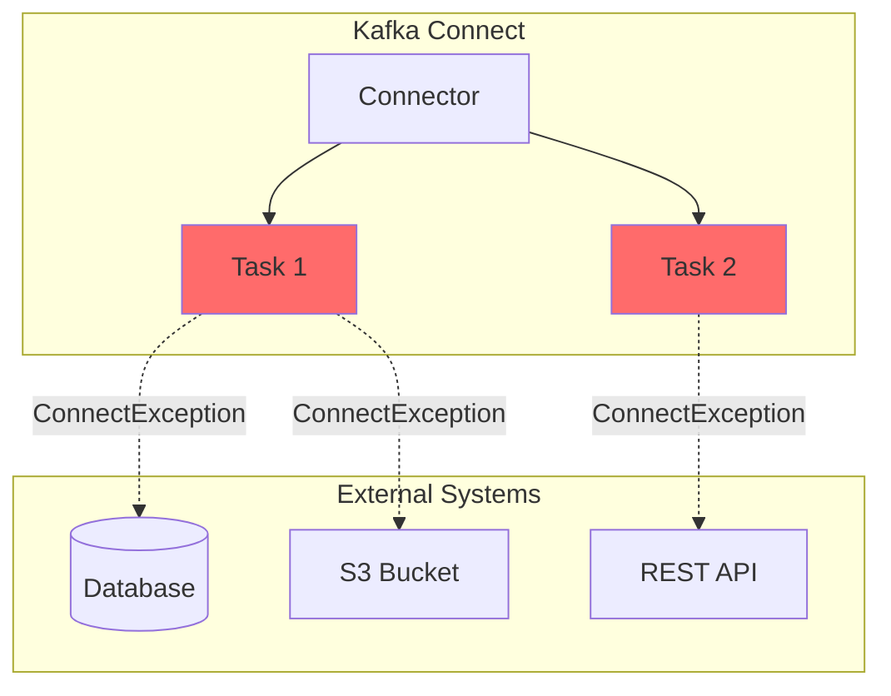
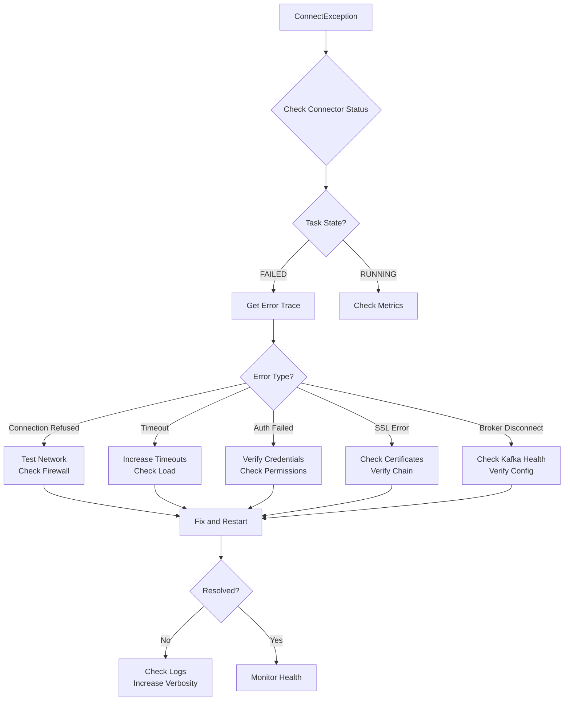

# How to Fix 'ConnectException' in Kafka Connect

Author: [nawazdhandala](https://www.github.com/nawazdhandala)

Tags: Apache Kafka, Kafka Connect, ConnectException, Troubleshooting, Data Integration, DevOps, Debugging

Description: Learn how to diagnose and fix ConnectException errors in Kafka Connect, including connection failures, timeout issues, and configuration problems.

---

The `ConnectException` in Kafka Connect is a general exception that occurs when connectors fail to establish or maintain connections to external systems. This guide covers common causes and practical solutions for resolving these errors.

## Understanding ConnectException



### Common Error Messages

```
org.apache.kafka.connect.errors.ConnectException:
    java.sql.SQLException: Cannot create PoolableConnectionFactory
    (Connection refused)

org.apache.kafka.connect.errors.ConnectException:
    Failed to connect to http://api.example.com: Connection timed out

org.apache.kafka.connect.errors.ConnectException:
    JDBC connection error: Access denied for user 'connect'@'10.0.0.5'

org.apache.kafka.connect.errors.ConnectException:
    Broker disconnected during offset fetch
```

## Diagnosing the Problem

### Step 1: Check Connector Status

```bash
# Get connector status
curl -s http://localhost:8083/connectors/my-connector/status | jq .

# Example output showing failed task
{
  "name": "my-connector",
  "connector": {
    "state": "RUNNING",
    "worker_id": "connect-1:8083"
  },
  "tasks": [
    {
      "id": 0,
      "state": "FAILED",
      "worker_id": "connect-1:8083",
      "trace": "org.apache.kafka.connect.errors.ConnectException: java.sql.SQLException..."
    }
  ],
  "type": "source"
}
```

### Step 2: Check Connect Worker Logs

```bash
# View recent connector errors
docker logs kafka-connect 2>&1 | grep -i "connectexception\|error\|failed" | tail -50

# For Kubernetes
kubectl logs -f deployment/kafka-connect | grep -i "connectexception"
```

### Step 3: Test Connectivity

```bash
# Test network connectivity
nc -zv database-host 5432
nc -zv api.example.com 443

# Test from within Connect container
docker exec -it kafka-connect bash -c "nc -zv database-host 5432"

# DNS resolution test
nslookup database-host
dig database-host
```

## Common Causes and Solutions

### Cause 1: Database Connection Failures

**JDBC Source/Sink ConnectException:**

```
org.apache.kafka.connect.errors.ConnectException:
    java.sql.SQLException: Cannot create PoolableConnectionFactory
    (Connection refused to host: db-server; port: 5432)
```

**Solution: Verify database connectivity and credentials**

```json
{
  "name": "jdbc-source-connector",
  "config": {
    "connector.class": "io.confluent.connect.jdbc.JdbcSourceConnector",

    "connection.url": "jdbc:postgresql://db-server:5432/mydb?connectTimeout=30&socketTimeout=60",
    "connection.user": "connect_user",
    "connection.password": "${secrets:jdbc-password}",

    "connection.attempts": 5,
    "connection.backoff.ms": 10000,

    "validate.non.null": false,

    "dialect.name": "PostgreSqlDatabaseDialect"
  }
}
```

**Verify database access:**

```bash
# Test PostgreSQL connection
psql -h db-server -p 5432 -U connect_user -d mydb -c "SELECT 1"

# Test MySQL connection
mysql -h db-server -P 3306 -u connect_user -p mydb -e "SELECT 1"

# Check database firewall rules
sudo iptables -L -n | grep 5432

# Verify user permissions
psql -U postgres -c "SELECT usename, usesuper, usecreatedb FROM pg_user WHERE usename='connect_user'"
```

**Fix permission issues:**

```sql
-- PostgreSQL: Grant necessary permissions
GRANT CONNECT ON DATABASE mydb TO connect_user;
GRANT USAGE ON SCHEMA public TO connect_user;
GRANT SELECT ON ALL TABLES IN SCHEMA public TO connect_user;

-- MySQL: Grant necessary permissions
GRANT SELECT, REPLICATION SLAVE, REPLICATION CLIENT ON *.* TO 'connect_user'@'%';
FLUSH PRIVILEGES;
```

### Cause 2: Network Timeout Issues

**Timeout Error:**

```
org.apache.kafka.connect.errors.ConnectException:
    java.net.SocketTimeoutException: connect timed out
```

**Solution: Increase timeout settings**

```json
{
  "name": "http-sink-connector",
  "config": {
    "connector.class": "io.confluent.connect.http.HttpSinkConnector",
    "tasks.max": "2",
    "topics": "events",

    "http.api.url": "https://api.example.com/events",

    "request.timeout.ms": 30000,
    "retry.backoff.ms": 500,
    "max.retries": 10,

    "connection.timeout.ms": 10000,
    "socket.timeout.ms": 30000,

    "http.connect.timeout.ms": 10000,
    "http.read.timeout.ms": 30000
  }
}
```

**For S3 connector:**

```json
{
  "name": "s3-sink-connector",
  "config": {
    "connector.class": "io.confluent.connect.s3.S3SinkConnector",
    "topics": "logs",

    "s3.bucket.name": "my-bucket",
    "s3.region": "us-east-1",

    "s3.part.size": 5242880,
    "s3.wan.mode": true,

    "s3.http.send.expect.continue": false,
    "s3.http.max.retries": 5,
    "s3.socket.timeout.ms": 60000,
    "s3.connection.timeout.ms": 30000
  }
}
```

### Cause 3: SSL/TLS Certificate Issues

**SSL Error:**

```
org.apache.kafka.connect.errors.ConnectException:
    javax.net.ssl.SSLHandshakeException: PKIX path building failed
```

**Solution: Configure SSL properly**

```json
{
  "name": "secure-jdbc-connector",
  "config": {
    "connector.class": "io.confluent.connect.jdbc.JdbcSourceConnector",

    "connection.url": "jdbc:postgresql://db-server:5432/mydb?ssl=true&sslmode=verify-full&sslrootcert=/etc/kafka-connect/certs/ca.pem",
    "connection.user": "connect_user",
    "connection.password": "${secrets:jdbc-password}"
  }
}
```

**For Kafka Connect worker SSL:**

```properties
# connect-distributed.properties

# SSL for Kafka broker connection
security.protocol=SSL
ssl.truststore.location=/etc/kafka-connect/truststore.jks
ssl.truststore.password=${secrets:truststore-password}
ssl.keystore.location=/etc/kafka-connect/keystore.jks
ssl.keystore.password=${secrets:keystore-password}
ssl.key.password=${secrets:key-password}

# Producer SSL
producer.security.protocol=SSL
producer.ssl.truststore.location=/etc/kafka-connect/truststore.jks
producer.ssl.truststore.password=${secrets:truststore-password}

# Consumer SSL
consumer.security.protocol=SSL
consumer.ssl.truststore.location=/etc/kafka-connect/truststore.jks
consumer.ssl.truststore.password=${secrets:truststore-password}
```

**Verify SSL certificates:**

```bash
# Check certificate validity
openssl s_client -connect db-server:5432 -starttls postgres

# Verify certificate chain
openssl verify -CAfile ca.pem server.pem

# Check certificate expiration
openssl x509 -in server.pem -noout -dates

# Import certificate to truststore
keytool -import -trustcacerts -alias db-server \
    -file server.pem \
    -keystore /etc/kafka-connect/truststore.jks \
    -storepass changeit
```

### Cause 4: Authentication Failures

**Auth Error:**

```
org.apache.kafka.connect.errors.ConnectException:
    Authentication failed: Invalid credentials
```

**Solution: Verify and update credentials**

```json
{
  "name": "secured-connector",
  "config": {
    "connector.class": "io.confluent.connect.jdbc.JdbcSourceConnector",

    "connection.url": "jdbc:postgresql://db-server:5432/mydb",
    "connection.user": "${env:DB_USER}",
    "connection.password": "${secrets:db-password}",

    "config.providers": "secrets,env",
    "config.providers.secrets.class": "org.apache.kafka.common.config.provider.FileConfigProvider",
    "config.providers.secrets.param.file.path": "/etc/kafka-connect/secrets",
    "config.providers.env.class": "org.apache.kafka.common.config.provider.EnvironmentConfigProvider"
  }
}
```

**For SASL authentication:**

```properties
# connect-distributed.properties

sasl.mechanism=SCRAM-SHA-512
security.protocol=SASL_SSL
sasl.jaas.config=org.apache.kafka.common.security.scram.ScramLoginModule required \
    username="connect-user" \
    password="connect-password";

producer.sasl.mechanism=SCRAM-SHA-512
producer.security.protocol=SASL_SSL
producer.sasl.jaas.config=org.apache.kafka.common.security.scram.ScramLoginModule required \
    username="connect-user" \
    password="connect-password";
```

### Cause 5: Kafka Broker Disconnection

**Broker Error:**

```
org.apache.kafka.connect.errors.ConnectException:
    Broker disconnected during offset fetch
```

**Solution: Configure broker connection resilience**

```properties
# connect-distributed.properties

bootstrap.servers=kafka-1:9092,kafka-2:9092,kafka-3:9092

# Connection settings
reconnect.backoff.ms=1000
reconnect.backoff.max.ms=10000
request.timeout.ms=40000
retry.backoff.ms=100

# Producer settings
producer.retries=2147483647
producer.max.in.flight.requests.per.connection=1
producer.acks=all
producer.delivery.timeout.ms=120000
producer.request.timeout.ms=30000

# Consumer settings
consumer.session.timeout.ms=45000
consumer.heartbeat.interval.ms=15000
consumer.max.poll.interval.ms=300000
```

### Cause 6: Schema Registry Connection Issues

**Schema Registry Error:**

```
org.apache.kafka.connect.errors.ConnectException:
    Failed to connect to schema registry at http://schema-registry:8081
```

**Solution: Configure schema registry connection**

```json
{
  "name": "avro-connector",
  "config": {
    "connector.class": "io.confluent.connect.jdbc.JdbcSinkConnector",

    "key.converter": "io.confluent.connect.avro.AvroConverter",
    "key.converter.schema.registry.url": "http://schema-registry:8081",
    "key.converter.basic.auth.credentials.source": "USER_INFO",
    "key.converter.basic.auth.user.info": "user:password",

    "value.converter": "io.confluent.connect.avro.AvroConverter",
    "value.converter.schema.registry.url": "http://schema-registry:8081",
    "value.converter.basic.auth.credentials.source": "USER_INFO",
    "value.converter.basic.auth.user.info": "user:password",

    "schema.registry.url": "http://schema-registry:8081",
    "schema.registry.basic.auth.user.info": "user:password"
  }
}
```

**Verify schema registry connectivity:**

```bash
# Test schema registry connection
curl -u user:password http://schema-registry:8081/subjects

# List schemas
curl -u user:password http://schema-registry:8081/subjects | jq .

# Check schema registry health
curl http://schema-registry:8081/
```

## Debugging Workflow



## Comprehensive Troubleshooting Script

```bash
#!/bin/bash
# troubleshoot-connect.sh

CONNECT_URL="${CONNECT_URL:-http://localhost:8083}"
CONNECTOR_NAME="$1"

if [ -z "$CONNECTOR_NAME" ]; then
    echo "Usage: $0 <connector-name>"
    exit 1
fi

echo "=== Kafka Connect Troubleshooting ==="
echo "Connector: $CONNECTOR_NAME"
echo ""

# Check Connect cluster health
echo "--- Connect Cluster Health ---"
curl -s "$CONNECT_URL/" | jq .
echo ""

# Get connector status
echo "--- Connector Status ---"
STATUS=$(curl -s "$CONNECT_URL/connectors/$CONNECTOR_NAME/status")
echo "$STATUS" | jq .
echo ""

# Extract error trace if failed
TASK_STATE=$(echo "$STATUS" | jq -r '.tasks[0].state')
if [ "$TASK_STATE" == "FAILED" ]; then
    echo "--- Error Trace ---"
    echo "$STATUS" | jq -r '.tasks[0].trace'
    echo ""
fi

# Get connector configuration
echo "--- Connector Configuration ---"
curl -s "$CONNECT_URL/connectors/$CONNECTOR_NAME/config" | jq .
echo ""

# Check topics
echo "--- Related Topics ---"
CONFIG=$(curl -s "$CONNECT_URL/connectors/$CONNECTOR_NAME/config")
TOPICS=$(echo "$CONFIG" | jq -r '.topics // .["topics.regex"] // "N/A"')
echo "Topics: $TOPICS"
echo ""

# Network connectivity tests
echo "--- Network Tests ---"
DB_HOST=$(echo "$CONFIG" | jq -r '.["connection.url"]' | sed -E 's|.*://([^:/]+).*|\1|')
if [ "$DB_HOST" != "null" ] && [ -n "$DB_HOST" ]; then
    echo "Testing connectivity to: $DB_HOST"
    nc -zv "$DB_HOST" 5432 2>&1 || echo "Connection failed"
fi
echo ""

# Check for common issues
echo "--- Common Issues Check ---"

# Check replication factor
RF=$(echo "$CONFIG" | jq -r '.["replication.factor"] // "3"')
echo "Replication factor: $RF"

# Check error tolerance
ET=$(echo "$CONFIG" | jq -r '.["errors.tolerance"] // "none"')
echo "Error tolerance: $ET"

# Check DLQ configuration
DLQ=$(echo "$CONFIG" | jq -r '.["errors.deadletterqueue.topic.name"] // "not configured"')
echo "Dead letter queue: $DLQ"

echo ""
echo "=== Troubleshooting Complete ==="
```

## Preventive Measures

### Health Check Configuration

```json
{
  "name": "resilient-connector",
  "config": {
    "connector.class": "io.confluent.connect.jdbc.JdbcSourceConnector",

    "connection.url": "jdbc:postgresql://db:5432/mydb",
    "connection.user": "connect",
    "connection.password": "${secrets:password}",

    "connection.attempts": 10,
    "connection.backoff.ms": 5000,

    "poll.interval.ms": 5000,
    "table.poll.interval.ms": 60000,

    "errors.tolerance": "all",
    "errors.retry.timeout": 300000,
    "errors.retry.delay.max.ms": 60000,

    "errors.deadletterqueue.topic.name": "jdbc-source-dlq",
    "errors.deadletterqueue.topic.replication.factor": 3,
    "errors.deadletterqueue.context.headers.enable": true,

    "errors.log.enable": true,
    "errors.log.include.messages": true
  }
}
```

### Monitoring Dashboard Queries

For Grafana dashboards:

```
# Failed tasks count
sum(kafka_connect_connector_task_state{state="failed"}) by (connector)

# Connection error rate
rate(kafka_connect_task_error_total_errors[5m])

# Task restart rate
rate(kafka_connect_connector_task_restart_total[5m])

# Connector status (1=running, 0=failed)
kafka_connect_connector_state{state="running"}
```

## Best Practices

1. **Always configure retries** - Network issues are transient
2. **Use connection pools** - Reduce connection overhead
3. **Set appropriate timeouts** - Balance between resilience and failure detection
4. **Enable error logging** - Capture detailed error information
5. **Configure dead letter queues** - Preserve failed records
6. **Monitor connector metrics** - Detect issues before they cause outages
7. **Test connectivity before deployment** - Validate network access
8. **Use secrets management** - Never hardcode credentials
9. **Document recovery procedures** - Create runbooks for common failures
10. **Implement circuit breakers** - Prevent cascade failures

---

ConnectException errors in Kafka Connect typically indicate infrastructure or configuration issues rather than application bugs. By systematically checking connectivity, credentials, timeouts, and SSL configuration, you can identify and resolve most connection problems. The key is to implement proper error handling and monitoring from the start, so issues are detected and addressed quickly.
