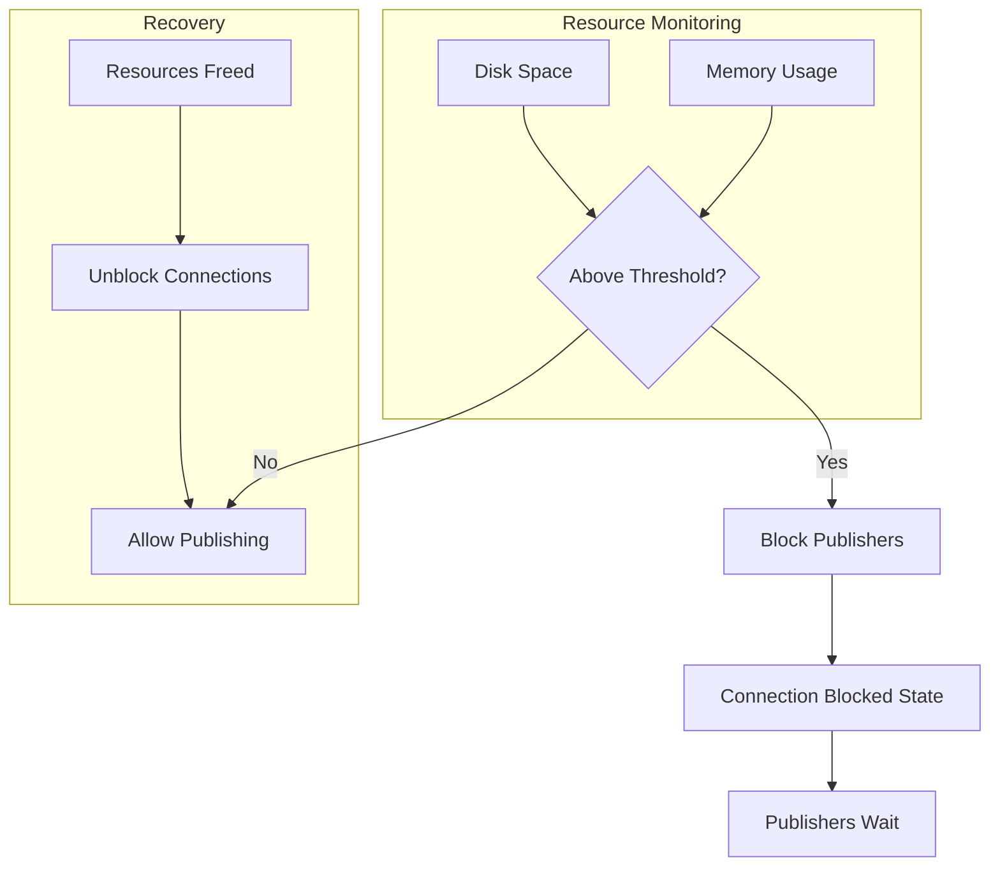
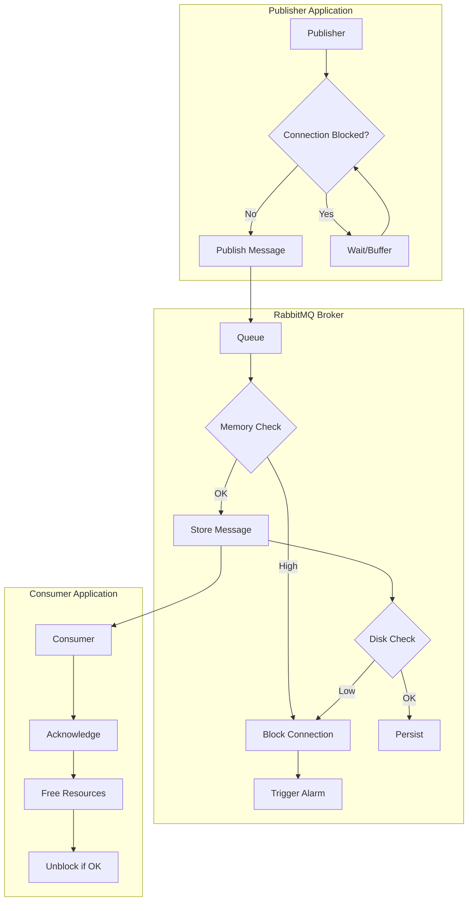
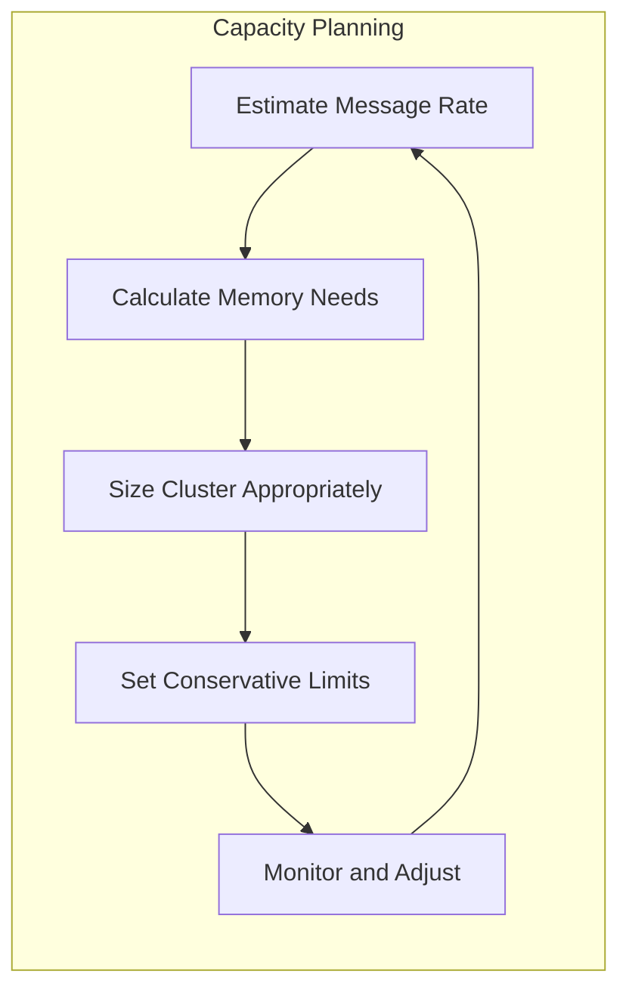

# How to Fix 'Connection Blocked' Errors in RabbitMQ

Author: [nawazdhandala](https://www.github.com/nawazdhandala)

Tags: RabbitMQ, Connection Blocked, Troubleshooting, Memory Management, Flow Control, Message Queue, Performance

Description: Learn how to diagnose and resolve RabbitMQ connection blocked errors caused by memory pressure, disk space issues, and flow control mechanisms.

---

> RabbitMQ blocks connections when the broker is under resource pressure, typically due to memory or disk space constraints. When this happens, publishers cannot send messages, which can cascade into application failures. This guide explains why blocking occurs and how to resolve it.

The "connection blocked" state is RabbitMQ's way of protecting itself from running out of resources. Understanding and properly handling this mechanism is crucial for building resilient messaging applications.

---

## Understanding Connection Blocking



### What Triggers Connection Blocking?

1. **Memory high watermark exceeded** - Default is 40% of available RAM
2. **Disk free space alarm** - Default is 50MB minimum free space
3. **File descriptor limit reached** - Too many open connections/files

---

## Identifying the Problem

### Checking Broker Status

```bash
# Check overall node health and alarms
rabbitmqctl status

# Look for these alarm indicators:
# {alarms,[{memory,"rabbit@hostname"},{disk,"rabbit@hostname"}]}

# Check memory usage specifically
rabbitmqctl status | grep -A 10 "Memory"

# Check disk free space
rabbitmqctl status | grep -A 5 "Disk"
```

### Checking Connection Status

```bash
# List all connections and their state
rabbitmqctl list_connections name state blocked_by

# Filter for blocked connections
rabbitmqctl list_connections name state | grep blocked

# Get detailed connection info
rabbitmqctl list_connections name state recv_oct send_oct send_pend
```

### Management UI Indicators

In the RabbitMQ Management UI, look for:
- Red "Memory" or "Disk" badges on the overview page
- Connections showing "blocked" or "blocking" state
- Queue depth increasing without consumers processing

---

## Diagnosing Memory Issues

### Memory Breakdown Analysis

```bash
# Get detailed memory breakdown
rabbitmqctl status --formatter=json | jq '.memory'

# Key areas to examine:
# - connection_readers: Memory for receiving data
# - connection_writers: Memory for sending data
# - queue_procs: Memory used by queue processes
# - binary: Large messages in memory
# - msg_index: Message index data
```

### Memory Usage by Queue

```python
import subprocess
import json

def analyze_queue_memory():
    """Analyze memory usage across all queues"""

    # Get queue memory information
    result = subprocess.run(
        ['rabbitmqctl', 'list_queues',
         'name', 'messages', 'memory', 'consumers',
         '--formatter=json'],
        capture_output=True,
        text=True
    )

    queues = json.loads(result.stdout)

    # Sort by memory usage (descending)
    sorted_queues = sorted(queues, key=lambda q: q.get('memory', 0), reverse=True)

    print("Top Memory-Consuming Queues:")
    print("-" * 60)

    total_memory = 0
    for queue in sorted_queues[:10]:
        name = queue['name']
        messages = queue['messages']
        memory_bytes = queue['memory']
        memory_mb = memory_bytes / (1024 * 1024)
        consumers = queue['consumers']

        total_memory += memory_bytes

        print(f"{name}")
        print(f"  Messages: {messages:,}")
        print(f"  Memory: {memory_mb:.2f} MB")
        print(f"  Consumers: {consumers}")
        print()

    print(f"Total queue memory: {total_memory / (1024 * 1024):.2f} MB")

if __name__ == '__main__':
    analyze_queue_memory()
```

---

## Fixing Memory-Related Blocking

### 1. Adjust Memory High Watermark

```erlang
%% rabbitmq.conf

%% Increase memory threshold (default is 0.4 = 40%)
%% Only increase if you have sufficient RAM
vm_memory_high_watermark.relative = 0.6

%% Or set an absolute value
vm_memory_high_watermark.absolute = 2GB

%% Configure paging threshold (when messages start being paged to disk)
vm_memory_high_watermark_paging_ratio = 0.75
```

```bash
# Apply memory changes at runtime (temporary)
rabbitmqctl set_vm_memory_high_watermark 0.6

# Or set absolute value
rabbitmqctl set_vm_memory_high_watermark absolute 2GB
```

### 2. Enable Message Paging

```erlang
%% rabbitmq.conf

%% Configure queue to page messages to disk earlier
%% This reduces memory pressure at the cost of performance
queue_master_locator = min-masters
```

### 3. Set Queue Length Limits

```python
import pika

connection = pika.BlockingConnection(
    pika.ConnectionParameters('localhost')
)
channel = connection.channel()

# Create queue with length limits to prevent unbounded growth
channel.queue_declare(
    queue='bounded-queue',
    durable=True,
    arguments={
        # Maximum number of messages in the queue
        'x-max-length': 100000,

        # Maximum total bytes of message bodies
        'x-max-length-bytes': 104857600,  # 100MB

        # What to do when limit is reached
        # 'drop-head': Remove oldest messages (default)
        # 'reject-publish': Reject new messages with basic.nack
        # 'reject-publish-dlx': Reject and dead-letter new messages
        'x-overflow': 'reject-publish'
    }
)

print("Bounded queue created")
connection.close()
```

---

## Fixing Disk Space Issues

### Checking Disk Space

```bash
# Check current disk alarm status
rabbitmqctl status | grep disk_free

# Check actual disk usage
df -h /var/lib/rabbitmq
```

### Adjusting Disk Free Limit

```erlang
%% rabbitmq.conf

%% Set minimum free disk space (default is 50MB)
disk_free_limit.relative = 1.5
%% This means: 1.5 * RAM size must be free

%% Or set absolute value
disk_free_limit.absolute = 5GB
```

```bash
# Set at runtime (temporary)
rabbitmqctl set_disk_free_limit 5GB

# Or relative to memory
rabbitmqctl set_disk_free_limit mem_relative 1.5
```

### Cleaning Up Disk Space

```bash
# Clear old log files
sudo find /var/log/rabbitmq -name "*.log.*" -mtime +7 -delete

# Compact Mnesia database (requires node restart)
rabbitmqctl stop_app
rabbitmqctl reset  # WARNING: Clears all data!
rabbitmqctl start_app

# For quorum queues - check WAL size
du -sh /var/lib/rabbitmq/mnesia/*/quorum/

# Force quorum queue checkpoint (reduces WAL size)
# This is done automatically but can be triggered
rabbitmqctl eval 'rabbit_quorum_queue:force_checkpoint_all().'
```

---

## Handling Connection Blocking in Applications

### Python - Handling Blocked Connections

```python
import pika
import time
import logging

logging.basicConfig(level=logging.INFO)
logger = logging.getLogger(__name__)

class ResilientPublisher:
    def __init__(self, host='localhost'):
        self.host = host
        self.connection = None
        self.channel = None
        self.blocked = False

    def connect(self):
        """Establish connection with blocking handlers"""

        # Connection parameters with heartbeat
        parameters = pika.ConnectionParameters(
            host=self.host,
            heartbeat=60,
            blocked_connection_timeout=300  # Wait up to 5 minutes when blocked
        )

        self.connection = pika.BlockingConnection(parameters)
        self.channel = self.connection.channel()

        # Register callback for connection blocked/unblocked events
        self.connection.add_on_connection_blocked_callback(self._on_blocked)
        self.connection.add_on_connection_unblocked_callback(self._on_unblocked)

        # Enable publisher confirms
        self.channel.confirm_delivery()

        logger.info("Connected to RabbitMQ")

    def _on_blocked(self, frame):
        """Called when connection is blocked"""
        self.blocked = True
        logger.warning(f"Connection blocked: {frame.reason}")

    def _on_unblocked(self, frame):
        """Called when connection is unblocked"""
        self.blocked = False
        logger.info("Connection unblocked")

    def publish(self, queue, message, max_retries=3):
        """Publish message with blocking awareness"""

        if self.connection is None or self.connection.is_closed:
            self.connect()

        # Wait if connection is blocked
        if self.blocked:
            logger.warning("Connection is blocked, waiting...")
            wait_time = 0
            while self.blocked and wait_time < 60:
                time.sleep(1)
                wait_time += 1
                # Process events to receive unblock notification
                self.connection.process_data_events()

            if self.blocked:
                raise Exception("Connection still blocked after timeout")

        # Attempt to publish with retries
        for attempt in range(max_retries):
            try:
                self.channel.basic_publish(
                    exchange='',
                    routing_key=queue,
                    body=message,
                    properties=pika.BasicProperties(
                        delivery_mode=2  # Persistent
                    ),
                    mandatory=True
                )
                logger.info(f"Message published to {queue}")
                return True

            except pika.exceptions.ConnectionBlockedTimeout:
                logger.warning(f"Publish timed out (blocked), attempt {attempt + 1}")
                if attempt < max_retries - 1:
                    time.sleep(5 * (attempt + 1))  # Exponential backoff

            except Exception as e:
                logger.error(f"Publish failed: {e}")
                self.connect()  # Reconnect

        return False

    def close(self):
        """Clean up connection"""
        if self.connection and not self.connection.is_closed:
            self.connection.close()
            logger.info("Connection closed")

# Usage example
if __name__ == '__main__':
    publisher = ResilientPublisher()

    try:
        publisher.connect()

        # Publish messages
        for i in range(100):
            success = publisher.publish('test-queue', f'Message {i}')
            if not success:
                logger.error(f"Failed to publish message {i}")

    finally:
        publisher.close()
```

### Node.js - Handling Blocked Connections

```javascript
const amqp = require('amqplib');

class ResilientPublisher {
    constructor(url = 'amqp://localhost') {
        this.url = url;
        this.connection = null;
        this.channel = null;
        this.blocked = false;
    }

    async connect() {
        // Connect with socket options
        this.connection = await amqp.connect(this.url, {
            // Heartbeat interval in seconds
            heartbeat: 60
        });

        // Handle connection blocked event
        this.connection.on('blocked', (reason) => {
            this.blocked = true;
            console.warn(`Connection blocked: ${reason}`);
        });

        // Handle connection unblocked event
        this.connection.on('unblocked', () => {
            this.blocked = false;
            console.log('Connection unblocked');
        });

        // Handle connection errors
        this.connection.on('error', (err) => {
            console.error('Connection error:', err);
        });

        // Handle connection close
        this.connection.on('close', () => {
            console.log('Connection closed');
            this.connection = null;
            this.channel = null;
        });

        // Create confirm channel for publisher confirms
        this.channel = await this.connection.createConfirmChannel();

        console.log('Connected to RabbitMQ');
    }

    async waitForUnblock(timeoutMs = 60000) {
        // Wait for connection to be unblocked
        const startTime = Date.now();

        while (this.blocked) {
            if (Date.now() - startTime > timeoutMs) {
                throw new Error('Timeout waiting for connection unblock');
            }

            // Wait a bit before checking again
            await new Promise(resolve => setTimeout(resolve, 1000));
        }
    }

    async publish(queue, message, options = {}) {
        // Ensure connection exists
        if (!this.connection) {
            await this.connect();
        }

        // Wait if blocked
        if (this.blocked) {
            console.warn('Connection blocked, waiting...');
            await this.waitForUnblock();
        }

        // Ensure queue exists
        await this.channel.assertQueue(queue, { durable: true });

        // Publish with confirmation
        return new Promise((resolve, reject) => {
            const content = Buffer.from(
                typeof message === 'string' ? message : JSON.stringify(message)
            );

            this.channel.publish(
                '',  // Default exchange
                queue,
                content,
                {
                    persistent: true,
                    ...options
                },
                (err) => {
                    if (err) {
                        console.error('Publish failed:', err);
                        reject(err);
                    } else {
                        resolve(true);
                    }
                }
            );
        });
    }

    async close() {
        if (this.channel) {
            await this.channel.close();
        }
        if (this.connection) {
            await this.connection.close();
        }
        console.log('Connection closed');
    }
}

// Usage example
async function main() {
    const publisher = new ResilientPublisher();

    try {
        await publisher.connect();

        // Publish messages
        for (let i = 0; i < 100; i++) {
            try {
                await publisher.publish('test-queue', { id: i, data: 'test' });
                console.log(`Published message ${i}`);
            } catch (err) {
                console.error(`Failed to publish message ${i}:`, err);
            }
        }

    } finally {
        await publisher.close();
    }
}

main().catch(console.error);
```

---

## Flow Control Architecture



---

## Implementing Backpressure

### Producer-Side Throttling

```python
import pika
import time
from collections import deque
import threading

class ThrottledPublisher:
    def __init__(self, host='localhost', max_pending=1000):
        self.host = host
        self.max_pending = max_pending
        self.pending_confirms = 0
        self.lock = threading.Lock()
        self.connection = None
        self.channel = None

    def connect(self):
        """Connect with async confirm handling"""
        parameters = pika.ConnectionParameters(
            host=self.host,
            heartbeat=60
        )

        self.connection = pika.BlockingConnection(parameters)
        self.channel = self.connection.channel()
        self.channel.confirm_delivery()

    def _wait_for_confirms(self, target_pending):
        """Wait until pending confirms drop below target"""
        while self.pending_confirms > target_pending:
            # Process events to receive confirmations
            self.connection.process_data_events(time_limit=0.1)

    def publish(self, queue, message):
        """Publish with backpressure based on pending confirms"""

        # Throttle if too many pending confirms
        if self.pending_confirms >= self.max_pending:
            print(f"Throttling: {self.pending_confirms} pending confirms")
            self._wait_for_confirms(self.max_pending // 2)

        with self.lock:
            self.pending_confirms += 1

        try:
            self.channel.basic_publish(
                exchange='',
                routing_key=queue,
                body=message,
                properties=pika.BasicProperties(delivery_mode=2)
            )

            with self.lock:
                self.pending_confirms -= 1

        except Exception as e:
            with self.lock:
                self.pending_confirms -= 1
            raise e

    def close(self):
        # Wait for all confirms before closing
        self._wait_for_confirms(0)
        self.connection.close()

# Usage
publisher = ThrottledPublisher(max_pending=500)
publisher.connect()

for i in range(10000):
    publisher.publish('test-queue', f'Message {i}')

publisher.close()
```

### Queue-Based Rate Limiting

```python
import pika
import time

def create_rate_limited_queue(channel, queue_name, messages_per_second):
    """Create a queue with built-in rate limiting using TTL"""

    # Calculate delay in milliseconds
    delay_ms = int(1000 / messages_per_second)

    # Create a delayed message exchange pattern
    channel.exchange_declare(
        exchange=f'{queue_name}-delayed',
        exchange_type='x-delayed-message',
        durable=True,
        arguments={'x-delayed-type': 'direct'}
    )

    channel.queue_declare(
        queue=queue_name,
        durable=True,
        arguments={
            'x-queue-type': 'quorum',
            # Consumer rate limiting via prefetch
            'x-max-priority': 10
        }
    )

    channel.queue_bind(
        queue=queue_name,
        exchange=f'{queue_name}-delayed',
        routing_key=queue_name
    )

    return delay_ms

def publish_rate_limited(channel, exchange, routing_key, message, delay_ms):
    """Publish message with delay for rate limiting"""
    channel.basic_publish(
        exchange=exchange,
        routing_key=routing_key,
        body=message,
        properties=pika.BasicProperties(
            delivery_mode=2,
            headers={'x-delay': delay_ms}
        )
    )
```

---

## Monitoring and Alerting

### Prometheus Metrics to Watch

```yaml
# Alert rules for connection blocking
groups:
  - name: rabbitmq_connection_alerts
    rules:
      # Alert when memory alarm is triggered
      - alert: RabbitMQMemoryAlarm
        expr: rabbitmq_alarms_memory_used_watermark == 1
        for: 1m
        labels:
          severity: critical
        annotations:
          summary: "RabbitMQ memory alarm triggered"
          description: "Memory usage has exceeded the high watermark"

      # Alert when disk alarm is triggered
      - alert: RabbitMQDiskAlarm
        expr: rabbitmq_alarms_free_disk_space_watermark == 1
        for: 1m
        labels:
          severity: critical
        annotations:
          summary: "RabbitMQ disk alarm triggered"
          description: "Disk free space is below the threshold"

      # Alert on blocked connections
      - alert: RabbitMQConnectionsBlocked
        expr: rabbitmq_connections_state{state="blocked"} > 0
        for: 2m
        labels:
          severity: warning
        annotations:
          summary: "RabbitMQ has blocked connections"
          description: "{{ $value }} connections are currently blocked"
```

### Monitoring Script

```python
#!/usr/bin/env python3
"""Monitor RabbitMQ for connection blocking conditions"""

import subprocess
import json
import sys

def check_alarms():
    """Check for active alarms"""
    result = subprocess.run(
        ['rabbitmqctl', 'status', '--formatter=json'],
        capture_output=True,
        text=True
    )

    status = json.loads(result.stdout)
    alarms = status.get('alarms', [])

    if alarms:
        print("CRITICAL: Active alarms detected!")
        for alarm in alarms:
            print(f"  - {alarm}")
        return False

    print("OK: No alarms")
    return True

def check_memory():
    """Check memory usage"""
    result = subprocess.run(
        ['rabbitmqctl', 'status', '--formatter=json'],
        capture_output=True,
        text=True
    )

    status = json.loads(result.stdout)
    memory = status.get('memory', {})

    total = memory.get('total', {}).get('erlang', 0)
    limit = status.get('vm_memory_high_watermark_limit', 0)

    if limit > 0:
        usage_pct = (total / limit) * 100
        print(f"Memory: {total / (1024**2):.1f}MB / {limit / (1024**2):.1f}MB ({usage_pct:.1f}%)")

        if usage_pct > 90:
            print("WARNING: Memory usage above 90%")
            return False

    return True

def check_disk():
    """Check disk free space"""
    result = subprocess.run(
        ['rabbitmqctl', 'status', '--formatter=json'],
        capture_output=True,
        text=True
    )

    status = json.loads(result.stdout)
    disk_free = status.get('disk_free', 0)
    disk_limit = status.get('disk_free_limit', 0)

    print(f"Disk free: {disk_free / (1024**3):.1f}GB (limit: {disk_limit / (1024**3):.1f}GB)")

    if disk_free < disk_limit * 1.5:
        print("WARNING: Disk free space getting low")
        return False

    return True

def check_blocked_connections():
    """Check for blocked connections"""
    result = subprocess.run(
        ['rabbitmqctl', 'list_connections', 'name', 'state', '--formatter=json'],
        capture_output=True,
        text=True
    )

    connections = json.loads(result.stdout)
    blocked = [c for c in connections if c.get('state') == 'blocked']

    if blocked:
        print(f"WARNING: {len(blocked)} blocked connections")
        for conn in blocked[:5]:
            print(f"  - {conn['name']}")
        return False

    print(f"OK: No blocked connections (total: {len(connections)})")
    return True

if __name__ == '__main__':
    all_ok = True

    all_ok &= check_alarms()
    all_ok &= check_memory()
    all_ok &= check_disk()
    all_ok &= check_blocked_connections()

    sys.exit(0 if all_ok else 1)
```

---

## Prevention Best Practices

### 1. Proper Capacity Planning



### 2. Consumer Scaling

```python
import pika
import multiprocessing
import os

def consumer_worker(queue_name):
    """Individual consumer worker process"""
    connection = pika.BlockingConnection(
        pika.ConnectionParameters('localhost')
    )
    channel = connection.channel()

    # Limit prefetch to prevent memory issues
    channel.basic_qos(prefetch_count=10)

    def callback(ch, method, properties, body):
        # Process message
        print(f"[Worker {os.getpid()}] Processing: {body[:50]}")
        # Acknowledge after processing
        ch.basic_ack(delivery_tag=method.delivery_tag)

    channel.basic_consume(
        queue=queue_name,
        on_message_callback=callback,
        auto_ack=False
    )

    print(f"[Worker {os.getpid()}] Waiting for messages...")
    channel.start_consuming()

def scale_consumers(queue_name, num_workers):
    """Scale consumers to handle message volume"""
    workers = []

    for _ in range(num_workers):
        p = multiprocessing.Process(
            target=consumer_worker,
            args=(queue_name,)
        )
        p.start()
        workers.append(p)

    return workers

if __name__ == '__main__':
    # Scale to 4 consumer workers
    workers = scale_consumers('orders-queue', 4)

    try:
        for w in workers:
            w.join()
    except KeyboardInterrupt:
        for w in workers:
            w.terminate()
```

### 3. Configuration Checklist

```erlang
%% rabbitmq.conf - Production settings to prevent blocking

%% Memory management
vm_memory_high_watermark.relative = 0.6
vm_memory_high_watermark_paging_ratio = 0.75

%% Disk management
disk_free_limit.relative = 2.0

%% Connection limits
channel_max = 128
connection_max = 1024

%% Queue defaults
default_queue_type = quorum

%% Logging for debugging
log.console = true
log.console.level = warning
log.file.level = info
```

---

## Conclusion

Connection blocking in RabbitMQ is a protective mechanism that prevents the broker from running out of resources. By understanding the causes and implementing proper handling in your applications, you can build resilient messaging systems that gracefully handle resource pressure.

Key takeaways:
- Monitor memory and disk usage proactively
- Handle connection blocked events in your applications
- Implement backpressure and throttling mechanisms
- Scale consumers to match producer throughput
- Set appropriate queue limits to prevent unbounded growth

---

*Need comprehensive monitoring for your RabbitMQ clusters? [OneUptime](https://oneuptime.com) provides real-time alerts for memory pressure, disk space issues, and connection blocking events.*

**Related Reading:**
- [How to Configure RabbitMQ Quorum Queues](https://oneuptime.com/blog)
- [How to Monitor RabbitMQ with Prometheus](https://oneuptime.com/blog)
