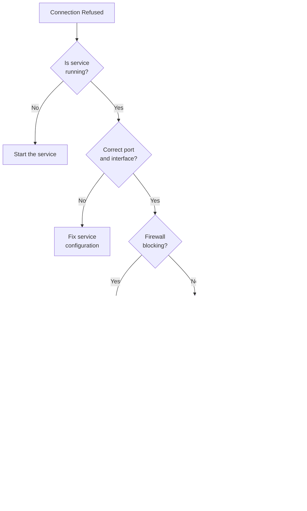

# How to Fix 'Connection Refused' Network Errors

Author: [nawazdhandala](https://www.github.com/nawazdhandala)

Tags: Linux, Networking, Troubleshooting, System Administration, Firewall, TCP/IP

Description: Learn how to diagnose and fix 'Connection Refused' errors in Linux by checking services, ports, firewalls, and network configurations.

---

"Connection refused" is one of the most common network errors you will encounter in Linux. Unlike timeouts or "no route to host" errors, a connection refused error means the target host actively rejected the connection. This guide provides a systematic approach to diagnosing and fixing this issue.

## Understanding the Error

A "Connection refused" error occurs when:

1. The target port has no service listening
2. The service is listening on a different interface
3. A firewall is rejecting (not dropping) the connection
4. TCP wrappers are blocking access


## Systematic Troubleshooting Approach



## Step 1: Verify the Service is Running

### Check Service Status

```bash
# Check if service is running with systemctl
systemctl status nginx
systemctl status mysql
systemctl status sshd

# Example output for stopped service:
# nginx.service - A high performance web server
#    Loaded: loaded (/lib/systemd/system/nginx.service; enabled)
#    Active: inactive (dead) since Mon 2026-01-24 10:00:00 UTC

# Check if the process exists
ps aux | grep nginx
pgrep -la nginx
```

### Start the Service

```bash
# Start the service
sudo systemctl start nginx

# Enable service to start on boot
sudo systemctl enable nginx

# Check status after starting
systemctl status nginx
```

## Step 2: Verify Service is Listening on Correct Port

### Check Listening Ports

```bash
# List all listening ports with process information
# -t: TCP, -u: UDP, -l: listening, -n: numeric, -p: process info
sudo ss -tulnp

# Example output:
# State  Recv-Q Send-Q Local Address:Port  Peer Address:Port Process
# LISTEN 0      128    127.0.0.1:3306      0.0.0.0:*         users:(("mysqld",pid=1234,fd=22))
# LISTEN 0      511    0.0.0.0:80          0.0.0.0:*         users:(("nginx",pid=5678,fd=6))

# Filter for specific port
sudo ss -tulnp | grep :80

# Alternative using netstat (older systems)
sudo netstat -tulnp | grep LISTEN
```

### Understanding Listen Addresses


### Common Issue: Service Bound to Localhost Only

```bash
# If service shows listening on 127.0.0.1, it only accepts local connections
# Example: 127.0.0.1:3306 means MySQL only accepts localhost connections

# Check MySQL bind address
grep bind-address /etc/mysql/mysql.conf.d/mysqld.cnf
# Output: bind-address = 127.0.0.1

# To allow remote connections, change to:
# bind-address = 0.0.0.0
# Then restart: sudo systemctl restart mysql
```

### Fix Service Configuration

For various services, here is how to change the bind address:

**Nginx:**
```bash
# Edit nginx configuration
sudo nano /etc/nginx/sites-available/default

# Ensure listen directive allows external connections
server {
    listen 80;              # IPv4 all interfaces
    listen [::]:80;         # IPv6 all interfaces
    # NOT: listen 127.0.0.1:80;  (localhost only)
}

# Restart nginx
sudo systemctl restart nginx
```

**MySQL/MariaDB:**
```bash
# Edit MySQL configuration
sudo nano /etc/mysql/mysql.conf.d/mysqld.cnf

# Change bind-address
bind-address = 0.0.0.0

# Restart MySQL
sudo systemctl restart mysql
```

**PostgreSQL:**
```bash
# Edit PostgreSQL configuration
sudo nano /etc/postgresql/14/main/postgresql.conf

# Change listen_addresses
listen_addresses = '*'

# Also edit pg_hba.conf for client authentication
sudo nano /etc/postgresql/14/main/pg_hba.conf

# Add line for remote access
host    all    all    0.0.0.0/0    md5

# Restart PostgreSQL
sudo systemctl restart postgresql
```

**Redis:**
```bash
# Edit Redis configuration
sudo nano /etc/redis/redis.conf

# Change bind address (be careful with security!)
bind 0.0.0.0

# Restart Redis
sudo systemctl restart redis
```

## Step 3: Check Local Firewall

### iptables

```bash
# List all iptables rules
sudo iptables -L -n -v

# Check if port 80 is allowed
sudo iptables -L -n | grep 80

# Add rule to allow port 80
sudo iptables -A INPUT -p tcp --dport 80 -j ACCEPT

# Save iptables rules (varies by distribution)
# Debian/Ubuntu:
sudo netfilter-persistent save
# RHEL/CentOS:
sudo service iptables save
```

### nftables (Modern Replacement)

```bash
# List nftables rules
sudo nft list ruleset

# Add rule to allow port 80
sudo nft add rule inet filter input tcp dport 80 accept
```

### firewalld (RHEL/CentOS/Fedora)

```bash
# Check firewalld status
sudo firewall-cmd --state

# List allowed services and ports
sudo firewall-cmd --list-all

# Add port 80 temporarily
sudo firewall-cmd --add-port=80/tcp

# Add port 80 permanently
sudo firewall-cmd --permanent --add-port=80/tcp
sudo firewall-cmd --reload

# Add service by name
sudo firewall-cmd --permanent --add-service=http
sudo firewall-cmd --permanent --add-service=https
sudo firewall-cmd --reload
```

### UFW (Ubuntu)

```bash
# Check UFW status
sudo ufw status verbose

# Allow port 80
sudo ufw allow 80/tcp

# Allow by service name
sudo ufw allow http
sudo ufw allow https

# Allow from specific IP
sudo ufw allow from 192.168.1.100 to any port 80

# Reload UFW
sudo ufw reload
```

## Step 4: Check SELinux/AppArmor

### SELinux (RHEL/CentOS/Fedora)

```bash
# Check SELinux status
getenforce
# Output: Enforcing, Permissive, or Disabled

# Check SELinux denials in audit log
sudo ausearch -m avc -ts recent

# Check if port is allowed for the service
sudo semanage port -l | grep http
# Output: http_port_t    tcp    80, 81, 443, ...

# Allow a non-standard port for HTTP
sudo semanage port -a -t http_port_t -p tcp 8080

# Temporarily disable SELinux (for testing only!)
sudo setenforce 0

# If service works with SELinux disabled, you need to fix the context
# Use audit2allow to generate the required policy
sudo ausearch -c 'nginx' --raw | audit2allow -M my-nginx
sudo semodule -i my-nginx.pp
```

### AppArmor (Ubuntu/Debian)

```bash
# Check AppArmor status
sudo aa-status

# Check for denied operations
sudo dmesg | grep DENIED

# Put profile in complain mode (logs but allows)
sudo aa-complain /etc/apparmor.d/usr.sbin.nginx

# Disable profile entirely (for testing)
sudo aa-disable /etc/apparmor.d/usr.sbin.nginx

# Re-enable profile
sudo aa-enforce /etc/apparmor.d/usr.sbin.nginx
```

## Step 5: Check TCP Wrappers

TCP wrappers provide host-based access control for services:

```bash
# Check if service uses TCP wrappers
ldd /usr/sbin/sshd | grep wrap

# View allowed hosts
cat /etc/hosts.allow

# View denied hosts
cat /etc/hosts.deny
```

Example `/etc/hosts.allow`:
```bash
# Allow SSH from specific networks
sshd: 192.168.1.0/24
sshd: 10.0.0.0/8

# Allow all services from localhost
ALL: 127.0.0.1
```

Example `/etc/hosts.deny`:
```bash
# Deny all by default (if hosts.allow doesn't match)
ALL: ALL
```

## Step 6: Test Connectivity

### From Local Machine

```bash
# Test connection to local service
nc -zv localhost 80
# Output: Connection to localhost 80 port [tcp/http] succeeded!

# Or using telnet
telnet localhost 80

# Using curl for HTTP services
curl -v http://localhost:80
```

### From Remote Machine

```bash
# Test connection from another machine
nc -zv server.example.com 80

# With timeout
nc -zv -w 5 server.example.com 80

# Test using nmap (shows filtered vs closed vs open)
nmap -p 80 server.example.com
# Open: Service is accepting connections
# Closed: Port responds with RST (connection refused)
# Filtered: No response (firewall dropping packets)
```

### Network Path Analysis

```bash
# Trace the network path
traceroute server.example.com

# Check if specific port is reachable at each hop
# (requires tcptraceroute)
tcptraceroute server.example.com 80

# Test with MTR for ongoing analysis
mtr server.example.com
```

## Step 7: Check for Port Conflicts

```bash
# Find what is using a specific port
sudo lsof -i :80

# Find process using port with fuser
sudo fuser 80/tcp

# Kill process using port (if needed)
sudo fuser -k 80/tcp
```

## Common Scenarios and Solutions

### Scenario 1: Service Not Started


```bash
# Check service status
systemctl status nginx

# Start service
sudo systemctl start nginx

# Check logs if it fails to start
journalctl -u nginx -f
```

### Scenario 2: Wrong Bind Address

```bash
# Service listening on localhost only
sudo ss -tulnp | grep 3306
# Shows: 127.0.0.1:3306

# Fix: Change configuration to bind to all interfaces
# Edit config file and change bind-address to 0.0.0.0
# Restart service
```

### Scenario 3: Firewall Blocking

```bash
# Connection works locally but not remotely
curl localhost:80          # Works
curl 192.168.1.100:80      # Also works locally
# From remote: Connection refused

# Check firewall
sudo iptables -L -n | grep 80
# No rules found for port 80

# Add rule
sudo ufw allow 80/tcp
# Or: sudo firewall-cmd --add-port=80/tcp --permanent
```

### Scenario 4: Docker Container

```bash
# Docker container not exposing port
docker ps
# PORTS shows nothing or wrong mapping

# Run container with correct port mapping
docker run -p 8080:80 nginx

# Or check docker-compose.yml
# ports:
#   - "8080:80"
```

## Diagnostic Script

Here is a script to automate the troubleshooting process:

```bash
#!/bin/bash
# diagnose-connection.sh - Diagnose connection refused errors

HOST=${1:-localhost}
PORT=${2:-80}

echo "=== Diagnosing connection to $HOST:$PORT ==="
echo

# Test connection
echo "1. Testing connection..."
nc -zv -w 5 "$HOST" "$PORT" 2>&1
echo

# Check if local and service is listening
if [ "$HOST" = "localhost" ] || [ "$HOST" = "127.0.0.1" ]; then
    echo "2. Checking local listeners..."
    ss -tulnp | grep ":$PORT " || echo "   No service listening on port $PORT"
    echo
fi

# Check firewall (if local)
echo "3. Checking firewall rules..."
if command -v ufw &> /dev/null; then
    sudo ufw status | grep "$PORT" || echo "   No UFW rule for port $PORT"
elif command -v firewall-cmd &> /dev/null; then
    sudo firewall-cmd --list-all | grep "$PORT" || echo "   No firewalld rule for port $PORT"
else
    sudo iptables -L -n | grep "$PORT" || echo "   No iptables rule for port $PORT"
fi
echo

# Check SELinux (if present)
if command -v getenforce &> /dev/null; then
    echo "4. SELinux status: $(getenforce)"
fi

echo "=== Diagnosis complete ==="
```

## Quick Reference

| Symptom | Likely Cause | Command to Check |
|---------|--------------|------------------|
| Connection refused on all ports | Service not running | `systemctl status <service>` |
| Works locally, not remotely | Wrong bind address | `ss -tulnp \| grep <port>` |
| Works locally, not remotely | Firewall blocking | `sudo ufw status` or `firewall-cmd --list-all` |
| Intermittent failures | Service crashing | `journalctl -u <service> -f` |
| After system update | SELinux context | `ausearch -m avc -ts recent` |

## Conclusion

"Connection refused" errors always indicate that something actively rejected the connection, which is actually helpful for troubleshooting since it means the network path is working. Work through the checklist systematically: verify the service is running, check it is listening on the correct interface and port, ensure firewalls allow the connection, and verify security modules like SELinux or AppArmor are not blocking access. With this methodical approach, you can quickly identify and resolve the root cause of any connection refused error.
