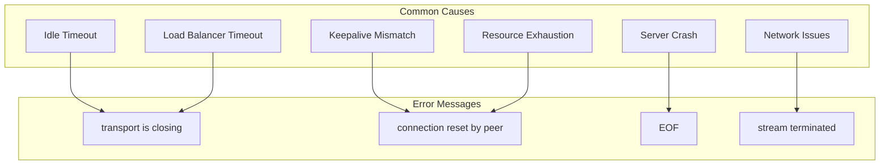
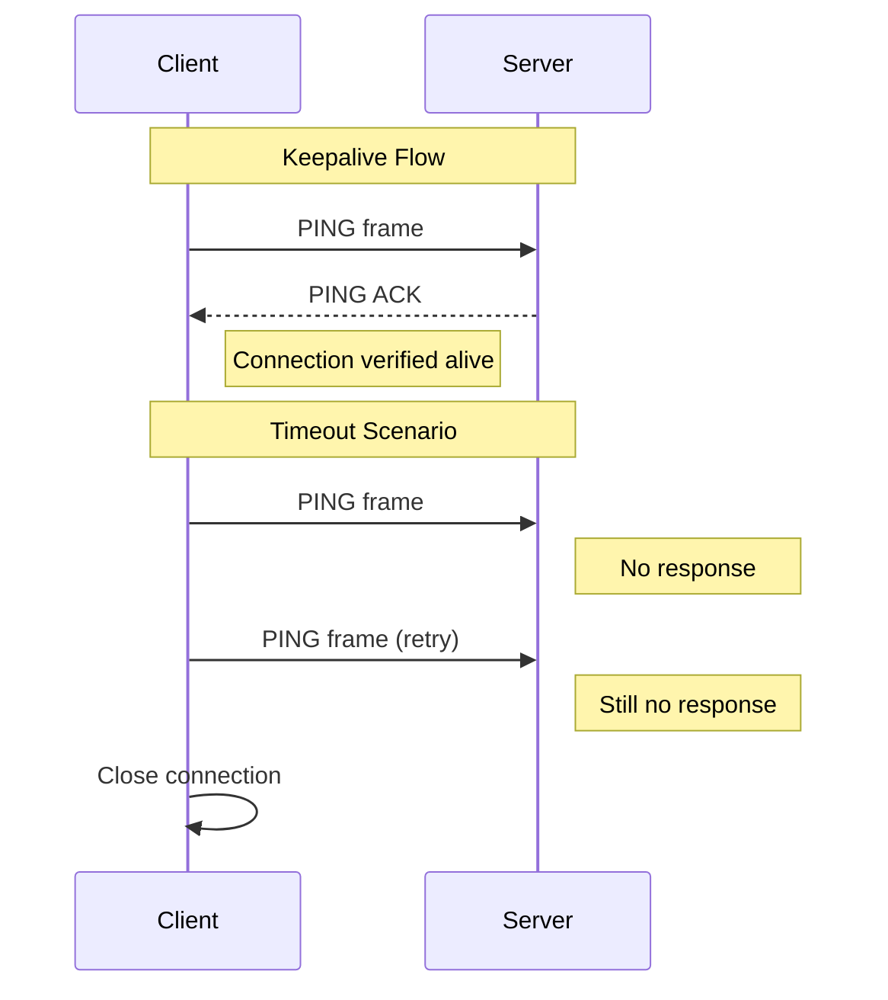
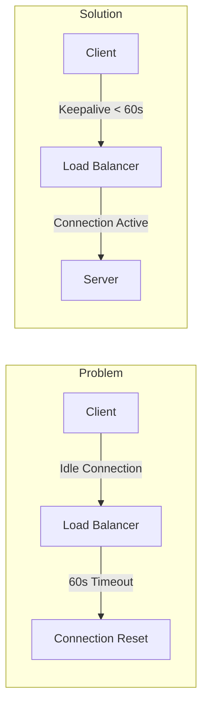

# How to Fix "Connection Reset" Errors in gRPC

Author: [nawazdhandala](https://www.github.com/nawazdhandala)

Tags: gRPC, Troubleshooting, Networking, Go, DevOps, Microservices

Description: Learn how to diagnose and resolve gRPC connection reset errors caused by timeouts, load balancer misconfigurations, keepalive settings, and resource exhaustion.

---

Connection reset errors in gRPC manifest as "transport is closing", "connection reset by peer", or "EOF" errors. These issues often stem from mismatched keepalive settings, load balancer timeouts, or resource constraints.

## Understanding Connection Reset Errors



## Common Error Messages

| Error | Typical Cause |
|-------|---------------|
| `rpc error: code = Unavailable desc = transport is closing` | Server-side idle timeout or keepalive failure |
| `rpc error: code = Unavailable desc = connection reset by peer` | Server forcibly closed connection |
| `rpc error: code = Internal desc = stream terminated by RST_STREAM` | HTTP/2 stream reset |
| `rpc error: code = Unavailable desc = EOF` | Connection closed unexpectedly |

## Solution 1: Configure Keepalive Settings

### Understanding Keepalive



### Go Server Keepalive Configuration

```go
// server/main.go
package main

import (
    "log"
    "net"
    "time"

    "google.golang.org/grpc"
    "google.golang.org/grpc/keepalive"

    pb "github.com/example/myapp/proto"
)

func main() {
    listener, err := net.Listen("tcp", ":50051")
    if err != nil {
        log.Fatalf("Failed to listen: %v", err)
    }

    // Configure keepalive parameters
    kaParams := keepalive.ServerParameters{
        // Maximum time a connection can be idle before server sends a GOAWAY
        MaxConnectionIdle: 5 * time.Minute,

        // Maximum time a connection can exist before server sends a GOAWAY
        MaxConnectionAge: 30 * time.Minute,

        // Grace period after MaxConnectionAge before forcibly closing
        MaxConnectionAgeGrace: 5 * time.Second,

        // Time between server keepalive pings
        Time: 2 * time.Minute,

        // Timeout for keepalive ping acknowledgment
        Timeout: 20 * time.Second,
    }

    // Configure enforcement policy
    kaEnforcement := keepalive.EnforcementPolicy{
        // Minimum time client should wait between pings
        MinTime: 30 * time.Second,

        // Allow pings even when there are no active streams
        PermitWithoutStream: true,
    }

    server := grpc.NewServer(
        grpc.KeepaliveParams(kaParams),
        grpc.KeepaliveEnforcementPolicy(kaEnforcement),
    )

    pb.RegisterMyServiceServer(server, &myService{})

    log.Println("Server starting with keepalive enabled")
    if err := server.Serve(listener); err != nil {
        log.Fatalf("Failed to serve: %v", err)
    }
}
```

### Go Client Keepalive Configuration

```go
// client/main.go
package main

import (
    "context"
    "log"
    "time"

    "google.golang.org/grpc"
    "google.golang.org/grpc/credentials/insecure"
    "google.golang.org/grpc/keepalive"

    pb "github.com/example/myapp/proto"
)

func main() {
    // Configure client keepalive
    kaParams := keepalive.ClientParameters{
        // Time after which client sends keepalive ping if no activity
        Time: 30 * time.Second,

        // Timeout for keepalive ping acknowledgment
        Timeout: 10 * time.Second,

        // Allow pings when there are no active RPCs
        PermitWithoutStream: true,
    }

    conn, err := grpc.Dial(
        "localhost:50051",
        grpc.WithTransportCredentials(insecure.NewCredentials()),
        grpc.WithKeepaliveParams(kaParams),
    )
    if err != nil {
        log.Fatalf("Failed to connect: %v", err)
    }
    defer conn.Close()

    client := pb.NewMyServiceClient(conn)

    // Make requests
    resp, err := client.DoSomething(context.Background(), &pb.Request{})
    if err != nil {
        log.Fatalf("Request failed: %v", err)
    }

    log.Printf("Response: %v", resp)
}
```

### Python Keepalive Configuration

```python
# server.py
import grpc
from concurrent import futures

# Keepalive options
options = [
    # Maximum time server allows connection to be idle
    ('grpc.keepalive_time_ms', 120000),  # 2 minutes

    # Timeout for keepalive ping acknowledgment
    ('grpc.keepalive_timeout_ms', 20000),  # 20 seconds

    # Allow keepalive pings when no calls in flight
    ('grpc.keepalive_permit_without_calls', True),

    # Maximum time connection can exist
    ('grpc.max_connection_age_ms', 1800000),  # 30 minutes

    # Grace period after max_connection_age
    ('grpc.max_connection_age_grace_ms', 5000),  # 5 seconds

    # Maximum idle time before server closes connection
    ('grpc.max_connection_idle_ms', 300000),  # 5 minutes

    # HTTP/2 settings
    ('grpc.http2.min_recv_ping_interval_without_data_ms', 30000),
    ('grpc.http2.max_pings_without_data', 0),
]

server = grpc.server(
    futures.ThreadPoolExecutor(max_workers=10),
    options=options
)
```

```python
# client.py
import grpc

options = [
    ('grpc.keepalive_time_ms', 30000),  # 30 seconds
    ('grpc.keepalive_timeout_ms', 10000),  # 10 seconds
    ('grpc.keepalive_permit_without_calls', True),
    ('grpc.http2.max_pings_without_data', 0),
]

channel = grpc.insecure_channel('localhost:50051', options=options)
```

## Solution 2: Handle Load Balancer Timeouts

Load balancers often have their own idle timeouts that can cause connection resets.



### AWS ALB Configuration

```yaml
# Terraform configuration for AWS ALB
resource "aws_lb_target_group" "grpc" {
  name             = "grpc-target-group"
  port             = 50051
  protocol         = "HTTP"
  protocol_version = "GRPC"
  vpc_id           = var.vpc_id
  target_type      = "ip"

  health_check {
    enabled             = true
    healthy_threshold   = 2
    unhealthy_threshold = 2
    timeout             = 5
    interval            = 30
    path                = "/grpc.health.v1.Health/Check"
    matcher             = "0"  # gRPC OK status
  }

  # Increase idle timeout to accommodate long-running streams
  stickiness {
    type            = "lb_cookie"
    cookie_duration = 86400  # 1 day
  }
}

resource "aws_lb" "grpc" {
  name               = "grpc-alb"
  internal           = false
  load_balancer_type = "application"

  # Set idle timeout higher than client keepalive
  idle_timeout = 120  # 2 minutes
}
```

### Nginx Configuration

```nginx
# nginx.conf
upstream grpc_backend {
    server grpc-server-1:50051;
    server grpc-server-2:50051;

    # Keep connections alive
    keepalive 32;
    keepalive_requests 10000;
    keepalive_timeout 300s;
}

server {
    listen 443 ssl http2;

    location / {
        grpc_pass grpc://grpc_backend;

        # Timeout settings
        grpc_connect_timeout 10s;
        grpc_read_timeout 300s;
        grpc_send_timeout 300s;

        # Keepalive to upstream
        grpc_socket_keepalive on;

        # Buffer settings
        grpc_buffer_size 16k;

        # Error handling
        error_page 502 = /error502grpc;
    }

    location = /error502grpc {
        internal;
        default_type application/grpc;
        add_header grpc-status 14;
        add_header grpc-message "Upstream unavailable";
        return 204;
    }
}
```

### Envoy Configuration

```yaml
# envoy.yaml
static_resources:
  listeners:
    - name: grpc_listener
      address:
        socket_address:
          address: 0.0.0.0
          port_value: 8080
      filter_chains:
        - filters:
            - name: envoy.filters.network.http_connection_manager
              typed_config:
                "@type": type.googleapis.com/envoy.extensions.filters.network.http_connection_manager.v3.HttpConnectionManager
                stat_prefix: grpc
                codec_type: AUTO

                # Connection idle timeout
                common_http_protocol_options:
                  idle_timeout: 300s

                # HTTP/2 settings
                http2_protocol_options:
                  # Maximum concurrent streams
                  max_concurrent_streams: 100

                  # Initial stream and connection window sizes
                  initial_stream_window_size: 65536
                  initial_connection_window_size: 1048576

                  # Connection keepalive
                  connection_keepalive:
                    interval: 30s
                    timeout: 10s

  clusters:
    - name: grpc_backend
      connect_timeout: 5s
      type: STRICT_DNS
      lb_policy: ROUND_ROBIN

      # Circuit breaker settings
      circuit_breakers:
        thresholds:
          - priority: DEFAULT
            max_connections: 1000
            max_pending_requests: 1000
            max_requests: 1000

      # Health checking
      health_checks:
        - timeout: 5s
          interval: 10s
          unhealthy_threshold: 3
          healthy_threshold: 2
          grpc_health_check: {}
```

## Solution 3: Implement Connection Retry Logic

```go
// client/retry.go
package main

import (
    "context"
    "log"
    "time"

    "google.golang.org/grpc"
    "google.golang.org/grpc/codes"
    "google.golang.org/grpc/credentials/insecure"
    "google.golang.org/grpc/status"

    pb "github.com/example/myapp/proto"
)

// RetryConfig defines retry behavior
type RetryConfig struct {
    MaxRetries  int
    BaseBackoff time.Duration
    MaxBackoff  time.Duration
}

// DefaultRetryConfig provides sensible defaults
var DefaultRetryConfig = RetryConfig{
    MaxRetries:  5,
    BaseBackoff: 100 * time.Millisecond,
    MaxBackoff:  5 * time.Second,
}

// isRetryableError determines if an error should trigger a retry
func isRetryableError(err error) bool {
    if err == nil {
        return false
    }

    st, ok := status.FromError(err)
    if !ok {
        // Network errors are typically retryable
        return true
    }

    switch st.Code() {
    case codes.Unavailable:
        // Server is temporarily unavailable (connection reset, etc.)
        return true
    case codes.ResourceExhausted:
        // Rate limiting - retry with backoff
        return true
    case codes.Aborted:
        // Operation was aborted - retry might succeed
        return true
    case codes.DeadlineExceeded:
        // Timeout - might work with fresh deadline
        return true
    default:
        return false
    }
}

// WithRetry wraps a gRPC call with retry logic
func WithRetry[T any](
    ctx context.Context,
    config RetryConfig,
    fn func(context.Context) (T, error),
) (T, error) {
    var result T
    var lastErr error

    backoff := config.BaseBackoff

    for attempt := 0; attempt <= config.MaxRetries; attempt++ {
        result, lastErr = fn(ctx)

        if lastErr == nil {
            return result, nil
        }

        if !isRetryableError(lastErr) {
            return result, lastErr
        }

        if attempt == config.MaxRetries {
            break
        }

        log.Printf("Retry %d/%d after error: %v", attempt+1, config.MaxRetries, lastErr)

        // Wait with exponential backoff
        select {
        case <-ctx.Done():
            return result, ctx.Err()
        case <-time.After(backoff):
        }

        // Increase backoff
        backoff *= 2
        if backoff > config.MaxBackoff {
            backoff = config.MaxBackoff
        }
    }

    return result, lastErr
}

// Example usage
func main() {
    conn, err := grpc.Dial(
        "localhost:50051",
        grpc.WithTransportCredentials(insecure.NewCredentials()),
    )
    if err != nil {
        log.Fatalf("Failed to connect: %v", err)
    }
    defer conn.Close()

    client := pb.NewMyServiceClient(conn)
    ctx := context.Background()

    // Call with retry
    resp, err := WithRetry(ctx, DefaultRetryConfig, func(ctx context.Context) (*pb.Response, error) {
        return client.DoSomething(ctx, &pb.Request{})
    })

    if err != nil {
        log.Fatalf("Request failed after retries: %v", err)
    }

    log.Printf("Response: %v", resp)
}
```

### Using gRPC Built-in Retry

```go
// client/builtin_retry.go
package main

import (
    "google.golang.org/grpc"
    "google.golang.org/grpc/credentials/insecure"
)

func main() {
    // Define retry policy
    retryPolicy := `{
        "methodConfig": [{
            "name": [{"service": "mypackage.MyService"}],
            "waitForReady": true,
            "retryPolicy": {
                "MaxAttempts": 5,
                "InitialBackoff": "0.1s",
                "MaxBackoff": "5s",
                "BackoffMultiplier": 2.0,
                "RetryableStatusCodes": [
                    "UNAVAILABLE",
                    "RESOURCE_EXHAUSTED",
                    "ABORTED"
                ]
            }
        }]
    }`

    conn, err := grpc.Dial(
        "localhost:50051",
        grpc.WithTransportCredentials(insecure.NewCredentials()),
        grpc.WithDefaultServiceConfig(retryPolicy),
    )
    if err != nil {
        log.Fatalf("Failed to connect: %v", err)
    }
    defer conn.Close()

    // Requests will automatically retry on specified status codes
}
```

## Solution 4: Implement Health Checks

```go
// server/health.go
package main

import (
    "context"
    "log"
    "net"
    "sync"
    "time"

    "google.golang.org/grpc"
    "google.golang.org/grpc/health"
    healthpb "google.golang.org/grpc/health/grpc_health_v1"
    "google.golang.org/grpc/reflection"

    pb "github.com/example/myapp/proto"
)

type healthManager struct {
    healthServer *health.Server
    services     []string
    mu           sync.RWMutex
}

func newHealthManager(healthServer *health.Server, services []string) *healthManager {
    return &healthManager{
        healthServer: healthServer,
        services:     services,
    }
}

// SetServingStatus updates health status for all services
func (h *healthManager) SetServingStatus(status healthpb.HealthCheckResponse_ServingStatus) {
    h.mu.Lock()
    defer h.mu.Unlock()

    for _, service := range h.services {
        h.healthServer.SetServingStatus(service, status)
    }

    // Also update the overall status
    h.healthServer.SetServingStatus("", status)
}

func main() {
    listener, err := net.Listen("tcp", ":50051")
    if err != nil {
        log.Fatalf("Failed to listen: %v", err)
    }

    server := grpc.NewServer()

    // Register main service
    myService := &myService{}
    pb.RegisterMyServiceServer(server, myService)

    // Register health service
    healthServer := health.NewServer()
    healthpb.RegisterHealthServer(server, healthServer)

    // Create health manager
    healthMgr := newHealthManager(healthServer, []string{
        "mypackage.MyService",
    })

    // Set initial status
    healthMgr.SetServingStatus(healthpb.HealthCheckResponse_SERVING)

    // Enable reflection
    reflection.Register(server)

    // Monitor health and update status
    go func() {
        for {
            time.Sleep(10 * time.Second)

            // Check dependencies
            if myService.isDatabaseHealthy() && myService.isCacheHealthy() {
                healthMgr.SetServingStatus(healthpb.HealthCheckResponse_SERVING)
            } else {
                healthMgr.SetServingStatus(healthpb.HealthCheckResponse_NOT_SERVING)
            }
        }
    }()

    log.Println("Server starting with health checks enabled")
    if err := server.Serve(listener); err != nil {
        log.Fatalf("Failed to serve: %v", err)
    }
}
```

### Client Health Check Usage

```go
// client/health_check.go
package main

import (
    "context"
    "log"
    "time"

    "google.golang.org/grpc"
    "google.golang.org/grpc/credentials/insecure"
    healthpb "google.golang.org/grpc/health/grpc_health_v1"
)

func checkHealth(conn *grpc.ClientConn, service string) bool {
    client := healthpb.NewHealthClient(conn)

    ctx, cancel := context.WithTimeout(context.Background(), 5*time.Second)
    defer cancel()

    resp, err := client.Check(ctx, &healthpb.HealthCheckRequest{
        Service: service,
    })
    if err != nil {
        log.Printf("Health check failed: %v", err)
        return false
    }

    return resp.Status == healthpb.HealthCheckResponse_SERVING
}

func watchHealth(conn *grpc.ClientConn, service string) {
    client := healthpb.NewHealthClient(conn)

    ctx := context.Background()

    stream, err := client.Watch(ctx, &healthpb.HealthCheckRequest{
        Service: service,
    })
    if err != nil {
        log.Printf("Failed to start health watch: %v", err)
        return
    }

    for {
        resp, err := stream.Recv()
        if err != nil {
            log.Printf("Health watch error: %v", err)
            return
        }

        log.Printf("Health status: %v", resp.Status)
    }
}
```

## Debugging Connection Issues

### Enable gRPC Debug Logging

```go
// Enable verbose logging
import (
    "google.golang.org/grpc/grpclog"
)

func init() {
    // Set to 2 for verbose, 1 for info, 0 for warning
    grpclog.SetLoggerV2(grpclog.NewLoggerV2WithVerbosity(
        os.Stdout, // info
        os.Stderr, // warning
        os.Stderr, // error
        2,         // verbosity
    ))
}
```

### Environment Variables for Debugging

```bash
# Enable gRPC debug output
export GRPC_GO_LOG_VERBOSITY_LEVEL=99
export GRPC_GO_LOG_SEVERITY_LEVEL=info

# Enable HTTP/2 frame logging
export GODEBUG=http2debug=2

# Run your application
./myapp
```

### Network Diagnostic Script

```bash
#!/bin/bash
# diagnose_grpc.sh

HOST=$1
PORT=$2

echo "=== gRPC Connection Diagnostics ==="
echo "Target: $HOST:$PORT"
echo ""

echo "1. DNS Resolution"
dig +short $HOST
echo ""

echo "2. TCP Connection Test"
nc -zv $HOST $PORT 2>&1
echo ""

echo "3. TLS Handshake (if applicable)"
echo | openssl s_client -connect $HOST:$PORT 2>&1 | head -20
echo ""

echo "4. gRPC Health Check"
grpcurl -plaintext $HOST:$PORT grpc.health.v1.Health/Check
echo ""

echo "5. List Available Services"
grpcurl -plaintext $HOST:$PORT list
echo ""

echo "6. Connection Trace"
tcpdump -i any -c 20 host $HOST and port $PORT 2>&1
```

---

Connection reset errors in gRPC are often caused by keepalive mismatches between client, server, and any intermediate load balancers. Align your timeout settings, implement proper retry logic, and use health checks to build resilient gRPC services.
