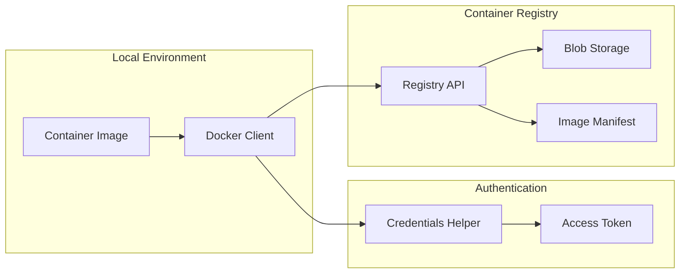
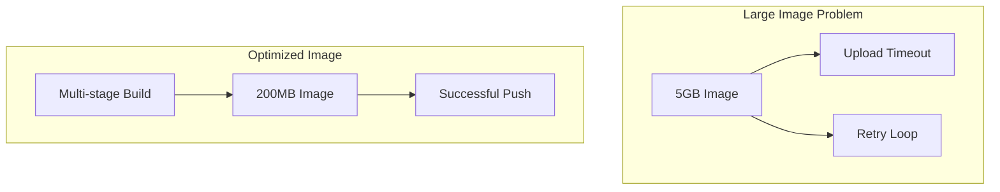

# How to Fix "Container Registry" Push Errors

Author: [nawazdhandala](https://www.github.com/nawazdhandala)

Tags: Docker, Container Registry, GCR, ECR, ACR, DevOps, CI/CD, Troubleshooting

Description: A comprehensive guide to diagnosing and fixing common container registry push errors across Google Container Registry, Amazon ECR, and Azure Container Registry.

---

Pushing container images to a registry should be straightforward, but authentication issues, network problems, and permission errors can turn a simple push into hours of debugging. This guide covers the most common push errors and their solutions across major cloud registries.

## Understanding Container Registry Architecture



## Google Container Registry (GCR) Errors

### Error: "denied: Token exchange failed"

This is the most common GCR error. It means your authentication is not configured correctly.

```bash
# Error message
denied: Token exchange failed for project 'my-project'.
Caller does not have permission 'storage.buckets.get'.
```

**Solution 1: Configure Docker Credential Helper**

```bash
# Install gcloud CLI if not already installed
# Then configure Docker authentication
gcloud auth configure-docker

# For Artifact Registry (newer)
gcloud auth configure-docker us-central1-docker.pkg.dev
```

**Solution 2: Use Service Account Key**

```bash
# Create a service account with required permissions
gcloud iam service-accounts create docker-pusher \
    --display-name="Docker Image Pusher"

# Grant Storage Admin role (for GCR)
gcloud projects add-iam-policy-binding my-project \
    --member="serviceAccount:docker-pusher@my-project.iam.gserviceaccount.com" \
    --role="roles/storage.admin"

# Create and download key
gcloud iam service-accounts keys create key.json \
    --iam-account=docker-pusher@my-project.iam.gserviceaccount.com

# Authenticate Docker with service account
cat key.json | docker login -u _json_key --password-stdin https://gcr.io
```

### Error: "unauthorized: authentication required"

```bash
# Verify you are logged in
gcloud auth list

# Re-authenticate
gcloud auth login

# Re-configure Docker
gcloud auth configure-docker --quiet
```

### Error: "name unknown: Repository not found"

This usually means the image tag format is wrong.

```bash
# Wrong format
docker push myimage:latest

# Correct format for GCR
docker push gcr.io/PROJECT_ID/myimage:latest

# Correct format for Artifact Registry
docker push us-central1-docker.pkg.dev/PROJECT_ID/REPO_NAME/myimage:latest
```

## Amazon ECR Errors

### Error: "no basic auth credentials"

ECR requires re-authentication every 12 hours.

```bash
# Get login password and pipe to Docker login
aws ecr get-login-password --region us-east-1 | \
    docker login --username AWS --password-stdin \
    123456789012.dkr.ecr.us-east-1.amazonaws.com
```

**For CI/CD pipelines, automate this:**

```yaml
# GitHub Actions example
- name: Login to Amazon ECR
  id: login-ecr
  uses: aws-actions/amazon-ecr-login@v2

- name: Build and push
  env:
    ECR_REGISTRY: ${{ steps.login-ecr.outputs.registry }}
  run: |
    docker build -t $ECR_REGISTRY/my-app:${{ github.sha }} .
    docker push $ECR_REGISTRY/my-app:${{ github.sha }}
```

### Error: "RepositoryNotFoundException"

The ECR repository must exist before you can push images.

```bash
# Create the repository first
aws ecr create-repository \
    --repository-name my-app \
    --image-scanning-configuration scanOnPush=true \
    --region us-east-1

# Then push
docker push 123456789012.dkr.ecr.us-east-1.amazonaws.com/my-app:latest
```

**Terraform solution for automatic repository creation:**

```hcl
resource "aws_ecr_repository" "app" {
  name                 = "my-app"
  image_tag_mutability = "MUTABLE"

  image_scanning_configuration {
    scan_on_push = true
  }

  lifecycle {
    prevent_destroy = true
  }
}

# Lifecycle policy to clean up old images
resource "aws_ecr_lifecycle_policy" "app" {
  repository = aws_ecr_repository.app.name

  policy = jsonencode({
    rules = [{
      rulePriority = 1
      description  = "Keep last 30 images"
      selection = {
        tagStatus     = "any"
        countType     = "imageCountMoreThan"
        countNumber   = 30
      }
      action = {
        type = "expire"
      }
    }]
  })
}
```

### Error: "AccessDeniedException"

IAM permissions are insufficient.

```bash
# Check current identity
aws sts get-caller-identity

# Required IAM policy for pushing
{
    "Version": "2012-10-17",
    "Statement": [
        {
            "Effect": "Allow",
            "Action": [
                "ecr:GetAuthorizationToken"
            ],
            "Resource": "*"
        },
        {
            "Effect": "Allow",
            "Action": [
                "ecr:BatchCheckLayerAvailability",
                "ecr:GetDownloadUrlForLayer",
                "ecr:BatchGetImage",
                "ecr:PutImage",
                "ecr:InitiateLayerUpload",
                "ecr:UploadLayerPart",
                "ecr:CompleteLayerUpload"
            ],
            "Resource": "arn:aws:ecr:us-east-1:123456789012:repository/my-app"
        }
    ]
}
```

## Azure Container Registry Errors

### Error: "unauthorized: authentication required"

```bash
# Login with Azure CLI
az acr login --name myregistry

# Or use service principal
docker login myregistry.azurecr.io \
    --username $SERVICE_PRINCIPAL_ID \
    --password $SERVICE_PRINCIPAL_PASSWORD
```

### Error: "UNAUTHORIZED: authentication required, realm"

Admin credentials might be disabled.

```bash
# Enable admin user (not recommended for production)
az acr update --name myregistry --admin-enabled true

# Get credentials
az acr credential show --name myregistry

# Better approach: use managed identity or service principal
az ad sp create-for-rbac \
    --name "acr-push-sp" \
    --scopes /subscriptions/{sub}/resourceGroups/{rg}/providers/Microsoft.ContainerRegistry/registries/{registry} \
    --role acrpush
```

## Network and Proxy Issues

### Error: "net/http: TLS handshake timeout"

```bash
# Check if you can reach the registry
curl -v https://gcr.io/v2/

# If behind a proxy, configure Docker
sudo mkdir -p /etc/systemd/system/docker.service.d
sudo cat > /etc/systemd/system/docker.service.d/http-proxy.conf << EOF
[Service]
Environment="HTTP_PROXY=http://proxy.example.com:8080"
Environment="HTTPS_PROXY=http://proxy.example.com:8080"
Environment="NO_PROXY=localhost,127.0.0.1"
EOF

sudo systemctl daemon-reload
sudo systemctl restart docker
```

### Error: "context deadline exceeded"

Large images or slow connections cause timeouts.

```bash
# Increase Docker timeout
export DOCKER_CLIENT_TIMEOUT=300
export COMPOSE_HTTP_TIMEOUT=300

# Or push layers individually by optimizing Dockerfile
# Put frequently changing content at the end
```

## Image Size and Layer Issues

### Error: "blob upload unknown"



**Optimize your Dockerfile:**

```dockerfile
# Bad: Large image with build tools
FROM node:18
WORKDIR /app
COPY . .
RUN npm install
RUN npm run build
CMD ["node", "dist/index.js"]

# Good: Multi-stage build
FROM node:18 AS builder
WORKDIR /app
COPY package*.json ./
RUN npm ci
COPY . .
RUN npm run build

FROM node:18-alpine
WORKDIR /app
# Only copy production dependencies and build output
COPY --from=builder /app/dist ./dist
COPY --from=builder /app/node_modules ./node_modules
CMD ["node", "dist/index.js"]
```

### Error: "manifest invalid" or "manifest unknown"

```bash
# Check local image exists
docker images | grep my-app

# Verify tag matches exactly
docker tag my-app:latest gcr.io/my-project/my-app:latest

# Push with verbose output
docker push gcr.io/my-project/my-app:latest --debug
```

## CI/CD Pipeline Troubleshooting

### GitHub Actions Complete Example

```yaml
name: Build and Push

on:
  push:
    branches: [main]

env:
  REGISTRY: gcr.io
  PROJECT_ID: my-project
  IMAGE_NAME: my-app

jobs:
  build-and-push:
    runs-on: ubuntu-latest
    permissions:
      contents: read
      id-token: write  # Required for workload identity

    steps:
      - name: Checkout
        uses: actions/checkout@v4

      - name: Authenticate to Google Cloud
        uses: google-github-actions/auth@v2
        with:
          workload_identity_provider: ${{ secrets.WIF_PROVIDER }}
          service_account: ${{ secrets.WIF_SERVICE_ACCOUNT }}

      - name: Configure Docker
        run: gcloud auth configure-docker --quiet

      - name: Build image
        run: |
          docker build \
            --cache-from $REGISTRY/$PROJECT_ID/$IMAGE_NAME:latest \
            -t $REGISTRY/$PROJECT_ID/$IMAGE_NAME:${{ github.sha }} \
            -t $REGISTRY/$PROJECT_ID/$IMAGE_NAME:latest \
            .

      - name: Push image
        run: |
          docker push $REGISTRY/$PROJECT_ID/$IMAGE_NAME:${{ github.sha }}
          docker push $REGISTRY/$PROJECT_ID/$IMAGE_NAME:latest
```

### Debugging Script

```bash
#!/bin/bash
# debug-push.sh - Diagnose container registry push issues

REGISTRY=$1
IMAGE=$2

echo "=== Checking Docker daemon ==="
docker info > /dev/null 2>&1 || { echo "Docker not running"; exit 1; }

echo "=== Checking image exists locally ==="
docker images | grep "$IMAGE" || { echo "Image not found locally"; exit 1; }

echo "=== Checking registry connectivity ==="
curl -s -o /dev/null -w "%{http_code}" "https://$REGISTRY/v2/" || echo "Cannot reach registry"

echo "=== Checking authentication ==="
docker pull "$REGISTRY/library/alpine:latest" 2>&1 | head -5

echo "=== Attempting push with debug ==="
DOCKER_CLI_DEBUG=1 docker push "$REGISTRY/$IMAGE" 2>&1

echo "=== Docker config ==="
cat ~/.docker/config.json | jq '.auths | keys'
```

## Best Practices

1. **Use credential helpers**: Never store passwords in plaintext
2. **Implement image scanning**: Catch vulnerabilities before deployment
3. **Set up lifecycle policies**: Automatically clean up old images
4. **Use immutable tags**: Prevent accidental overwrites in production
5. **Cache layers**: Speed up builds by ordering Dockerfile instructions properly

---

Container registry push errors are frustrating but usually fall into three categories: authentication, permissions, or network issues. Start by verifying authentication, check IAM/RBAC permissions, and then look at network connectivity. With the debugging techniques in this guide, you should be able to resolve most push failures quickly.
