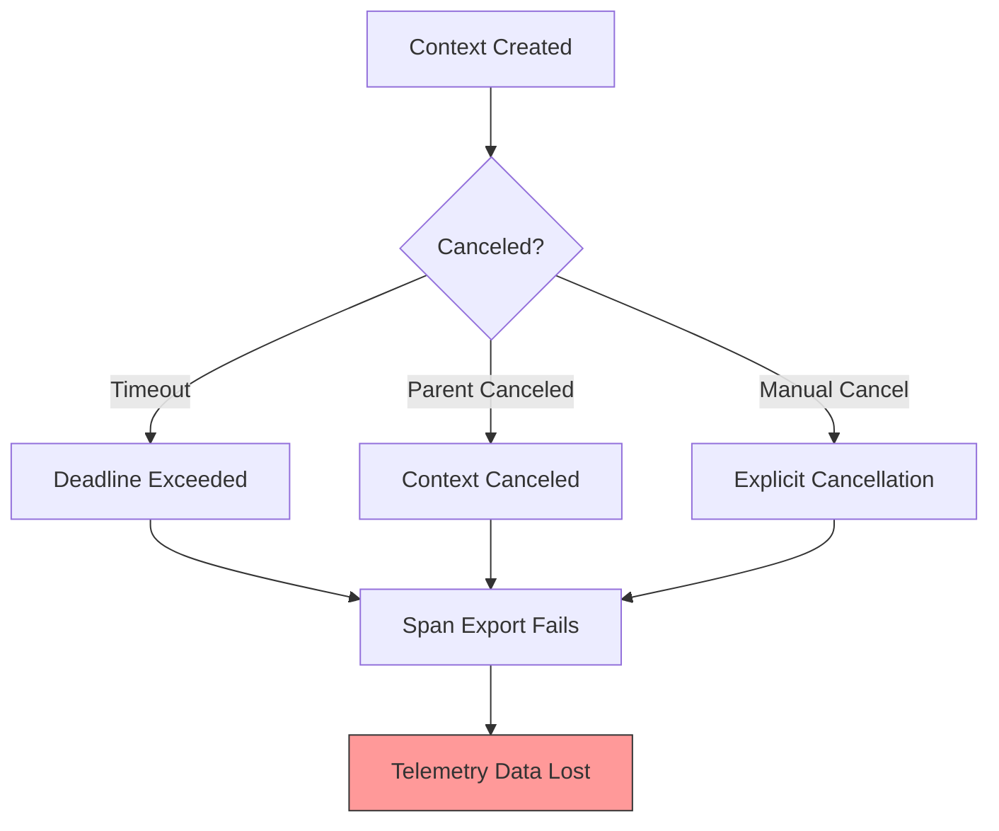
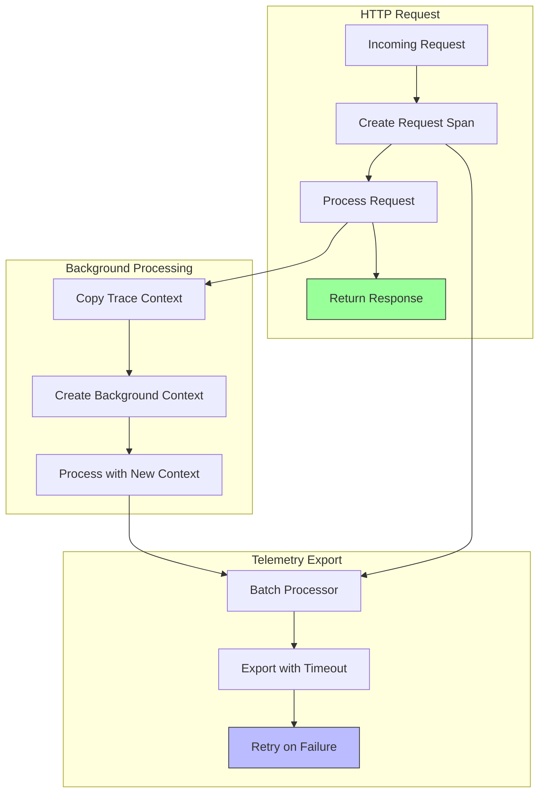

# How to Fix "Context Canceled" Errors in OpenTelemetry

Author: [nawazdhandala](https://www.github.com/nawazdhandala)

Tags: OpenTelemetry, Debugging, Context, Tracing, Error Handling

Description: Learn how to diagnose and fix context canceled errors that cause spans and telemetry data to be lost in OpenTelemetry applications.

---

"Context canceled" errors are among the most frustrating issues in OpenTelemetry implementations. They cause spans to be dropped, metrics to be lost, and leave gaps in your observability data. This guide explains why these errors occur and how to fix them.

## Understanding Context Cancellation

In Go and other languages with context support, a context can be canceled for several reasons:



## Common Causes of Context Canceled Errors

### 1. HTTP Request Context Used for Background Operations

The most common cause is using an HTTP request's context for operations that should outlive the request:

```go
// WRONG: This will fail when the HTTP request completes
func handleRequest(w http.ResponseWriter, r *http.Request) {
    ctx := r.Context() // This context gets canceled when the request ends

    // Start a span that will be used for background processing
    ctx, span := tracer.Start(ctx, "process-request")

    // Return response to client
    w.WriteHeader(http.StatusAccepted)
    w.Write([]byte("Processing started"))

    // This goroutine uses the request context - PROBLEM!
    go func() {
        defer span.End() // This may fail with "context canceled"

        // By the time this runs, r.Context() may already be canceled
        processInBackground(ctx) // Will fail!
    }()
}
```

**The Fix**: Create a new context for background operations:

```go
// CORRECT: Use a separate context for background work
func handleRequest(w http.ResponseWriter, r *http.Request) {
    // Extract trace context from the request
    ctx := r.Context()

    // Create a span linked to the request
    _, span := tracer.Start(ctx, "process-request")

    // Create a new background context that carries trace context
    // but is not tied to the request lifecycle
    bgCtx := context.Background()

    // Link the background context to the original trace
    bgCtx = trace.ContextWithSpan(bgCtx, span)

    // Return response to client
    w.WriteHeader(http.StatusAccepted)
    w.Write([]byte("Processing started"))

    // Now the goroutine uses a context that won't be canceled
    go func() {
        defer span.End() // This will work correctly

        // Create child spans using the background context
        processInBackground(bgCtx)
    }()
}

func processInBackground(ctx context.Context) {
    // This span will be properly linked to the parent trace
    ctx, span := tracer.Start(ctx, "background-processing")
    defer span.End()

    // Do the actual work
    time.Sleep(5 * time.Second)
    span.SetStatus(codes.Ok, "completed")
}
```

### 2. Shutdown Race Conditions

Another common cause is application shutdown happening before telemetry export completes:

```go
// WRONG: Shutdown may cancel context before export completes
func main() {
    // Initialize tracer
    tp := initTracer()

    // Run application
    runApp()

    // Shutdown immediately - may drop pending spans!
    tp.Shutdown(context.Background())
}
```

**The Fix**: Allow time for graceful shutdown:

```go
// CORRECT: Give exporters time to flush
func main() {
    // Initialize tracer
    tp := initTracer()

    // Handle shutdown signals
    sigCh := make(chan os.Signal, 1)
    signal.Notify(sigCh, os.Interrupt, syscall.SIGTERM)

    // Run application in background
    go runApp()

    // Wait for shutdown signal
    <-sigCh

    // Create a context with timeout for graceful shutdown
    ctx, cancel := context.WithTimeout(context.Background(), 30*time.Second)
    defer cancel()

    // Shutdown with timeout - allows pending spans to be exported
    if err := tp.Shutdown(ctx); err != nil {
        log.Printf("Error shutting down tracer provider: %v", err)
    }

    log.Println("Shutdown complete")
}
```

### 3. Exporter Timeout Too Short

If your exporter timeout is shorter than the export duration, you will see context canceled errors:

```go
// WRONG: 1 second timeout may be too short for batch exports
exporter, err := otlptracegrpc.New(ctx,
    otlptracegrpc.WithTimeout(1*time.Second), // Too short!
    otlptracegrpc.WithEndpoint("collector:4317"),
)
```

**The Fix**: Use appropriate timeouts:

```go
// CORRECT: Use reasonable timeout values
exporter, err := otlptracegrpc.New(ctx,
    otlptracegrpc.WithTimeout(30*time.Second), // Reasonable timeout
    otlptracegrpc.WithEndpoint("collector:4317"),
    otlptracegrpc.WithRetry(otlptracegrpc.RetryConfig{
        Enabled:         true,
        InitialInterval: 1 * time.Second,
        MaxInterval:     5 * time.Second,
        MaxElapsedTime:  30 * time.Second,
    }),
)
```

## Fixing Context Canceled in Python

Python applications face similar issues:

```python
# WRONG: Using request context for background tasks
from fastapi import FastAPI, Request, BackgroundTasks
from opentelemetry import trace

app = FastAPI()
tracer = trace.get_tracer(__name__)

@app.post("/process")
async def process_item(request: Request, background_tasks: BackgroundTasks):
    # This span's context is tied to the request
    with tracer.start_as_current_span("process-request") as span:
        # Adding background task - but context may be gone when it runs!
        background_tasks.add_task(do_background_work)
        return {"status": "accepted"}

async def do_background_work():
    # No trace context here - span will be orphaned!
    with tracer.start_as_current_span("background-work") as span:
        await asyncio.sleep(5)
```

**The Fix**: Explicitly pass trace context:

```python
# CORRECT: Extract and pass trace context to background tasks
from fastapi import FastAPI, Request, BackgroundTasks
from opentelemetry import trace
from opentelemetry.trace import SpanContext
from opentelemetry.trace.propagation import set_span_in_context
import contextvars

app = FastAPI()
tracer = trace.get_tracer(__name__)

@app.post("/process")
async def process_item(request: Request, background_tasks: BackgroundTasks):
    with tracer.start_as_current_span("process-request") as span:
        # Capture the span context before the request ends
        span_context = span.get_span_context()

        # Pass the span context to the background task
        background_tasks.add_task(
            do_background_work,
            span_context=span_context
        )
        return {"status": "accepted"}

async def do_background_work(span_context: SpanContext):
    """
    Background task that creates a linked span using the captured context.
    """
    # Create a link to the original span
    link = trace.Link(span_context)

    # Start a new span with a link to the original trace
    with tracer.start_as_current_span(
        "background-work",
        links=[link]
    ) as span:
        span.set_attribute("linked_trace_id", format(span_context.trace_id, '032x'))
        await asyncio.sleep(5)
        span.set_status(trace.Status(trace.StatusCode.OK))
```

## Handling Context in Async Operations

For async operations, ensure context propagation:

```python
# async_context.py
import asyncio
from opentelemetry import trace, context
from opentelemetry.trace import set_span_in_context

tracer = trace.get_tracer(__name__)

async def process_items(items: list):
    """
    Process multiple items concurrently while maintaining trace context.
    """
    with tracer.start_as_current_span("process-items") as parent_span:
        # Capture the current context
        ctx = context.get_current()

        # Create tasks with context propagation
        tasks = []
        for item in items:
            # Each task gets the parent context
            task = asyncio.create_task(
                process_single_item(item, ctx)
            )
            tasks.append(task)

        # Wait for all tasks
        results = await asyncio.gather(*tasks, return_exceptions=True)

        # Check for failures
        failures = [r for r in results if isinstance(r, Exception)]
        if failures:
            parent_span.set_status(
                trace.Status(trace.StatusCode.ERROR, f"{len(failures)} items failed")
            )

        return results

async def process_single_item(item, parent_ctx):
    """
    Process a single item with proper context propagation.
    """
    # Attach the parent context
    token = context.attach(parent_ctx)
    try:
        # Now this span will be a child of the parent
        with tracer.start_as_current_span(f"process-item-{item}") as span:
            span.set_attribute("item.id", str(item))

            # Simulate processing
            await asyncio.sleep(0.1)

            return {"item": item, "status": "processed"}
    finally:
        # Detach the context when done
        context.detach(token)
```

## Diagnosing Context Canceled Errors

Use these techniques to find the source of context cancellation:

```go
// debug_context.go
package main

import (
    "context"
    "fmt"
    "runtime"
    "time"

    "go.opentelemetry.io/otel/trace"
)

// DebugContext wraps a context and logs when it's canceled
func DebugContext(parent context.Context, name string) context.Context {
    ctx, cancel := context.WithCancel(parent)

    // Track where this context was created
    _, file, line, _ := runtime.Caller(1)
    location := fmt.Sprintf("%s:%d", file, line)

    go func() {
        <-ctx.Done()
        fmt.Printf("[DEBUG] Context '%s' canceled at %s\n", name, location)
        fmt.Printf("[DEBUG] Reason: %v\n", ctx.Err())

        // Print stack trace to find the cancellation source
        buf := make([]byte, 4096)
        n := runtime.Stack(buf, false)
        fmt.Printf("[DEBUG] Stack trace:\n%s\n", buf[:n])
    }()

    // Return a context that can be canceled
    return &debugContext{ctx, cancel, name}
}

type debugContext struct {
    context.Context
    cancel context.CancelFunc
    name   string
}

// Helper to check if a span was affected by context cancellation
func CheckSpanExport(span trace.Span) {
    if !span.IsRecording() {
        fmt.Println("[WARN] Span is not recording - may have been affected by context cancellation")
    }

    spanCtx := span.SpanContext()
    if !spanCtx.IsValid() {
        fmt.Println("[WARN] Span context is invalid")
    }
}
```

## Architecture for Reliable Telemetry

Design your system to handle context cancellation gracefully:



## Configuration for Resilient Export

Configure your exporters to be resilient to temporary failures:

```yaml
# otel-collector-config.yaml
exporters:
  otlp:
    endpoint: backend:4317
    # Generous timeout for exports
    timeout: 30s

    # Retry configuration
    retry_on_failure:
      enabled: true
      initial_interval: 5s
      max_interval: 30s
      max_elapsed_time: 300s

    # Queue configuration to buffer during failures
    sending_queue:
      enabled: true
      num_consumers: 10
      queue_size: 5000
```

## Best Practices Summary

1. **Never use request context for background work**: Always create a new context for operations that outlive the request.

2. **Implement graceful shutdown**: Give your application time to flush pending telemetry before exiting.

3. **Use appropriate timeouts**: Set exporter timeouts that account for network latency and batch sizes.

4. **Enable retry logic**: Configure exporters to retry on transient failures.

5. **Monitor for dropped spans**: Set up alerts for telemetry export failures.

6. **Use span links for async operations**: When you cannot use parent-child relationships, use links to maintain trace correlation.

```go
// Summary: Proper context handling pattern
func handleRequestProperly(w http.ResponseWriter, r *http.Request) {
    // 1. Create request span with request context
    ctx, span := tracer.Start(r.Context(), "handle-request")
    defer span.End()

    // 2. Do synchronous work with request context
    result := doSyncWork(ctx)

    // 3. For async work, create a detached context
    if needsAsyncProcessing(result) {
        // Copy trace context to new background context
        bgCtx := trace.ContextWithSpan(context.Background(), span)

        // Start async work with detached context
        go func() {
            asyncCtx, asyncSpan := tracer.Start(bgCtx, "async-processing")
            defer asyncSpan.End()

            doAsyncWork(asyncCtx)
        }()
    }

    // 4. Return response - request context can now safely end
    w.WriteHeader(http.StatusOK)
    json.NewEncoder(w).Encode(result)
}
```

## Conclusion

Context canceled errors in OpenTelemetry are almost always caused by context lifecycle mismanagement. The key insight is that request contexts should only be used for operations that complete before the response is sent. For background processing, async operations, and anything that outlives the request, create a new context and explicitly propagate trace information.

By following these patterns, you will ensure that all your spans are properly recorded and exported, giving you complete visibility into your distributed systems.
