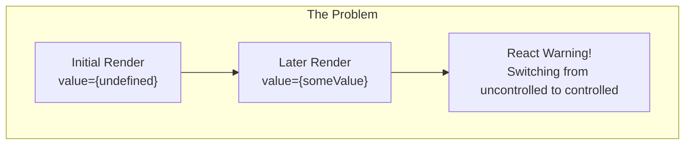
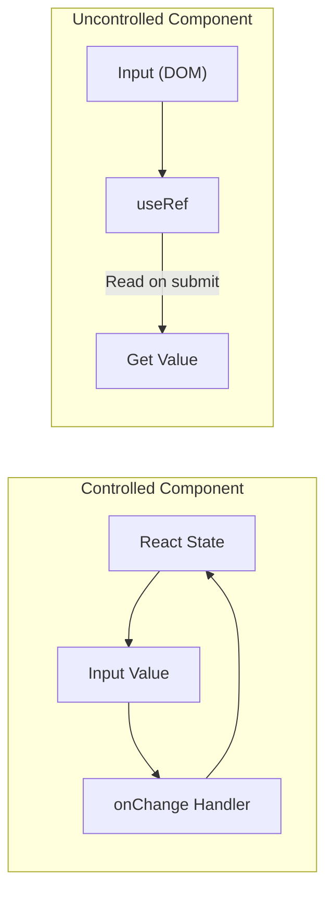
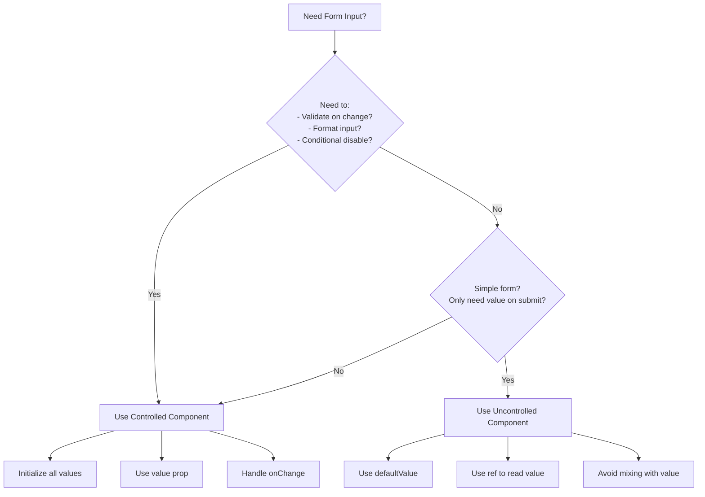

# How to Fix 'Controlled vs Uncontrolled' Input Warnings

Author: [nawazdhandala](https://www.github.com/nawazdhandala)

Tags: React, Forms, Input, Controlled Components, Uncontrolled Components, JavaScript, TypeScript, Debugging

Description: Learn how to fix React controlled vs uncontrolled input warnings by understanding component patterns and implementing proper form handling.

---

> The "A component is changing an uncontrolled input to be controlled" warning signals a fundamental misunderstanding of React form handling. This guide explains the difference between controlled and uncontrolled components and shows you how to fix these warnings properly.

Form handling in React requires choosing between controlled and uncontrolled patterns. Mixing them causes bugs and warnings.

---

## Understanding the Warning



---

## The Root Cause

React tracks whether an input is controlled or uncontrolled based on whether the `value` prop is defined. The warning appears when an input switches between these states.

### What Triggers the Warning

```tsx
// src/components/BrokenForm.tsx

// BAD: This component will trigger the warning
function BrokenForm() {
  // Problem: formData.name starts as undefined
  const [formData, setFormData] = useState<{ name?: string }>({});

  return (
    <input
      type="text"
      // First render: value={undefined} -> uncontrolled
      // After typing: value="John" -> controlled
      // React warns because the input switched modes
      value={formData.name}
      onChange={(e) =>
        setFormData({ ...formData, name: e.target.value })
      }
    />
  );
}
```

### The Fix

```tsx
// src/components/FixedForm.tsx

// GOOD: Initialize with empty string, not undefined
function FixedForm() {
  // Always provide a defined initial value
  const [formData, setFormData] = useState({ name: '' });

  return (
    <input
      type="text"
      // First render: value="" -> controlled
      // After typing: value="John" -> controlled
      // No warning because it stays controlled
      value={formData.name}
      onChange={(e) =>
        setFormData({ ...formData, name: e.target.value })
      }
    />
  );
}
```

---

## Controlled vs Uncontrolled



---

## Controlled Components

### Basic Controlled Input

In controlled components, React state is the single source of truth:

```tsx
// src/components/ControlledInput.tsx
import { useState, ChangeEvent } from 'react';

function ControlledInput() {
  // State holds the current value
  const [value, setValue] = useState('');

  // Handler updates state on every keystroke
  const handleChange = (e: ChangeEvent<HTMLInputElement>) => {
    setValue(e.target.value);
  };

  return (
    <div>
      {/* value prop makes this controlled */}
      <input
        type="text"
        value={value}
        onChange={handleChange}
        placeholder="Type something..."
      />
      {/* Display shows the state value */}
      <p>Current value: {value}</p>
    </div>
  );
}
```

### Controlled Form with Multiple Fields

```tsx
// src/components/ControlledForm.tsx
import { useState, FormEvent, ChangeEvent } from 'react';

interface FormData {
  firstName: string;
  lastName: string;
  email: string;
  age: string; // Use string for input, convert on submit
}

// Initialize all fields with empty strings
const initialFormData: FormData = {
  firstName: '',
  lastName: '',
  email: '',
  age: '',
};

function ControlledForm() {
  const [formData, setFormData] = useState<FormData>(initialFormData);

  // Generic handler that works for any field
  const handleChange = (e: ChangeEvent<HTMLInputElement>) => {
    const { name, value } = e.target;

    setFormData((prev) => ({
      ...prev,
      [name]: value,
    }));
  };

  const handleSubmit = (e: FormEvent) => {
    e.preventDefault();
    console.log('Submitted:', formData);

    // Convert age to number when processing
    const processedData = {
      ...formData,
      age: parseInt(formData.age, 10) || 0,
    };

    // Submit processedData to API
  };

  const handleReset = () => {
    // Reset to initial values
    setFormData(initialFormData);
  };

  return (
    <form onSubmit={handleSubmit}>
      <input
        type="text"
        name="firstName"
        value={formData.firstName}
        onChange={handleChange}
        placeholder="First name"
      />

      <input
        type="text"
        name="lastName"
        value={formData.lastName}
        onChange={handleChange}
        placeholder="Last name"
      />

      <input
        type="email"
        name="email"
        value={formData.email}
        onChange={handleChange}
        placeholder="Email"
      />

      <input
        type="number"
        name="age"
        value={formData.age}
        onChange={handleChange}
        placeholder="Age"
      />

      <button type="submit">Submit</button>
      <button type="button" onClick={handleReset}>
        Reset
      </button>
    </form>
  );
}
```

---

## Uncontrolled Components

### Basic Uncontrolled Input

In uncontrolled components, the DOM holds the value:

```tsx
// src/components/UncontrolledInput.tsx
import { useRef, FormEvent } from 'react';

function UncontrolledInput() {
  // Ref points to the DOM element
  const inputRef = useRef<HTMLInputElement>(null);

  const handleSubmit = (e: FormEvent) => {
    e.preventDefault();

    // Read value from DOM when needed
    const value = inputRef.current?.value;
    console.log('Submitted value:', value);
  };

  return (
    <form onSubmit={handleSubmit}>
      {/* No value prop - this is uncontrolled */}
      {/* defaultValue sets initial value without controlling it */}
      <input
        type="text"
        ref={inputRef}
        defaultValue=""
        placeholder="Type something..."
      />
      <button type="submit">Submit</button>
    </form>
  );
}
```

### When to Use Uncontrolled Components

```tsx
// src/components/FileUpload.tsx
import { useRef, ChangeEvent } from 'react';

function FileUpload() {
  const fileInputRef = useRef<HTMLInputElement>(null);

  // File inputs must be uncontrolled
  // You cannot set the value of a file input programmatically
  const handleFileChange = (e: ChangeEvent<HTMLInputElement>) => {
    const files = e.target.files;
    if (files && files.length > 0) {
      console.log('Selected file:', files[0].name);
    }
  };

  const handleClick = () => {
    // Programmatically trigger file selection
    fileInputRef.current?.click();
  };

  return (
    <div>
      <input
        type="file"
        ref={fileInputRef}
        onChange={handleFileChange}
        style={{ display: 'none' }}
      />
      <button onClick={handleClick}>Choose File</button>
    </div>
  );
}
```

---

## Common Patterns That Cause Warnings

### Problem 1: Optional State Properties

```tsx
// BAD: Optional property can be undefined
interface FormState {
  name?: string;
  email?: string;
}

function BadForm() {
  const [form, setForm] = useState<FormState>({});

  return (
    <>
      {/* Warning: value is undefined initially */}
      <input value={form.name} onChange={...} />
      <input value={form.email} onChange={...} />
    </>
  );
}

// GOOD: Required properties with default values
interface FormState {
  name: string;
  email: string;
}

function GoodForm() {
  const [form, setForm] = useState<FormState>({
    name: '',
    email: '',
  });

  return (
    <>
      {/* No warning: values are always defined */}
      <input value={form.name} onChange={...} />
      <input value={form.email} onChange={...} />
    </>
  );
}
```

### Problem 2: Null Values

```tsx
// BAD: null is treated as uncontrolled
function BadNullForm() {
  const [value, setValue] = useState<string | null>(null);

  return (
    // Warning: value={null} is treated as uncontrolled
    <input value={value} onChange={(e) => setValue(e.target.value)} />
  );
}

// GOOD: Use empty string instead of null
function GoodNullForm() {
  const [value, setValue] = useState<string | null>(null);

  return (
    // Use nullish coalescing to provide fallback
    <input
      value={value ?? ''}
      onChange={(e) => setValue(e.target.value)}
    />
  );
}
```

### Problem 3: API Data Loading

```tsx
// BAD: Form shows before data loads
function BadEditForm({ userId }: { userId: string }) {
  const [user, setUser] = useState<User | null>(null);

  useEffect(() => {
    fetchUser(userId).then(setUser);
  }, [userId]);

  return (
    <form>
      {/* Warning: user?.name is undefined before data loads */}
      <input
        value={user?.name}
        onChange={(e) =>
          setUser((prev) =>
            prev ? { ...prev, name: e.target.value } : prev
          )
        }
      />
    </form>
  );
}

// GOOD: Wait for data or provide defaults
function GoodEditForm({ userId }: { userId: string }) {
  const [user, setUser] = useState<User | null>(null);
  const [isLoading, setIsLoading] = useState(true);

  useEffect(() => {
    setIsLoading(true);
    fetchUser(userId)
      .then(setUser)
      .finally(() => setIsLoading(false));
  }, [userId]);

  // Option 1: Show loading state
  if (isLoading || !user) {
    return <div>Loading...</div>;
  }

  return (
    <form>
      {/* Now user is guaranteed to exist */}
      <input
        value={user.name}
        onChange={(e) =>
          setUser({ ...user, name: e.target.value })
        }
      />
    </form>
  );
}
```

---

## Type-Safe Form Handling

### Generic Form Hook

Create a reusable hook that ensures controlled behavior:

```tsx
// src/hooks/useForm.ts
import { useState, useCallback, ChangeEvent } from 'react';

type FormErrors<T> = Partial<Record<keyof T, string>>;

interface UseFormReturn<T> {
  values: T;
  errors: FormErrors<T>;
  handleChange: (e: ChangeEvent<HTMLInputElement | HTMLTextAreaElement | HTMLSelectElement>) => void;
  handleBlur: (e: ChangeEvent<HTMLInputElement | HTMLTextAreaElement | HTMLSelectElement>) => void;
  setFieldValue: (name: keyof T, value: T[keyof T]) => void;
  setFieldError: (name: keyof T, error: string) => void;
  reset: () => void;
  isValid: boolean;
}

export function useForm<T extends Record<string, any>>(
  initialValues: T,
  validate?: (values: T) => FormErrors<T>
): UseFormReturn<T> {
  // Initialize with provided values - ensures all fields are defined
  const [values, setValues] = useState<T>(initialValues);
  const [errors, setErrors] = useState<FormErrors<T>>({});
  const [touched, setTouched] = useState<Partial<Record<keyof T, boolean>>>({});

  // Handle input changes
  const handleChange = useCallback(
    (e: ChangeEvent<HTMLInputElement | HTMLTextAreaElement | HTMLSelectElement>) => {
      const { name, value, type } = e.target;

      // Handle checkbox inputs specially
      const newValue =
        type === 'checkbox'
          ? (e.target as HTMLInputElement).checked
          : value;

      setValues((prev) => ({
        ...prev,
        [name]: newValue,
      }));

      // Clear error when field is edited
      if (errors[name as keyof T]) {
        setErrors((prev) => ({
          ...prev,
          [name]: undefined,
        }));
      }
    },
    [errors]
  );

  // Handle input blur for validation
  const handleBlur = useCallback(
    (e: ChangeEvent<HTMLInputElement | HTMLTextAreaElement | HTMLSelectElement>) => {
      const { name } = e.target;

      setTouched((prev) => ({
        ...prev,
        [name]: true,
      }));

      // Run validation if provided
      if (validate) {
        const validationErrors = validate(values);
        if (validationErrors[name as keyof T]) {
          setErrors((prev) => ({
            ...prev,
            [name]: validationErrors[name as keyof T],
          }));
        }
      }
    },
    [values, validate]
  );

  // Set a single field value programmatically
  const setFieldValue = useCallback(
    (name: keyof T, value: T[keyof T]) => {
      setValues((prev) => ({
        ...prev,
        [name]: value,
      }));
    },
    []
  );

  // Set a single field error
  const setFieldError = useCallback(
    (name: keyof T, error: string) => {
      setErrors((prev) => ({
        ...prev,
        [name]: error,
      }));
    },
    []
  );

  // Reset form to initial values
  const reset = useCallback(() => {
    setValues(initialValues);
    setErrors({});
    setTouched({});
  }, [initialValues]);

  // Check if form is valid
  const isValid = Object.keys(errors).length === 0;

  return {
    values,
    errors,
    handleChange,
    handleBlur,
    setFieldValue,
    setFieldError,
    reset,
    isValid,
  };
}
```

### Using the Form Hook

```tsx
// src/components/SignupForm.tsx
import { useForm } from '../hooks/useForm';

interface SignupFormData {
  username: string;
  email: string;
  password: string;
  confirmPassword: string;
  acceptTerms: boolean;
}

// Initial values ensure all fields are controlled from the start
const initialValues: SignupFormData = {
  username: '',
  email: '',
  password: '',
  confirmPassword: '',
  acceptTerms: false,
};

// Validation function
function validate(values: SignupFormData) {
  const errors: Partial<Record<keyof SignupFormData, string>> = {};

  if (!values.username) {
    errors.username = 'Username is required';
  }

  if (!values.email) {
    errors.email = 'Email is required';
  } else if (!/^[^\s@]+@[^\s@]+\.[^\s@]+$/.test(values.email)) {
    errors.email = 'Invalid email format';
  }

  if (!values.password) {
    errors.password = 'Password is required';
  } else if (values.password.length < 8) {
    errors.password = 'Password must be at least 8 characters';
  }

  if (values.password !== values.confirmPassword) {
    errors.confirmPassword = 'Passwords do not match';
  }

  if (!values.acceptTerms) {
    errors.acceptTerms = 'You must accept the terms';
  }

  return errors;
}

function SignupForm() {
  const {
    values,
    errors,
    handleChange,
    handleBlur,
    reset,
    isValid,
  } = useForm(initialValues, validate);

  const handleSubmit = (e: React.FormEvent) => {
    e.preventDefault();

    // Validate all fields before submit
    const validationErrors = validate(values);
    if (Object.keys(validationErrors).length > 0) {
      return;
    }

    // Submit form
    console.log('Submitting:', values);
  };

  return (
    <form onSubmit={handleSubmit}>
      <div>
        <input
          type="text"
          name="username"
          value={values.username}
          onChange={handleChange}
          onBlur={handleBlur}
          placeholder="Username"
        />
        {errors.username && <span className="error">{errors.username}</span>}
      </div>

      <div>
        <input
          type="email"
          name="email"
          value={values.email}
          onChange={handleChange}
          onBlur={handleBlur}
          placeholder="Email"
        />
        {errors.email && <span className="error">{errors.email}</span>}
      </div>

      <div>
        <input
          type="password"
          name="password"
          value={values.password}
          onChange={handleChange}
          onBlur={handleBlur}
          placeholder="Password"
        />
        {errors.password && <span className="error">{errors.password}</span>}
      </div>

      <div>
        <input
          type="password"
          name="confirmPassword"
          value={values.confirmPassword}
          onChange={handleChange}
          onBlur={handleBlur}
          placeholder="Confirm Password"
        />
        {errors.confirmPassword && (
          <span className="error">{errors.confirmPassword}</span>
        )}
      </div>

      <div>
        <label>
          <input
            type="checkbox"
            name="acceptTerms"
            checked={values.acceptTerms}
            onChange={handleChange}
          />
          I accept the terms and conditions
        </label>
        {errors.acceptTerms && (
          <span className="error">{errors.acceptTerms}</span>
        )}
      </div>

      <button type="submit">Sign Up</button>
      <button type="button" onClick={reset}>
        Reset
      </button>
    </form>
  );
}
```

---

## Decision Flow



---

## Quick Reference

| Scenario | Solution |
|----------|----------|
| `value={undefined}` warning | Initialize state with empty string |
| `value={null}` warning | Use `value={val ?? ''}` |
| Optional form fields | Provide defaults: `{ name: '' }` |
| Loading API data | Show loading state until data arrives |
| Dynamic fields | Use computed initial values |
| Reset form | Set state back to initial values |

---

## Best Practices

1. **Always initialize state** - use empty strings, not undefined
2. **Choose one pattern** - do not mix controlled and uncontrolled
3. **Use TypeScript** - catch undefined issues at compile time
4. **Handle loading states** - do not render forms before data loads
5. **Create reusable hooks** - centralize form logic
6. **Use defaultValue for uncontrolled** - never use value without onChange

---

## Conclusion

The controlled vs uncontrolled warning is a signal that your component's contract with React is inconsistent. Key takeaways:

- **Controlled components** use `value` and `onChange`
- **Uncontrolled components** use `defaultValue` and `ref`
- **Initialize all values** to avoid switching between modes
- **Use TypeScript** to catch potential undefined values

---

*Need to monitor your React application? [OneUptime](https://oneuptime.com) provides error tracking and performance monitoring to catch form-related issues in production.*
