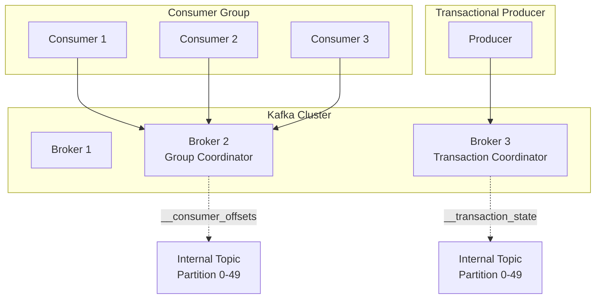
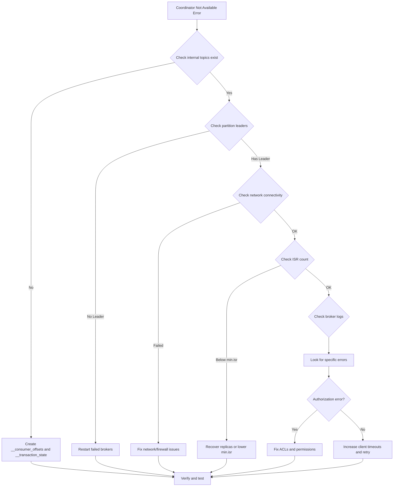

# How to Fix "Coordinator Not Available" Errors in Kafka

Author: [nawazdhandala](https://www.github.com/nawazdhandala)

Tags: Kafka, Consumer Groups, Coordinator, Troubleshooting, Error Handling, Distributed Systems

Description: A comprehensive guide to diagnosing and resolving the COORDINATOR_NOT_AVAILABLE error in Apache Kafka consumer groups and transactions.

---

The "Coordinator Not Available" error is a common issue in Apache Kafka that affects consumer groups and transactional producers. This error occurs when Kafka clients cannot communicate with the group coordinator or transaction coordinator broker. This guide explains the root causes and provides practical solutions to resolve this error.

## Understanding the Coordinator

Kafka uses two types of coordinators, both of which can trigger this error.



### Group Coordinator

The group coordinator manages consumer group membership and offset commits. Each consumer group has a designated coordinator broker determined by hashing the group ID.

### Transaction Coordinator

The transaction coordinator manages producer transactions, ensuring exactly-once semantics. It is determined by hashing the transactional ID.

## Common Causes and Solutions

### Cause 1: Internal Topics Not Created

The `__consumer_offsets` and `__transaction_state` topics must exist for coordinators to function.

#### Diagnosis

```bash
# Check if internal topics exist
kafka-topics.sh --bootstrap-server localhost:9092 --list | grep __

# Expected output:
# __consumer_offsets
# __transaction_state
```

#### Solution

Internal topics are usually auto-created, but you can create them manually if needed.

```bash
# Create __consumer_offsets topic (if not exists)
kafka-topics.sh --bootstrap-server localhost:9092 \
    --create \
    --topic __consumer_offsets \
    --partitions 50 \
    --replication-factor 3 \
    --config cleanup.policy=compact \
    --config compression.type=lz4

# Create __transaction_state topic (if not exists)
kafka-topics.sh --bootstrap-server localhost:9092 \
    --create \
    --topic __transaction_state \
    --partitions 50 \
    --replication-factor 3 \
    --config cleanup.policy=compact \
    --config compression.type=lz4
```

Ensure your broker configuration allows auto-creation.

```properties
# server.properties
auto.create.topics.enable=true
offsets.topic.replication.factor=3
transaction.state.log.replication.factor=3
transaction.state.log.min.isr=2
```

### Cause 2: Coordinator Broker is Down or Unreachable

If the broker hosting the coordinator partition is unavailable, clients will receive this error.

#### Diagnosis

```bash
# Check broker status
kafka-broker-api-versions.sh --bootstrap-server localhost:9092

# Check topic partition leaders for __consumer_offsets
kafka-topics.sh --bootstrap-server localhost:9092 \
    --describe \
    --topic __consumer_offsets

# Look for partitions with no leader (leader=-1)
```

#### Solution

```bash
# Restart the failed broker
sudo systemctl restart kafka

# Or if using Docker
docker-compose restart kafka-broker-2

# Check if partitions have leaders now
kafka-topics.sh --bootstrap-server localhost:9092 \
    --describe \
    --topic __consumer_offsets | grep -E "Leader:\s+-1"
```

If partitions remain leaderless, you may need to trigger a leader election.

```bash
# Trigger preferred leader election for all topics
kafka-leader-election.sh --bootstrap-server localhost:9092 \
    --election-type preferred \
    --all-topic-partitions
```

### Cause 3: Under-Replicated Partitions

If the internal topics have under-replicated partitions, the coordinator may become unavailable.

#### Diagnosis

```bash
# Check for under-replicated partitions
kafka-topics.sh --bootstrap-server localhost:9092 \
    --describe \
    --under-replicated-partitions

# Check __consumer_offsets specifically
kafka-topics.sh --bootstrap-server localhost:9092 \
    --describe \
    --topic __consumer_offsets \
    --under-replicated-partitions
```

#### Solution

```bash
# Increase replication factor if too low
kafka-reassign-partitions.sh --bootstrap-server localhost:9092 \
    --reassignment-json-file reassignment.json \
    --execute

# reassignment.json example:
{
  "version": 1,
  "partitions": [
    {
      "topic": "__consumer_offsets",
      "partition": 0,
      "replicas": [1, 2, 3]
    }
  ]
}
```

### Cause 4: Network Connectivity Issues

Network problems between clients and the coordinator broker cause this error.

#### Diagnosis

```bash
# Test connectivity to all brokers
for broker in kafka1:9092 kafka2:9092 kafka3:9092; do
    echo "Testing $broker..."
    nc -zv $broker 2>&1 | head -1
done

# Check DNS resolution
nslookup kafka1.example.com

# Test with Kafka tools
kafka-broker-api-versions.sh --bootstrap-server kafka1:9092,kafka2:9092,kafka3:9092
```

#### Solution

Verify your client configuration includes all brokers.

```java
// Java client configuration
Properties props = new Properties();

// Include multiple brokers for failover
props.put(ConsumerConfig.BOOTSTRAP_SERVERS_CONFIG,
    "kafka1:9092,kafka2:9092,kafka3:9092");

// Increase connection timeouts
props.put(ConsumerConfig.REQUEST_TIMEOUT_MS_CONFIG, 60000);
props.put(ConsumerConfig.DEFAULT_API_TIMEOUT_MS_CONFIG, 60000);
props.put(ConsumerConfig.SESSION_TIMEOUT_MS_CONFIG, 30000);
```

### Cause 5: Cluster is Starting Up

During cluster startup, coordinators may not be immediately available.

#### Diagnosis

```bash
# Check broker logs for startup status
tail -f /var/log/kafka/server.log | grep -E "(started|coordinator|__consumer_offsets)"
```

#### Solution

Implement retry logic in your application.

```java
import org.apache.kafka.clients.consumer.*;
import org.apache.kafka.common.errors.CoordinatorNotAvailableException;
import java.time.Duration;
import java.util.*;

public class ResilientConsumer {

    private static final int MAX_RETRIES = 10;
    private static final long RETRY_BACKOFF_MS = 1000;

    private KafkaConsumer<String, String> consumer;
    private final Properties props;

    public ResilientConsumer(Properties props) {
        this.props = props;
    }

    /**
     * Creates a consumer with retry logic for coordinator errors.
     */
    public void connect(List<String> topics) {
        int retries = 0;

        while (retries < MAX_RETRIES) {
            try {
                consumer = new KafkaConsumer<>(props);
                consumer.subscribe(topics);

                // Test the connection by polling
                consumer.poll(Duration.ofMillis(1000));

                System.out.println("Successfully connected to Kafka");
                return;

            } catch (CoordinatorNotAvailableException e) {
                retries++;
                System.out.printf("Coordinator not available, retry %d/%d%n",
                    retries, MAX_RETRIES);

                if (consumer != null) {
                    consumer.close();
                }

                try {
                    Thread.sleep(RETRY_BACKOFF_MS * retries);
                } catch (InterruptedException ie) {
                    Thread.currentThread().interrupt();
                    throw new RuntimeException("Interrupted during retry", ie);
                }

            } catch (Exception e) {
                throw new RuntimeException("Failed to connect to Kafka", e);
            }
        }

        throw new RuntimeException("Failed to connect after " + MAX_RETRIES + " retries");
    }

    /**
     * Consumes messages with automatic recovery from coordinator errors.
     */
    public void consume(MessageHandler handler) {
        while (true) {
            try {
                ConsumerRecords<String, String> records =
                    consumer.poll(Duration.ofMillis(100));

                for (ConsumerRecord<String, String> record : records) {
                    handler.handle(record);
                }

                consumer.commitSync();

            } catch (CoordinatorNotAvailableException e) {
                System.out.println("Coordinator lost, reconnecting...");
                reconnect();

            } catch (Exception e) {
                System.err.println("Error consuming: " + e.getMessage());
            }
        }
    }

    private void reconnect() {
        if (consumer != null) {
            try {
                consumer.close();
            } catch (Exception ignored) {}
        }

        connect(new ArrayList<>(consumer.subscription()));
    }

    public interface MessageHandler {
        void handle(ConsumerRecord<String, String> record);
    }
}
```

### Cause 6: Insufficient ISR for Internal Topics

If the in-sync replicas fall below the minimum required, the coordinator cannot function.

#### Diagnosis

```bash
# Check ISR count for __consumer_offsets
kafka-topics.sh --bootstrap-server localhost:9092 \
    --describe \
    --topic __consumer_offsets | grep -E "Isr:"

# Check broker configuration
kafka-configs.sh --bootstrap-server localhost:9092 \
    --entity-type brokers \
    --entity-default \
    --describe | grep -E "(min.insync|offsets.topic)"
```

#### Solution

Adjust the minimum ISR requirement or ensure enough brokers are available.

```properties
# server.properties - Lower the minimum ISR for recovery
# WARNING: This reduces durability guarantees
offsets.topic.replication.factor=3
min.insync.replicas=1  # Temporarily lower from 2

# For transactions
transaction.state.log.replication.factor=3
transaction.state.log.min.isr=1  # Temporarily lower from 2
```

After recovery, restore the original settings.

```bash
# Update broker configuration dynamically
kafka-configs.sh --bootstrap-server localhost:9092 \
    --entity-type brokers \
    --entity-default \
    --alter \
    --add-config min.insync.replicas=2
```

## Handling Coordinator Errors in Code

### Java Consumer with Error Handling

```java
import org.apache.kafka.clients.consumer.*;
import org.apache.kafka.common.errors.*;
import java.time.Duration;
import java.util.*;

public class FaultTolerantConsumer {

    private final Properties props;
    private KafkaConsumer<String, String> consumer;
    private volatile boolean running = true;

    public FaultTolerantConsumer(String bootstrapServers, String groupId) {
        props = new Properties();
        props.put(ConsumerConfig.BOOTSTRAP_SERVERS_CONFIG, bootstrapServers);
        props.put(ConsumerConfig.GROUP_ID_CONFIG, groupId);
        props.put(ConsumerConfig.KEY_DESERIALIZER_CLASS_CONFIG,
            "org.apache.kafka.common.serialization.StringDeserializer");
        props.put(ConsumerConfig.VALUE_DESERIALIZER_CLASS_CONFIG,
            "org.apache.kafka.common.serialization.StringDeserializer");

        // Configure for better resilience
        props.put(ConsumerConfig.ENABLE_AUTO_COMMIT_CONFIG, false);
        props.put(ConsumerConfig.AUTO_OFFSET_RESET_CONFIG, "earliest");

        // Increase timeouts for unstable environments
        props.put(ConsumerConfig.SESSION_TIMEOUT_MS_CONFIG, 30000);
        props.put(ConsumerConfig.HEARTBEAT_INTERVAL_MS_CONFIG, 10000);
        props.put(ConsumerConfig.REQUEST_TIMEOUT_MS_CONFIG, 40000);
        props.put(ConsumerConfig.DEFAULT_API_TIMEOUT_MS_CONFIG, 60000);

        // Retry configuration
        props.put(ConsumerConfig.RETRY_BACKOFF_MS_CONFIG, 500);
        props.put(ConsumerConfig.RECONNECT_BACKOFF_MS_CONFIG, 500);
        props.put(ConsumerConfig.RECONNECT_BACKOFF_MAX_MS_CONFIG, 10000);
    }

    public void consume(String topic) {
        consumer = new KafkaConsumer<>(props);
        consumer.subscribe(Collections.singletonList(topic));

        while (running) {
            try {
                ConsumerRecords<String, String> records =
                    consumer.poll(Duration.ofMillis(1000));

                if (!records.isEmpty()) {
                    processRecords(records);
                    commitWithRetry();
                }

            } catch (CoordinatorNotAvailableException e) {
                handleCoordinatorError("Coordinator not available", e);

            } catch (NotCoordinatorException e) {
                handleCoordinatorError("Not the coordinator", e);

            } catch (GroupAuthorizationException e) {
                System.err.println("Authorization error: " + e.getMessage());
                throw e;  // Cannot recover from auth errors

            } catch (WakeupException e) {
                if (running) {
                    throw e;
                }
                // Shutdown triggered, ignore

            } catch (Exception e) {
                System.err.println("Unexpected error: " + e.getMessage());
                e.printStackTrace();
                sleepWithBackoff(1000);
            }
        }

        closeConsumer();
    }

    private void processRecords(ConsumerRecords<String, String> records) {
        for (ConsumerRecord<String, String> record : records) {
            System.out.printf("Received: topic=%s, partition=%d, offset=%d, key=%s%n",
                record.topic(), record.partition(), record.offset(), record.key());
            // Process the record
        }
    }

    private void commitWithRetry() {
        int maxRetries = 3;
        int retries = 0;

        while (retries < maxRetries) {
            try {
                consumer.commitSync(Duration.ofSeconds(10));
                return;

            } catch (CoordinatorNotAvailableException | NotCoordinatorException e) {
                retries++;
                System.out.printf("Commit failed, retry %d/%d: %s%n",
                    retries, maxRetries, e.getMessage());
                sleepWithBackoff(500 * retries);

            } catch (CommitFailedException e) {
                System.err.println("Commit failed permanently: " + e.getMessage());
                // Partition was revoked, cannot commit
                return;
            }
        }

        System.err.println("Failed to commit after " + maxRetries + " retries");
    }

    private void handleCoordinatorError(String message, Exception e) {
        System.out.println(message + ": " + e.getMessage());
        System.out.println("Waiting for coordinator to become available...");

        // The consumer will automatically try to find the new coordinator
        // Just add a small backoff to avoid tight loops
        sleepWithBackoff(1000);
    }

    private void sleepWithBackoff(long baseMs) {
        try {
            Thread.sleep(baseMs + (long)(Math.random() * baseMs));
        } catch (InterruptedException e) {
            Thread.currentThread().interrupt();
        }
    }

    private void closeConsumer() {
        if (consumer != null) {
            try {
                consumer.close(Duration.ofSeconds(10));
            } catch (Exception e) {
                System.err.println("Error closing consumer: " + e.getMessage());
            }
        }
    }

    public void shutdown() {
        running = false;
        if (consumer != null) {
            consumer.wakeup();
        }
    }
}
```

### Transactional Producer with Coordinator Error Handling

```java
import org.apache.kafka.clients.producer.*;
import org.apache.kafka.common.errors.*;
import java.util.*;

public class ResilientTransactionalProducer {

    private final Properties props;
    private KafkaProducer<String, String> producer;
    private final String transactionalId;

    public ResilientTransactionalProducer(String bootstrapServers, String transactionalId) {
        this.transactionalId = transactionalId;

        props = new Properties();
        props.put(ProducerConfig.BOOTSTRAP_SERVERS_CONFIG, bootstrapServers);
        props.put(ProducerConfig.KEY_SERIALIZER_CLASS_CONFIG,
            "org.apache.kafka.common.serialization.StringSerializer");
        props.put(ProducerConfig.VALUE_SERIALIZER_CLASS_CONFIG,
            "org.apache.kafka.common.serialization.StringSerializer");

        // Transactional configuration
        props.put(ProducerConfig.TRANSACTIONAL_ID_CONFIG, transactionalId);
        props.put(ProducerConfig.ENABLE_IDEMPOTENCE_CONFIG, true);

        // Reliability settings
        props.put(ProducerConfig.ACKS_CONFIG, "all");
        props.put(ProducerConfig.RETRIES_CONFIG, Integer.MAX_VALUE);
        props.put(ProducerConfig.MAX_IN_FLIGHT_REQUESTS_PER_CONNECTION, 5);

        // Timeout configuration
        props.put(ProducerConfig.REQUEST_TIMEOUT_MS_CONFIG, 30000);
        props.put(ProducerConfig.DELIVERY_TIMEOUT_MS_CONFIG, 120000);
        props.put(ProducerConfig.TRANSACTION_TIMEOUT_CONFIG, 60000);
    }

    public void initialize() {
        int maxRetries = 5;
        int retries = 0;

        while (retries < maxRetries) {
            try {
                producer = new KafkaProducer<>(props);
                producer.initTransactions();
                System.out.println("Producer initialized successfully");
                return;

            } catch (CoordinatorNotAvailableException e) {
                retries++;
                System.out.printf("Transaction coordinator not available, retry %d/%d%n",
                    retries, maxRetries);
                closeProducer();
                sleepWithBackoff(1000 * retries);

            } catch (Exception e) {
                throw new RuntimeException("Failed to initialize producer", e);
            }
        }

        throw new RuntimeException("Failed to initialize after " + maxRetries + " retries");
    }

    /**
     * Sends messages in a transaction with automatic recovery.
     */
    public void sendInTransaction(String topic, List<ProducerRecord<String, String>> records) {
        int maxRetries = 3;
        int retries = 0;

        while (retries < maxRetries) {
            try {
                producer.beginTransaction();

                for (ProducerRecord<String, String> record : records) {
                    producer.send(record);
                }

                producer.commitTransaction();
                System.out.printf("Successfully committed transaction with %d records%n",
                    records.size());
                return;

            } catch (CoordinatorNotAvailableException | NotCoordinatorException e) {
                retries++;
                System.out.printf("Coordinator error during transaction, retry %d/%d: %s%n",
                    retries, maxRetries, e.getMessage());

                abortTransaction();
                sleepWithBackoff(1000 * retries);

            } catch (ProducerFencedException | OutOfOrderSequenceException e) {
                // Fatal errors - cannot recover with same producer
                System.err.println("Fatal producer error: " + e.getMessage());
                closeProducer();
                initialize();  // Re-initialize the producer
                throw new RuntimeException("Transaction failed fatally", e);

            } catch (KafkaException e) {
                System.err.println("Kafka error during transaction: " + e.getMessage());
                abortTransaction();
                throw e;
            }
        }

        throw new RuntimeException("Transaction failed after " + maxRetries + " retries");
    }

    private void abortTransaction() {
        try {
            producer.abortTransaction();
        } catch (Exception e) {
            System.err.println("Error aborting transaction: " + e.getMessage());
        }
    }

    private void closeProducer() {
        if (producer != null) {
            try {
                producer.close();
            } catch (Exception e) {
                System.err.println("Error closing producer: " + e.getMessage());
            }
            producer = null;
        }
    }

    private void sleepWithBackoff(long ms) {
        try {
            Thread.sleep(ms);
        } catch (InterruptedException e) {
            Thread.currentThread().interrupt();
        }
    }

    public void close() {
        closeProducer();
    }
}
```

## Monitoring Coordinator Health

Set up monitoring to detect coordinator issues before they impact applications.

```yaml
# Prometheus alerting rules
groups:
  - name: kafka_coordinator_alerts
    rules:
      # Alert when coordinator is unavailable
      - alert: KafkaCoordinatorUnavailable
        expr: kafka_controller_active_controller_count == 0
        for: 1m
        labels:
          severity: critical
        annotations:
          summary: "No active Kafka controller"
          description: "The Kafka cluster has no active controller, which affects coordinator availability"

      # Alert on high coordinator request latency
      - alert: KafkaCoordinatorLatencyHigh
        expr: |
          histogram_quantile(0.99,
            sum(rate(kafka_network_request_total_time_ms_bucket{request="FindCoordinator"}[5m]))
            by (le)
          ) > 1000
        for: 5m
        labels:
          severity: warning
        annotations:
          summary: "High coordinator lookup latency"
          description: "FindCoordinator requests are taking longer than 1 second at p99"

      # Alert on consumer group coordinator issues
      - alert: KafkaConsumerGroupUnstable
        expr: |
          increase(kafka_consumer_group_rebalances_total[5m]) > 5
        for: 5m
        labels:
          severity: warning
        annotations:
          summary: "Frequent consumer group rebalances"
          description: "Consumer group {{ $labels.group }} is experiencing frequent rebalances"
```

## Troubleshooting Flowchart



## Conclusion

The "Coordinator Not Available" error in Kafka typically stems from:

1. **Missing internal topics** - Ensure `__consumer_offsets` and `__transaction_state` exist
2. **Broker failures** - Monitor broker health and ensure quick recovery
3. **Network issues** - Verify connectivity between clients and all brokers
4. **Insufficient replicas** - Maintain adequate replication for internal topics
5. **Cluster startup** - Implement retry logic for transient unavailability

By implementing proper error handling, monitoring, and following the troubleshooting steps in this guide, you can minimize the impact of coordinator issues on your Kafka applications.
