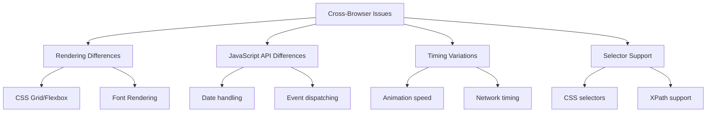

# How to Fix 'Cross-Browser' Test Issues

Author: [nawazdhandala](https://www.github.com/nawazdhandala)

Tags: Cross-Browser Testing, Playwright, Selenium, WebDriver, E2E Testing, Browser Automation

Description: A practical guide to diagnosing and fixing cross-browser testing issues, including browser-specific bugs, timing problems, and selector inconsistencies.

---

Cross-browser testing ensures your application works correctly across Chrome, Firefox, Safari, and Edge. But browser differences make tests flaky and debugging frustrating. This guide covers the most common cross-browser testing issues and battle-tested solutions.

## Understanding Cross-Browser Differences

Browsers implement web standards differently. What works in Chrome might break in Safari. Understanding these differences is key to writing reliable tests.



## Setting Up Multi-Browser Testing

### Playwright Configuration

Playwright has excellent multi-browser support out of the box:

```javascript
// playwright.config.js
const { defineConfig, devices } = require('@playwright/test');

module.exports = defineConfig({
  testDir: './tests',

  // Run tests in parallel
  fullyParallel: true,

  // Fail the build on test failures
  forbidOnly: !!process.env.CI,

  // Retry on CI only
  retries: process.env.CI ? 2 : 0,

  // Reporter configuration
  reporter: [
    ['html', { open: 'never' }],
    ['junit', { outputFile: 'results/junit.xml' }]
  ],

  // Shared settings for all projects
  use: {
    // Base URL for navigation
    baseURL: 'http://localhost:3000',

    // Collect trace on failure
    trace: 'on-first-retry',

    // Screenshot on failure
    screenshot: 'only-on-failure',

    // Video on failure
    video: 'on-first-retry'
  },

  // Configure browsers
  projects: [
    {
      name: 'chromium',
      use: { ...devices['Desktop Chrome'] }
    },
    {
      name: 'firefox',
      use: { ...devices['Desktop Firefox'] }
    },
    {
      name: 'webkit',
      use: { ...devices['Desktop Safari'] }
    },

    // Mobile browsers
    {
      name: 'Mobile Chrome',
      use: { ...devices['Pixel 5'] }
    },
    {
      name: 'Mobile Safari',
      use: { ...devices['iPhone 12'] }
    }
  ]
});
```

Run tests on specific browsers:

```bash
# Run on all browsers
npx playwright test

# Run on specific browser
npx playwright test --project=firefox

# Run on multiple browsers
npx playwright test --project=chromium --project=webkit
```

### Selenium WebDriver Setup

For Selenium-based tests, configure multiple browsers:

```python
# conftest.py - pytest fixtures for multi-browser testing
import pytest
from selenium import webdriver
from selenium.webdriver.chrome.service import Service as ChromeService
from selenium.webdriver.firefox.service import Service as FirefoxService
from webdriver_manager.chrome import ChromeDriverManager
from webdriver_manager.firefox import GeckoDriverManager

@pytest.fixture(params=['chrome', 'firefox', 'edge'])
def browser(request):
    """Fixture that yields a WebDriver for each browser"""
    browser_name = request.param

    if browser_name == 'chrome':
        options = webdriver.ChromeOptions()
        options.add_argument('--headless')
        options.add_argument('--no-sandbox')
        options.add_argument('--disable-dev-shm-usage')
        driver = webdriver.Chrome(
            service=ChromeService(ChromeDriverManager().install()),
            options=options
        )

    elif browser_name == 'firefox':
        options = webdriver.FirefoxOptions()
        options.add_argument('--headless')
        driver = webdriver.Firefox(
            service=FirefoxService(GeckoDriverManager().install()),
            options=options
        )

    elif browser_name == 'edge':
        options = webdriver.EdgeOptions()
        options.add_argument('--headless')
        driver = webdriver.Edge(options=options)

    driver.set_window_size(1920, 1080)
    yield driver
    driver.quit()
```

## Fixing Common Cross-Browser Issues

### Issue 1: Element Not Found

Different browsers render at different speeds. An element visible in Chrome might not be ready in Firefox.

```javascript
// Bad: Immediate element access
const button = page.locator('#submit-button');
await button.click();  // Might fail in slower browsers

// Good: Wait for element to be actionable
const button = page.locator('#submit-button');
await button.waitFor({ state: 'visible' });
await button.click();

// Better: Use Playwright's auto-waiting with explicit timeout
const button = page.locator('#submit-button');
await button.click({ timeout: 10000 });
```

For Selenium:

```python
from selenium.webdriver.support.ui import WebDriverWait
from selenium.webdriver.support import expected_conditions as EC
from selenium.webdriver.common.by import By

# Bad: Immediate find
button = driver.find_element(By.ID, 'submit-button')
button.click()  # Might throw NoSuchElementException

# Good: Explicit wait
wait = WebDriverWait(driver, 10)
button = wait.until(
    EC.element_to_be_clickable((By.ID, 'submit-button'))
)
button.click()
```

### Issue 2: Selector Inconsistencies

Some CSS selectors work differently across browsers:

```javascript
// Bad: Browser-specific pseudo-selectors
const input = page.locator('input::-webkit-search-cancel-button');

// Good: Cross-browser selector
const input = page.locator('input[type="search"]');

// Bad: Complex nth-child that varies
const item = page.locator('ul > li:nth-child(2n+1):not(:last-child)');

// Good: Simpler, more reliable selector
const items = page.locator('ul > li');
const oddItems = await items.filter({ hasNot: page.locator(':last-child') });
```

Use data attributes for reliable selection:

```html
<!-- Add data-testid attributes to your HTML -->
<button data-testid="submit-order">Place Order</button>
```

```javascript
// Reliable across all browsers
const button = page.locator('[data-testid="submit-order"]');
await button.click();
```

### Issue 3: JavaScript Date Handling

Date parsing varies significantly between browsers:

```javascript
// Bad: Inconsistent date parsing
const date = new Date('2024-01-15');  // Works in Chrome, might fail in Safari

// Good: ISO format with explicit timezone
const date = new Date('2024-01-15T00:00:00Z');

// Better: Use a library for consistent parsing
import { parseISO } from 'date-fns';
const date = parseISO('2024-01-15');
```

Test date-related functionality with explicit values:

```javascript
test('should format date correctly', async ({ page }) => {
  // Set a fixed date to avoid timezone issues
  await page.addInitScript(() => {
    const fixedDate = new Date('2024-01-15T12:00:00Z');
    Date.now = () => fixedDate.getTime();
  });

  await page.goto('/dashboard');
  const dateDisplay = page.locator('[data-testid="current-date"]');
  await expect(dateDisplay).toHaveText('January 15, 2024');
});
```

### Issue 4: Event Handling Differences

Browsers dispatch events differently:

```javascript
// Bad: Assuming event order
await input.fill('test');
await input.press('Enter');  // Might not trigger form submit in all browsers

// Good: Explicit form submission
await input.fill('test');
await page.locator('form').evaluate(form => form.submit());

// Or click the submit button explicitly
await input.fill('test');
await page.locator('button[type="submit"]').click();
```

Handle keyboard events consistently:

```javascript
// Bad: Browser-specific key codes
await page.keyboard.press('Escape');  // Key name varies

// Good: Use standardized key values
await page.keyboard.press('Escape');
await expect(page.locator('.modal')).not.toBeVisible();

// Handle modifier keys properly
// Windows/Linux: Ctrl, Mac: Meta
const modifier = process.platform === 'darwin' ? 'Meta' : 'Control';
await page.keyboard.press(`${modifier}+a`);  // Select all
```

### Issue 5: Animation and Timing Issues

Animations cause flaky tests across browsers:

```javascript
// playwright.config.js - disable animations for consistent tests
module.exports = defineConfig({
  use: {
    // Disable CSS animations
    contextOptions: {
      reducedMotion: 'reduce'
    }
  }
});
```

Or disable animations in your test:

```javascript
test('should open dropdown menu', async ({ page }) => {
  // Disable animations
  await page.addStyleTag({
    content: `
      *, *::before, *::after {
        animation-duration: 0s !important;
        animation-delay: 0s !important;
        transition-duration: 0s !important;
        transition-delay: 0s !important;
      }
    `
  });

  await page.locator('.dropdown-toggle').click();
  await expect(page.locator('.dropdown-menu')).toBeVisible();
});
```

### Issue 6: File Upload Handling

File uploads work differently across browsers:

```javascript
// Playwright - works across all browsers
test('should upload file', async ({ page }) => {
  const fileInput = page.locator('input[type="file"]');

  // Set file directly - works in all browsers
  await fileInput.setInputFiles('./test-data/document.pdf');

  // Or upload multiple files
  await fileInput.setInputFiles([
    './test-data/doc1.pdf',
    './test-data/doc2.pdf'
  ]);

  // Verify upload
  await expect(page.locator('.upload-status')).toHaveText('Upload complete');
});
```

For Selenium:

```python
def test_file_upload(browser):
    file_input = browser.find_element(By.CSS_SELECTOR, 'input[type="file"]')

    # Use absolute path for cross-browser compatibility
    import os
    file_path = os.path.abspath('./test-data/document.pdf')

    # Clear the input first (some browsers need this)
    file_input.clear()
    file_input.send_keys(file_path)

    # Wait for upload to complete
    wait = WebDriverWait(browser, 30)
    wait.until(
        EC.text_to_be_present_in_element(
            (By.CLASS_NAME, 'upload-status'),
            'Upload complete'
        )
    )
```

## Browser-Specific Test Handling

Sometimes you need different behavior for different browsers:

```javascript
// playwright.config.js
test('should render correctly', async ({ page, browserName }) => {
  await page.goto('/dashboard');

  // Browser-specific assertions
  if (browserName === 'webkit') {
    // Safari renders fonts slightly differently
    await expect(page.locator('.header')).toHaveCSS('font-size', '15px');
  } else {
    await expect(page.locator('.header')).toHaveCSS('font-size', '16px');
  }
});

// Skip tests for specific browsers
test('should use WebGL', async ({ page, browserName }) => {
  test.skip(browserName === 'webkit', 'WebGL not fully supported in WebKit');

  await page.goto('/3d-viewer');
  await expect(page.locator('canvas')).toBeVisible();
});
```

## Debugging Cross-Browser Failures

When a test fails in one browser but passes in others:

```javascript
// Enable debug mode
test('debug failing test', async ({ page, browserName }) => {
  // Log browser info
  console.log(`Running in ${browserName}`);

  await page.goto('/problematic-page');

  // Take screenshot for comparison
  await page.screenshot({
    path: `screenshots/${browserName}-step1.png`,
    fullPage: true
  });

  // Log computed styles
  const styles = await page.locator('.element').evaluate(el => {
    return window.getComputedStyle(el);
  });
  console.log('Computed styles:', styles.display, styles.visibility);

  // Check for browser-specific issues
  const userAgent = await page.evaluate(() => navigator.userAgent);
  console.log('User Agent:', userAgent);
});
```

Run with debugging enabled:

```bash
# Show browser window
npx playwright test --headed

# Run in debug mode
npx playwright test --debug

# Generate trace for analysis
npx playwright test --trace on
npx playwright show-trace trace.zip
```

## Best Practices

1. **Use data-testid attributes** for reliable element selection across browsers.

2. **Avoid hardcoded timeouts** - use explicit waits and auto-waiting features.

3. **Test on real browser versions** - emulators don't catch all issues.

4. **Run cross-browser tests in CI** - don't rely on local testing alone.

5. **Keep browser versions updated** - old browsers have more inconsistencies.

6. **Document browser-specific workarounds** - help future maintainers understand why.

```javascript
// Document workarounds clearly
test('form submission', async ({ page, browserName }) => {
  await page.fill('#email', 'test@example.com');

  // WORKAROUND: Safari doesn't trigger form submit on Enter key
  // Bug: https://bugs.webkit.org/show_bug.cgi?id=XXXXX
  if (browserName === 'webkit') {
    await page.click('button[type="submit"]');
  } else {
    await page.press('#email', 'Enter');
  }

  await expect(page).toHaveURL('/success');
});
```

---

Cross-browser testing is challenging, but the patterns in this guide will help you write more reliable tests. Focus on consistent selectors, proper waiting strategies, and understanding browser differences. When tests fail in one browser, debug systematically and document any browser-specific workarounds for your team.
