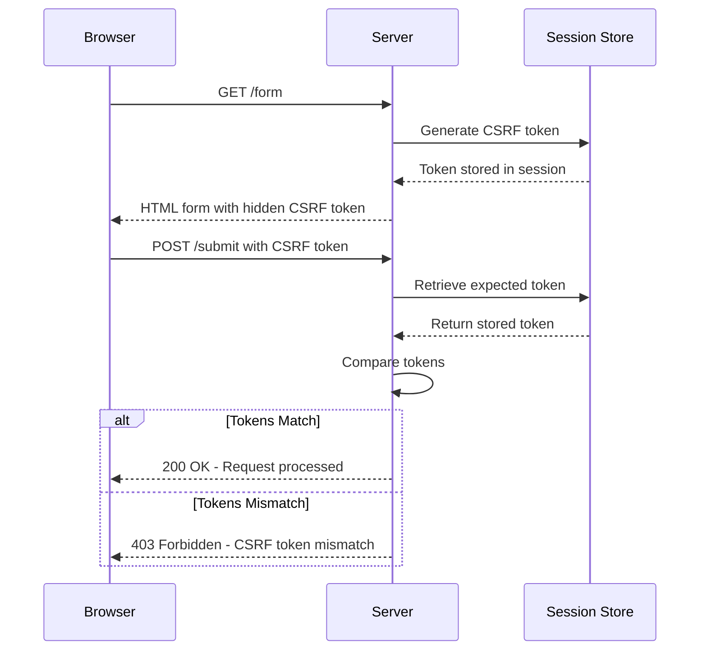
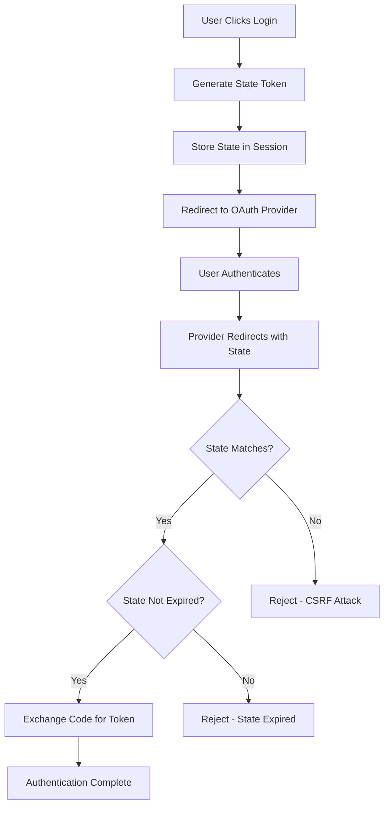

# How to Fix "CSRF Token Mismatch" Errors

Author: [nawazdhandala](https://github.com/nawazdhandala)

Tags: CSRF, Security, Authentication, Web Development, OAuth2, Debugging

Description: Learn how to diagnose and fix CSRF token mismatch errors in web applications with practical solutions for common frameworks and OAuth2 implementations.

---

Cross-Site Request Forgery (CSRF) token mismatch errors are a common frustration for developers. These errors occur when the security token submitted with a request does not match the expected token on the server. This guide explains why these errors happen and how to fix them across different frameworks and scenarios.

## Understanding CSRF Protection

CSRF protection works by requiring a secret token with each state-changing request. The server generates this token and includes it in forms or headers, then validates it when the request comes back.



## Common Causes of CSRF Token Mismatch

### 1. Session Expiration

The most common cause is an expired session. When the session expires, the stored CSRF token is lost, but the browser still sends the old token from the cached form.

```python
# Flask example - Session timeout causes CSRF mismatch
from flask import Flask, session
from flask_wtf.csrf import CSRFProtect

app = Flask(__name__)
app.config['SECRET_KEY'] = 'your-secret-key'
app.config['PERMANENT_SESSION_LIFETIME'] = timedelta(minutes=30)  # Session expires
app.config['WTF_CSRF_TIME_LIMIT'] = 3600  # CSRF token valid for 1 hour

# Problem: Session expires at 30 min, but form might be open longer
# Solution: Align session lifetime with CSRF token lifetime or handle gracefully
csrf = CSRFProtect(app)
```

### 2. Multiple Browser Tabs

Opening the same form in multiple tabs can cause issues because each tab might get a different token, but only the last one is valid.

```javascript
// Problem: Each tab gets a new CSRF token
// Tab 1: Token A (valid)
// Tab 2: Token B (valid, but invalidates Token A in some implementations)
// Submit Tab 1: Token A fails because only Token B is valid

// Solution: Use per-request tokens that all remain valid
// Or use a token pool approach
```

### 3. Cached Pages

Browser caching or CDN caching can serve stale pages with old CSRF tokens.

```html
<!-- Add cache control headers to prevent caching of pages with forms -->
<meta http-equiv="Cache-Control" content="no-cache, no-store, must-revalidate">
<meta http-equiv="Pragma" content="no-cache">
<meta http-equiv="Expires" content="0">
```

```python
# Flask - Disable caching for views with forms
from flask import make_response

@app.route('/form')
def show_form():
    response = make_response(render_template('form.html'))
    response.headers['Cache-Control'] = 'no-cache, no-store, must-revalidate'
    response.headers['Pragma'] = 'no-cache'
    response.headers['Expires'] = '0'
    return response
```

### 4. AJAX Requests Missing Token

Single-page applications often forget to include the CSRF token in AJAX requests.

```javascript
// Problem: AJAX request without CSRF token
fetch('/api/data', {
    method: 'POST',
    body: JSON.stringify(data)
});
// Results in: 403 CSRF token mismatch

// Solution: Include the token in headers
fetch('/api/data', {
    method: 'POST',
    headers: {
        'Content-Type': 'application/json',
        'X-CSRF-Token': document.querySelector('meta[name="csrf-token"]').content
    },
    body: JSON.stringify(data)
});
```

### 5. Domain Mismatch

CSRF tokens are often tied to a specific domain. Subdomain or protocol mismatches can cause validation failures.

```javascript
// Problem: Token generated for www.example.com
// Request sent from example.com (without www)
// Results in: CSRF mismatch

// Solution: Ensure consistent domain handling
// In your DNS/nginx config, redirect to canonical domain
```

## Fixing CSRF Issues by Framework

### Laravel

Laravel has robust CSRF protection built-in. Here are common fixes:

```php
<?php
// config/session.php - Ensure proper session configuration
return [
    'driver' => env('SESSION_DRIVER', 'file'),
    'lifetime' => env('SESSION_LIFETIME', 120),
    'expire_on_close' => false,
    'encrypt' => false,
    'domain' => env('SESSION_DOMAIN', null), // Set this for subdomains
    'same_site' => 'lax',
    'secure' => env('SESSION_SECURE_COOKIE', true), // True in production
];
```

```php
<!-- Blade template - Include CSRF token in forms -->
<form method="POST" action="/submit">
    @csrf
    <!-- Form fields -->
</form>
```

```javascript
// resources/js/bootstrap.js - Configure Axios for CSRF
import axios from 'axios';

// Get CSRF token from meta tag
let token = document.head.querySelector('meta[name="csrf-token"]');

if (token) {
    axios.defaults.headers.common['X-CSRF-TOKEN'] = token.content;
} else {
    console.error('CSRF token not found');
}

// Alternative: Use cookie-based CSRF (Laravel Sanctum)
axios.defaults.withCredentials = true;
```

```php
<?php
// Handle CSRF token expiration gracefully
// app/Exceptions/Handler.php
use Illuminate\Session\TokenMismatchException;

public function render($request, Throwable $exception)
{
    if ($exception instanceof TokenMismatchException) {
        // For AJAX requests
        if ($request->expectsJson()) {
            return response()->json([
                'error' => 'CSRF token expired',
                'message' => 'Please refresh the page and try again'
            ], 419);
        }

        // For regular requests, redirect back with error
        return redirect()
            ->back()
            ->withInput($request->except('password'))
            ->withErrors(['csrf' => 'Session expired. Please try again.']);
    }

    return parent::render($request, $exception);
}
```

### Django

Django uses middleware for CSRF protection:

```python
# settings.py - CSRF configuration
CSRF_COOKIE_SECURE = True  # Only send over HTTPS
CSRF_COOKIE_HTTPONLY = False  # Allow JavaScript to read (needed for AJAX)
CSRF_COOKIE_SAMESITE = 'Lax'  # Prevent CSRF in most cross-site contexts
CSRF_TRUSTED_ORIGINS = [
    'https://yourapp.com',
    'https://www.yourapp.com',
]

# For subdomains
CSRF_COOKIE_DOMAIN = '.yourapp.com'
SESSION_COOKIE_DOMAIN = '.yourapp.com'
```

```html
<!-- Include CSRF token in Django templates -->
<form method="post">
    
    <!-- Form fields -->
</form>
```

```javascript
// JavaScript - Get CSRF token from cookie for AJAX requests
function getCookie(name) {
    let cookieValue = null;
    if (document.cookie && document.cookie !== '') {
        const cookies = document.cookie.split(';');
        for (let i = 0; i < cookies.length; i++) {
            const cookie = cookies[i].trim();
            if (cookie.substring(0, name.length + 1) === (name + '=')) {
                cookieValue = decodeURIComponent(cookie.substring(name.length + 1));
                break;
            }
        }
    }
    return cookieValue;
}

const csrftoken = getCookie('csrftoken');

// Configure fetch to include CSRF token
fetch('/api/endpoint/', {
    method: 'POST',
    headers: {
        'Content-Type': 'application/json',
        'X-CSRFToken': csrftoken
    },
    body: JSON.stringify(data)
});
```

```python
# views.py - Handle CSRF failures gracefully
from django.views.decorators.csrf import csrf_protect
from django.middleware.csrf import CsrfViewMiddleware

@csrf_protect
def my_view(request):
    if request.method == 'POST':
        # Process form
        pass
    return render(request, 'form.html')

# For APIs that need CSRF exemption (use with caution)
from django.views.decorators.csrf import csrf_exempt

@csrf_exempt
def api_webhook(request):
    # Only use for webhooks from trusted sources
    # Implement alternative authentication (API keys, signatures)
    pass
```

### Express.js with csurf

```javascript
// app.js - Configure CSRF middleware
const express = require('express');
const csrf = require('csurf');
const cookieParser = require('cookie-parser');

const app = express();

// Parse cookies before CSRF middleware
app.use(cookieParser());

// Parse request bodies
app.use(express.urlencoded({ extended: false }));
app.use(express.json());

// Configure CSRF protection
const csrfProtection = csrf({
    cookie: {
        key: '_csrf',
        httpOnly: true,
        secure: process.env.NODE_ENV === 'production',
        sameSite: 'lax',
        maxAge: 3600 // 1 hour
    }
});

// Apply CSRF to all routes except specific ones
app.use((req, res, next) => {
    // Skip CSRF for webhooks or specific paths
    if (req.path.startsWith('/webhook/') || req.path.startsWith('/api/public/')) {
        return next();
    }
    csrfProtection(req, res, next);
});

// Make CSRF token available to templates
app.use((req, res, next) => {
    if (req.csrfToken) {
        res.locals.csrfToken = req.csrfToken();
    }
    next();
});

// Error handler for CSRF errors
app.use((err, req, res, next) => {
    if (err.code === 'EBADCSRFTOKEN') {
        if (req.xhr || req.headers.accept?.includes('application/json')) {
            return res.status(403).json({
                error: 'CSRF token invalid or expired',
                message: 'Please refresh the page and try again'
            });
        }
        return res.status(403).render('error', {
            message: 'Session expired. Please go back and try again.'
        });
    }
    next(err);
});
```

```javascript
// routes/form.js - Include CSRF token in responses
router.get('/form', (req, res) => {
    res.render('form', {
        csrfToken: req.csrfToken()
    });
});

// Handlebars/EJS template
// <input type="hidden" name="_csrf" value="{{csrfToken}}">
```

### Flask with Flask-WTF

```python
# app.py - Flask CSRF configuration
from flask import Flask, render_template, request, jsonify
from flask_wtf.csrf import CSRFProtect, CSRFError

app = Flask(__name__)
app.config['SECRET_KEY'] = 'your-secret-key-here'
app.config['WTF_CSRF_TIME_LIMIT'] = 3600  # Token valid for 1 hour
app.config['WTF_CSRF_SSL_STRICT'] = True  # Strict referer checking for HTTPS

csrf = CSRFProtect(app)

# Handle CSRF errors gracefully
@app.errorhandler(CSRFError)
def handle_csrf_error(e):
    if request.is_json or request.headers.get('X-Requested-With') == 'XMLHttpRequest':
        return jsonify({
            'error': 'CSRF validation failed',
            'message': 'Please refresh the page and try again'
        }), 400
    return render_template('csrf_error.html', reason=e.description), 400

# Exempt specific routes from CSRF (use sparingly)
@app.route('/webhook/stripe', methods=['POST'])
@csrf.exempt
def stripe_webhook():
    # Verify using Stripe's signature instead
    pass
```

```html
<!-- templates/form.html - Include CSRF token -->
<form method="post">
    <input type="hidden" name="csrf_token" value="{{ csrf_token() }}">
    <!-- Form fields -->
</form>

<!-- For AJAX, include in meta tag -->
<meta name="csrf-token" content="{{ csrf_token() }}">
```

## CSRF in OAuth2 and Authentication Flows

OAuth2 uses the `state` parameter as CSRF protection. Here is how to handle it properly:

```python
# OAuth2 state parameter as CSRF protection
import secrets
from flask import session, redirect, request

def initiate_oauth():
    # Generate a cryptographically secure state
    state = secrets.token_urlsafe(32)

    # Store in session
    session['oauth_state'] = state
    session['oauth_state_created'] = time.time()

    # Build authorization URL
    auth_url = f"https://provider.com/oauth/authorize?" + urlencode({
        'client_id': CLIENT_ID,
        'redirect_uri': REDIRECT_URI,
        'response_type': 'code',
        'state': state,
        'scope': 'openid email profile'
    })

    return redirect(auth_url)

def oauth_callback():
    # Verify state parameter
    received_state = request.args.get('state')
    stored_state = session.pop('oauth_state', None)
    state_created = session.pop('oauth_state_created', 0)

    # Check state exists and matches
    if not stored_state or received_state != stored_state:
        return jsonify({'error': 'Invalid state parameter'}), 403

    # Check state is not too old (5 minutes)
    if time.time() - state_created > 300:
        return jsonify({'error': 'State expired'}), 403

    # Continue with token exchange
    code = request.args.get('code')
    # ...
```



## Debugging CSRF Token Mismatches

### Step 1: Inspect the Tokens

```javascript
// Browser console - Check if token is present in form
const formToken = document.querySelector('input[name="_csrf"]')?.value;
console.log('Form CSRF Token:', formToken);

// Check meta tag
const metaToken = document.querySelector('meta[name="csrf-token"]')?.content;
console.log('Meta CSRF Token:', metaToken);

// Check cookie
const cookies = document.cookie.split(';').map(c => c.trim());
const csrfCookie = cookies.find(c => c.startsWith('csrf') || c.startsWith('_csrf'));
console.log('CSRF Cookie:', csrfCookie);
```

### Step 2: Server-Side Logging

```python
# Flask - Add debugging for CSRF
import logging
from flask_wtf.csrf import validate_csrf, ValidationError

logging.basicConfig(level=logging.DEBUG)
logger = logging.getLogger(__name__)

@app.before_request
def log_csrf_debug():
    if request.method in ['POST', 'PUT', 'DELETE', 'PATCH']:
        logger.debug(f"Request path: {request.path}")
        logger.debug(f"Session ID: {session.get('_id', 'No session')}")
        logger.debug(f"CSRF token in form: {request.form.get('csrf_token', 'Not found')}")
        logger.debug(f"CSRF token in header: {request.headers.get('X-CSRFToken', 'Not found')}")

        # Check session CSRF
        session_csrf = session.get('csrf_token', 'Not in session')
        logger.debug(f"CSRF token in session: {session_csrf}")
```

### Step 3: Common Fixes Checklist

```markdown
## CSRF Debugging Checklist

### Token Generation
- [ ] CSRF middleware is properly configured
- [ ] Token is generated for each session
- [ ] Token is included in all forms (hidden input)
- [ ] Token is available in meta tag for AJAX

### Token Submission
- [ ] Token is sent with POST/PUT/DELETE requests
- [ ] Correct header name used (X-CSRF-Token, X-CSRFToken, etc.)
- [ ] Token value is not URL-encoded incorrectly

### Session Configuration
- [ ] Session driver is configured correctly
- [ ] Session cookies use correct domain
- [ ] Session cookies use correct SameSite attribute
- [ ] Session lifetime is appropriate

### Caching
- [ ] Pages with forms are not cached
- [ ] CDN is not caching CSRF tokens
- [ ] Browser cache is properly controlled

### Domain and Protocol
- [ ] Consistent domain usage (www vs non-www)
- [ ] HTTPS used consistently
- [ ] Cookies marked as Secure in production
```

## Preventing CSRF Token Issues in SPAs

Single-page applications require special handling:

```javascript
// App initialization - Fetch and store CSRF token
class CSRFManager {
    constructor() {
        this.token = null;
        this.tokenExpiry = null;
    }

    async initialize() {
        await this.refreshToken();

        // Refresh token periodically (before expiry)
        setInterval(() => this.refreshToken(), 50 * 60 * 1000); // 50 minutes
    }

    async refreshToken() {
        try {
            const response = await fetch('/api/csrf-token', {
                credentials: 'include'
            });

            if (response.ok) {
                const data = await response.json();
                this.token = data.token;
                this.tokenExpiry = Date.now() + (data.expiresIn * 1000);
            }
        } catch (error) {
            console.error('Failed to refresh CSRF token:', error);
        }
    }

    getToken() {
        if (!this.token || Date.now() >= this.tokenExpiry) {
            // Token missing or expired, refresh synchronously for this request
            this.refreshToken();
        }
        return this.token;
    }

    // Create a fetch wrapper that includes CSRF token
    async fetch(url, options = {}) {
        const token = this.getToken();

        const headers = {
            ...options.headers,
            'X-CSRF-Token': token
        };

        const response = await fetch(url, {
            ...options,
            headers,
            credentials: 'include'
        });

        // Handle CSRF errors by refreshing and retrying
        if (response.status === 403) {
            const data = await response.json();
            if (data.error === 'CSRF token invalid') {
                await this.refreshToken();
                // Retry the request once
                return fetch(url, {
                    ...options,
                    headers: {
                        ...options.headers,
                        'X-CSRF-Token': this.token
                    },
                    credentials: 'include'
                });
            }
        }

        return response;
    }
}

// Usage
const csrf = new CSRFManager();
await csrf.initialize();

// All API calls use the wrapper
const response = await csrf.fetch('/api/data', {
    method: 'POST',
    headers: { 'Content-Type': 'application/json' },
    body: JSON.stringify(data)
});
```

## Conclusion

CSRF token mismatch errors typically stem from session issues, caching problems, or incorrect token handling. To resolve these errors:

1. Ensure session configuration is correct (lifetime, domain, security flags)
2. Include CSRF tokens in all forms and AJAX requests
3. Handle token expiration gracefully with user-friendly messages
4. Disable caching for pages containing forms
5. Use consistent domain and protocol across your application
6. Implement proper error handling to guide users when tokens expire

By following the framework-specific solutions and debugging techniques in this guide, you can quickly identify and resolve CSRF token mismatch errors in your application.
