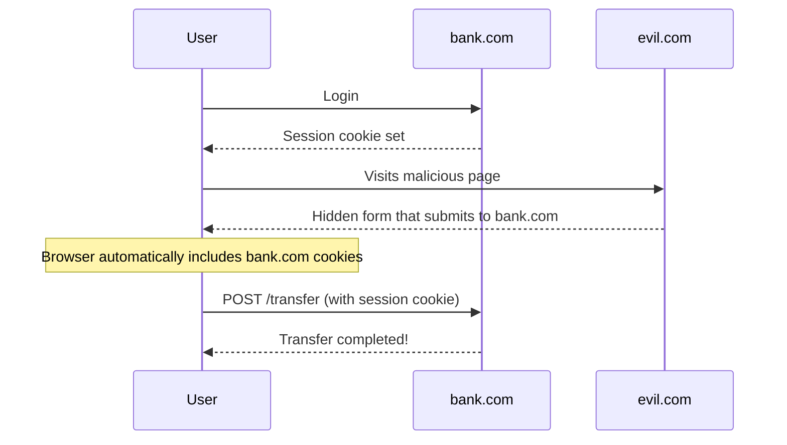
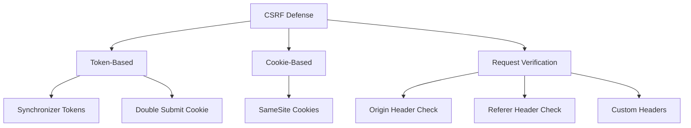
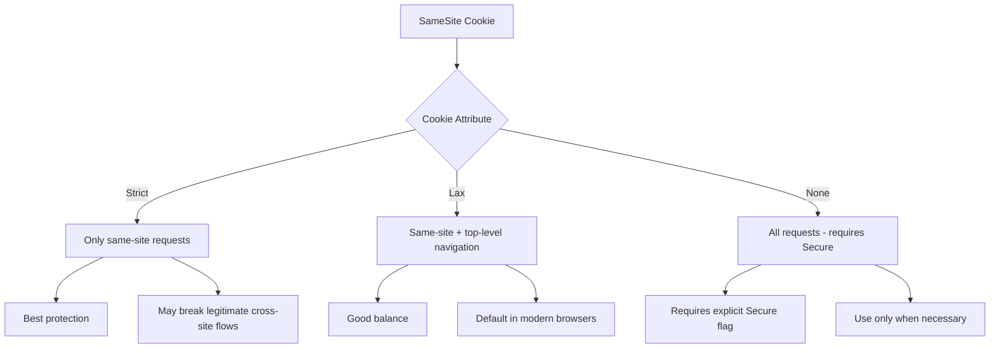

# How to Fix 'CSRF Token' Vulnerabilities

Author: [nawazdhandala](https://www.github.com/nawazdhandala)

Tags: Security, CSRF, Web Security, Tokens, Authentication, Backend

Description: Learn how to prevent Cross-Site Request Forgery attacks using CSRF tokens, SameSite cookies, and other defense mechanisms.

---

Cross-Site Request Forgery (CSRF) is an attack that tricks authenticated users into performing unwanted actions on a web application. When a user is logged into a site, an attacker can craft a malicious page that submits requests to that site using the user's credentials. This guide explains how CSRF attacks work and how to implement proper defenses including CSRF tokens, SameSite cookies, and other protective measures.

## Understanding CSRF Attacks

CSRF exploits the trust a web application has in the user's browser. When you're logged into a site, your browser automatically includes your session cookies with every request to that site, even if the request originates from a different domain.



### Example Attack

```html
<!-- Malicious page at evil.com -->
<html>
<body>
    <h1>You won a prize!</h1>

    <!-- Hidden form that submits to the victim site -->
    <form id="csrf-form" action="https://bank.com/transfer" method="POST" style="display:none">
        <input type="hidden" name="to" value="attacker-account" />
        <input type="hidden" name="amount" value="10000" />
    </form>

    <script>
        // Automatically submit the form when page loads
        document.getElementById('csrf-form').submit();
    </script>
</body>
</html>
```

When a logged-in user visits this page, their browser automatically includes their bank.com cookies, and the transfer is executed without their knowledge.

## Defense Strategy Overview



## Implementing CSRF Tokens

CSRF tokens are unique, unpredictable values generated by the server and included in requests. The server validates that each request contains the correct token.

### Node.js/Express Implementation

```javascript
const express = require('express');
const crypto = require('crypto');
const cookieParser = require('cookie-parser');

const app = express();
app.use(express.urlencoded({ extended: true }));
app.use(express.json());
app.use(cookieParser());

// Session store (use Redis in production)
const sessions = new Map();

// Generate cryptographically secure CSRF token
function generateCSRFToken() {
    return crypto.randomBytes(32).toString('hex');
}

// Middleware to set CSRF token
function csrfProtection(req, res, next) {
    const sessionId = req.cookies.sessionId;

    if (!sessionId || !sessions.has(sessionId)) {
        return res.status(401).json({ error: 'Not authenticated' });
    }

    const session = sessions.get(sessionId);

    // Generate new token if none exists
    if (!session.csrfToken) {
        session.csrfToken = generateCSRFToken();
    }

    // Make token available to templates and response
    res.locals.csrfToken = session.csrfToken;
    req.csrfToken = session.csrfToken;

    next();
}

// Middleware to validate CSRF token on state-changing requests
function validateCSRF(req, res, next) {
    // Skip for safe methods
    if (['GET', 'HEAD', 'OPTIONS'].includes(req.method)) {
        return next();
    }

    const sessionId = req.cookies.sessionId;
    const session = sessions.get(sessionId);

    if (!session) {
        return res.status(401).json({ error: 'Not authenticated' });
    }

    // Get token from request (header, body, or query)
    const token = req.headers['x-csrf-token'] ||
                  req.body._csrf ||
                  req.query._csrf;

    // Constant-time comparison to prevent timing attacks
    if (!token || !crypto.timingSafeEqual(
        Buffer.from(session.csrfToken),
        Buffer.from(token)
    )) {
        return res.status(403).json({ error: 'Invalid CSRF token' });
    }

    next();
}

// Apply middleware
app.use(csrfProtection);
app.use(validateCSRF);

// Route that returns CSRF token
app.get('/api/csrf-token', (req, res) => {
    res.json({ csrfToken: req.csrfToken });
});

// Protected route
app.post('/api/transfer', (req, res) => {
    // CSRF token already validated by middleware
    const { to, amount } = req.body;
    res.json({ success: true, message: `Transferred ${amount} to ${to}` });
});
```

### HTML Form Integration

```html
<!-- Server-rendered form with CSRF token -->
<form action="/api/transfer" method="POST">
    <!-- Include CSRF token as hidden field -->
    <input type="hidden" name="_csrf" value="<%= csrfToken %>">

    <label for="to">Recipient:</label>
    <input type="text" id="to" name="to" required>

    <label for="amount">Amount:</label>
    <input type="number" id="amount" name="amount" required>

    <button type="submit">Transfer</button>
</form>
```

### JavaScript/AJAX Integration

```javascript
// Fetch CSRF token and use in subsequent requests
class ApiClient {
    constructor() {
        this.csrfToken = null;
    }

    async init() {
        // Fetch CSRF token from server
        const response = await fetch('/api/csrf-token', {
            credentials: 'include'  // Include cookies
        });
        const data = await response.json();
        this.csrfToken = data.csrfToken;
    }

    async post(url, body) {
        const response = await fetch(url, {
            method: 'POST',
            headers: {
                'Content-Type': 'application/json',
                'X-CSRF-Token': this.csrfToken  // Include token in header
            },
            credentials: 'include',
            body: JSON.stringify(body)
        });
        return response.json();
    }

    async transfer(to, amount) {
        return this.post('/api/transfer', { to, amount });
    }
}

// Usage
const api = new ApiClient();
await api.init();
await api.transfer('recipient', 100);
```

## Django CSRF Protection

Django has built-in CSRF protection that's enabled by default.

```python
# settings.py
MIDDLEWARE = [
    'django.middleware.csrf.CsrfViewMiddleware',  # Enable CSRF protection
    # ... other middleware
]

# CSRF cookie settings
CSRF_COOKIE_SECURE = True      # Only send over HTTPS
CSRF_COOKIE_HTTPONLY = True    # Not accessible via JavaScript
CSRF_COOKIE_SAMESITE = 'Strict'  # Additional CSRF protection
```

```html
<!-- Django template with CSRF token -->
<form method="post">
    
    <input type="text" name="recipient">
    <input type="number" name="amount">
    <button type="submit">Transfer</button>
</form>
```

```python
# For AJAX requests, get token from cookie
from django.views.decorators.csrf import ensure_csrf_cookie

@ensure_csrf_cookie
def get_csrf_token(request):
    """Endpoint to ensure CSRF cookie is set."""
    return JsonResponse({'status': 'ok'})
```

```javascript
// JavaScript for Django AJAX requests
function getCookie(name) {
    const value = `; ${document.cookie}`;
    const parts = value.split(`; ${name}=`);
    if (parts.length === 2) return parts.pop().split(';').shift();
}

fetch('/api/transfer', {
    method: 'POST',
    headers: {
        'Content-Type': 'application/json',
        'X-CSRFToken': getCookie('csrftoken')  // Django looks for this header
    },
    body: JSON.stringify({ to: 'recipient', amount: 100 })
});
```

## Double Submit Cookie Pattern

An alternative to server-side token storage is the double submit cookie pattern. The token is sent as both a cookie and a request parameter.

```javascript
const express = require('express');
const crypto = require('crypto');
const cookieParser = require('cookie-parser');

const app = express();
app.use(cookieParser());
app.use(express.json());

// Middleware to set CSRF cookie
function setCSRFCookie(req, res, next) {
    if (!req.cookies.csrfToken) {
        const token = crypto.randomBytes(32).toString('hex');
        res.cookie('csrfToken', token, {
            httpOnly: false,  // Must be readable by JavaScript
            secure: true,
            sameSite: 'strict'
        });
    }
    next();
}

// Middleware to validate double submit
function validateDoubleSubmit(req, res, next) {
    if (['GET', 'HEAD', 'OPTIONS'].includes(req.method)) {
        return next();
    }

    const cookieToken = req.cookies.csrfToken;
    const headerToken = req.headers['x-csrf-token'];

    if (!cookieToken || !headerToken) {
        return res.status(403).json({ error: 'Missing CSRF token' });
    }

    // Compare tokens (constant-time)
    try {
        if (!crypto.timingSafeEqual(
            Buffer.from(cookieToken),
            Buffer.from(headerToken)
        )) {
            return res.status(403).json({ error: 'Invalid CSRF token' });
        }
    } catch {
        return res.status(403).json({ error: 'Invalid CSRF token' });
    }

    next();
}

app.use(setCSRFCookie);
app.use(validateDoubleSubmit);
```

```javascript
// Client-side: read token from cookie and include in header
function getCookie(name) {
    const value = `; ${document.cookie}`;
    const parts = value.split(`; ${name}=`);
    if (parts.length === 2) return parts.pop().split(';').shift();
}

fetch('/api/transfer', {
    method: 'POST',
    headers: {
        'Content-Type': 'application/json',
        'X-CSRF-Token': getCookie('csrfToken')  // Same value as cookie
    },
    credentials: 'include',
    body: JSON.stringify({ to: 'recipient', amount: 100 })
});
```

## SameSite Cookies

SameSite cookies provide automatic CSRF protection by controlling when cookies are sent with cross-site requests.

```javascript
// Express session with SameSite cookie
const session = require('express-session');

app.use(session({
    secret: 'your-secret-key',
    resave: false,
    saveUninitialized: false,
    cookie: {
        secure: true,           // Only HTTPS
        httpOnly: true,         // No JavaScript access
        sameSite: 'strict',     // Never send with cross-site requests
        maxAge: 24 * 60 * 60 * 1000  // 24 hours
    }
}));
```

### SameSite Values



- **Strict** - Cookie only sent for same-site requests
- **Lax** - Cookie sent for same-site and top-level navigation (links)
- **None** - Cookie sent for all requests (requires Secure flag)

## Origin and Referer Validation

As an additional defense layer, validate the Origin and Referer headers.

```javascript
// Origin/Referer validation middleware
function validateOrigin(allowedOrigins) {
    return (req, res, next) => {
        if (['GET', 'HEAD', 'OPTIONS'].includes(req.method)) {
            return next();
        }

        const origin = req.headers.origin;
        const referer = req.headers.referer;

        // Check Origin header first (more reliable)
        if (origin) {
            if (allowedOrigins.includes(origin)) {
                return next();
            }
            return res.status(403).json({ error: 'Invalid origin' });
        }

        // Fall back to Referer header
        if (referer) {
            try {
                const refererOrigin = new URL(referer).origin;
                if (allowedOrigins.includes(refererOrigin)) {
                    return next();
                }
            } catch {
                // Invalid URL
            }
            return res.status(403).json({ error: 'Invalid referer' });
        }

        // No Origin or Referer - could be legitimate (same-origin)
        // or could be an attack. Decide based on your security requirements.
        // For strict security, reject requests without these headers.
        return res.status(403).json({ error: 'Missing origin/referer' });
    };
}

app.use(validateOrigin(['https://example.com', 'https://www.example.com']));
```

## Custom Request Headers

CORS prevents cross-origin requests from including custom headers without preflight. This can be used as additional CSRF protection.

```javascript
// Server: require custom header
function requireCustomHeader(req, res, next) {
    if (['GET', 'HEAD', 'OPTIONS'].includes(req.method)) {
        return next();
    }

    // This header triggers CORS preflight for cross-origin requests
    // Simple cross-origin requests cannot include custom headers
    if (req.headers['x-requested-with'] !== 'XMLHttpRequest') {
        return res.status(403).json({ error: 'Invalid request' });
    }

    next();
}

app.use(requireCustomHeader);
```

```javascript
// Client: always include custom header
fetch('/api/transfer', {
    method: 'POST',
    headers: {
        'Content-Type': 'application/json',
        'X-Requested-With': 'XMLHttpRequest'  // Custom header
    },
    body: JSON.stringify({ to: 'recipient', amount: 100 })
});
```

## React Application Example

```jsx
// CSRFProvider.jsx - Context for CSRF token management
import React, { createContext, useContext, useState, useEffect } from 'react';

const CSRFContext = createContext(null);

export function CSRFProvider({ children }) {
    const [csrfToken, setCsrfToken] = useState(null);
    const [loading, setLoading] = useState(true);

    useEffect(() => {
        // Fetch CSRF token on mount
        fetch('/api/csrf-token', { credentials: 'include' })
            .then(res => res.json())
            .then(data => {
                setCsrfToken(data.csrfToken);
                setLoading(false);
            })
            .catch(err => {
                console.error('Failed to fetch CSRF token:', err);
                setLoading(false);
            });
    }, []);

    if (loading) {
        return <div>Loading...</div>;
    }

    return (
        <CSRFContext.Provider value={csrfToken}>
            {children}
        </CSRFContext.Provider>
    );
}

export function useCSRFToken() {
    return useContext(CSRFContext);
}

// useApi.js - API hook with automatic CSRF token
import { useCSRFToken } from './CSRFProvider';

export function useApi() {
    const csrfToken = useCSRFToken();

    const post = async (url, data) => {
        const response = await fetch(url, {
            method: 'POST',
            headers: {
                'Content-Type': 'application/json',
                'X-CSRF-Token': csrfToken
            },
            credentials: 'include',
            body: JSON.stringify(data)
        });

        if (!response.ok) {
            throw new Error(`API error: ${response.status}`);
        }

        return response.json();
    };

    return { post };
}

// TransferForm.jsx - Form component
import { useState } from 'react';
import { useApi } from './useApi';
import { useCSRFToken } from './CSRFProvider';

function TransferForm() {
    const [recipient, setRecipient] = useState('');
    const [amount, setAmount] = useState('');
    const { post } = useApi();
    const csrfToken = useCSRFToken();

    const handleSubmit = async (e) => {
        e.preventDefault();
        try {
            await post('/api/transfer', { to: recipient, amount });
            alert('Transfer successful!');
        } catch (err) {
            alert('Transfer failed: ' + err.message);
        }
    };

    return (
        <form onSubmit={handleSubmit}>
            {/* Hidden CSRF token for non-JS form submission */}
            <input type="hidden" name="_csrf" value={csrfToken} />

            <input
                type="text"
                value={recipient}
                onChange={(e) => setRecipient(e.target.value)}
                placeholder="Recipient"
                required
            />
            <input
                type="number"
                value={amount}
                onChange={(e) => setAmount(e.target.value)}
                placeholder="Amount"
                required
            />
            <button type="submit">Transfer</button>
        </form>
    );
}
```

## Testing for CSRF Vulnerabilities

```html
<!-- Test page to check CSRF protection -->
<!DOCTYPE html>
<html>
<head>
    <title>CSRF Test</title>
</head>
<body>
    <h1>CSRF Test Page</h1>

    <!-- Test 1: Form submission without token -->
    <form id="test1" action="http://target.com/api/transfer" method="POST">
        <input type="hidden" name="to" value="attacker" />
        <input type="hidden" name="amount" value="1000" />
    </form>

    <!-- Test 2: AJAX without token -->
    <script>
        // This should fail if CSRF protection is working
        fetch('http://target.com/api/transfer', {
            method: 'POST',
            headers: { 'Content-Type': 'application/json' },
            credentials: 'include',
            body: JSON.stringify({ to: 'attacker', amount: 1000 })
        })
        .then(res => console.log('Test 2 response:', res.status))
        .catch(err => console.log('Test 2 error:', err));
    </script>

    <button onclick="document.getElementById('test1').submit()">
        Run Form Test
    </button>
</body>
</html>
```

## Best Practices Summary

1. **Use CSRF tokens** for all state-changing operations
2. **Set SameSite=Strict** on session cookies when possible
3. **Validate Origin/Referer** headers as additional defense
4. **Use secure cookie flags** (Secure, HttpOnly)
5. **Require custom headers** for AJAX requests
6. **Regenerate tokens** after login to prevent session fixation
7. **Use constant-time comparison** to prevent timing attacks
8. **Token per-session** is acceptable, per-request is stronger
9. **Never expose tokens** in URLs (they appear in logs)
10. **Test your protection** with CSRF testing tools

## Conclusion

CSRF attacks exploit the browser's automatic cookie inclusion to perform unauthorized actions. Proper defense requires a layered approach: CSRF tokens for explicit verification, SameSite cookies for automatic browser protection, and Origin/Referer validation as additional safeguards.

Modern frameworks often include CSRF protection by default, but you must ensure it's properly configured and used throughout your application. Regular security testing should verify that all state-changing endpoints are protected against CSRF attacks.
