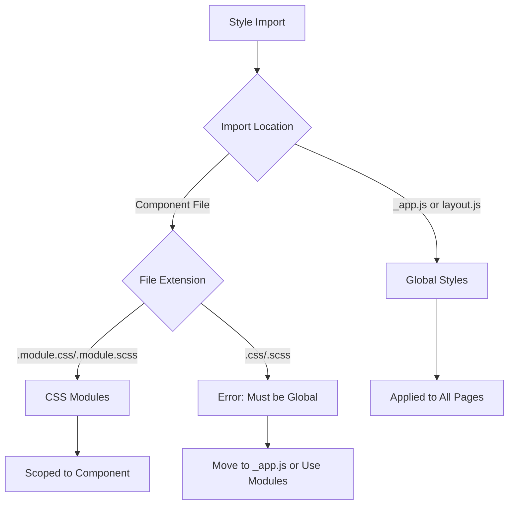
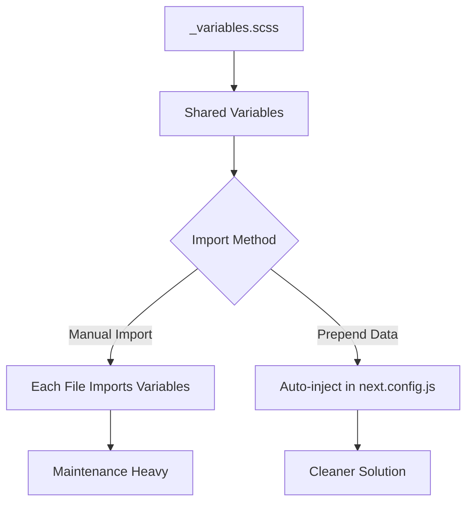
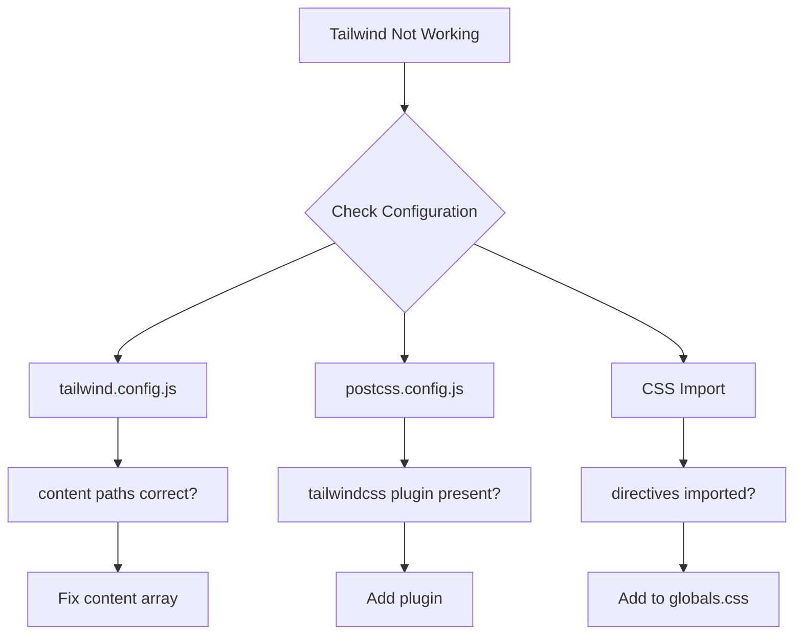

# How to Fix "CSS/SCSS" Import Errors in Next.js

Author: [nawazdhandala](https://www.github.com/nawazdhandala)

Tags: Next.js, CSS, SCSS, Styling, Frontend, Troubleshooting, Web Development

Description: A comprehensive guide to diagnosing and resolving CSS and SCSS import errors in Next.js applications with practical solutions.

---

CSS and SCSS import errors are among the most common issues developers encounter when building Next.js applications. These errors can manifest in various ways, from build failures to styles not applying correctly. This guide covers the most frequent causes and their solutions.

## Understanding CSS/SCSS Import Architecture in Next.js

Before diving into solutions, let us understand how Next.js handles style imports:



## Common Error 1: Global CSS Cannot Be Imported from Components

One of the most frequent errors is attempting to import global CSS from a component file:

```bash
# Error message
./styles/globals.css
Global CSS cannot be imported from files other than your Custom <App>.
Due to the Global nature of stylesheets, and to avoid conflicts,
Please move all first-party global CSS imports to pages/_app.js.
```

### Solution: Move Global CSS to _app.js or layout.js

For Pages Router (pages directory):

```javascript
// pages/_app.js
// Import global styles here - this is the only place for global CSS
import '../styles/globals.css';

// If using SCSS
import '../styles/globals.scss';

function MyApp({ Component, pageProps }) {
  return <Component {...pageProps} />;
}

export default MyApp;
```

For App Router (app directory):

```javascript
// app/layout.js
// Import global styles in the root layout
import '../styles/globals.css';

// If using SCSS
import '../styles/globals.scss';

export default function RootLayout({ children }) {
  return (
    <html lang="en">
      <body>{children}</body>
    </html>
  );
}
```

## Common Error 2: SCSS Module Not Found

When SCSS files fail to import, the error typically looks like:

```bash
# Error message
Module not found: Can't resolve './styles.scss'
```

### Solution: Install and Configure SCSS Support

```bash
# Install sass package - Next.js will automatically configure it
npm install sass

# Or with yarn
yarn add sass

# Or with pnpm
pnpm add sass
```

Verify your next.config.js has proper configuration:

```javascript
// next.config.js
/** @type {import('next').NextConfig} */
const nextConfig = {
  // SCSS is supported out of the box after installing sass
  // No additional configuration needed for basic usage

  // Optional: Configure sass options
  sassOptions: {
    // Include paths for shared SCSS files
    includePaths: ['./styles'],

    // Add global variables or mixins to all SCSS files
    prependData: `@import "variables.scss";`,
  },
};

module.exports = nextConfig;
```

## Common Error 3: CSS Modules Class Name Issues

CSS Modules require specific naming conventions:

```mermaid
flowchart LR
    A[styles.module.css] --> B[import styles from './styles.module.css']
    B --> C[className={styles.container}]

    D[styles.css] --> E[import './styles.css']
    E --> F[className="container"]

    style A fill:#90EE90
    style D fill:#FFB6C1
```

### Solution: Use Correct CSS Module Syntax

```css
/* components/Button/Button.module.css */
/* Use camelCase for class names to avoid issues */
.button {
  padding: 10px 20px;
  border-radius: 4px;
}

/* Avoid hyphens in class names when possible */
/* Use camelCase instead */
.primaryButton {
  background-color: blue;
  color: white;
}

/* If you must use hyphens, access them with bracket notation */
.secondary-button {
  background-color: gray;
}
```

```jsx
// components/Button/Button.jsx
import styles from './Button.module.css';

export default function Button({ variant, children }) {
  // Access camelCase classes directly
  const primaryClass = styles.primaryButton;

  // Access hyphenated classes with bracket notation
  const secondaryClass = styles['secondary-button'];

  return (
    <button
      className={`${styles.button} ${variant === 'primary' ? primaryClass : secondaryClass}`}
    >
      {children}
    </button>
  );
}
```

## Common Error 4: PostCSS Configuration Conflicts

PostCSS errors often arise from configuration conflicts:

```bash
# Error message
Error: Your custom PostCSS configuration must export a `plugins` key.
```

### Solution: Fix PostCSS Configuration

```javascript
// postcss.config.js
// Correct format for PostCSS configuration
module.exports = {
  plugins: {
    // Tailwind CSS (if using)
    tailwindcss: {},

    // Autoprefixer for browser compatibility
    autoprefixer: {},

    // Optional: CSS Nano for production minification
    ...(process.env.NODE_ENV === 'production'
      ? {
          cssnano: {
            preset: ['default', { discardComments: { removeAll: true } }],
          },
        }
      : {}),
  },
};
```

Alternative array format:

```javascript
// postcss.config.js
// Array format also works
module.exports = {
  plugins: [
    'tailwindcss',
    'autoprefixer',
    process.env.NODE_ENV === 'production' && [
      'cssnano',
      { preset: 'default' },
    ],
  ].filter(Boolean),
};
```

## Common Error 5: SCSS Variable Import Issues

When SCSS variables are not available across files:



### Solution: Configure Global SCSS Variables

Create a variables file:

```scss
// styles/_variables.scss
// Define your variables
$primary-color: #0070f3;
$secondary-color: #1a1a1a;
$font-family: 'Inter', sans-serif;
$border-radius: 8px;
$spacing-unit: 8px;

// Mixins
@mixin flex-center {
  display: flex;
  align-items: center;
  justify-content: center;
}

@mixin responsive($breakpoint) {
  @if $breakpoint == mobile {
    @media (max-width: 768px) { @content; }
  } @else if $breakpoint == tablet {
    @media (max-width: 1024px) { @content; }
  }
}
```

Configure Next.js to prepend variables:

```javascript
// next.config.js
const path = require('path');

/** @type {import('next').NextConfig} */
const nextConfig = {
  sassOptions: {
    includePaths: [path.join(__dirname, 'styles')],
    // Prepend variables and mixins to every SCSS file
    prependData: `
      @import "variables";
      @import "mixins";
    `,
  },
};

module.exports = nextConfig;
```

## Common Error 6: CSS Import Order Issues

Import order can cause specificity problems:

```jsx
// Problem: Styles may override each other unexpectedly

// pages/_app.js - WRONG ORDER
import '../styles/globals.css';
import 'some-library/styles.css';  // Library styles override your globals

// pages/_app.js - CORRECT ORDER
import 'some-library/styles.css';  // Library styles first
import '../styles/globals.css';     // Your overrides last
```

### Solution: Establish Clear Import Order

```javascript
// pages/_app.js or app/layout.js
// 1. Third-party library styles (lowest priority)
import 'normalize.css';
import '@some-ui-library/styles.css';

// 2. Your base/reset styles
import '../styles/reset.css';

// 3. Global styles
import '../styles/globals.css';

// 4. Component-specific global styles (if any)
import '../styles/components.css';

function MyApp({ Component, pageProps }) {
  return <Component {...pageProps} />;
}

export default MyApp;
```

## Common Error 7: Dynamic Import of CSS

Dynamic CSS imports require special handling:

```jsx
// This will cause an error in production
const loadStyles = async () => {
  await import('./dynamic-styles.css');  // Error!
};

// Correct approach: Use CSS Modules or CSS-in-JS
import styles from './dynamic-styles.module.css';

// Or use conditional class application
const Component = ({ theme }) => {
  return (
    <div className={theme === 'dark' ? styles.dark : styles.light}>
      Content
    </div>
  );
};
```

## Common Error 8: Tailwind CSS Integration Issues

When Tailwind classes are not working:



### Solution: Proper Tailwind Configuration

```javascript
// tailwind.config.js
/** @type {import('tailwindcss').Config} */
module.exports = {
  // Ensure content paths cover all your files
  content: [
    './pages/**/*.{js,ts,jsx,tsx,mdx}',
    './components/**/*.{js,ts,jsx,tsx,mdx}',
    './app/**/*.{js,ts,jsx,tsx,mdx}',
    // Include any other directories with Tailwind classes
    './src/**/*.{js,ts,jsx,tsx,mdx}',
  ],
  theme: {
    extend: {},
  },
  plugins: [],
};
```

```css
/* styles/globals.css */
/* These directives must be present */
@tailwind base;
@tailwind components;
@tailwind utilities;

/* Your custom styles below */
```

## Debugging CSS Import Errors

Use this systematic approach to diagnose issues:

```javascript
// debug-styles.js - Create a debug script
const fs = require('fs');
const path = require('path');

function checkStyleImports(dir) {
  const issues = [];

  function scanDirectory(currentDir) {
    const files = fs.readdirSync(currentDir);

    files.forEach(file => {
      const filePath = path.join(currentDir, file);
      const stat = fs.statSync(filePath);

      if (stat.isDirectory() && !file.includes('node_modules')) {
        scanDirectory(filePath);
      } else if (file.match(/\.(js|jsx|ts|tsx)$/)) {
        const content = fs.readFileSync(filePath, 'utf8');

        // Check for global CSS imports outside _app or layout
        const globalCSSImport = content.match(/import\s+['"][^'"]+\.css['"]/g);
        if (globalCSSImport && !filePath.includes('_app') && !filePath.includes('layout')) {
          // Check if it is not a module
          globalCSSImport.forEach(imp => {
            if (!imp.includes('.module.css')) {
              issues.push({
                file: filePath,
                issue: `Global CSS import found: ${imp}`,
              });
            }
          });
        }
      }
    });
  }

  scanDirectory(dir);
  return issues;
}

// Run the check
const issues = checkStyleImports('./');
console.log('Style Import Issues:', issues);
```

## Complete Working Example

Here is a complete example of proper CSS/SCSS setup:

```
project/
  styles/
    _variables.scss
    _mixins.scss
    globals.scss
  components/
    Button/
      Button.jsx
      Button.module.scss
  pages/
    _app.js
    index.js
  next.config.js
  postcss.config.js
```

```scss
// styles/_variables.scss
$colors: (
  primary: #0070f3,
  secondary: #1a1a1a,
  success: #10b981,
  error: #ef4444,
);

@function color($key) {
  @return map-get($colors, $key);
}
```

```scss
// styles/globals.scss
// Global styles - imported in _app.js
* {
  box-sizing: border-box;
  margin: 0;
  padding: 0;
}

body {
  font-family: $font-family;
  line-height: 1.6;
}

a {
  color: color(primary);
  text-decoration: none;
}
```

```scss
// components/Button/Button.module.scss
// Component-specific styles - automatically scoped
.button {
  padding: $spacing-unit * 2;
  border-radius: $border-radius;
  border: none;
  cursor: pointer;
  transition: all 0.2s ease;

  &:hover {
    transform: translateY(-2px);
  }

  &.primary {
    background-color: color(primary);
    color: white;
  }

  &.secondary {
    background-color: color(secondary);
    color: white;
  }
}
```

```jsx
// components/Button/Button.jsx
import styles from './Button.module.scss';

export default function Button({ variant = 'primary', children, ...props }) {
  return (
    <button
      className={`${styles.button} ${styles[variant]}`}
      {...props}
    >
      {children}
    </button>
  );
}
```

## Summary

CSS and SCSS import errors in Next.js typically stem from a few common issues:

1. **Global CSS in wrong location** - Move to _app.js or layout.js
2. **Missing sass package** - Install with npm install sass
3. **Incorrect module syntax** - Use .module.css extension and proper imports
4. **PostCSS configuration** - Ensure plugins key is exported
5. **Variable sharing** - Use prependData in sassOptions
6. **Import order** - Load third-party styles before custom styles
7. **Content paths** - Verify Tailwind content configuration

Following the patterns and solutions in this guide will help you resolve most CSS and SCSS import issues in your Next.js applications.
