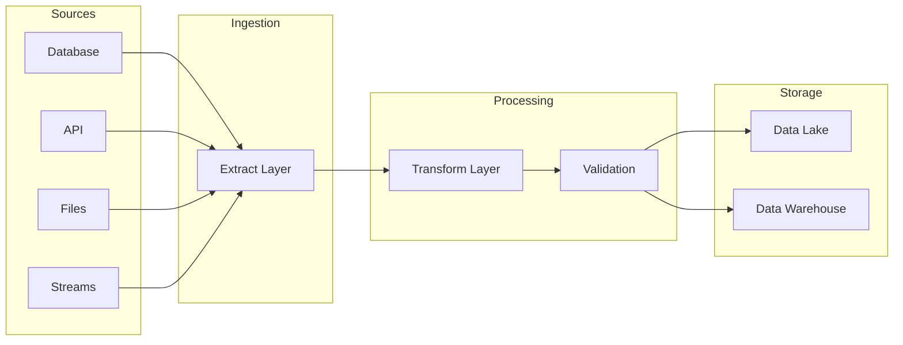
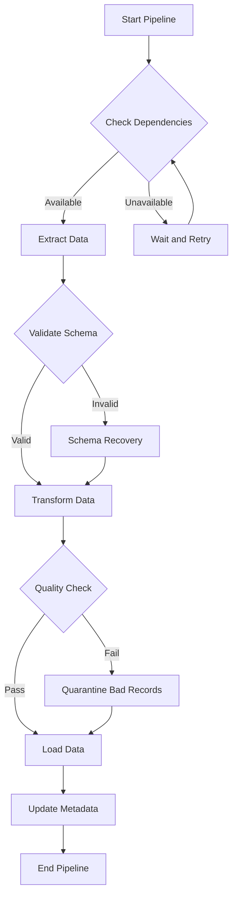

# How to Fix "Data Pipeline" Failures

Author: [nawazdhandala](https://www.github.com/nawazdhandala)

Tags: Data Engineering, ETL, Data Pipelines, Debugging, Apache Spark, Apache Airflow, Troubleshooting

Description: A practical guide to diagnosing and fixing common data pipeline failures including schema mismatches, resource exhaustion, and dependency issues.

---

Data pipeline failures are inevitable in any data engineering environment. Whether you are running ETL jobs, streaming pipelines, or batch processing, understanding how to quickly diagnose and fix failures is essential. This guide covers the most common causes of data pipeline failures and provides practical solutions.

## Understanding Data Pipeline Architecture



## Common Failure Categories

Data pipeline failures typically fall into these categories:

1. **Data Quality Issues** - Schema changes, null values, type mismatches
2. **Resource Exhaustion** - Memory, disk, network limitations
3. **Dependency Failures** - Upstream systems unavailable
4. **Configuration Errors** - Wrong credentials, paths, or settings
5. **Code Bugs** - Logic errors in transformation code

## Diagnosing Pipeline Failures

### Step 1: Check the Logs

Always start with the logs. Most pipeline tools provide detailed error information.

```python
# Python logging setup for data pipelines
import logging
import sys

def setup_pipeline_logging(job_name):
    """Configure logging for pipeline jobs."""
    logger = logging.getLogger(job_name)
    logger.setLevel(logging.DEBUG)

    # Console handler for immediate feedback
    console_handler = logging.StreamHandler(sys.stdout)
    console_handler.setLevel(logging.INFO)

    # File handler for detailed debugging
    file_handler = logging.FileHandler(f'/var/log/pipelines/{job_name}.log')
    file_handler.setLevel(logging.DEBUG)

    # Format with timestamp and context
    formatter = logging.Formatter(
        '%(asctime)s - %(name)s - %(levelname)s - %(message)s'
    )
    console_handler.setFormatter(formatter)
    file_handler.setFormatter(formatter)

    logger.addHandler(console_handler)
    logger.addHandler(file_handler)

    return logger

# Usage in pipeline
logger = setup_pipeline_logging('customer_etl')
logger.info('Starting pipeline run')
```

### Step 2: Identify the Failure Point

```python
# Add checkpoints to identify where failures occur
class PipelineCheckpoint:
    def __init__(self, pipeline_name):
        self.pipeline_name = pipeline_name
        self.checkpoints = []

    def mark(self, stage_name, record_count=None):
        """Mark a checkpoint in the pipeline."""
        checkpoint = {
            'stage': stage_name,
            'timestamp': datetime.now().isoformat(),
            'record_count': record_count
        }
        self.checkpoints.append(checkpoint)
        logger.info(f"Checkpoint: {stage_name} - Records: {record_count}")

    def get_last_successful(self):
        """Return the last successful checkpoint."""
        return self.checkpoints[-1] if self.checkpoints else None

# Usage
checkpoint = PipelineCheckpoint('sales_pipeline')
checkpoint.mark('extract_complete', record_count=10000)
checkpoint.mark('transform_complete', record_count=9500)
# If pipeline fails here, you know transform succeeded
```

## Fixing Schema Mismatch Errors

Schema changes in source systems are one of the most common causes of pipeline failures.

```python
# Schema validation before processing
from pyspark.sql.types import StructType, StructField, StringType, IntegerType

def validate_schema(df, expected_schema):
    """Validate DataFrame schema against expected schema."""
    actual_fields = set(df.schema.fieldNames())
    expected_fields = set([f.name for f in expected_schema.fields])

    # Check for missing required fields
    missing = expected_fields - actual_fields
    if missing:
        raise ValueError(f"Missing required fields: {missing}")

    # Check for unexpected fields (may indicate schema change)
    extra = actual_fields - expected_fields
    if extra:
        logger.warning(f"Unexpected fields found: {extra}")

    # Validate data types
    for field in expected_schema.fields:
        if field.name in actual_fields:
            actual_type = df.schema[field.name].dataType
            if actual_type != field.dataType:
                raise TypeError(
                    f"Field {field.name}: expected {field.dataType}, got {actual_type}"
                )

    return True

# Define expected schema
expected_schema = StructType([
    StructField("customer_id", IntegerType(), nullable=False),
    StructField("name", StringType(), nullable=False),
    StructField("email", StringType(), nullable=True),
])

# Validate before processing
validate_schema(input_df, expected_schema)
```

### Handling Schema Evolution

```python
# Gracefully handle schema changes with defaults
def handle_schema_evolution(df, expected_schema):
    """Add missing columns with defaults, handle type changes."""
    from pyspark.sql.functions import lit, col

    result_df = df

    for field in expected_schema.fields:
        if field.name not in df.columns:
            # Add missing column with null or default
            logger.warning(f"Adding missing column: {field.name}")
            result_df = result_df.withColumn(field.name, lit(None).cast(field.dataType))
        else:
            # Cast to expected type if different
            try:
                result_df = result_df.withColumn(
                    field.name,
                    col(field.name).cast(field.dataType)
                )
            except Exception as e:
                logger.error(f"Cannot cast {field.name}: {e}")
                raise

    return result_df
```

## Fixing Resource Exhaustion Errors

### Memory Issues

```python
# Process data in chunks to avoid memory exhaustion
def process_in_batches(source_query, batch_size=10000):
    """Process large datasets in memory-efficient batches."""
    offset = 0
    total_processed = 0

    while True:
        # Fetch batch
        batch_query = f"{source_query} LIMIT {batch_size} OFFSET {offset}"
        batch_df = spark.read.jdbc(url, table, properties, query=batch_query)

        if batch_df.count() == 0:
            break

        # Process batch
        processed = transform_batch(batch_df)

        # Write batch
        processed.write.mode('append').parquet(output_path)

        # Update counters
        batch_count = batch_df.count()
        total_processed += batch_count
        offset += batch_size

        logger.info(f"Processed batch: {batch_count} records, total: {total_processed}")

        # Clear cache to free memory
        batch_df.unpersist()
        processed.unpersist()

    return total_processed
```

### Disk Space Issues

```bash
#!/bin/bash
# Monitor and clean up disk space for pipeline temporary files

TEMP_DIR="/tmp/pipeline_temp"
THRESHOLD=80  # Percentage

# Check disk usage
usage=$(df "$TEMP_DIR" | tail -1 | awk '{print $5}' | sed 's/%//')

if [ "$usage" -gt "$THRESHOLD" ]; then
    echo "Disk usage at ${usage}%, cleaning up old files..."

    # Remove files older than 1 day
    find "$TEMP_DIR" -type f -mtime +1 -delete

    # Remove empty directories
    find "$TEMP_DIR" -type d -empty -delete

    new_usage=$(df "$TEMP_DIR" | tail -1 | awk '{print $5}')
    echo "Disk usage after cleanup: $new_usage"
fi
```

## Fixing Dependency Failures

```python
# Implement retry logic with exponential backoff
import time
from functools import wraps

def retry_with_backoff(max_retries=3, base_delay=1, max_delay=60):
    """Decorator for retrying failed operations."""
    def decorator(func):
        @wraps(func)
        def wrapper(*args, **kwargs):
            retries = 0
            while retries < max_retries:
                try:
                    return func(*args, **kwargs)
                except Exception as e:
                    retries += 1
                    if retries == max_retries:
                        logger.error(f"Max retries reached for {func.__name__}: {e}")
                        raise

                    # Calculate delay with exponential backoff
                    delay = min(base_delay * (2 ** retries), max_delay)
                    logger.warning(
                        f"Attempt {retries} failed for {func.__name__}, "
                        f"retrying in {delay}s: {e}"
                    )
                    time.sleep(delay)
            return None
        return wrapper
    return decorator

# Usage
@retry_with_backoff(max_retries=5, base_delay=2)
def fetch_from_api(endpoint):
    """Fetch data from external API with retry."""
    response = requests.get(endpoint, timeout=30)
    response.raise_for_status()
    return response.json()
```

### Circuit Breaker Pattern

```python
# Implement circuit breaker for failing dependencies
class CircuitBreaker:
    def __init__(self, failure_threshold=5, recovery_timeout=60):
        self.failure_count = 0
        self.failure_threshold = failure_threshold
        self.recovery_timeout = recovery_timeout
        self.last_failure_time = None
        self.state = 'CLOSED'  # CLOSED, OPEN, HALF_OPEN

    def call(self, func, *args, **kwargs):
        """Execute function with circuit breaker protection."""
        if self.state == 'OPEN':
            if time.time() - self.last_failure_time > self.recovery_timeout:
                self.state = 'HALF_OPEN'
                logger.info("Circuit breaker entering HALF_OPEN state")
            else:
                raise Exception("Circuit breaker is OPEN, request rejected")

        try:
            result = func(*args, **kwargs)
            if self.state == 'HALF_OPEN':
                self.state = 'CLOSED'
                self.failure_count = 0
                logger.info("Circuit breaker recovered, state: CLOSED")
            return result
        except Exception as e:
            self.failure_count += 1
            self.last_failure_time = time.time()

            if self.failure_count >= self.failure_threshold:
                self.state = 'OPEN'
                logger.error(f"Circuit breaker OPEN after {self.failure_count} failures")
            raise

# Usage
db_circuit = CircuitBreaker(failure_threshold=3, recovery_timeout=30)
data = db_circuit.call(fetch_from_database, query)
```

## Building Fault-Tolerant Pipelines



### Dead Letter Queue for Bad Records

```python
# Quarantine bad records instead of failing entire pipeline
def process_with_dlq(df, transform_func, dlq_path):
    """Process records, sending failures to dead letter queue."""
    from pyspark.sql.functions import struct, lit, current_timestamp

    good_records = []
    bad_records = []

    # Process each partition
    def process_partition(partition):
        good = []
        bad = []
        for row in partition:
            try:
                transformed = transform_func(row)
                good.append(transformed)
            except Exception as e:
                bad.append({
                    'original_data': row.asDict(),
                    'error': str(e),
                    'timestamp': datetime.now().isoformat()
                })
        return good, bad

    # Collect results
    results = df.rdd.mapPartitions(process_partition).collect()

    # Separate good and bad records
    for good, bad in results:
        good_records.extend(good)
        bad_records.extend(bad)

    # Write bad records to DLQ
    if bad_records:
        bad_df = spark.createDataFrame(bad_records)
        bad_df.write.mode('append').json(dlq_path)
        logger.warning(f"Sent {len(bad_records)} records to DLQ")

    # Return good records for further processing
    return spark.createDataFrame(good_records)
```

## Monitoring and Alerting

```python
# Send alerts when pipeline failures occur
import requests

def send_pipeline_alert(pipeline_name, error_message, severity='error'):
    """Send alert to monitoring system."""
    alert_payload = {
        'pipeline': pipeline_name,
        'error': error_message,
        'severity': severity,
        'timestamp': datetime.now().isoformat(),
        'environment': os.getenv('ENVIRONMENT', 'production')
    }

    # Send to OneUptime or other monitoring service
    webhook_url = os.getenv('ALERT_WEBHOOK_URL')
    if webhook_url:
        try:
            response = requests.post(webhook_url, json=alert_payload, timeout=10)
            response.raise_for_status()
        except Exception as e:
            logger.error(f"Failed to send alert: {e}")

# Usage in pipeline
try:
    run_pipeline()
except Exception as e:
    send_pipeline_alert('customer_etl', str(e), severity='critical')
    raise
```

## Prevention Best Practices

1. **Add schema validation** at pipeline boundaries
2. **Implement idempotent operations** so reruns are safe
3. **Use checkpointing** for long-running pipelines
4. **Monitor resource usage** and set up alerts before exhaustion
5. **Test with production-like data volumes** before deployment
6. **Document dependencies** and failure modes
7. **Set up automated retries** with exponential backoff

---

Data pipeline failures are not a question of if but when. The key is building pipelines that fail gracefully, provide clear error messages, and can recover automatically when possible. Start with good logging and schema validation, add retry logic for transient failures, and always have a dead letter queue for records that cannot be processed.
