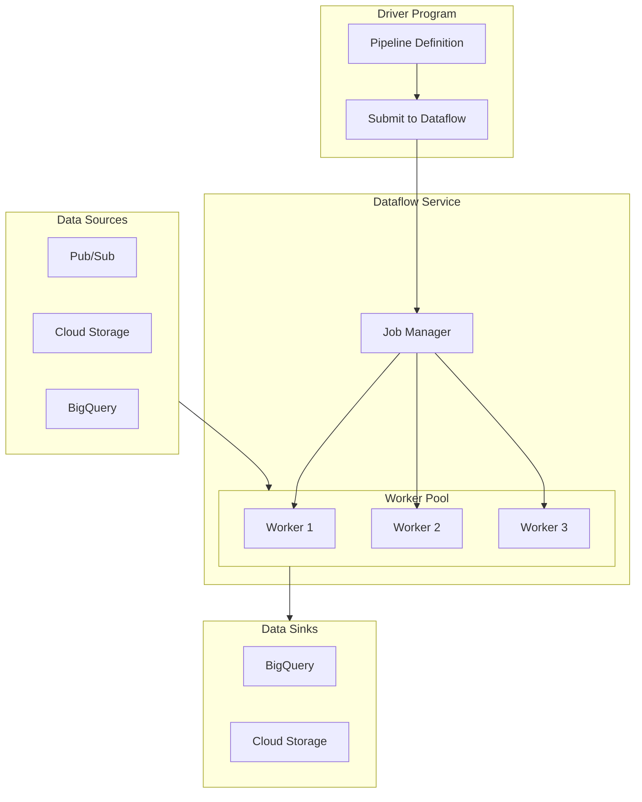

# How to Fix 'Dataflow' Pipeline Errors

Author: [nawazdhandala](https://www.github.com/nawazdhandala)

Tags: Google Cloud, Dataflow, Apache Beam, Data Pipeline, Big Data, GCP, Troubleshooting

Description: A practical guide to diagnosing and fixing common Google Cloud Dataflow pipeline errors, from worker issues to data processing failures.

---

Google Cloud Dataflow is a fully managed service for executing Apache Beam pipelines. When pipelines fail, understanding where and why can be challenging due to the distributed nature of the system. This guide covers the most common Dataflow errors and how to fix them.

## Understanding Dataflow Architecture



## Job Submission Errors

### Error: "Unable to create job" or "Permission denied"

```bash
# Check required APIs are enabled
gcloud services enable dataflow.googleapis.com
gcloud services enable compute.googleapis.com
gcloud services enable storage.googleapis.com
gcloud services enable bigquery.googleapis.com

# Verify IAM roles for the service account
PROJECT_ID=$(gcloud config get-value project)
SERVICE_ACCOUNT="dataflow-worker@${PROJECT_ID}.iam.gserviceaccount.com"

# Create dedicated service account
gcloud iam service-accounts create dataflow-worker \
    --display-name="Dataflow Worker Service Account"

# Grant required roles
gcloud projects add-iam-policy-binding $PROJECT_ID \
    --member="serviceAccount:${SERVICE_ACCOUNT}" \
    --role="roles/dataflow.worker"

gcloud projects add-iam-policy-binding $PROJECT_ID \
    --member="serviceAccount:${SERVICE_ACCOUNT}" \
    --role="roles/storage.objectAdmin"

gcloud projects add-iam-policy-binding $PROJECT_ID \
    --member="serviceAccount:${SERVICE_ACCOUNT}" \
    --role="roles/bigquery.dataEditor"

gcloud projects add-iam-policy-binding $PROJECT_ID \
    --member="serviceAccount:${SERVICE_ACCOUNT}" \
    --role="roles/pubsub.subscriber"
```

### Error: "Region not supported" or "Quota exceeded"

```bash
# List available regions
gcloud compute regions list

# Check quotas
gcloud compute project-info describe --project=$PROJECT_ID

# Set appropriate region in pipeline options
python my_pipeline.py \
    --region=us-central1 \
    --project=$PROJECT_ID \
    --runner=DataflowRunner
```

## Worker Startup Errors

### Error: "Worker pool failed to start"

Common causes and solutions:

```python
# Python pipeline with proper worker configuration
import apache_beam as beam
from apache_beam.options.pipeline_options import PipelineOptions, GoogleCloudOptions, WorkerOptions

options = PipelineOptions()

# Google Cloud options
google_cloud_options = options.view_as(GoogleCloudOptions)
google_cloud_options.project = 'my-project'
google_cloud_options.region = 'us-central1'
google_cloud_options.job_name = 'my-pipeline-job'
google_cloud_options.staging_location = 'gs://my-bucket/staging'
google_cloud_options.temp_location = 'gs://my-bucket/temp'

# Worker options
worker_options = options.view_as(WorkerOptions)
worker_options.machine_type = 'n1-standard-4'  # Adequate resources
worker_options.max_num_workers = 10
worker_options.disk_size_gb = 100  # Sufficient disk space
worker_options.service_account_email = 'dataflow-worker@my-project.iam.gserviceaccount.com'

# For private workers (VPC)
worker_options.network = 'my-vpc'
worker_options.subnetwork = 'regions/us-central1/subnetworks/my-subnet'
worker_options.use_public_ips = False  # For private workers
```

### Error: "Failed to install dependencies"

```python
# requirements.txt - ensure compatible versions
apache-beam[gcp]==2.52.0
google-cloud-bigquery==3.14.0
google-cloud-storage==2.14.0
pandas==2.0.3
numpy==1.24.3

# setup.py for custom packages
from setuptools import setup, find_packages

setup(
    name='my_pipeline',
    version='1.0',
    packages=find_packages(),
    install_requires=[
        'apache-beam[gcp]==2.52.0',
        'pandas>=2.0.0',
    ],
)
```

Run with setup file:

```bash
python my_pipeline.py \
    --runner=DataflowRunner \
    --project=my-project \
    --region=us-central1 \
    --setup_file=./setup.py \
    --requirements_file=./requirements.txt
```

## Data Processing Errors

### Error: "Element is not JSON serializable"

```python
# Bad - Custom objects without serialization
class MyData:
    def __init__(self, value):
        self.value = value

# Good - Use NamedTuples or dataclasses with coders
from typing import NamedTuple
import apache_beam as beam
from apache_beam.coders import registry

class MyData(NamedTuple):
    value: str
    count: int

# Or use dictionaries
def process_element(element):
    return {
        'value': element['value'],
        'count': element['count']
    }
```

### Error: "Out of memory" on workers

```python
# Bad - Loading entire dataset into memory
def process_large_file(element):
    with open(element, 'r') as f:
        data = f.readlines()  # Loads entire file
    return process_all(data)

# Good - Stream processing with generators
def process_large_file(element):
    with beam.io.filesystems.FileSystems.open(element) as f:
        for line in f:
            yield process_line(line)

# Better - Use Beam's built-in file reading
with beam.Pipeline(options=options) as p:
    lines = (
        p
        | 'Read' >> beam.io.ReadFromText('gs://bucket/large-file*.txt')
        | 'Process' >> beam.Map(process_line)
    )
```

### Error: "Fusion prevented" or "Stuck pipeline"

```python
# Dataflow fuses steps together for efficiency
# Sometimes you need to break fusion for parallelism

# Force shuffle to break fusion
with beam.Pipeline(options=options) as p:
    data = (
        p
        | 'Read' >> beam.io.ReadFromPubSub(topic='projects/my-project/topics/my-topic')
        | 'Parse' >> beam.Map(parse_message)
        | 'Reshuffle' >> beam.Reshuffle()  # Breaks fusion, enables parallelism
        | 'HeavyProcess' >> beam.ParDo(HeavyProcessingDoFn())
        | 'Write' >> beam.io.WriteToBigQuery(...)
    )
```

## I/O Errors

### Error: "BigQuery insertion failed"

```python
from apache_beam.io.gcp.bigquery import WriteToBigQuery, BigQueryDisposition

# Configure BigQuery write with error handling
output = (
    processed_data
    | 'WriteToBQ' >> WriteToBigQuery(
        table='project:dataset.table',
        schema='name:STRING,value:INTEGER,timestamp:TIMESTAMP',
        create_disposition=BigQueryDisposition.CREATE_IF_NEEDED,
        write_disposition=BigQueryDisposition.WRITE_APPEND,
        # Handle failed rows
        insert_retry_strategy='RETRY_ON_TRANSIENT_ERROR',
        # Use streaming inserts for real-time
        method='STREAMING_INSERTS',
        # Or batch for efficiency
        # method='FILE_LOADS',
    )
)

# Handle dead letters (failed records)
result = (
    processed_data
    | 'WriteToBQ' >> WriteToBigQuery(
        table='project:dataset.table',
        schema=table_schema,
    )
)

# Capture failed rows
failed_rows = result[WriteToBigQuery.FAILED_ROWS]
(
    failed_rows
    | 'LogFailed' >> beam.Map(lambda x: logging.error(f"Failed row: {x}"))
    | 'WriteFailedToGCS' >> beam.io.WriteToText('gs://bucket/failed-rows')
)
```

### Error: "Pub/Sub acknowledgement deadline exceeded"

```python
from apache_beam.io.gcp.pubsub import ReadFromPubSub

# Configure Pub/Sub read with appropriate settings
messages = (
    p
    | 'Read' >> ReadFromPubSub(
        subscription='projects/my-project/subscriptions/my-sub',
        # Increase ack deadline for slow processing
        with_attributes=True,
        timestamp_attribute='event_time'
    )
)

# Process in smaller batches for streaming
class ProcessWithCheckpoint(beam.DoFn):
    def process(self, element):
        # Quick processing to avoid ack timeout
        result = quick_transform(element)
        yield result

# For slow processing, checkpoint to storage
class SlowProcessDoFn(beam.DoFn):
    def process(self, element, window=beam.DoFn.WindowParam):
        # Save intermediate state
        checkpoint_key = f"checkpoint/{element.id}"

        # Check if already processed
        if self.is_processed(checkpoint_key):
            return

        # Process and checkpoint
        result = slow_processing(element)
        self.save_checkpoint(checkpoint_key, result)
        yield result
```

### Error: "Cloud Storage access denied"

```bash
# Verify bucket permissions
gsutil iam get gs://my-bucket

# Grant access to Dataflow service account
gsutil iam ch serviceAccount:dataflow-worker@my-project.iam.gserviceaccount.com:objectAdmin gs://my-bucket

# Check bucket exists and is accessible
gsutil ls gs://my-bucket/
```

## Debugging Techniques

### View Job Logs

```bash
# List recent jobs
gcloud dataflow jobs list --region=us-central1

# Get job details
gcloud dataflow jobs describe JOB_ID --region=us-central1

# View worker logs
gcloud logging read '
resource.type="dataflow_step"
resource.labels.job_id="JOB_ID"
severity>=ERROR
' --limit=50

# Stream logs during development
gcloud dataflow jobs show JOB_ID --region=us-central1 --format="value(currentState)"
```

### Add Logging to Pipeline

```python
import logging
import apache_beam as beam

# Configure logging
logging.getLogger().setLevel(logging.INFO)

class DebugDoFn(beam.DoFn):
    def __init__(self, step_name):
        self.step_name = step_name
        self.counter = beam.metrics.Metrics.counter(self.__class__, f'{step_name}_count')
        self.errors = beam.metrics.Metrics.counter(self.__class__, f'{step_name}_errors')

    def process(self, element):
        try:
            self.counter.inc()
            logging.info(f"{self.step_name}: Processing element {element.get('id', 'unknown')}")

            result = transform(element)

            logging.debug(f"{self.step_name}: Result = {result}")
            yield result

        except Exception as e:
            self.errors.inc()
            logging.error(f"{self.step_name}: Error processing {element}: {e}")
            # Optionally yield to dead letter queue
            yield beam.pvalue.TaggedOutput('errors', {'element': element, 'error': str(e)})

# Use with tagged outputs for error handling
with beam.Pipeline(options=options) as p:
    results = (
        p
        | 'Read' >> beam.io.ReadFromPubSub(...)
        | 'Process' >> beam.ParDo(DebugDoFn('process')).with_outputs('errors', main='main')
    )

    # Main output
    results.main | 'WriteSuccess' >> beam.io.WriteToBigQuery(...)

    # Error output
    results.errors | 'WriteErrors' >> beam.io.WriteToText('gs://bucket/errors/')
```

### Monitor Metrics

```python
# Define custom metrics
from apache_beam.metrics import Metrics

class MyTransformDoFn(beam.DoFn):
    def __init__(self):
        self.processed_count = Metrics.counter(self.__class__, 'processed_elements')
        self.processing_time = Metrics.distribution(self.__class__, 'processing_time_ms')
        self.batch_size = Metrics.gauge(self.__class__, 'current_batch_size')

    def process(self, element):
        import time
        start = time.time()

        result = transform(element)

        # Record metrics
        self.processed_count.inc()
        self.processing_time.update(int((time.time() - start) * 1000))

        yield result
```

## Pipeline Template for Production

```python
#!/usr/bin/env python
"""Production-ready Dataflow pipeline template."""

import argparse
import logging
import apache_beam as beam
from apache_beam.options.pipeline_options import PipelineOptions

def run(argv=None):
    """Main entry point."""
    parser = argparse.ArgumentParser()
    parser.add_argument('--input', required=True, help='Input source')
    parser.add_argument('--output', required=True, help='Output destination')

    known_args, pipeline_args = parser.parse_known_args(argv)
    options = PipelineOptions(pipeline_args)

    with beam.Pipeline(options=options) as p:
        # Read
        raw_data = p | 'Read' >> beam.io.ReadFromText(known_args.input)

        # Transform
        processed = (
            raw_data
            | 'Parse' >> beam.Map(parse_line)
            | 'Filter' >> beam.Filter(is_valid)
            | 'Transform' >> beam.ParDo(TransformDoFn())
        )

        # Write with error handling
        write_result = processed | 'Write' >> beam.io.WriteToBigQuery(
            known_args.output,
            write_disposition=beam.io.BigQueryDisposition.WRITE_APPEND,
        )

if __name__ == '__main__':
    logging.getLogger().setLevel(logging.INFO)
    run()
```

Run command:

```bash
python pipeline.py \
    --runner=DataflowRunner \
    --project=my-project \
    --region=us-central1 \
    --staging_location=gs://my-bucket/staging \
    --temp_location=gs://my-bucket/temp \
    --input=gs://my-bucket/input/*.json \
    --output=my-project:dataset.table \
    --service_account_email=dataflow-worker@my-project.iam.gserviceaccount.com \
    --max_num_workers=20 \
    --machine_type=n1-standard-4
```

---

Dataflow pipeline errors often stem from permissions, resource constraints, or data serialization issues. Start debugging by checking job logs in Cloud Console, verify IAM permissions for your service account, and use custom metrics to track pipeline health. For production pipelines, always implement dead letter queues to capture failed records and add comprehensive logging to diagnose issues quickly.
