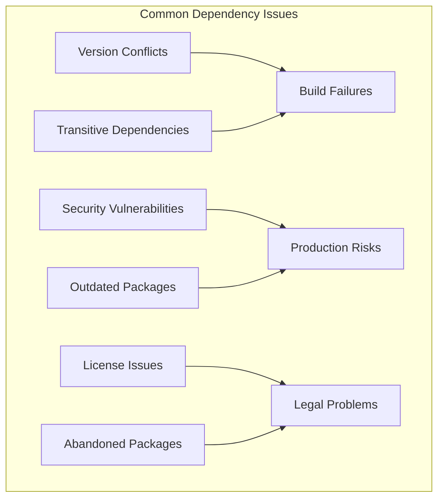

# How to Fix "Dependency Management" Issues

Author: [nawazdhandala](https://www.github.com/nawazdhandala)

Tags: DevOps, Dependencies, npm, pip, Go, Maven, Security, Dependency Management

Description: Learn how to handle dependency conflicts, security vulnerabilities, and version management across different package ecosystems.

---

Dependencies are both a blessing and a curse. They save you from reinventing the wheel, but they also introduce complexity, security risks, and maintenance burden. When dependency management goes wrong, you end up with version conflicts, broken builds, and security vulnerabilities that keep you up at night.

Let's explore practical strategies for managing dependencies effectively across different ecosystems.

## Understanding Dependency Problems



## Resolving Version Conflicts

### Node.js: The node_modules Problem

Version conflicts in npm often manifest as "Cannot find module" or unexpected behavior at runtime.

```bash
# Identify duplicate packages
npm ls lodash

# Output might show:
# project@1.0.0
# +-- package-a@2.0.0
# |   `-- lodash@4.17.21
# `-- package-b@1.0.0
#     `-- lodash@3.10.1  <-- Version conflict!
```

Fix conflicts with resolutions:

```json
{
  "name": "my-project",
  "dependencies": {
    "package-a": "^2.0.0",
    "package-b": "^1.0.0"
  },
  "overrides": {
    "lodash": "4.17.21"
  }
}
```

For yarn:

```json
{
  "resolutions": {
    "lodash": "4.17.21",
    "**/lodash": "4.17.21"
  }
}
```

### Python: Dependency Hell

Python's dependency conflicts often surface during pip install:

```bash
# Check for conflicts
pip check

# Output:
# package-a 2.0.0 requires requests>=2.28, but you have requests 2.25.1
```

Use pip-tools for deterministic resolution:

```bash
# requirements.in - specify your direct dependencies
flask>=2.0
requests>=2.28
celery>=5.0

# Generate locked requirements
pip-compile requirements.in --output-file requirements.txt

# For dev dependencies
pip-compile requirements-dev.in --output-file requirements-dev.txt
```

Handle conflicts explicitly:

```ini
# requirements.in with constraints
flask>=2.0
requests>=2.28,<3.0  # Pin major version
celery>=5.0

# Constraint file for transitive dependencies
-c constraints.txt
```

### Go: Module Conflicts

Go modules handle most conflicts automatically, but you may need manual intervention:

```bash
# Show why a module is included
go mod why -m github.com/some/package

# Show module dependency graph
go mod graph | grep conflicting-package

# Force specific version
go mod edit -require github.com/pkg/errors@v0.9.1
```

Use `replace` directives for local fixes:

```go
// go.mod
module myapp

go 1.21

require (
    github.com/gin-gonic/gin v1.9.1
    github.com/some/package v1.2.3
)

// Replace a problematic transitive dependency
replace github.com/old/broken => github.com/new/fixed v1.0.0

// Or use local fork while waiting for upstream fix
replace github.com/some/package => ../my-local-fork
```

## Scanning for Security Vulnerabilities

### Automated Vulnerability Scanning

```yaml
# .github/workflows/security.yml
name: Security Scan

on:
  push:
    branches: [main]
  schedule:
    # Run daily at midnight
    - cron: '0 0 * * *'

jobs:
  scan-node:
    runs-on: ubuntu-latest
    steps:
      - uses: actions/checkout@v4

      - name: Run npm audit
        run: npm audit --audit-level=high
        continue-on-error: true

      - name: Run Snyk
        uses: snyk/actions/node@master
        env:
          SNYK_TOKEN: ${{ secrets.SNYK_TOKEN }}
        with:
          args: --severity-threshold=high

  scan-python:
    runs-on: ubuntu-latest
    steps:
      - uses: actions/checkout@v4

      - name: Install safety
        run: pip install safety

      - name: Run safety check
        run: safety check -r requirements.txt

      - name: Run pip-audit
        run: |
          pip install pip-audit
          pip-audit -r requirements.txt

  scan-go:
    runs-on: ubuntu-latest
    steps:
      - uses: actions/checkout@v4

      - name: Run govulncheck
        run: |
          go install golang.org/x/vuln/cmd/govulncheck@latest
          govulncheck ./...
```

### Fixing Vulnerable Dependencies

```bash
# Node.js - auto-fix vulnerabilities
npm audit fix

# Force fix breaking changes (review carefully!)
npm audit fix --force

# Python - update specific package
pip install --upgrade requests

# Go - update specific module
go get -u github.com/vulnerable/package@latest
go mod tidy
```

## Managing Transitive Dependencies

Transitive dependencies are packages your dependencies depend on. They are often the source of surprises.

```mermaid
flowchart TD
    A[Your App] --> B[express@4.18]
    A --> C[axios@1.4]
    B --> D[body-parser@1.20]
    B --> E[cookie@0.5]
    C --> F[follow-redirects@1.15]
    D --> G[raw-body@2.5]
    E --> H[...]
    F --> I[...]

    style D fill:#ffcccc
    style F fill:#ffcccc
```

### Lock Files Are Essential

Always commit your lock files:

```bash
# Node.js
git add package-lock.json  # or yarn.lock

# Python
git add requirements.txt   # generated by pip-compile

# Go
git add go.sum

# Ruby
git add Gemfile.lock
```

### Audit Transitive Dependencies

```bash
# Node.js - list all dependencies
npm ls --all

# Python - show dependency tree
pip install pipdeptree
pipdeptree

# Go - show module graph
go mod graph
```

## Automated Dependency Updates

### Dependabot Configuration

```yaml
# .github/dependabot.yml
version: 2
updates:
  # Node.js dependencies
  - package-ecosystem: "npm"
    directory: "/"
    schedule:
      interval: "weekly"
      day: "monday"
    open-pull-requests-limit: 10
    groups:
      # Group minor and patch updates together
      minor-and-patch:
        patterns:
          - "*"
        update-types:
          - "minor"
          - "patch"
    ignore:
      # Ignore major updates for stability
      - dependency-name: "*"
        update-types: ["version-update:semver-major"]

  # Python dependencies
  - package-ecosystem: "pip"
    directory: "/"
    schedule:
      interval: "weekly"
    groups:
      development:
        patterns:
          - "pytest*"
          - "black"
          - "mypy"

  # Go modules
  - package-ecosystem: "gomod"
    directory: "/"
    schedule:
      interval: "weekly"

  # Docker base images
  - package-ecosystem: "docker"
    directory: "/"
    schedule:
      interval: "weekly"
```

### Renovate for More Control

```json
{
  "$schema": "https://docs.renovatebot.com/renovate-schema.json",
  "extends": ["config:recommended"],
  "schedule": ["before 9am on monday"],
  "timezone": "America/New_York",
  "packageRules": [
    {
      "matchUpdateTypes": ["minor", "patch"],
      "automerge": true,
      "automergeType": "pr",
      "platformAutomerge": true
    },
    {
      "matchPackagePatterns": ["^@types/"],
      "groupName": "TypeScript type definitions",
      "automerge": true
    },
    {
      "matchDepTypes": ["devDependencies"],
      "automerge": true
    },
    {
      "matchUpdateTypes": ["major"],
      "labels": ["major-update", "needs-review"]
    }
  ],
  "vulnerabilityAlerts": {
    "enabled": true,
    "labels": ["security"]
  }
}
```

## License Compliance

Track and enforce license policies:

```bash
# Node.js - check licenses
npx license-checker --summary
npx license-checker --onlyAllow "MIT;Apache-2.0;BSD-2-Clause;BSD-3-Clause;ISC"

# Python - check licenses
pip install pip-licenses
pip-licenses --allow-only="MIT;Apache 2.0;BSD"

# Go - check licenses
go install github.com/google/go-licenses@latest
go-licenses check ./...
```

Create a license policy file:

```yaml
# .licensepolicy.yml
allowed:
  - MIT
  - Apache-2.0
  - BSD-2-Clause
  - BSD-3-Clause
  - ISC
  - MPL-2.0

denied:
  - GPL-2.0
  - GPL-3.0
  - AGPL-3.0

exceptions:
  # Allow specific GPL packages for build tools only
  - package: "some-build-tool"
    license: "GPL-2.0"
    reason: "Build-time only, not distributed"
```

## Dependency Caching in CI

Speed up builds by caching dependencies:

```yaml
# .github/workflows/build.yml
jobs:
  build:
    runs-on: ubuntu-latest

    steps:
      - uses: actions/checkout@v4

      # Node.js caching
      - uses: actions/setup-node@v4
        with:
          node-version: '20'
          cache: 'npm'

      - run: npm ci

      # Python caching
      - uses: actions/setup-python@v5
        with:
          python-version: '3.12'
          cache: 'pip'

      - run: pip install -r requirements.txt

      # Go caching
      - uses: actions/setup-go@v5
        with:
          go-version: '1.21'
          cache: true

      - run: go mod download
```

## Creating a Dependency Management Policy

Document your team's dependency practices:

```markdown
## Dependency Policy

### Adding New Dependencies

1. Check if existing dependencies solve the problem
2. Evaluate package health: maintenance activity, issue count, download stats
3. Review license compatibility
4. Run security scan before merging
5. Document why the dependency was added

### Version Pinning

- Direct dependencies: Use exact versions in lock files
- CI/CD: Always use lock files, never float versions
- Security updates: Apply within 48 hours for critical vulnerabilities

### Review Schedule

- Weekly: Review and merge automated update PRs
- Monthly: Audit unused dependencies
- Quarterly: Review deprecated packages
```

## Best Practices Summary

1. **Always commit lock files** to ensure reproducible builds
2. **Use exact versions** for direct dependencies in production
3. **Automate security scanning** in your CI pipeline
4. **Set up automated updates** with Dependabot or Renovate
5. **Review transitive dependencies** regularly
6. **Enforce license policies** before legal problems arise
7. **Remove unused dependencies** to reduce attack surface
8. **Document dependency decisions** for future maintainers

---

Dependency management is an ongoing process, not a one-time setup. Build good habits early, automate what you can, and stay vigilant about security updates. Your future self will appreciate the effort when a critical vulnerability drops and you can patch it in minutes instead of days.
